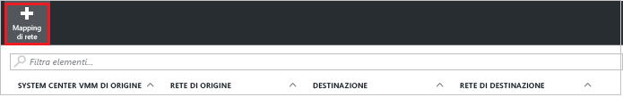

# Eseguire la replica di macchine virtuali Hyper-V in cloud VMM in un sito VMM secondario usando il portale di Azure
> [!div class="op_single_selector"]
> * [Portale di Azure](site-recovery-vmm-to-vmm.md)
> * [Portale classico](site-recovery-vmm-to-vmm-classic.md)
> * [PowerShell - Gestione risorse](site-recovery-vmm-to-vmm-powershell-resource-manager.md)
>
>

Questo articolo illustra come usare [Azure Site Recovery](site-recovery-overview.md) nel portale di Azure per eseguire la replica di macchine virtuali Hyper-V locali gestite nei cloud di System Center Virtual Machine Manager (VMM) in un sito secondario. Ulteriori informazioni sull'[architettura dello scenario](site-recovery-components.md#hyper-v-to-a-secondary-site).

È possibile inviare commenti nella parte inferiore di questo articolo oppure nel [forum sui servizi di ripristino di Azure](https://social.msdn.microsoft.com/forums/azure/home?forum=hypervrecovmgr).

## Prerequisiti

**Prerequisito** | **Dettagli**
--- | ---
**Azzurro** | È necessario un account [Microsoft Azure](http://azure.microsoft.com/) . È possibile iniziare con una [versione di valutazione gratuita](https://azure.microsoft.com/pricing/free-trial/). [Altre informazioni](https://azure.microsoft.com/pricing/details/site-recovery/) sui prezzi di Site Recovery.
**VMM locale** | È consigliabile eseguire la distribuzione con due server VMM, uno nel sito primario e uno nel sito secondario.   È possibile replicare tra cloud in un singolo server VMM.   I server VMM devono eseguire almeno System Center 2012 SP1 con gli aggiornamenti più recenti.   I server VMM richiedono l'accesso a Internet.
**Cloud VMM** | In ogni server VMM devono essere configurati uno o più cloud e in tutti i cloud deve essere impostato il profilo di capacità Hyper-V.   I cloud devono contenere uno o più gruppi host VMM.   Se si dispone solo di un server VMM, sono necessari almeno due cloud, che fungano uno da primario e uno da secondario.
**Hyper-V** | I server Hyper-V devono eseguire almeno Windows Server 2012 con ruolo Hyper-V e con gli ultimi aggiornamenti installati.   Il server Hyper-V deve contenere una o più macchine virtuali.    I server host Hyper-V devono trovarsi nei gruppi host disponibili nei cloud VMM primario e secondario.   Se si esegue Hyper-V in un cluster in Windows Server 2012 R2 installare l'[aggiornamento 2961977](https://support.microsoft.com/kb/2961977)   Se si esegue Hyper-V in un cluster basato su indirizzi IP statici in Windows Server 2012, il broker del cluster non viene creato automaticamente. Configurare manualmente il broker del cluster. [Altre informazioni](http://social.technet.microsoft.com/wiki/contents/articles/18792.configure-replica-broker-role-cluster-to-cluster-replication.aspx).   I server Hyper-V richiedono l'accesso a Internet.
**URL** | I server VMM e gli host Hyper-V devono poter raggiungere i seguenti URL:   [!INCLUDE [site-recovery-URLS](../../includes/site-recovery-URLS.md)]

## Passaggi di distribuzione

È necessario eseguire queste operazioni:

1. Verificare i prerequisiti.
2. Preparare il server VMM e gli host Hyper-V.
3. Creare un insieme di credenziali dei servizi di ripristino. L'insieme di credenziali contiene le impostazioni di configurazione e orchestra la replica.
4. Specificare origine, destinazione e impostazioni di replica.
5. Distribuzione del servizio Mobility nelle macchine virtuali di cui si vuole eseguire la replica.
6. Preparare per la replica e abilitare la replica per le macchine virtuali Hyper-V.
7. Eseguire un failover di test per verificare che tutti gli elementi funzionino come previsto.

## Preparare i server VMM e gli host Hyper-V

Preparare la distribuzione:

1. Assicurarsi che il server VMM e gli host Hyper-V rispettino i prerequisiti descritti in precedenza e siano in grado di raggiungere gli URL richiesti.
2. Configurare le reti VMM in modo che sia possibile configurare il [mapping di rete](#network-mapping-overview).

    - Accertarsi che le macchine virtuali nel server host Hyper-V di origine siano connesse a una rete VM di VMM. È necessario che tale rete sia collegata a una rete logica associata al cloud.
    Verificare che per il cloud secondario in cui verrà eseguito il ripristino sia configurata una rete VM corrispondente. collegata a una rete logica associata al cloud secondario.

3. Preparare un [singolo server di distribuzione](#single-vmm-server-deployment), se si desidera replicare le macchine virtuali tra cloud nello stesso server VMM.

## Creare un insieme di credenziali di Servizi di ripristino
1. Accedere al [portale di Azure](https://portal.azure.com).
2. Fare clic su **Nuovo** > **Gestione** > **Servizi di ripristino**.
3. In **Nome**specificare un nome descrittivo per identificare l'insieme di credenziali. Se è disponibile più di una sottoscrizione, selezionarne una.
4. [Creare un gruppo di risorse](../azure-resource-manager/resource-group-template-deploy-portal.md)o selezionarne uno esistente. Specificare un'area di Azure. I computer vengono replicati in quest'area. Per informazioni sulla disponibilità a livello geografico e sulle aree supportate, vedere la pagina relativa ai [dettagli sui prezzi per Azure Site Recovery](https://azure.microsoft.com/pricing/details/site-recovery/)
5. Per accedere rapidamente all'insieme di credenziali dal dashboard, fare clic su **Aggiungi al dashboard** > **Crea insieme di credenziali**.

    

Il nuovo insieme di credenziali verrà visualizzato in **Dashboard**, in **Tutte le risorse** e nel pannello **Insiemi di credenziali dei servizi di ripristino** principale.

## Scegliere un obiettivo di protezione

Selezionare gli elementi da replicare e la posizione in cui eseguire la replica.

2. Fare clic su **Site Recovery** > **Passaggio 1: Preparare l'infrastruttura** > **Obiettivo di protezione**.
3. Selezionare **Nel sito di ripristino**, quindi fare clic su **Yes, with Hyper-V** (Sì, con Hyper-V).
4. Selezionare **Sì** per indicare che si usa VMM per gestire gli host Hyper-V.
5. Selezionare **Sì** se si dispone di un server VMM secondario. Se si distribuisce la replica tra cloud in un unico server VMM, fare clic su **No**. Fare quindi clic su **OK**.

    

## Configurare l'ambiente di origine

Installare il provider di Azure Site Recovery nei server VMM, rilevare e registrare il server nell'insieme di credenziali.

1. Fare clic su **Passaggio 1: Preparare l'infrastruttura** > **Origine**.

    
2. In **Prepara origine** fare clic su **+ VMM** per aggiungere un server VMM.

    
3. In **Aggiungi server** verificare che in **Tipo di server** sia visualizzato **System Center VMM server** (Server System Center VMM) e che il server VMM sia conforme ai [prerequisiti](#prerequisites).
4. Scaricare il file di installazione del provider di Azure Site Recovery.
5. Scaricare la chiave di registrazione, che sarà necessaria durante l'installazione. La chiave è valida per cinque giorni dal momento in cui viene generata.

    
6. Installare il provider di Azure Site Recovery nel server VMM. Nei server host Hyper-V non è necessario installare niente in modo esplicito.

### Installare il provider di Azure Site Recovery

1. Eseguire il file di installazione del provider in ogni server VMM. Se VMM viene distribuito in un cluster, procedere come segue per la prima installazione:
    -  Installare il provider in un nodo attivo e completare l'installazione per registrare il server VMM nell'insieme di credenziali.
    - Quindi, installare il provider negli altri nodi. Tutti i nodi del cluster devono eseguire la stessa versione del provider.
2. Il programma di installazione esegue alcune verifiche dei prerequisiti e chiede l'autorizzazione per arrestare il servizio VMM. Il servizio VMM verrà riavviato automaticamente al termine dell'installazione. Se si esegue l'installazione in un cluster VMM, verrà richiesto di interrompere il ruolo Cluster.
3. In **Microsoft Update** è possibile acconsentire per specificare esplicitamente che gli aggiornamenti del provider vengano installati in base ai criteri di Microsoft Update.
4. In **Installazione** accettare o modificare il percorso predefinito di installazione e quindi fare clic su **Installa**.

    
5. Al termine dell'installazione fare clic su **Registra** per registrare il server nell'insieme di credenziali.

    
6. In **Vault name**verificare il nome dell'insieme di credenziali in cui verrà registrato il server. Fare clic su *Avanti*.

    
7. Nella pagina **Connessione Internet** specificare la modalità di connessione ad Azure del provider in esecuzione sul server VMM.

    

   - È possibile specificare che il provider debba connettersi direttamente a Internet o tramite un proxy.
   - Se necessario, specificare le impostazioni proxy.
   - Se si usa un proxy, viene creato automaticamente un account RunAs di VMM (DRAProxyAccount) con le credenziali del proxy specificate. Configurare il server proxy in modo che l'account possa eseguire correttamente l'autenticazione. È possibile modificare le impostazioni dell'account RunAs nella console di VMM > **Impostazioni** > **Sicurezza** > **Account RunAs**. Riavviare il servizio VMM per aggiornare le modifiche.
8. In **Chiave di registrazione**selezionare il codice di registrazione scaricato da Azure Site Recovery e copiato nel server VMM.
9. L'impostazione di crittografia viene usata solo quando si esegue la replica di VM Hyper-V in cloud VMM in Azure. Non viene usata se si esegue la replica in un sito secondario.
10. In **Nome server**specificare un nome descrittivo per identificare il server VMM nell'insieme di credenziali. In una configurazione cluster specificare il nome del ruolo relativo al cluster VMM.
11. In **Sincronizza i metadati cloud** scegliere se sincronizzare i metadati per tutti i cloud presenti nel server VMM con l'insieme di credenziali. È necessario eseguire questa azione solo una volta in ogni server. Se non si vogliono sincronizzare tutti i cloud, è possibile lasciare deselezionata questa opzione e sincronizzare ogni cloud singolarmente nelle proprietà del cloud nella console VMM.
12. Fare clic su **Avanti** per completare il processo. Dopo la registrazione, i metadati del server VMM vengono recuperati da Azure Site Recovery. Il server viene visualizzato nella scheda **Server VMM** della pagina **Server** nell'insieme di credenziali.

    
13. Quando il server sarà disponibile nella console di Site Recovery, in **Origine** > **Prepara origine** selezionare il server VMM e quindi il cloud in cui si trova l'host Hyper-V. Fare quindi clic su **OK**.

È anche possibile installare il provider dalla riga di comando:

[!INCLUDE [site-recovery-rw-provider-command-line](../../includes/site-recovery-rw-provider-command-line.md)]

## Configurare l'ambiente di destinazione

Selezionare il server VMM di destinazione e il cloud.

1. Fare clic su **Preparare l'infrastruttura** > **Destinazione** e selezionare il server VMM di destinazione da usare.
2. Verranno visualizzati i cloud nel server sincronizzati con Site Recovery. Selezionare il cloud di destinazione.

   

## Configurare le impostazioni di replica

- Quando si crea un criterio di replica, tutti gli host che usano il criterio devono avere lo stesso sistema operativo. Il cloud VMM può contenere host Hyper-V che eseguono versioni diverse di Windows Server, ma in questo caso sono necessari più criteri di replica.
- È possibile eseguire offline la replica iniziale. [Altre informazioni](#prepare-for-initial-offline-replication)

1. Per creare nuovi criteri di replica, fare clic su **Preparare l'infrastruttura** > **Impostazioni della replica** > **+Crea e associa**.

    
2. In **Criteri di creazione e associazione**specificare il nome dei criteri. Il tipo di origine e di destinazione deve essere **Hyper-V**.
3. In **Versione host Hyper-V** selezionare il sistema operativo in esecuzione nell'host.
4. In **Tipo di autenticazione** e **Porta di autenticazione** specificare come viene autenticato il traffico tra il server host Hyper-V primario e quello di ripristino. Selezionare **Certificato** a meno che non sia configurato un ambiente Kerberos funzionante. Azure Site Recovery configura automaticamente i certificati per l'autenticazione HTTPS. Non è necessario intervenire manualmente. Per impostazione predefinita, le porte 8083 e 8084 (per i certificati) sono aperte in Windows Firewall per i server host Hyper-V. Se si seleziona **Kerberos**, verrà usato un ticket Kerberos per l'autenticazione reciproca dei server host. Questa impostazione è rilevante solo per i server host Hyper-V in esecuzione su Windows Server 2012 R2.
5. In **Frequenza di copia**specificare la frequenza con cui replicare i dati differenziali dopo la replica iniziale, ogni 30 secondi oppure ogni 5 o 15 minuti.
6. In **Conservazione del punto di ripristino**specificare la durata in ore dell'intervallo di conservazione per ogni punto di ripristino. I computer protetti possono essere ripristinati in qualsiasi punto all'interno di un intervallo.
7. In **Frequenza snapshot coerenti con l'app** specificare la frequenza, da&1; a&12; ore, per la creazione di punti di ripristino contenenti snapshot coerenti con l'applicazione. Hyper-V utilizza due tipi di snapshot, uno snapshot standard che fornisce uno snapshot incrementale dell'intera macchina virtuale e uno snapshot coerente con l'applicazione che accetta uno snapshot temporizzato dei dati dell'applicazione all'interno della macchina virtuale. Negli snapshot coerenti dell'applicazione viene usato il servizio Copia Shadow del volume (VSS) per garantire che le applicazioni siano coerenti durante la creazione dello snapshot. L'abilitazione di snapshot coerenti con l'applicazione influirà sulle prestazioni delle applicazioni in esecuzione nelle macchine virtuali di origine. Assicurarsi che il valore impostato sia inferiore al numero di punti di ripristino aggiuntivi configurati.
8. In **Compressione trasferimento dati**specificare se i dati replicati che vengono trasferiti devono essere compressi.
9. Selezionare **Eliminare la macchina virtuale di replica** per specificare che la macchina virtuale di replica deve essere eliminata nel caso in cui si disabiliti la protezione per la VM di origine. Con questa impostazione abilitata, quando si disabilita la protezione per la macchina virtuale di origine, questa viene rimossa dalla console di Site Recovery, le impostazioni di Site Recovery relative a VMM vengono rimosse dalla console VMM e la replica viene eliminata.
10. Se si esegue la replica in rete, in **Metodo di replica iniziale** specificare se si preferisce avviare la replica iniziale o pianificarla. Per risparmiare larghezza di banda di rete, è opportuno pianificarla al di fuori dell'orario di lavoro. Fare quindi clic su **OK**.

     
11. Quando si creano nuovi criteri, questi vengono associati automaticamente al cloud VMM. In **Criteri di replica** fare clic su **OK**. È possibile associare altri cloud VMM (e le VM in essi contenute) a questi criteri di replica in **Replica** > nome del criterio > **Associate VMM Cloud** (Associa cloud VMM).

     

### Configurare il mapping di rete

- Leggere le informazioni sul [mapping di rete](#prepare-for-network-mapping) prima di iniziare.
- Verificare che le macchine virtuali sui server VMM siano connesse a una rete VM.

1. In **Site Recovery Infrastructure** >  (Infrastruttura di Site Recovery) **Mapping di rete** > **Mapping di rete** fare clic su **+Mapping di rete**.

    
2. Nella scheda **Aggiungi mapping di rete** selezionare i server VMM di origine e di destinazione. Vengono recuperate le reti VM associate ai server VMM.
3. In **Rete di origine**selezionare la rete che si vuole usare nell'elenco di reti VM associate al server VMM primario.
4. In **Rete di destinazione** selezionare la rete che si vuole usare nel server VMM secondario. Fare quindi clic su **OK**.

    

Quando ha inizio il mapping di rete vengono eseguite le operazioni seguenti:

* Tutte le macchine virtuali di replica esistenti che corrispondono alla rete VM di origine verranno connesse alle reti VM di destinazione.
* Dopo la replica, le nuove macchine virtuali connesse alla rete VM di origine verranno connesse alla rete mappata di destinazione.
* Se si modifica un mapping esistente con una nuova rete, le macchine virtuali di replica verranno connesse usando le nuove impostazioni.
* Se la rete di destinazione dispone di più subnet e una di esse ha lo stesso nome di una subnet in cui si trova la macchina virtuale di origine, la macchina virtuale di replica sarà connessa a tale subnet di destinazione dopo il failover. Se non è presente una subnet di destinazione con un nome corrispondente, la macchina virtuale sarà connessa alla prima subnet della rete.

### Configurare il mapping di archiviazione.

Il [mapping di archiviazione](#prepare-for-storage-mapping) non è supportato nel nuovo portale di Azure. ma può essere abilitato tramite Powershell. [Altre informazioni](site-recovery-vmm-to-vmm-powershell-resource-manager.md#step-7-configure-storage-mapping).

## Passaggio 5: Pianificazione della capacità

Dopo avere configurato l'infrastruttura di base, passare alla pianificazione della capacità e valutare se sono necessarie altre risorse.

- Scaricare ed eseguire [Azure Site Recovery Capacity Planner](site-recovery-capacity-planner.md) per raccogliere informazioni sull'ambiente di replica, tra cui le macchine virtuali, i dischi per ogni macchina e l'archiviazione per disco.
- Dopo aver raccolto le informazioni di replica in tempo reale, è possibile modificare i criteri di NetQos per controllare la larghezza di banda per la replica delle macchine virtuali. Altre informazioni sulla [limitazione del traffico di replica di Hyper-V](http://www.thomasmaurer.ch/2013/12/throttling-hyper-v-replica-traffic/) sono disponibili sul blog di Thomas Maurer. Altre informazioni sul [cmdlet New-NetQosPolicy](https://technet.microsoft.com/library/hh967468.aspx.).

## Abilitare la replica

1. Fare clic su **Passaggio 2: Eseguire la replica dell'applicazione** > **Origine**. Dopo avere abilitato la replica per la prima volta, è necessario fare clic su **+Replica** nell'insieme di credenziali per abilitare la replica per altri computer.

    
2. In **Origine** selezionare il server VMM e il cloud in cui si trovano gli host Hyper-V da replicare. Fare quindi clic su **OK**.

    
3. In **Destinazione** verificare il cloud e il server VMM secondario.
4. In **Macchine virtuali** selezionare nell'elenco le macchine virtuali da proteggere.

    

È possibile tenere traccia dello stato del processo **Abilita protezione** in **Processi** > **Site Recovery jobs** (Processi di Site Recovery). Dopo il completamento del **processo di finalizzazione** della protezione la macchina virtuale è pronta per il failover.

Si noti che:

- È anche possibile abilitare la protezione per le macchine virtuali nella console VMM. Fare clic su **Abilita protezione** nella barra degli strumenti della scheda **Azure Site Recovery** nelle proprietà della macchina virtuale.
- Dopo aver abilitato la replica è possibile visualizzare le proprietà della macchina virtuale in **Elementi replicati**. Nel dashboard **Informazioni di base** è possibile visualizzare informazioni sui criteri di replica per la macchina virtuale e il relativo stato. Per altri dettagli, fare clic su **Proprietà** .

### Caricare le macchine virtuali esistenti
Se in VMM sono presenti macchine virtuali replicate tramite la replica Hyper-V, è possibile caricarle per la replica in Azure Site Recovery nel modo seguente:

1. Assicurarsi che il server Hyper-V che ospita la macchina virtuale esistente si trovi nel cloud primario e che il server Hyper-V che ospita la macchina virtuale di replica si trovi nel cloud secondario.
2. Assicurarsi che per il cloud VMM primario sia configurato un criterio di replica.
3. Abilitare la replica per la macchina virtuale primaria. Azure Site Recovery e VMM garantiscono che vengano rilevati la stessa macchina virtuale e lo stesso host di replica. Azure Site Recovery riuserà e ristabilirà la replica tramite le impostazioni configurate.

## Testare la distribuzione

Per testare la distribuzione è possibile eseguire un [failover di test](site-recovery-test-failover-vmm-to-vmm.md) per una singola macchina virtuale o [creare un piano di ripristino](site-recovery-create-recovery-plans.md) che contenga una o più macchine virtuali.

## Preparare la replica iniziale offline

Per la copia iniziale dei dati è possibile eseguire la replica non in linea. Per prepararla, procedere come segue:

* Nel server di origine specificare il percorso dal quale verrà eseguita l'esportazione dei dati. Assegnare il controllo completo per NTFS e le autorizzazioni di condivisione al servizio VMM nel percorso di esportazione. Nel server di destinazione specificare il percorso dal quale verrà eseguita l'importazione dei dati. Assegnare le stesse autorizzazioni indicate in precedenza per questo percorso esportazione.
* Se il percorso importazione o esportazione è condiviso, assegnare l'appartenenza al gruppo Administrator, Power User, Print Operators o Server Operators per l'account del servizio VMM nel computer remoto in cui si trova il percorso condiviso.
* Se si usano account RunAs per aggiungere host, nei percorsi di importazione e di esportazione assegnare autorizzazioni di lettura e scrittura per gli account RunAs in VMM.
* Le condivisioni di importazione ed esportazione non devono essere posizionate nei computer usati come server host Hyper-V, in quanto la configurazione del loopback non è supportata da Hyper-V.
* In Active Directory, in ogni server host Hyper-V contenente le macchine virtuali che si desidera proteggere, abilitare e configurare la delega vincolata affinché i computer remoti nei quali sono situati i percorsi di esportazione e importazione siano considerati attendibili, come illustrato di seguito:
  1. Nel controller di dominio, aprire **Utenti e computer di Active Directory**.
  2. Nell'albero della console fare clic su **NomeDominio** > **Computer**.
  3. Fare clic con il pulsante destro del mouse sul nome del server host Hyper-V e scegliere **Proprietà**.
  4. Nella scheda **Delega** fare clic su **Computer attendibile per la delega solo ai servizi specificati**.
  5. Fare clic su **Usa un qualsiasi protocollo di autenticazione**.
  6. Fare clic su **Aggiungi** > **Utenti e computer**.
  7. Digitare il nome del computer che ospita il percorso esportazione e fare clic su **OK**. Nell'elenco dei servizi disponibili tenere premuto il tasto CTRL e fare clic su **cifs** > **OK**. Ripetere l'operazione per il nome del computer che ospita il percorso esportazione. Ripetere l'operazione per eventuali altri server host Hyper-V.

## Preparare il mapping di rete
Il mapping di rete esegue il mapping tra reti VM di VMM nei server VMM primario e secondario per:

* Posizionare in modo ottimale le macchine virtuali di replica in host Hyper-V secondari dopo il failover.
* Connettere le macchine virtuali di replica alle reti di macchine virtuali appropriate dopo il failover.

Si noti che:
- Il mapping di rete può essere configurato tra le reti VM in due server VMM o in un singolo server VMM, se due siti sono gestiti dallo stesso server.
- Se il mapping di rete è configurato correttamente e la replica è abilitata, una macchina virtuale presente nella posizione principale verrà connessa a una rete e la relativa replica nella posizione di destinazione verrà connessa alla rete mappata.
- Se le reti sono state configurate correttamente in VMM, quando si seleziona una rete VM di destinazione durante il mapping di rete, verranno visualizzati i cloud di origine VMM che utilizzano la rete VM di origine insieme alle le reti VM di destinazione disponibili nei cloud di destinazione utilizzati per la protezione.
- Se la rete di destinazione dispone di più subnet e una di esse ha lo stesso nome della subnet in cui si trova la macchina virtuale di origine, la macchina virtuale di replica sarà connessa a tale subnet di destinazione dopo il failover. Se non è presente una subnet di destinazione con un nome corrispondente, la macchina virtuale sarà connessa alla prima subnet della rete.

Di seguito è riportato un esempio per illustrare questo meccanismo. Si prenda come esempio un’organizzazione con due sedi, New York e Chicago.

| **Posizione** | **Server VMM** | **Reti VM** | **Mappata a** |
| --- | --- | --- | --- |
| New York |VMM-NewYork |VMNetwork1-NewYork |Mappata a VMNetwork1-Chicago |
| VMNetwork2-NewYork |Non mappata | | |
| Chicago |VMM-Chicago |VMNetwork1-Chicago |Mappata a VMNetwork1-NewYork |
| VMNetwork2-Chicago |Non mappata | | |

Con questo esempio:

* Quando viene creata una macchina virtuale di replica per una macchina virtuale connessa a VMNetwork1-NewYork, essa verrà connessa a VMNetwork1-Chicago.
* Quando una macchina virtuale di replica viene creata per VMNetwork2-NewYork o VMNetwork2-Chicago, non verrà connessa ad alcuna rete.

Di seguito viene indicato in che modo vengono configurati i cloud VMM e in che modo le reti logiche vengono associate ai cloud.

### Impostazioni di protezione del cloud
| **Cloud protetto** | **Protezione del cloud** | **Rete logica (New York)** |
| --- | --- | --- |
| GoldCloud1 |GoldCloud2 | |
| SilverCloud1 |SilverCloud2 | |
| GoldCloud2 |
ND

 |
LogicalNetwork1-NewYork

LogicalNetwork1-Chicago
 |
| SilverCloud2 |
ND

 |
LogicalNetwork1-NewYork

LogicalNetwork1-Chicago
 |

### Impostazioni di rete VM e logica
| **Posizione** | **Rete logica** | **Rete VM associata** |
| --- | --- | --- |
| New York |LogicalNetwork1-NewYork |VMNetwork1-NewYork |
| Chicago |LogicalNetwork1-Chicago |VMNetwork1-Chicago |
| LogicalNetwork2Chicago |VMNetwork2-Chicago | |

### Reti di destinazione
In base a queste impostazioni, quando si seleziona la rete VM di destinazione, nella tabella seguente sono mostrate le opzioni che saranno disponibili.

| **Selezionare** | **Cloud protetto** | **Protezione del cloud** | **Rete di destinazione disponibili** |
| --- | --- | --- | --- |
| VMNetwork1-Chicago |SilverCloud1 |SilverCloud2 |Disponibile |
| GoldCloud1 |GoldCloud2 |Disponibile | |
| VMNetwork2-Chicago |SilverCloud1 |SilverCloud2 |Non disponibile |
| GoldCloud1 |GoldCloud2 |Disponibile | |

### Failback
Per vedere cosa succede in caso di failback (replica inversa), si supponga che venga eseguito il mapping di VMNetwork1-NewYork a VMNetwork1-Chicago, con le impostazioni seguenti.

| **Macchina virtuale** | **Connessa alla rete VM** |
| --- | --- |
| VM1 |VMNetwork1-Network |
| VM2 (replica di VM1) |VMNetwork1-Chicago |

Con queste impostazioni esaminare cosa accade in un paio di scenari possibili.

| **Scenario** | **Risultato** |
| --- | --- |
| Nessuna modifica nelle proprietà della rete di VM-2 dopo il failover |VM-1 rimane connessa alla rete di origine. |
| Le proprietà di rete di VM-2 cambiano dopo il failover e la macchina virtuale viene disconnessa  |VM-1 viene disconnessa |
| Le proprietà di rete di VM-2 cambiano dopo il failover e la macchina virtuale viene connessa a VMNetwork2-Chicago |Se non viene eseguito il mapping di VMNetwork2-Chicago, VM-1 verrà disconnessa |
| Il mapping di rete di VMNetwork1-Chicago viene modificato |VM-1 verrà connessa alla rete ora mappata a VMNetwork1-Chicago |

## Prepararsi per una distribuzione a server singolo

Se è disponibile un unico server VMM, è possibile replicare le macchine virtuali degli host Hyper-V presenti nel cloud VMM in [Azure](site-recovery-vmm-to-azure.md) o in un cloud VMM secondario. La prima opzione è consigliabile perché la replica tra cloud non è uniforme. Se si desidera replicare tra cloud, è possibile replicare con un singolo server VMM autonomo o con un singolo server VMM distribuito in un cluster di Windows esteso

### Server VMM autonomo

In questo scenario distribuire il singolo server VMM come macchina virtuale nel sito primario e replicare questa VM in un sito secondario con Site Recovery e Hyper-V Replica.

1. **Configurare VMM in una VM Hyper-V**. È consigliabile condividere il percorso dell'istanza di SQL Server usata da VMM nella stessa macchina virtuale. In questo modo, infatti, deve essere creata una sola macchina virtuale, con un conseguente risparmio di tempo. Se si vuole usare un'istanza remota di SQL Server e si verifica un'interruzione, è necessario ripristinare l'istanza prima di ripristinare VMM.
2. **Assicurarsi che il server VMM abbia almeno due cloud configurati**. Un cloud conterrà le VM da replicare e l’altro cloud verrà usato come posizione secondaria. Il cloud che contiene le VM da proteggere deve essere conforme ai [prerequisiti](#prerequisites).
3. Configurare Site Recovery come descritto in questo articolo. Creare e registrare il server VMM in un insieme di credenziali, impostare un criterio di replica e abilitare la replica. I nomi VMM di origine e di destinazione saranno uguali. Specificare che la replica iniziale venga eseguita tramite la rete.
4. Se si configura il mapping di rete, verrà eseguito il mapping della rete VM relativa al cloud primario alla rete VM relativa al cloud secondario.
5. Nella console di gestione Hyper-V, abilitare la Replica Hyper-V nell'host Hyper-V che contiene le VM VMM e abilitare la replica sulla VM. Assicurarsi di non aggiungere la macchina virtuale VMM ai cloud protetti mediante Ripristino sito, per garantire che le impostazioni di Replica Hyper-V non siano sottoposte a override da Ripristino sito.
6. Se si creano piani di ripristino per il failover, si userà lo stesso server VMM per l'origine e la destinazione.
7. In caso di interruzione totale, eseguire il failover e il ripristino come riportato di seguito:

   1. Nella console di gestione Hyper-V nel sito secondario, eseguire un failover non pianificato per eseguire il failover della macchina virtuale VMM primaria al sito secondario.
   2. Verificare che la macchina virtuale VMM sia attiva e in esecuzione e, nell'insieme di credenziali, eseguire un failover non pianificato per eseguire il failover delle macchine virtuali dal cloud primario a quello secondario. Eseguire il commit del failover e selezionare un punto di ripristino alternativo, se necessario.
   3. Al termine del failover non pianificato, è di nuovo possibile accedere a tutte le risorse dal sito primario.
   4. Quando il sito primario sarà nuovamente disponibile, abilitare la replica inversa per la macchina virtuale VMM nella console di gestione Hyper-V nel sito secondario. Verrà avviata la replica per la macchina virtuale dal sito secondario al sito primario.
   5. Nella console di gestione Hyper-V nel sito secondario, eseguire un failover pianificato per eseguire il failover della macchina virtuale VMM al sito primario. Eseguire il commit del failover. Viene abilitata la replica inversa per avviare nuovamente la replica della macchina virtuale VMM dal sito primario a quello secondario.
   6. Nell'insieme di credenziali dei Servizi di ripristino abilitare la replica inversa per le VM del carico di lavoro per avviarne la replica dal sito secondario a quello primario.
   7. Nell'insieme di credenziali dei Servizi di ripristino eseguire un failover pianificato per eseguire il failback delle VM del carico di lavoro nel sito primario. Eseguire il commit del failover per completare le operazioni. Abilitare la replica inversa per avviare la replica delle VM del carico di lavoro dal sito primario a quello secondario.

### Cluster VMM esteso

Anziché distribuire un server VMM autonomo come VM che replica in un sito secondario, è possibile garantire la disponibilità elevata di VMM distribuendolo come VM in un cluster di failover di Windows, assicurando così flessibilità al carico di lavoro e protezione da errori hardware. Per effettuare la distribuzione usando Site Recovery, la macchina virtuale di VMM deve essere distribuita in un cluster esteso in siti geograficamente separati. A tale scopo, seguire questa procedura:

1. Installare VMM su una macchina virtuale in un cluster di failover di Windows e selezionare l'opzione per eseguire il server come disponibilità elevata durante l'installazione.
2. L'istanza di SQL Server usata da VMM deve essere replicata con gruppi di disponibilità AlwaysOn di SQL Server in modo che sia disponibile una replica del database nel sito secondario.
3. Seguire le istruzioni in questo articolo per creare un insieme di credenziali, registrare il server e configurare la protezione. È necessario registrare ogni server VMM nel cluster nell'insieme di credenziali di Servizi di ripristino. A tale scopo, installare il Provider in un nodo attivo e registrare il server VMM. Quindi installare il provider sugli altri nodi.
4. Se si verifica un'interruzione, il server VMM e il database SQL Server corrispondente sono sottoposti a failover e l'accesso viene eseguito dal sito secondario.

## Eseguire la preparazione per il mapping dell'archiviazione

Viene eseguito il mapping delle classificazioni di archiviazione su un server VMM di origine e uno di destinazione per eseguire le operazioni seguenti:

  * **Identificare l'archiviazione di destinazione per le macchine virtuali di replica**: un disco rigido di una macchina virtuale di origine replicherà nell'archivio specificato (condivisione SMB o volume condiviso cluster) nel percorso di destinazione.
  * **Posizionamento delle macchine virtuali di replica**: il mapping di archiviazione viene usato per posizionare in modo ottimale le macchine virtuali di replica nei server host Hyper-V. Le macchine virtuali di replica saranno posizionate negli host che possono accedere alla classificazione di archiviazione mappata.
  * **Nessun mapping di archiviazione**: se non si configura il mapping di archiviazione, le macchine virtuali vengono replicate nella posizione di archiviazione predefinita specificata nel server host Hyper-V associato alla macchina virtuale di replica.

Si noti che:
- È possibile configurare il mapping tra due cloud VMM in un singolo server.
- Le classificazioni di archiviazione devono essere disponibili per i gruppi host situati nei cloud di origine e di destinazione.
- Le classificazioni non devono necessariamente avere lo stesso tipo di archiviazione. È possibile ad esempio mappare una classificazione di origine contenente condivisioni SMB a una classificazione di destinazione contenente CSV

### Esempio
Se le classificazioni sono configurate correttamente in VMM quando si selezionano il server VMM di origine e destinazione durante il mapping di archiviazione, verranno visualizzate le classificazioni di origine e destinazione. Di seguito è riportato un esempio di condivisioni di file di archiviazione e le classificazioni per un'organizzazione con due posizioni a New York e Chicago.

| **Posizione** | **Server VMM** | **Condivisione file (origine)** | **Classificazione (origine)** | **Mappata a** | **Condivisione file (destinazione)** |
| --- | --- | --- | --- | --- | --- |
| New York |VMM_Source |SourceShare1 |GOLD |GOLD_TARGET |TargetShare1 |
| SourceShare2 |SILVER |SILVER_TARGET |TargetShare2 | | |
| SourceShare3 |BRONZE |BRONZE_TARGET |TargetShare3 | | |
| Chicago |VMM_Target | |GOLD_TARGET |Non mappata | |
|  |SILVER_TARGET |Non mappata | | | |
|  |BRONZE_TARGET |Non mappata | | | |

Con questo esempio:

* Una macchina virtuale di replica che viene creata per una macchina virtuale in un archivio GOLD (SourceShare1) viene replicata in un archivio GOLD_TARGET (TargetShare1).
* Una macchina virtuale di replica che viene creata per una macchina virtuale in un archivio SILVER (SourceShare2) viene replicata in un archivio SILVER_TARGET (TargetShare2).

### Posizioni di archiviazione multiple
Se la classificazione di destinazione viene assegnata a più condivisioni SMB o volumi condivisi del cluster, la posizione di archiviazione ottimale verrà selezionata automaticamente quando la macchina virtuale è protetta. Se con la classificazione specificata non è disponibile una risorsa di archiviazione di destinazione adeguata, la posizione di archiviazione predefinita specificata nell'host Hyper-V viene utilizzata per inserire i dischi rigidi virtuali di replica.

Nella tabella seguente viene illustrato come la classificazione di archiviazione e i volumi condivisi del cluster sono configurati nell’esempio.

| **Posizione** | **Classificazione** | **Risorsa di archiviazione associata** |
| --- | --- | --- |
| New York |GOLD |
C:\ClusterStorage\SourceVolume1

\\FileServer\SourceShare1
 |
| SILVER |
C:\ClusterStorage\SourceVolume2

\\FileServer\SourceShare2
 | |
| Chicago |GOLD_TARGET |
C:\ClusterStorage\TargetVolume1

\\FileServer\TargetShare1
 |
| SILVER_TARGET |
C:\ClusterStorage\TargetVolume2

\\FileServer\TargetShare2
 | |

In questa tabella viene riepilogato il comportamento quando si abilita la protezione per le macchine virtuali (VM1 - VM5) in questo ambiente di esempio.

| **Macchina virtuale** | **Risorsa di archiviazione di origine** | **Classificazione di origine** | **Risorsa di archiviazione di destinazione mappata** |
| --- | --- | --- | --- |
| VM1 |C:\ClusterStorage\SourceVolume1 |GOLD |
C:\ClusterStorage\SourceVolume1

\\\FileServer\SourceShare1

Entrambi GOLD_TARGET
 |
| VM2 |\\FileServer\SourceShare1 |GOLD |
C:\ClusterStorage\SourceVolume1

\\FileServer\SourceShare1
 
Entrambi GOLD_TARGET
 |
| VM3 |C:\ClusterStorage\SourceVolume2 |SILVER |
C:\ClusterStorage\SourceVolume2

\FileServer\SourceShare2
 |
| VM4 |\FileServer\SourceShare2 |SILVER |
C:\ClusterStorage\SourceVolume2

\\FileServer\SourceShare2

Entrambi SILVER_TARGET
 |
| VM5 |C:\ClusterStorage\SourceVolume3 |N/D |Nessun mapping, per cui viene utilizzata la posizione di archiviazione predefinita dell'host Hyper-V |

### Panoramica sulla privacy dei dati

Questa tabella descrive come vengono riepilogati i dati in questo scenario:

- - -
| Azione | **Dettagli** | **Dati raccolti** | **Uso** | **Obbligatorio** |
| --- | --- | --- | --- | --- |
| **Registrazione** | Si registra un server VMM in un insieme di credenziali dei servizi di ripristino. Se in seguito si vuole annullare la registrazione di un server, è possibile farlo eliminando le informazioni sul server dal portale di Azure. | Dopo la registrazione di un server VMM, Site Recovery raccoglie, elabora e trasferisce i metadati relativi al server VMM e i nomi dei cloud VMM rilevati da Site Recovery. | Questi dati vengono quindi usati per identificare e comunicare con il server VMM appropriato e configurare le impostazioni per i cloud VMM corretti. | Questa operazione è obbligatoria. Se non si vogliono inviare queste informazioni a Site Recovery, non sarà possibile usare il servizio. |
| **Abilitare la replica** | Il provider di Azure Site Recovery viene installato nel server VMM e costituisce il canale per le comunicazioni con il servizio Site Recovery. Il provider è una DLL (Dynamic Link Library, libreria di collegamento dinamico) ospitata nel processo VMM. Al termine dell'installazione del provider, nella Console di amministrazione VMM viene abilitata la funzionalità "Datacenter Recovery". Questa funzionalità per la protezione delle macchine virtuali può essere abilitata in macchine virtuali nuove ed esistenti. |Se questa proprietà è impostata, il provider invia a Site Recovery il nome e l'ID della macchina virtuale.  La replica viene abilitata dalla tecnologia di replica Hyper-V disponibile in Windows Server 2012 o Windows Server 2012 R2. I dati delle macchine virtuali vengono replicati da un host Hyper-V a un altro, generalmente situato in un data center di "ripristino" diverso. |Site Recovery usa i metadati per popolare le informazioni relative alla macchina virtuale nel portale di Azure. | Questa funzionalità è una parte essenziale del servizio e non può essere disattivata. Se non si vogliono inviare queste informazioni, non sarà possibile abilitare la protezione di Site Recovery per le macchine virtuali. Tenere presente che tutti i dati inviati dal provider a Site Recovery vengono trasmessi tramite HTTPS. |
| **Piano di ripristino** | I piani di ripristino consentono di creare un piano di orchestrazione per il data center di ripristino. È possibile definire l'ordine con cui le macchine virtuali o un gruppo di macchine virtuali deve essere avviato presso il sito di ripristino. Per ogni macchina virtuale, inoltre, è possibile specificare l'esecuzione di script automatizzati o di azioni manuali al momento del ripristino. Il failover viene in genere attivato a livello del piano di ripristino per consentire un ripristino coordinato. | Site Recovery raccoglie, elabora e trasmette i metadati per il piano di ripristino, inclusi i metadati della macchina virtuale e i metadati di qualsiasi script di automazione e nota di azione manuale. |I metadati vengono quindi usati per creare il piano di ripristino nel portale di Azure. |Questa funzionalità è una parte essenziale del servizio e non può essere disattivata. Se non si vogliono inviare queste informazioni a Site Recovery, non sarà possibile creare piani di ripristino. |
| **Mapping di rete** | Consente di eseguire il mapping delle informazioni di rete dal data center principale al data center di ripristino. Se le macchine virtuali vengono ripristinate presso il sito di ripristino, il mapping di rete consente di ristabilire la connettività di rete. |Site Recovery raccoglie, elabora e trasmette i metadati delle reti logiche per ogni sito (primario e data center). |I metadati vengono quindi usati per popolare le impostazioni di rete, in modo da poter eseguire il mapping delle informazioni di rete. | Questa funzionalità è una parte essenziale del servizio e non può essere disattivata. Se non si vogliono inviare queste informazioni a Site Recovery, non sarà possibile usare il mapping di rete. |
| **Failover (pianificato/non pianificato/test)** | Il failover di macchine virtuali non può essere eseguito tra due data center gestiti da VMM. L'azione di failover viene attivata manualmente nel portale di Azure. |Il provider del server VMM riceve la notifica dell'evento da Site Recovery ed esegue un'azione di failover sull'host Hyper-V tramite le interfacce VMM. Il failover effettivo di una macchina virtuale viene eseguito da un host Hyper-V a un altro e viene gestito dalla tecnologia di replica Hyper-V disponibile in Windows Server 2012 o Windows Server 2012 R2. Site Recovery usa le informazioni inviate per popolare lo stato dell'azione di failover nel portale di Azure. | Questa funzionalità è una parte essenziale del servizio e non può essere disattivata. Se non si vogliono inviare queste informazioni a Site Recovery, non sarà possibile usare il failover. |

## Passaggi successivi

Dopo aver testato la distribuzione, leggere altre informazioni sugli altri tipi di [failover](site-recovery-failover.md)

