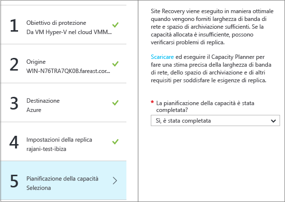

<properties
	pageTitle="Eseguire la replica di macchine virtuali Hyper-V presenti in cloud VMM in un sito VMM secondario usando il portale di Azure | Microsoft Azure"
	description="Questo articolo descrive come distribuire Azure Site Recovery per coordinare la replica, il failover e il ripristino di macchine virtuali Hyper-V in cloud VMM in un sito VMM secondario tramite il portale di Azure."
	services="site-recovery"
	documentationCenter=""
	authors="rayne-wiselman"
	manager="jwhit"
	editor=""/>

<tags
	ms.service="site-recovery"
	ms.workload="backup-recovery"
	ms.tgt_pltfrm="na"
	ms.devlang="na"
	ms.topic="article"
	ms.date="05/26/2016"
	ms.author="raynew"/>

# Eseguire la replica di macchine virtuali Hyper-V in cloud VMM in un sito VMM secondario usando il portale di Azure

> [AZURE.SELECTOR]
- [Portale di Azure](site-recovery-vmm-to-vmm.md)
- [Portale classico](site-recovery-vmm-to-vmm-classic.md)
- [PowerShell - Gestione risorse](site-recovery-vmm-to-vmm-powershell-resource-manager.md)

Benvenuti in Azure Site Recovery. Questo articolo illustra come eseguire la replica in un sito secondario di macchine virtuali Hyper-V locali gestite in cloud di System Center Virtual Machine Manager (VMM). Descrive inoltre come impostare la replica con Azure Site Recovery nel portale di Azure.

> [AZURE.NOTE] Azure offre due diversi [modelli di distribuzione](../resource-manager-deployment-model.md) per creare e usare le risorse: Azure Resource Manager e la distribuzione classica. Sono anche disponibili il portale di Azure classico, che supporta il modello di distribuzione classica, e il portale di Azure, che supporta entrambi i modelli di distribuzione.

Azure Site Recovery nel portale di Azure offre numerose nuove funzionalità:

- Nel portale di Azure il servizio Backup di Azure e il servizio Azure Site Recovery vengono combinati in un unico insieme di credenziali di Servizi di ripristino per consentire la configurazione e la gestione della continuità aziendale e del ripristino di emergenza da un'unica posizione. Un dashboard unificato permette di monitorare e gestire le operazioni nei siti locali e nel cloud pubblico di Azure.
- Gli utenti con sottoscrizioni di Azure in cui è stato effettuato il provisioning del programma Cloud Solution Provider (CSP) ora possono gestire le operazioni di Site Recovery nel portale di Azure.

Dopo aver letto questo articolo è possibile lasciare eventuali commenti nella sezione Disqus, nella parte inferiore della pagina. In caso di domande tecniche, visitare il [forum di Azure Site Recovery](https://social.msdn.microsoft.com/forums/azure/home?forum=hypervrecovmgr).

## Panoramica

Le organizzazioni necessitano di una strategia di continuità aziendale e ripristino di emergenza per determinare come app, carichi di lavoro e dati possano rimanere in esecuzione e disponibili durante i periodi di inattività, pianificati o meno, e come ripristinare le normali condizioni di lavoro il prima possibile. La strategia di continuità aziendale e ripristino di emergenza deve garantire la sicurezza dei dati aziendali e la possibilità di recuperarli, oltre alla disponibilità costante dei carichi di lavoro in caso di emergenza.

Il servizio Azure Site Recovery contribuisce alla strategia BCDR orchestrando la replica dei server fisici locali e delle macchine virtuali sul cloud (Azure) o in un data center secondario. In caso di interruzioni nella località primaria, verrà eseguito il failover alla località secondaria per mantenere disponibili app e carichi di lavoro. Quando la località primaria sarà di nuovo operativa, si tornerà a tale località. Per altre informazioni, vedere [Che cos'è Site Recovery?](site-recovery-overview.md)

Questo articolo fornisce tutte le informazioni necessarie per eseguire la replica in un sito VMM secondario di macchine virtuali Hyper-V locali presenti in cloud VMM. Include una panoramica sull'architettura, informazioni sulla pianificazione e procedure di distribuzione per la configurazione di server locali, delle impostazioni di replica e della pianificazione della capacità. Dopo aver configurato l'infrastruttura è possibile abilitare la replica nei computer da proteggere e verificare il funzionamento del failover.

## Vantaggi per le aziende

- Site Recovery garantisce la protezione dei carichi di lavoro aziendali e delle applicazioni in esecuzione su macchine virtuali Hyper-V replicandoli in un server Hyper-V secondario.
- Il portale di Servizi di ripristino permette di configurare, gestire e monitorare le operazioni di replica, failover e ripristino da un'unica posizione.
- È possibile eseguire facilmente il failover dall'infrastruttura locale primaria nel sito secondario ed eseguire il failback (ripristino) dal sito secondario a quello primario.
- È possibile configurare piani di ripristino con più computer per fare in modo che il failover dei carichi di lavoro delle applicazioni a più livelli venga eseguito contemporaneamente.

## Architettura dello scenario

Componenti dello scenario:

- **Sito primario**: nel sito primario sono presenti uno o più server host Hyper-V in cui sono in esecuzione le macchine virtuali di origine che si vuole replicare. I server host primari si trovano in un cloud VMM privato.
- **Sito secondario**: nel sito secondario sono presenti uno o più server host Hyper-V in cui sono in esecuzione le macchine virtuali di destinazione in cui verranno replicate le macchine virtuali primarie. Questi server host si trovano in un cloud VMM privato. Il cloud può trovarsi nel server primario (se si ha un solo server VMM) o in un server VMM secondario.
- **Provider**: durante la distribuzione di Site Recovery si installa il provider di Azure Site Recovery nei server VMM e si registrano i server in un insieme di credenziali dei servizi di ripristino. Il provider in esecuzione sul server VMM comunica con Site Recovery tramite HTTPS 443 per il coordinamento della replica. La replica dei dati viene eseguita tra il server host Hyper-V primario e quello secondario. I dati replicati rimangono nelle reti e nei siti locali e non vengono inviati ad Azure. Altre informazioni sulla [privacy](#privacy-information-for-site-recovery).

### Panoramica sulla privacy dei dati

Questa tabella descrive come vengono riepilogati i dati in questo scenario:
****
Azione | **Dettagli** | **Dati raccolti** | **Uso** | **Obbligatorio** 
--- | --- | --- | --- | ---
**Registrazione** | Si registra un server VMM in un insieme di credenziali dei servizi di ripristino. Se in seguito si vuole annullare la registrazione di un server, è possibile farlo eliminando le informazioni sul server dal portale di Azure. | Dopo la registrazione di un server VMM, Site Recovery raccoglie, elabora e trasferisce i metadati relativi al server VMM e i nomi dei cloud VMM rilevati da Site Recovery. | Questi dati vengono quindi usati per identificare e comunicare con il server VMM appropriato e configurare le impostazioni per i cloud VMM corretti. | Questa operazione è obbligatoria. Se non si vogliono inviare queste informazioni a Site Recovery, non sarà possibile usare il servizio. 
**Abilitare la replica** | Il provider di Azure Site Recovery viene installato nel server VMM e costituisce il canale per le comunicazioni con il servizio Site Recovery. Il provider è una DLL (Dynamic Link Library, libreria di collegamento dinamico) ospitata nel processo VMM. Al termine dell'installazione del provider, nella Console di amministrazione VMM viene abilitata la funzionalità "Datacenter Recovery". Questa funzionalità per la protezione delle macchine virtuali può essere abilitata in macchine virtuali nuove ed esistenti. | Se questa proprietà è impostata, il provider invia a Site Recovery il nome e l'ID della macchina virtuale. La replica viene abilitata dalla tecnologia di replica Hyper-V disponibile in Windows Server 2012 o Windows Server 2012 R2. I dati delle macchine virtuali vengono replicati da un host Hyper-V a un altro, generalmente situato in un data center di "ripristino" diverso. | Site Recovery usa i metadati per popolare le informazioni relative alla macchina virtuale nel portale di Azure. | Questa funzionalità è una parte essenziale del servizio e non può essere disattivata. Se non si vogliono inviare queste informazioni, non sarà possibile abilitare la protezione di Site Recovery per le macchine virtuali. Tenere presente che tutti i dati inviati dal provider a Site Recovery vengono trasmessi tramite HTTPS.
**Piano di ripristino** | I piani di ripristino consentono di creare un piano di orchestrazione per il data center di ripristino. È possibile definire l'ordine con cui le macchine virtuali o un gruppo di macchine virtuali deve essere avviato presso il sito di ripristino. Per ogni macchina virtuale, inoltre, è possibile specificare l'esecuzione di script automatizzati o di azioni manuali al momento del ripristino. Il failover viene in genere attivato a livello del piano di ripristino per consentire un ripristino coordinato. | Site Recovery raccoglie, elabora e trasmette i metadati per il piano di ripristino, inclusi i metadati della macchina virtuale e i metadati di qualsiasi script di automazione e nota di azione manuale. | I metadati vengono quindi usati per creare il piano di ripristino nel portale di Azure. | Questa funzionalità è una parte essenziale del servizio e non può essere disattivata. Se non si vogliono inviare queste informazioni a Site Recovery, non sarà possibile creare piani di ripristino.
**Mapping di rete** | Consente di eseguire il mapping delle informazioni di rete dal data center principale al data center di ripristino. Se le macchine virtuali vengono ripristinate presso il sito di ripristino, il mapping di rete consente di ristabilire la connettività di rete. | Site Recovery raccoglie, elabora e trasmette i metadati delle reti logiche per ogni sito (primario e data center). | I metadati vengono quindi usati per popolare le impostazioni di rete, in modo da poter eseguire il mapping delle informazioni di rete. | Questa funzionalità è una parte essenziale del servizio e non può essere disattivata. Se non si vogliono inviare queste informazioni a Site Recovery, non sarà possibile usare il mapping di rete.
**Failover (pianificato/non pianificato/test)** | Il failover di macchine virtuali non può essere eseguito tra due data center gestiti da VMM. L'azione di failover viene attivata manualmente nel portale di Azure. | Il provider del server VMM riceve la notifica dell'evento da Site Recovery ed esegue un'azione di failover sull'host Hyper-V tramite le interfacce VMM. Il failover effettivo di una macchina virtuale viene eseguito da un host Hyper-V a un altro e viene gestito dalla tecnologia di replica Hyper-V disponibile in Windows Server 2012 o Windows Server 2012 R2. Al termine del failover, il provider del server VMM nel data center di ripristino invia a Site Recovery le informazioni relative all'esito positivo dell'operazione. | Site Recovery usa le informazioni inviate per determinare lo stato dell'azione di failover nel portale di Azure. | Questa funzionalità è una parte essenziale del servizio e non può essere disattivata. Se non si vogliono inviare queste informazioni a Site Recovery, non sarà possibile usare il failover.

## Prerequisiti di Azure

Elementi necessari in Azure per la distribuzione di questo scenario:

**Prerequisiti** | **Dettagli** 
--- | ---
**Azzurro**| È necessario un account [Microsoft Azure](http://azure.microsoft.com/). È possibile iniziare con una [versione di valutazione gratuita](https://azure.microsoft.com/pricing/free-trial/). [Altre informazioni](https://azure.microsoft.com/pricing/details/site-recovery/) sui prezzi di Site Recovery. 

## Prerequisiti locali

Elementi necessari nel sito locale primario e in quello secondario per distribuire questo scenario:

**Prerequisiti** | **Dettagli** 
--- | ---
**VMM** | È consigliabile eseguire la distribuzione di un server VMM nel sito primario e di un server VMM nel sito secondario.   È possibile anche [eseguire la replica tra cloud in un singolo server VMM](site-recovery-single-vmm.md). A tale scopo, sono necessari almeno due cloud configurati sul server VMM.   I server VMM devono eseguire almeno System Center 2012 SP1 con gli aggiornamenti più recenti.   In ogni server VMM devono essere configurati uno o più cloud e in tutti i cloud deve essere impostato il profilo di capacità Hyper-V.   I cloud devono contenere uno o più gruppi host VMM.  Per altre informazioni sulla configurazione di cloud VMM, vedere [Preparare la distribuzione di Azure Site Recovery](https://msdn.microsoft.com/library/azure/dn469075.aspx#BKMK_Fabric) e [Walkthrough: Creating private clouds with System Center 2012 SP1 VMM](http://blogs.technet.com/b/keithmayer/archive/2013/04/18/walkthrough-creating-private-clouds-with-system-center-2012-sp1-virtual-machine-manager-build-your-private-cloud-in-a-month.aspx) (Procedura dettagliata: Creazione di cloud privati con System Center 2012 SP1 VMM).   I server VMM richiedono l'accesso a Internet. 
**Hyper-V** | I server Hyper-V devono eseguire almeno Windows Server 2012 con ruolo Hyper-V e con gli ultimi aggiornamenti installati.   Il server Hyper-V deve contenere una o più macchine virtuali.   I server host Hyper-V devono trovarsi nei gruppi host disponibili nei cloud VMM primario e secondario.   Se si esegue Hyper-V su un cluster in Windows Server 2012 R2, è necessario installare l'[aggiornamento 2961977](https://support.microsoft.com/kb/2961977)  . Se si esegue Hyper-V su un cluster in Windows Server 2012, il gestore del cluster non viene creato automaticamente se viene usato un cluster basato su indirizzi IP statici. Sarà necessario configurare manualmente il broker del cluster. [Altre informazioni](http://social.technet.microsoft.com/wiki/contents/articles/18792.configure-replica-broker-role-cluster-to-cluster-replication.aspx).
**Provider** | Durante la distribuzione di Site Recovery, installare il provider di Azure Site Recovery in server VMM. Il provider comunica con Site Recovery su HTTPS 443 per coordinare la replica. La replica dei dati viene eseguita tra il server Hyper-V primario e quello secondario attraverso la rete LAN o una connessione VPN.   Il provider in esecuzione nel server VMM deve poter accedere a questi URL: *.hypervrecoverymanager.windowsazure.com, *.accesscontrol.windows.net, *.backup.windowsazure.com, *.blob.core.windows.net, *.store.core.windows.net.   Consentire anche la comunicazione del firewall dai server VMM agli [intervalli IP dei data center di Azure](https://www.microsoft.com/download/confirmation.aspx?id=41653) e il protocollo HTTPS (443).

## Preparare la distribuzione

Per preparare la distribuzione è necessario:

1. [Preparare il server VMM](#prepare-the-vmm-server) per la distribuzione di Site Recovery.
2. [Preparare il mapping delle reti](#prepare-for-network-mapping). Configurare le reti in modo che sia possibile configurare il mapping di rete.

### Preparare il server VMM

Verificare che il server VMM sia conforme ai [prerequisiti](#on-premises-prerequisites) e possa accedere agli URL elencati.

### Preparare il mapping delle reti

Il mapping di rete esegue il mapping tra reti VM di VMM nei server VMM primario e secondario per:

- Posizionare in modo ottimale le macchine virtuali di replica in host Hyper-V secondari dopo il failover.
- Connettere le macchine virtuali di replica alle reti di macchine virtuali appropriate.
- Se non si configura il mapping di rete, le macchine virtuali di replica non verranno connesse ad alcuna rete dopo il failover.
- Se si vuole configurare il mapping di rete durante la distribuzione di Site Recovery, è necessario:

	- Accertarsi che le macchine virtuali nel server host Hyper-V di origine siano connesse a una rete VM di VMM. È necessario che tale rete sia collegata a una rete logica associata al cloud.
	- Verificare che per il cloud secondario in cui verrà eseguito il ripristino sia configurata una rete VM corrispondente, collegata a una rete logica associata al cloud secondario.

- [Altre informazioni](site-recovery-network-mapping.md) sul funzionamento del mapping di rete.

## Preparare la distribuzione con un unico server VMM

Se si è presente un unico server VMM, è possibile replicare le VM degli host Hyper-V presenti nel cloud VMM in [Azure](site-recovery-vmm-to-azure.md) o in un cloud VMM secondario. È consigliabile usare la prima opzione, poiché la replica tra cloud non è un'operazione semplice, ma se è necessario eseguirla, di seguito è riportata la procedura da seguire.

1. **Configurare VMM in una VM Hyper-V**. In questa fase è consigliabile condividere il percorso dell'istanza di SQL Server usata da VMM nella stessa macchina virtuale. In questo modo, infatti, deve essere creata una sola macchina virtuale, con un conseguente risparmio di tempo. Se si vuole usare un'istanza remota di SQL Server e si verifica un'interruzione, è necessario ripristinare l'istanza prima di ripristinare VMM.
2. **Assicurarsi che il server VMM abbia almeno due cloud configurati**. Un cloud conterrà le VM da replicare e l’altro cloud verrà usato come posizione secondaria. Il cloud che contiene le VM da proteggere deve essere conforme ai [prerequisiti](#on-premises-prerequisites).
3. Configurare Site Recovery come descritto in questo articolo. Creare e registrare il server VMM nell'insieme di credenziali, impostare un criterio di replica e abilitare la replica. È necessario specificare che la replica iniziale venga eseguita tramite la rete.
4. Se si configura il mapping di rete, verrà eseguito il mapping della rete VM relativa al cloud primario alla rete VM relativa al cloud secondario.
5. Nella console di gestione Hyper-V, abilitare la Replica Hyper-V nell'host Hyper-V che contiene le VM VMM e abilitare la replica sulla VM. Assicurarsi di non aggiungere la macchina virtuale VMM ai cloud protetti mediante Ripristino sito, per garantire che le impostazioni di Replica Hyper-V non siano sottoposte a override da Ripristino sito.
6. Se si creano piani di ripristino per il failover, si userà lo stesso server VMM per l'origine e la destinazione.
7. Eseguire il failover e il ripristino come riportato di seguito:

	- Effettuare manualmente il failover della macchina virtuale di VMM nel sito secondario usando la console di gestione di Hyper-V con un failover pianificato.
	- Eseguire il failover delle macchine virtuali.
	- Dopo aver ripristinato la macchina virtuale di VMM primaria, accedere al portale di Azure -> Insieme di credenziali dei servizi di ripristino ed eseguire un failover non pianificato delle macchine virtuali dal sito secondario al sito primario.
	- Al termine del failover non pianificato, è di nuovo possibile accedere a tutte le risorse dal sito primario.

### Creare un insieme di credenziali di Servizi di ripristino

1. Accedere al [portale di Azure](https://portal.azure.com).
2. Fare clic su **Nuovo** > **Gestione** > **Servizi di ripristino**. In alternativa è possibile fare clic su **Esplora** > **Insiemi di credenziali dei servizi di ripristino** > **Aggiungi**.

	

3. In **Nome** specificare un nome descrittivo per identificare l'insieme di credenziali. Se è disponibile più di una sottoscrizione, selezionarne una.
4. [Creare un nuovo gruppo di risorse](../resource-group-template-deploy-portal.md) o selezionarne uno esistente e specificare un'area di Azure. I computer verranno replicati in quest'area. Per informazioni sulla disponibilità a livello geografico e sulle aree supportate, vedere la pagina relativa ai [dettagli sui prezzi per Azure Site Recovery](https://azure.microsoft.com/pricing/details/site-recovery/).
4. Per accedere rapidamente all'insieme di credenziali dal dashboard, fare clic su **Aggiungi al dashboard** > **Crea insieme di credenziali**.

	

Il nuovo insieme di credenziali verrà visualizzato in **Dashboard** > **Tutte le risorse** e nel pannello **Insiemi di credenziali dei servizi di ripristino** principale.

## Introduzione

Le attività iniziali di Site Recovery consentono di eseguire la distribuzione molto rapidamente. Permettono di verificare i prerequisiti e illustrano i passaggi della distribuzione di Site Recovery nell'ordine corretto.

Nelle attività iniziali viene selezionato il tipo di computer da replicare e la posizione in cui eseguire la replica. Vengono configurati i server locali e creati i criteri di replica e viene eseguita la pianificazione della capacità. Dopo aver configurato l'infrastruttura viene abilitata la replica per le macchine virtuali. È possibile eseguire failover per computer specifici o creare piani di ripristino per eseguire il failover di più macchine.

Per avviare le attività iniziali, scegliere la modalità di distribuzione di Site Recovery. Il flusso delle attività iniziali è leggermente diverso a seconda dei requisiti di replica.

## Passaggio 1: Scegliere gli obiettivi di protezione

Selezionare gli elementi da replicare e la posizione in cui eseguire la replica.

1. Nel pannello **Insiemi di credenziali dei servizi di ripristino** selezionare l'insieme di credenziali e fare clic su **Impostazioni**.
2. In **Impostazioni** > **Attività iniziali** fare clic su **Site Recovery** > **Passaggio 1: Preparare l'infrastruttura** > **Obiettivo di protezione**.
3. In **Obiettivo di protezione** selezionare **Nel sito di ripristino** e quindi **Yes, with Hyper-V** (Sì, con Hyper-V).
4. Selezionare **Sì** per indicare che si sta usando VMM per gestire gli host Hyper-V e quindi **Sì** se si ha un server VMM secondario. Se si distribuisce la replica tra cloud in un unico server VMM, fare clic su **No**. Fare quindi clic su **OK**.

	

## Passaggio 2: Configurare l'ambiente di origine

Installare il provider di Azure Site Recovery nei server VMM e registrare il server nell'insieme di credenziali.

1. Fare clic su **Passaggio 2: Preparare l'infrastruttura** > **Origine**.

	

2. In **Prepara origine** fare clic su **+ VMM** per aggiungere un server VMM.

	

2. Nel pannello **Aggiungi server** verificare che in **Tipo di server** sia visualizzato **System Center VMM server** (Server System Center VMM) e che il server VMM sia conforme a [prerequisiti e requisiti URL](#on-premises-prerequisites).
4. Scaricare il file di installazione del provider di Azure Site Recovery.
5. Scaricare la chiave di registrazione, che sarà necessaria durante l'installazione. La chiave è valida per cinque giorni dal momento in cui viene generata.

	

6. Installare il provider di Azure Site Recovery nel server VMM.

> [AZURE.NOTE] Nei server host Hyper-V non è necessario installare niente in modo esplicito.

### Configurare il provider di Azure Site Recovery

1. Eseguire il file di installazione del provider in ogni server VMM. Se VMM viene distribuito in un cluster e si installa il provider per la prima volta, installarlo in un nodo attivo nel cluster e completare l'installazione per registrare il server VMM nell'insieme di credenziali. Quindi, installare il provider sugli altri nodi. Tutti i nodi del cluster devono eseguire la stessa versione del provider.
2. Il programma di installazione esegue alcune verifiche dei prerequisiti e chiede l'autorizzazione per arrestare il servizio VMM. Il servizio VMM verrà riavviato automaticamente al termine dell'installazione. Se si esegue l'installazione in un cluster VMM, verrà richiesto di interrompere il ruolo Cluster.

2.  In **Microsoft Update** è possibile acconsentire esplicitamente agli aggiornamenti in modo che gli aggiornamenti del provider vengano installati in base ai criteri di Microsoft Update.
3. In **Installazione** accettare o modificare il percorso predefinito di installazione del provider e quindi fare clic su **Installa**.

	

3. Al termine dell'installazione fare clic su **Registra** per registrare il server nell'insieme di credenziali.

	

9. In **Vault name** verificare il nome dell'insieme di credenziali in cui verrà registrato il server. Fare clic su *Avanti*.

	

7. Nella pagina **Connessione Internet** specificare la modalità di connessione Internet del provider in esecuzione sul server VMM. Selezionare **Connect with existing proxy settings** (Connetti con le impostazioni proxy esistenti) per usare le impostazioni di connessione a Internet predefinite configurate nel server.

	

	- Se si vuole usare un server proxy personalizzato, configurarlo prima di installare il provider. Quando si configurano impostazioni proxy personalizzate, verrà eseguito un test per verificare la connessione proxy.
	- Se si usa un proxy personalizzato oppure se il proxy predefinito richiede l'autenticazione, sarà necessario immettere i dettagli del proxy, tra cui l'indirizzo e la porta.
	- Gli URL seguenti devono essere accessibili dal server VMM e dagli host Hyper-V
		- *.hypervrecoverymanager.windowsazure.com
		- *.accesscontrol.windows.net
		- *.backup.windowsazure.com
		- *.blob.core.windows.net
		- *.store.core.windows.net
	- Consentire gli indirizzi IP descritti in [Intervalli IP dei data center di Azure](https://www.microsoft.com/download/confirmation.aspx?id=41653) e il protocollo HTTPS (443). È necessario aggiungere all'elenco di indirizzi consentiti gli IP dell'area Azure che si prevede di utilizzare e quello degli Stati Uniti occidentali.
	- Se si usa un proxy personalizzato, un account RunAs di VMM (DRAProxyAccount) verrà creato automaticamente con le credenziali del proxy specificate. Configurare il server proxy in modo che l'account possa eseguire correttamente l'autenticazione. Le impostazioni dell'account RunAs di VMM possono essere modificate nella console VMM. A tale scopo, aprire l'area di lavoro **Impostazioni**, espandere **Sicurezza**, fare clic su **Account RunAs**, quindi modificare la password di DRAProxyAccount. È necessario riavviare il servizio VMM per rendere effettiva l'impostazione.

8. In **Chiave di registrazione** selezionare il codice di registrazione scaricato da Azure Site Recovery e copiato nel server VMM.

10.  L'impostazione di crittografia viene usata solo quando si esegue la replica di VM Hyper-V in cloud VMM in Azure. Non viene usata se si esegue la replica in un sito secondario.

11.  In **Nome server** specificare un nome descrittivo per identificare il server VMM nell'insieme di credenziali. In una configurazione cluster specificare il nome del ruolo relativo al cluster VMM.
12.  In **Sincronizza i metadati cloud** selezionare se si vogliono sincronizzare i metadati per tutti i cloud presenti sul server VMM con l'insieme di credenziali. È necessario eseguire questa azione solo una volta in ogni server. Se non si vogliono sincronizzare tutti i cloud, è possibile lasciare deselezionata questa opzione e sincronizzare ogni cloud singolarmente nelle proprietà del cloud nella console VMM.

13.  Fare clic su **Avanti** per completare il processo. Dopo la registrazione, i metadati del server VMM vengono recuperati da Azure Site Recovery. Il server viene visualizzato nella scheda **Server VMM** della pagina **Server** nell'insieme di credenziali.
 	
	

11. Quando il server sarà disponibile nella console di Site Recovery, in **Origine** > **Prepara origine** selezionare il server VMM e quindi il cloud in cui si trova l'host Hyper-V. Fare quindi clic su **OK**.

#### Installazione dalla riga di comando

Il provider di Azure Site Recovery può essere installato dalla riga di comando. Questo metodo può essere usato per installare il provider in un Server Core per Windows Server 2012 R2.

1. Scaricare il file di installazione del provider e il codice di registrazione in una cartella, ad esempio C:\\ASR.
2. Arrestare il servizio System Center Virtual Machine Manager.
3. Da un prompt dei comandi con privilegi elevati eseguire questi comandi per estrarre il programma di installazione del provider:

    	C:\Windows\System32> CD C:\ASR
    	C:\ASR> AzureSiteRecoveryProvider.exe /x:. /q

4. Eseguire questo comando per installare il provider:

    	C:\ASR> setupdr.exe /i

5. Quindi eseguire questi comandi per registrare il server nell'insieme di credenziali:

    	CD C:\Program Files\Microsoft System Center 2012 R2\Virtual Machine Manager\bin
    	C:\Program Files\Microsoft System Center 2012 R2\Virtual Machine Manager\bin> DRConfigurator.exe /r  /Friendlyname <friendly name of the server> /Credentials <path of the credentials file> /EncryptionEnabled <full file name to save the encryption certificate>     

In cui i parametri sono i seguenti:

 - **/Credentials**: parametro obbligatorio che specifica la posizione in cui si trova il file della chiave di registrazione.
 - **/FriendlyName**: parametro obbligatorio per il nome del server host Hyper-V che viene visualizzato nel portale di Azure Site Recovery.
 - **/EncryptionEnabled**: parametro facoltativo che viene usato solo quando si esegue la replica da VMM in Azure.
 - **/proxyAddress**: parametro facoltativo che specifica l'indirizzo del server proxy.
 - **/proxyport**: parametro facoltativo che specifica la porta del server proxy.
 - **/proxyUsername**: parametro facoltativo che specifica il nome utente proxy (se il proxy richiede l'autenticazione).
 - **/proxyPassword**: parametro facoltativo che specifica la password per l'autenticazione nel server proxy (se il proxy richiede l'autenticazione).

## Passaggio 3: Configurare l'ambiente di destinazione

Selezionare il server VMM di destinazione e il cloud.

1. Fare clic su **Preparare l'infrastruttura** > **Destinazione** e selezionare il server VMM di destinazione che si vuole usare.
2.	Verranno visualizzati i cloud nel server sincronizzati con Site Recovery. Selezionare il cloud di destinazione.

	

## Passaggio 4: Configurare le impostazioni di replica

1. Per creare nuovi criteri di replica, fare clic su **Preparare l'infrastruttura** > **Impostazioni della replica** > **+Crea e associa**.

	

2. In **Creare e associare i criteri** specificare il nome dei criteri. Il tipo di origine e di destinazione deve essere **Hyper-V**.
3. In **Versione host Hyper-V** selezionare il sistema operativo in esecuzione nell'host.

	> [AZURE.NOTE] Il cloud VMM può contenere host Hyper-V che eseguono diverse versioni (supportate) di Windows Server, ma un criterio di replica può essere applicato solo a host che eseguono lo stesso sistema operativo. In caso di host che eseguono più versioni di un sistema operativo, quindi, creare criteri di replica separati.

4. In **Tipo di autenticazione** e **Porta di autenticazione** specificare come viene autenticato il traffico tra il server host Hyper-V primario e quello di ripristino. Selezionare **Certificato** a meno che non sia configurato un ambiente Kerberos funzionante. Azure Site Recovery configura automaticamente i certificati per l'autenticazione HTTPS. Non è necessario intervenire manualmente. Per impostazione predefinita, le porte 8083 e 8084 (per i certificati) sono aperte in Windows Firewall per i server host Hyper-V. Se si seleziona **Kerberos**, verrà usato un ticket Kerberos per l'autenticazione reciproca dei server host. Questa impostazione è rilevante solo per i server host Hyper-V in esecuzione su Windows Server 2012 R2.
3. In **Frequenza di copia** specificare la frequenza con cui replicare i dati differenziali dopo la replica iniziale, ogni 30 secondi oppure ogni 5 o 15 minuti.
4. In **Conservazione del punto di ripristino** specificare la durata in ore dell'intervallo di conservazione per ogni punto di ripristino. I computer protetti possono essere ripristinati in qualsiasi punto all'interno di un intervallo.
6. In **Frequenza snapshot coerenti con l'app** specificare la frequenza, da 1 a 12 ore, per la creazione di punti di ripristino contenenti snapshot coerenti con l'applicazione. Hyper-V utilizza due tipi di snapshot, uno snapshot standard che fornisce uno snapshot incrementale dell'intera macchina virtuale e uno snapshot coerente con l'applicazione che accetta uno snapshot temporizzato dei dati dell'applicazione all'interno della macchina virtuale. Negli snapshot coerenti dell'applicazione viene usato il servizio Copia Shadow del volume (VSS) per garantire che le applicazioni siano coerenti durante la creazione dello snapshot. Si noti che un'eventuale abilitazione di snapshot coerenti dell'applicazione influirà sulle prestazioni delle applicazioni in esecuzione nelle macchine virtuali di origine. Assicurarsi che il valore impostato sia inferiore al numero di punti di ripristino aggiuntivi configurati.
7. In **Compressione trasferimento dati** specificare se i dati replicati che vengono trasferiti devono essere compressi.
8. Selezionare **Eliminare la macchina virtuale di replica** per specificare che la macchina virtuale di replica deve essere eliminata nel caso in cui si disabiliti la protezione per la VM di origine. Con questa impostazione abilitata, quando si disabilita la protezione per la macchina virtuale di origine, questa viene rimossa dalla console di Site Recovery, le impostazioni di Site Recovery relative a VMM vengono rimosse dalla console VMM e la replica viene eliminata.
3. Se si esegue la replica in rete, in **Metodo di replica iniziale** specificare se si preferisce avviare la replica iniziale o pianificarla. Per risparmiare larghezza di banda di rete, è opportuno pianificarla al di fuori dell'orario di lavoro. Fare quindi clic su **OK**.

	

6. Quando si creano nuovi criteri, questi vengono associati automaticamente al cloud VMM. In **Criteri di replica** fare clic su **OK**. È possibile associare altri cloud VMM, e le VM che contengono, a questi criteri di replica in **Impostazioni** > **Replica** > nome dei criteri > **Associate VMM Cloud** (Associa cloud VMM).

	

### Preparare la replica iniziale offline

Per la copia iniziale dei dati è possibile eseguire la replica non in linea. Per prepararla, procedere come segue:

- Nel server di origine specificare il percorso dal quale verrà eseguita l'esportazione dei dati. Assegnare il controllo completo per NTFS e le autorizzazioni di condivisione al servizio VMM sul percorso di esportazione. Nel server di destinazione specificare il percorso dal quale verrà eseguita l'importazione dei dati. Assegnare le stesse autorizzazioni indicate in precedenza per questo percorso esportazione.
- Se il percorso importazione o esportazione è condiviso, assegnare l'appartenenza al gruppo Administrator, Power User, Print Operators o Server Operators per l'account del servizio VMM nel computer remoto in cui si trova il percorso condiviso.
- Se si utilizzano account RunAs per aggiungere gli host, nei percorsi di importazione ed esportazione assegnare le autorizzazioni di lettura e scrittura per l'esecuzione agli account RunAs in VMM.
- Le condivisioni di importazione ed esportazione non devono essere posizionate nei computer usati come server host Hyper-V, in quanto la configurazione del loopback non è supportata da Hyper-V.
- In Active Directory, in ogni server host Hyper-V contenente le macchine virtuali che si desidera proteggere, abilitare e configurare la delega vincolata affinché i computer remoti nei quali sono situati i percorsi di esportazione e importazione siano considerati attendibili, come illustrato di seguito:
	1. Nel controller di dominio, aprire **Utenti e computer di Active Directory**.
	2. Nell'albero della console fare clic su **NomeDominio** > **Computer**.
	3. Fare clic con il pulsante destro del mouse sul nome del server host Hyper-V e scegliere **Proprietà**.
	4. Nella scheda **Delega** fare clic su **Computer attendibile per la delega solo ai servizi specificati**.
	5. Fare clic su **Usa un qualsiasi protocollo di autenticazione**.
	6. Fare clic su **Aggiungi** > **Utenti e computer**.
	7. Digitare il nome del computer che ospita il percorso di esportazione e fare clic su **OK**. Nell'elenco dei servizi disponibili tenere premuto CTRL e fare clic su **cifs** > **OK**. Ripetere l'operazione per il nome del computer che ospita il percorso esportazione. Ripetere l'operazione per eventuali altri server host Hyper-V.

### Configurare il mapping di rete

Configurare il mapping di rete tra reti di origine e di destinazione.

- [Fare clic qui](#prepare-for-network-mapping) per una panoramica rapida sulle operazioni eseguite dal mapping di rete. [Fare clic qui](site-recovery-network-mapping.md) per informazioni più dettagliate.
- Verificare che le macchine virtuali sui server VMM siano connesse a una rete VM.

Per configurare il mapping, procedere come segue:

1. In **Impostazioni** > **Site Recovery Infrastructure** (Infrastruttura di Site Recovery) > **Mapping di rete** > **Mapping di rete** fare clic su **+Mapping di rete**.

	

2. Nella scheda **Aggiungi mapping di rete** selezionare i server VMM di origine e di destinazione. Vengono recuperate le reti VM associate ai server VMM.
3. In **Rete di origine** selezionare la rete che si vuole usare nell'elenco di reti VM associate al server VMM primario.
6. In **Rete di destinazione** selezionare la rete che si vuole usare nel server VMM secondario. Fare quindi clic su **OK**.

	

Quando ha inizio il mapping di rete vengono eseguite le operazioni seguenti:

- Tutte le macchine virtuali di replica esistenti che corrispondono alla rete VM di origine verranno connesse alle reti VM di destinazione.
- Dopo la replica, le nuove macchine virtuali connesse alla rete VM di origine verranno connesse alla rete mappata di destinazione.
- Se si modifica un mapping esistente con una nuova rete, le macchine virtuali di replica verranno connesse usando le nuove impostazioni.
- Se la rete di destinazione dispone di più subnet e una di esse ha lo stesso nome di una subnet in cui si trova la macchina virtuale di origine, la macchina virtuale di replica sarà connessa a tale subnet di destinazione dopo il failover. Se non è presente una subnet di destinazione con un nome corrispondente, la macchina virtuale sarà connessa alla prima subnet della rete.

## Passaggio 5: Pianificazione della capacità

Dopo aver configurato l'infrastruttura di base è possibile passare alla pianificazione della capacità e valutare se sono necessarie altre risorse.

In Site Recovery è disponibile uno strumento di pianificazione della capacità basato su Excel che consente di allocare le risorse appropriate all'ambiente di origine, i componenti di Site Recovery, la rete e l'archiviazione. Lo strumento di pianificazione può essere eseguito in modalità rapida, per ottenere stime basate su un numero medio di macchine virtuali, dischi e risorse di archiviazione, oppure in modalità dettagliata, in cui è necessario inserire le cifre a livello di carico di lavoro. Prima di iniziare è necessario:

- Raccogliere informazioni sull'ambiente di replica, incluse le macchine virtuali, i dischi per ogni macchina virtuale e le risorse di archiviazione per ogni disco.
- Stimare la frequenza di modifica giornaliera (varianza) prevista per i dati differenziali replicati. A questo scopo è possibile usare lo strumento [Capacity Planner for Hyper-V Replica](https://www.microsoft.com/download/details.aspx?id=39057).

1.	Fare clic su **Download** per scaricare lo strumento e quindi eseguirlo. [Vedere l'articolo](site-recovery-capacity-planner.md) fornito con lo strumento.
2.	Al termine scegliere **Sì** in **Have you run the Capacity Planner** (È stato eseguito lo strumento Capacity Planner?).

	

### Controllare la larghezza di banda

Dopo aver raccolto informazioni in tempo reale sulla replica differenziale tramite Capacity Planner for Hyper-V Replica, lo strumento di pianificazione della capacità basato su Excel consente di calcolare la larghezza di banda necessaria per la replica (iniziale e differenziale). Per controllare la quantità di larghezza di banda usata per la replica è possibile configurare i criteri NetQos tramite Criteri di gruppo o Windows PowerShell. Questa operazione può essere eseguita in più modi:

**PowerShell** | **Dettagli**
--- | ---
**New-NetQosPolicy "Da QoS a subnet di destinazione"** | Limita il traffico proveniente da un host Hyper-V che esegue Windows Server 2012 R2 a una subnet secondaria. Usare questa opzione se le subnet primarie e secondarie sono diverse.
**New-NetQosPolicy "Da QoS a porta di destinazione"** | Limita il traffico proveniente da un host Hyper-V che esegue Windows Server 2012 R2 a una porta di destinazione.
**New-NetQosPolicy "Limita il traffico da VMM"** | Limita il traffico proveniente da vmms.exe. Viene inoltre limitato il traffico Hyper-V e il traffico di migrazione in tempo reale. È possibile associare i protocolli IP e le porte da ridefinire.

È possibile usare le impostazioni relative al peso della larghezza di banda o limitare il traffico per bit in ogni subnet secondaria. Se si usa un cluster è necessario eseguire questa operazione su tutti i nodi del cluster. Per altre informazioni, vedere:

- Post sulla [limitazione del traffico di replica di Hyper-V](http://www.thomasmaurer.ch/2013/12/throttling-hyper-v-replica-traffic/) nel blog di Thomas Maurer
- Altre informazioni sul [cmdlet New-NetQosPolicy](https://technet.microsoft.com/library/hh967468.aspx).

## Passaggio 6: Abilitare la replica 

Per abilitare la replica, procedere come descritto di seguito.

1. Fare clic su **Passaggio 2: Eseguire la replica dell'applicazione** > **Origine**. Dopo aver abilitato la replica per la prima volta, è necessario fare clic su **+Replica** nell'insieme di credenziali per abilitare la replica per altri computer.

	

2. Nel pannello **Origine** selezionare il cloud e il server VMM in cui si trovano gli host Hyper-V che si vogliono replicare. Fare quindi clic su **OK**.

	

3. Nel pannello **Destinazione** verificare il cloud e il server VMM secondario.
4. In **Macchine virtuali** selezionare nell'elenco le VM da proteggere.

	

È possibile tenere traccia dello stato di avanzamento dell'azione **Abilita protezione** in Impostazioni > **Processi** > **Site Recovery jobs** (Processi di Site Recovery). Dopo l'esecuzione del processo **Finalizza protezione**, la macchina virtuale è pronta per il failover.

>[AZURE.NOTE] È anche possibile abilitare la protezione per le macchine virtuali nella console VMM. Fare clic su **Abilita protezione** sulla barra degli strumenti della scheda **Azure Site Recovery** nelle proprietà della macchina virtuale.

Dopo aver abilitato la replica è possibile visualizzare le proprietà della VM in **Impostazioni** > **Elementi replicati** > nome-vm. Nel dashboard **Informazioni di base** è possibile visualizzare informazioni sui criteri di replica per la VM e il relativo stato. Per altri dettagli, fare clic su **Proprietà**.

### Caricare le macchine virtuali esistenti

Se in VMM sono presenti macchine virtuali replicate tramite la replica Hyper-V, è possibile caricarle per la protezione di Azure Site Recovery nel modo seguente:

1. Assicurarsi che il server Hyper-V che ospita la macchina virtuale esistente si trovi nel cloud primario e che il server Hyper-V che ospita la macchina virtuale di replica si trovi nel cloud secondario.
2. Assicurarsi che per il cloud VMM primario sia configurato un criterio di replica.
2. Abilitare la replica per la macchina virtuale primaria. Azure Site Recovery e VMM garantiscono che vengano rilevati la stessa macchina virtuale e lo stesso host di replica. Azure Site Recovery riuserà e ristabilirà la replica tramite le impostazioni configurate.

## Passaggio 7: Testare la distribuzione

Per testare la distribuzione è possibile eseguire un failover di test per una singola macchina virtuale o creare un piano di ripristino che contenga una o più macchine virtuali.

### Preparare il failover

- Per testare completamente la distribuzione è necessario che l'infrastruttura per il computer replicato funzioni come previsto. Per testare Active Directory e DNS è possibile creare una macchina virtuale come controller di dominio con DNS ed eseguirne la replica in Azure usando Azure Site Recovery. Per altre informazioni, vedere [Considerazioni sul failover di test](site-recovery-active-directory.md#considerations-for-test-failover).
- Le istruzioni presenti in questo articolo descrivono come eseguire un failover di test senza rete. Questa opzione verifica che la macchina virtuale esegua il failover ma non testa le impostazioni di rete per la macchina virtuale. [Altre informazioni](site-recovery-failover.md#run-a-test-failover) sulle altre opzioni.
- Per eseguire un failover non pianificato anziché un failover di test, tenere presente quanto segue:

	- È consigliabile arrestare i computer primari prima di eseguire un failover non pianificato. Questo permette di evitare che il computer di origine e quello di replica siano in esecuzione nello stesso momento.
	- Quando si esegue un failover non pianificato, la replica dei dati dai computer primari viene arrestata per evitare il trasferimento di dati differenziali a failover iniziato. Se si esegue un failover non pianificato in un piano di ripristino, verrà eseguito fino al completamento anche se si verifica un errore.

### Eseguire un failover di test

1. Per eseguire il failover di una VM, in **Impostazioni** > **Elementi replicati** fare clic sulla VM e quindi su **+Failover di test**.

	

2. Per eseguire il failover di un piano di ripristino, in **Impostazioni** > **Piani di ripristino** fare clic con il pulsante destro del mouse sul piano e quindi scegliere **Failover di test**. Per creare un piano di ripristino, [seguire queste istruzioni](site-recovery-create-recovery-plans.md).
2. In **Failover di test** selezionare **Nessuno**. Con questa opzione si verifica che la macchina virtuale esegua il failover come previsto, ma la macchina virtuale replicata non verrà connessa ad alcuna rete.

	

3. Fare clic su **OK** per iniziare il failover. È possibile tenere traccia dello stato di avanzamento facendo clic sulla VM per visualizzarne le proprietà oppure selezionando il processo **Failover di test** in **Impostazioni** > **Processi** > **Site Recovery jobs** (Processi di Site Recovery).
4. Quando il processo di failover raggiunge la fase **Completa test**, seguire questa procedura:

	-  Visualizzare la macchina virtuale di replica nel cloud VMM secondario.
	-  Fare clic su **Complete the test** (Completa il test) per portare a termine il failover di test.
	-  Fare clic su **Note** per registrare e salvare eventuali commenti associati al failover di test.

5. La macchina virtuale di test viene creata sullo stesso host in cui è presente la macchina virtuale di replica, oltre a essere aggiunta allo stesso cloud in cui si trova la macchina virtuale di replica.
6. Dopo aver verificato il corretto avvio delle VM, fare clic su **Il failover di test è completo**. A questo punto, eventuali elementi creati automaticamente da Site Recovery durante il failover di test vengono eliminati.

	> [AZURE.NOTE] Se un failover di test continua per più di due settimane, ne viene forzato il completamento.

### Aggiornare il server DNS con l'indirizzo IP della macchina virtuale di replica

Dopo il failover, è possibile che la macchina virtuale di replica non abbia lo stesso indirizzo IP della macchina virtuale primaria.

- Le macchine virtuali aggiorneranno il server DNS in uso dopo l'avvio.
- È inoltre possibile aggiornare manualmente il server DNS come indicato di seguito:

#### Recuperare l'indirizzo IP

Eseguire il seguente script di esempio per recuperare l'indirizzo IP.

    	$vm = Get-SCVirtualMachine -Name <VM_NAME>
		$na = $vm[0].VirtualNetworkAdapters>
		$ip = Get-SCIPAddress -GrantToObjectID $na[0].id
		$ip.address  

#### Aggiornare il DNS

Eseguire il seguente script di esempio per aggiornare il DNS e specificare l'indirizzo IP recuperato mediante il precedente script di esempio.

		string]$Zone,
		[string]$name,
		[string]$IP
		)
		$Record = Get-DnsServerResourceRecord -ZoneName $zone -Name $name
		$newrecord = $record.clone()
		$newrecord.RecordData[0].IPv4Address  =  $IP
		Set-DnsServerResourceRecord -zonename $zone -OldInputObject $record -NewInputObject $Newrecord

## Passaggi successivi

Dopo aver configurato correttamente la distribuzione, vedere [altre informazioni](site-recovery-failover.md) sui diversi tipi di failover.

<!---HONumber=AcomDC_0803_2016-->