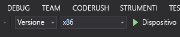

# Guida introduttiva: Creare un'app HoloLens con Ancoraggi nello spazio di Azure, in C + +/WinRT e DirectX

Questa guida introduttiva illustra come creare un'app HoloLens usando [Ancoraggi nello spazio di Azure](../overview.md) in C++/WinRT e DirectX. Ancoraggi nello spazio di Azure è un servizio per lo sviluppo multipiattaforma che consente di creare esperienze di realtà mista usando oggetti la cui posizione persiste tra dispositivi nel corso del tempo. Al termine, si avrà un'app HoloLens in grado di salvare e richiamare un ancoraggio nello spazio.

Si apprenderà come:

> [!div class="checklist"]
> * Creare un account di Ancoraggi nello spazio
> * Configurare l'identificatore e la chiave dell'account di Ancoraggi nello spazio
> * Distribuire ed eseguire l'app in un dispositivo HoloLens

[!INCLUDE [quickstarts-free-trial-note](../../../includes/quickstarts-free-trial-note.md)]

## Prerequisiti

Per completare questa guida introduttiva, accertarsi di disporre di quanto segue:

- Un computer Windows con <a href="https://www.visualstudio.com/downloads/" target="_blank">Visual Studio 2017+</a> installato con il carico di lavoro **Sviluppo di app per la piattaforma UWP (Universal Windows Platform)**, il componente **Windows 10 SDK (10.0.17763.0 o versione successiva)** e <a href="https://git-scm.com/download/win" target="_blank">Git per Windows</a>.
- [C++/WinRT Visual Studio Extension (VSIX)](https://aka.ms/cppwinrt/vsix) per Visual Studio installato da [Visual Studio Marketplace](https://marketplace.visualstudio.com/).
- Un dispositivo HoloLens con la [modalità sviluppatore](https://docs.microsoft.com/windows/mixed-reality/using-visual-studio) abilitata. Questo articolo richiede un dispositivo HoloLens con l'[Aggiornamento di Windows 10 (ottobre 2018)](https://docs.microsoft.com/windows/mixed-reality/release-notes-october-2018 ) (noto anche come RS5). Per aggiornare alla versione più recente per HoloLens, aprire l'app **Impostazioni**, scegliere **Aggiornamento e sicurezza**, quindi selezionare il pulsante **Verifica disponibilità aggiornamento**.
- L'app deve impostare la funzionalità **spatialPerception** nel proprio manifesto AppX.

[!INCLUDE [Create Spatial Anchors resource](../../../includes/spatial-anchors-get-started-create-resource.md)]

## Aprire il progetto di esempio

[!INCLUDE [Clone Sample Repo](../../../includes/spatial-anchors-clone-sample-repository.md)]

Aprire `HoloLens\DirectX\SampleHoloLens.sln` in Visual Studio.

## Configurare l'identificatore e la chiave dell'account

Il passaggio successivo consiste nel configurare l'app in modo da usare l'identificatore e la chiave dell'account. Questi dati sono stati copiati in un editor di testo durante la [configurazione della risorsa Ancoraggi nello spazio](#create-a-spatial-anchors-resource).

Aprire `HoloLens\DirectX\SampleHoloLens\ViewController.cpp`.

Individuare il campo `SpatialAnchorsAccountKey` e sostituire `Set me` con la chiave dell'account.

Individuare il campo `SpatialAnchorsAccountId` e sostituire `Set me` con l'identificatore dell'account.

## Distribuire l'app nel dispositivo HoloLens

Impostare **Solution Configuration** (Configurazione soluzione) su **Release** (Versione), impostare **Solution Platform** (Piattaforma soluzione) su **x86** e selezionare **Device** (Dispositivo) nelle opzioni di destinazione di distribuzione.

Accendere il dispositivo HoloLens, eseguire l'accesso e connetterlo al PC con un cavo USB.

Selezionare **Debug** > **Avvia debug** per distribuire l'app e avviare il debug.

Seguire le istruzioni nell'app per posizionare e richiamare un ancoraggio.

In Visual Studio arrestare l'app selezionando **Arresta debug** o premendo **MAIUSC+F5**.

[!INCLUDE [Clean-up section](../../../includes/clean-up-section-portal.md)]

[!INCLUDE [Next steps](../../../includes/spatial-anchors-quickstarts-nextsteps.md)]

> [!div class="nextstepaction"]
> [Esercitazione: Condividere gli ancoraggi nello spazio tra dispositivi](../tutorials/tutorial-share-anchors-across-devices.md)
