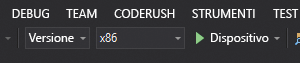

# Avvio rapido: Creare un'app Unity HoloLens con Ancoraggi nello spazio di Azure

Questa guida introduttiva illustra come creare un'app Unity HoloLens usando [Ancoraggi nello spazio di Azure](../overview.md). Ancoraggi nello spazio di Azure è un servizio per lo sviluppo multipiattaforma che consente di creare esperienze di realtà mista usando oggetti la cui posizione persiste tra dispositivi nel corso del tempo. Al termine si avrà un'app HoloLens compilata con Unity in grado di salvare e richiamare un ancoraggio nello spazio.

Si apprenderà come:

> [!div class="checklist"]
> * Creare un account di Ancoraggi nello spazio
> * Preparare le impostazioni di compilazione di Unity
> * Configurare l'identificatore e la chiave dell'account di Ancoraggi nello spazio
> * Esportare il progetto Visual Studio HoloLens
> * Distribuire ed eseguire l'app in un dispositivo HoloLens

[!INCLUDE [quickstarts-free-trial-note](../../../includes/quickstarts-free-trial-note.md)]

## Prerequisiti

Per completare questa guida introduttiva, accertarsi di disporre di quanto segue:

- Un computer Windows con <a href="https://unity3d.com/get-unity/download" target="_blank">Unity 2018.3+</a> e <a href="https://www.visualstudio.com/downloads/" target="_blank">Visual Studio 2017+</a> installati con il carico di lavoro **Sviluppo di app per la piattaforma UWP (Universal Windows Platform)**.
- Un dispositivo HoloLens con la [modalità sviluppatore](https://docs.microsoft.com/windows/mixed-reality/using-visual-studio) abilitata.
- L'app deve impostare la funzionalità **SpatialPerception** in **Build Settings**->**Player Settings**->**Publishing Settings**->**Capabilities** (Impostazioni compilazione->Impostazioni lettore->Impostazioni pubblicazione->Funzionalità).
- L'app deve abilitare **Virtual Reality Supported** (Realtà virtuale supportata) con **Windows Mixed Reality SDK** in **Build Settings**->**Player Settings**->**XR Settings** (Impostazioni compilazione->Impostazioni lettore->Impostazioni XR).

[!INCLUDE [Create Spatial Anchors resource](../../../includes/spatial-anchors-get-started-create-resource.md)]

## Aprire il progetto di esempio in Unity

[!INCLUDE [Clone Sample Repo](../../../includes/spatial-anchors-clone-sample-repository.md)]

Aprire Unity e il progetto nella cartella `Unity`.

Aprire **Build Settings** (Impostazioni compilazione) selezionando **File** -> **Build Settings** (File -> Impostazioni compilazione).

Nella sezione **Platform** (Piattaforma) selezionare **Universal Windows Platform** (Piattaforma UWP (Universal Windows Platform)). Impostare quindi **HoloLens** come **Target Device** (Dispositivo di destinazione).

Selezionare **Switch Platform** (Cambia piattaforma) per impostare **Universal Windows Platform** (Piattaforma UWP (Universal Windows Platform)) come piattaforma.

Chiudere la finestra **Build Settings** (Impostazioni compilazione).

## Configurare l'identificatore e la chiave dell'account

Nel riquadro **Progetto** passare a `Assets/AzureSpatialAnchorsPlugin/Examples` e aprire il file della scena `AzureSpatialAnchorsBasicDemo.unity`.

[!INCLUDE [Configure Unity Scene](../../../includes/spatial-anchors-unity-configure-scene.md)]

Salvare la scena selezionando **File** -> **Salva**.

## Esportare il progetto Visual Studio HoloLens

[!INCLUDE [Export Unity Project](../../../includes/spatial-anchors-unity-export-project-snip.md)]

Selezionare **Build** (Compila) per aprire una finestra di dialogo. Selezionare quindi una cartella in cui esportare il progetto HoloLens Visual Studio.

Al termine dell'esportazione, verrà visualizzata una cartella contenente il progetto HoloLens esportato.

## Distribuire l'applicazione HoloLens

Nella cartella fare doppio clic su `HelloAR U3D.sln` per aprire il progetto in Visual Studio.

Impostare **Solution Configuration** (Configurazione soluzione) su **Release** (Versione), impostare **Solution Platform** (Piattaforma soluzione) su **x86** e selezionare **Device** (Dispositivo) nelle opzioni di destinazione di distribuzione.

Accendere il dispositivo HoloLens, eseguire l'accesso e connetterlo al PC con un cavo USB.

Selezionare **Debug** > **Avvia debug** per distribuire l'app e avviare il debug.

Seguire le istruzioni nell'app per posizionare e richiamare un ancoraggio.

In Visual Studio arrestare l'app selezionando **Arresta debug** o premendo **MAIUSC+F5**.

[!INCLUDE [Clean-up section](../../../includes/clean-up-section-portal.md)]

[!INCLUDE [Next steps](../../../includes/spatial-anchors-quickstarts-nextsteps.md)]

> [!div class="nextstepaction"]
> [Esercitazione: Condividere gli ancoraggi nello spazio tra dispositivi](../tutorials/tutorial-share-anchors-across-devices.md)
