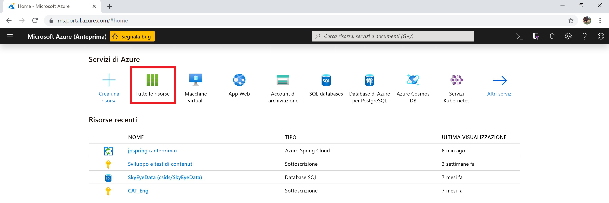
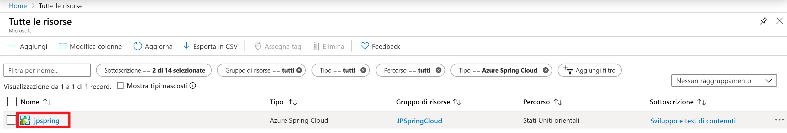
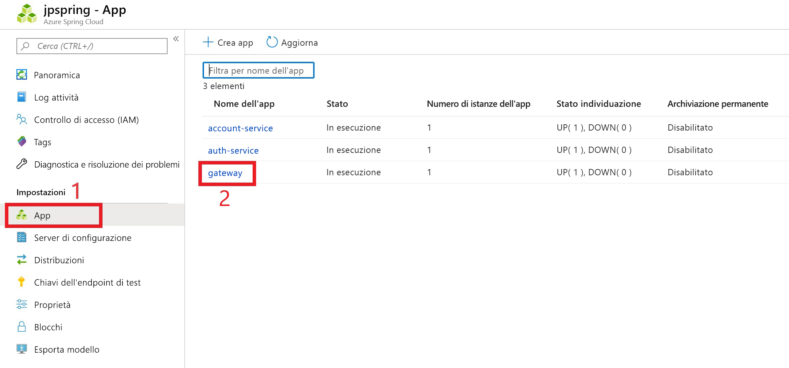
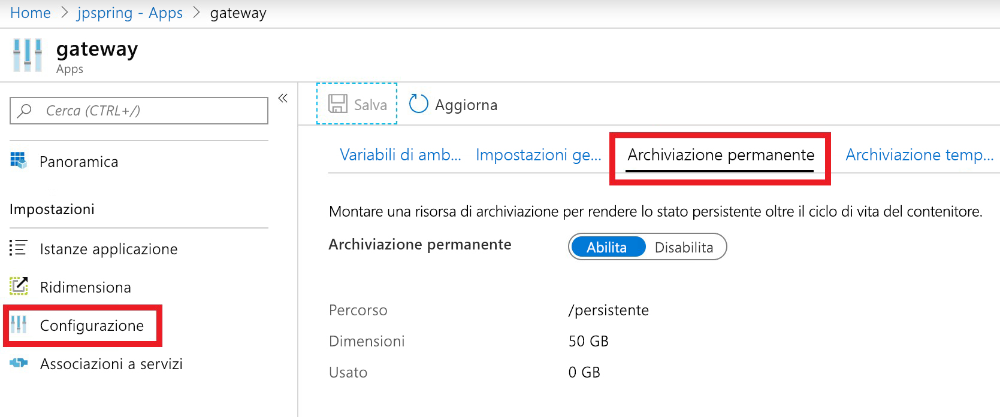

# <a name="how-to-use-persistent-storage-in-azure-spring-cloud"></a>Come usare l'archiviazione persistente nel cloud Spring di Azure

Azure Spring cloud fornisce due tipi di archiviazione per l'applicazione: permanente e temporanea.  Azure Spring cloud Abilita l'archiviazione temporanea per impostazione predefinita per ogni istanza dell'applicazione. L'archiviazione temporanea è limitata a 5 GB con un percorso di montaggio predefinito: `/tmp`.

> [!WARNING]
> Il riavvio di un'istanza dell'applicazione eliminerà definitivamente l'archiviazione temporanea associata.

L'archiviazione persistente è un contenitore di condivisione file gestito da Azure allocato per ogni applicazione. I dati archiviati nell'archivio permanente sono condivisi tra tutte le istanze dell'applicazione. Un'istanza del servizio cloud Spring di Azure può avere un massimo di 10 applicazioni con dischi permanenti abilitati. Ogni applicazione riceve 50 GB di spazio di archiviazione permanente. Il percorso di montaggio predefinito per l'archiviazione persistente è `/persistent`.

> [!WARNING]
> Se si *Disabilita* l'archiviazione persistente, lo spazio di archiviazione per l'applicazione viene deallocato.  Tutti i dati dell'account di archiviazione andranno persi. 

## <a name="enable-persistent-storage-using-the-azure-portal"></a>Abilitare l'archiviazione permanente usando il portale di Azure

1. Dalla schermata iniziale del portale di Azure selezionare **tutte le risorse**.

     >

1. Trovare e selezionare la risorsa cloud di Azure Spring che necessita di archiviazione permanente.  In questo esempio, l'applicazione è denominata *jpspring*.

    > 

1. Sotto l'intestazione **Impostazioni** selezionare **app**.

1. I servizi cloud Spring verranno visualizzati nella tabella.  Selezionare il servizio a cui si desidera aggiungere l'archiviazione permanente.  In questo esempio verrà selezionato il servizio **gateway** .

    > 

1. Nel pannello configurazione del servizio selezionare **configurazione** .

1. Selezionare la scheda **archiviazione permanente** e abilitare l'archiviazione permanente.

    > 

Quando è abilitata l'archiviazione persistente, le dimensioni e il percorso vengono visualizzati in questa pagina.

## <a name="use-the-azure-cli-to-modify-persistent-storage"></a>Usare l'interfaccia della riga di comando di Azure per modificare l'archiviazione permanente

Se necessario, installare l'estensione Spring cloud per l'interfaccia della riga di comando di Azure:

```azurecli
az extension add --name spring-cloud
```

Creare un'app con il disco persistente abilitato:
 
```azurecli
az spring-cloud app create -n <app> -g <resource-group> -s <service-name> --enable-persistent-storage true
```

Abilitare l'archiviazione permanente in un'app esistente:

```azurecli
az spring-cloud app update -n <app> -g <resource-group> -s <service-name> --enable-persistent-storage true
``` 

Disabilitare l'archiviazione permanente in un'app esistente:

> [!WARNING]
> Se si disabilita l'archiviazione persistente, lo spazio di archiviazione per l'applicazione viene deallocato, perdendo definitivamente i dati archiviati. 

```azurecli
az spring-cloud app update -n <app> -g <resource-group> -s <service-name> --enable-persistent-storage false
```

## <a name="next-steps"></a>Passaggi successivi

Informazioni sulle [quote delle applicazioni e dei servizi](spring-cloud-quotas.md)o informazioni su come [ridimensionare manualmente l'applicazione](spring-cloud-tutorial-scale-manual.md).