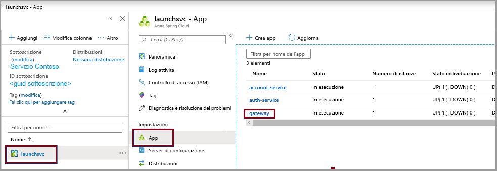
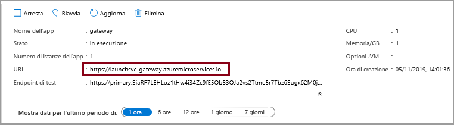

# <a name="quickstart-build-and-deploy-apps-to-azure-spring-cloud"></a>Avvio rapido: Compilare e distribuire app in Azure Spring Cloud

::: zone pivot="programming-language-csharp"
In questo argomento di avvio rapido si creano e si distribuiscono applicazioni di microservizi in Azure Spring Cloud usando l'interfaccia della riga di comando di Azure.

## <a name="prerequisites"></a>Prerequisiti

* Completare gli argomenti di avvio rapido precedenti di questa serie:

  * [Effettuare il provisioning del servizio Azure Spring Cloud](spring-cloud-quickstart-provision-service-instance.md).
  * [Configurare il server di configurazione di Azure Spring Cloud](spring-cloud-quickstart-setup-config-server.md).

## <a name="download-the-sample-app"></a>Scaricare l'app di esempio

Se finora è stato usato Azure Cloud Shell, passare a un prompt dei comandi locale per i passaggi seguenti.

1. Creare una nuova cartella e clonare il repository dell'app di esempio.

   ```console
   mkdir source-code
   ```

   ```console
   cd source-code
   ```

   ```console
   git clone https://github.com/Azure-Samples/Azure-Spring-Cloud-Samples
   ```

1. Passare alla directory del repository.

   ```console
   cd Azure-Spring-Cloud-Samples
   ```

## <a name="deploy-planetweatherprovider"></a>Distribuire PlanetWeatherProvider

1. Creare un'app per il progetto PlanetWeatherProvider nell'istanza di Azure Spring Cloud.

   ```azurecli
   az spring-cloud app create --name planet-weather-provider --runtime-version NetCore_31
   ```

   Per abilitare la registrazione automatica del servizio, è stato assegnato all'app lo stesso nome del valore di `spring.application.name` nel file *appsettings.json* del progetto:

   ```json
   "spring": {
     "application": {
       "name": "planet-weather-provider"
     }
   }
   ```

   L'esecuzione di questo comando potrebbe richiedere alcuni minuti.

1. Passare alla cartella del progetto `PlanetWeatherProvider`.

   ```console
   cd steeltoe-sample/src/planet-weather-provider
   ```

1. Creare i file binari e il file *ZIP* da distribuire.

   ```console
   dotnet publish -c release -o ./publish
   ```

   > [!TIP]
   > Il file di progetto contiene il codice XML seguente per inserire i file binari in un file *ZIP* dopo averli scritti nella cartella *./publish*:
   >
   > ```xml
   > <Target Name="Publish-Zip" AfterTargets="Publish">
   >   <ZipDirectory SourceDirectory="$(PublishDir)" DestinationFile="$(MSBuildProjectDirectory)/publish-deploy-planet.zip" Overwrite="true" />
   > </Target>
   > ```

1. Eseguire la distribuzione in Azure.

   Prima di eseguire il comando seguente, verificare che il prompt dei comandi sia nella cartella del progetto.

   ```console
   az spring-cloud app deploy -n planet-weather-provider --runtime-version NetCore_31 --main-entry Microsoft.Azure.SpringCloud.Sample.PlanetWeatherProvider.dll --artifact-path ./publish-deploy-planet.zip
   ```

   L'opzione `--main-entry` specifica il percorso relativo dalla cartella radice del file *ZIP* al file *DLL* che contiene il punto di ingresso dell'applicazione. Dopo aver caricato il file*ZIP*, il servizio estrae tutti i file e le cartelle e prova a eseguire il punto di ingresso nel file *DLL* specificato.

   L'esecuzione di questo comando potrebbe richiedere alcuni minuti.

## <a name="deploy-solarsystemweather"></a>Distribuire SolarSystemWeather

1. Creare un'altra app nell'istanza di Azure Spring Cloud per il progetto SolarSystemWeather:

   ```azurecli
   az spring-cloud app create --name solar-system-weather --runtime-version NetCore_31
   ```

   `solar-system-weather` è il nome specificato nel file *appsettings.json* del progetto `SolarSystemWeather`.

   L'esecuzione di questo comando potrebbe richiedere alcuni minuti.

1. Passare alla directory del progetto `SolarSystemWeather`.

   ```console
   cd ../solar-system-weather
   ```

1. Creare i file binari e il file *ZIP* da distribuire.

   ```console
   dotnet publish -c release -o ./publish
   ```

1. Eseguire la distribuzione in Azure.

   ```console
   az spring-cloud app deploy -n solar-system-weather --runtime-version NetCore_31 --main-entry Microsoft.Azure.SpringCloud.Sample.SolarSystemWeather.dll --artifact-path ./publish-deploy-solar.zip
   ```
   
   L'esecuzione di questo comando potrebbe richiedere alcuni minuti.

## <a name="assign-public-endpoint"></a>Assegnare l'endpoint pubblico

Per testare l'applicazione, inviare all'applicazione `solar-system-weather` una richiesta HTTP GET da un browser.  A questo scopo, è necessario un endpoint pubblico per la richiesta.

1. Per assegnare l'endpoint, eseguire il comando seguente.

   ```azurecli
   az spring-cloud app update -n solar-system-weather --is-public true
   ```

1. Per ottenere l'URL dell'endpoint, eseguire il comando seguente.

   Windows:

   ```azurecli
   az spring-cloud app show -n solar-system-weather -o table
   ```

   Linux:

   ```azurecli
   az spring-cloud app show --name solar-system-weather | grep url
   ```

## <a name="test-the-application"></a>Test dell'applicazione

Inviare una richiesta GET all'app `solar-system-weather`. In un browser passare all'URL pubblico alla fine del quale è stato accodato `/weatherforecast`. Ad esempio:

```
https://servicename-solar-system-weather.azuremicroservices.io/weatherforecast
```

L'output è in formato JSON:

```json
[{"Key":"Mercury","Value":"very warm"},{"Key":"Venus","Value":"quite unpleasant"},{"Key":"Mars","Value":"very cool"},{"Key":"Saturn","Value":"a little bit sandy"}]
```

Questa risposta indica che entrambe le app di microservizi funzionano. L'app `SolarSystemWeather` restituisce i dati recuperati dall'app `PlanetWeatherProvider`.
::: zone-end

::: zone pivot="programming-language-java"
Questo documento illustra come creare e distribuire applicazioni di microservizi in Azure Spring Cloud usando:
* Interfaccia della riga di comando di Azure
* Plug-in per Maven
* Intellij

Prima di procedere con la distribuzione mediante l'interfaccia della riga di comando di Azure o Maven, completare gli esempi relativi al [provisioning di un'istanza di Azure Spring Cloud](spring-cloud-quickstart-provision-service-instance.md) e alla [configurazione del server di configurazione](spring-cloud-quickstart-setup-config-server.md).

## <a name="prerequisites"></a>Prerequisiti

* [Installare JDK 8](https://docs.microsoft.com/java/azure/jdk/?view=azure-java-stable&preserve-view=true)
* [Iscriversi per ottenere una sottoscrizione di Azure](https://azure.microsoft.com/free/)
* (Facoltativo) [Installare l'interfaccia della riga di comando di Azure versione 2.0.67 o successiva](https://docs.microsoft.com/cli/azure/install-azure-cli?view=azure-cli-latest&preserve-view=true) e installare l'estensione Azure Spring Cloud con il comando `az extension add --name spring-cloud`
* (Facoltativo) [Installare Azure Toolkit for IntelliJ](https://plugins.jetbrains.com/plugin/8053-azure-toolkit-for-intellij/) ed [eseguire l'accesso](https://docs.microsoft.com/azure/developer/java/toolkit-for-intellij/create-hello-world-web-app#installation-and-sign-in)

## <a name="deployment-procedures"></a>Procedure di distribuzione

#### <a name="cli"></a>[CLI](#tab/Azure-CLI)

### <a name="build-the-microservices-applications-locally"></a>Creare l'applicazione di microservizi in locale

1. Clonare il repository di app di esempio nell'account di Azure Cloud.  

    ```azurecli
    git clone https://github.com/Azure-Samples/piggymetrics
    ```

2. Cambiare directory e creare il progetto.

    ```azurecli
    cd piggymetrics
    mvn clean package -DskipTests
    ```

La compilazione del progetto richiede circa 5 minuti. Al termine, si dovrebbero avere singoli file JAR per ogni servizio nelle rispettive cartelle.

### <a name="create-and-deploy-the-apps"></a>Creare e distribuire le app

1. Impostare i nomi predefiniti del gruppo di risorse e del cluster usando i comandi seguenti:

    ```azurecli
    az configure --defaults group=<resource group name>
    az configure --defaults spring-cloud=<service instance name>
    ```

1. Creare i microservizi Azure Spring Cloud usando i file JAR creati nel passaggio precedente. Verranno create tre app: **gateway**, **auth-service** e **account-service**.

    ```azurecli
    az spring-cloud app create --name gateway
    az spring-cloud app create --name auth-service
    az spring-cloud app create --name account-service
    ```

1. Occorre distribuire le applicazioni create nel passaggio precedente in Azure. Usare i comandi seguenti per distribuire le tre applicazioni:

    ```azurecli
    az spring-cloud app deploy -n gateway --jar-path ./gateway/target/gateway.jar
    az spring-cloud app deploy -n account-service --jar-path ./account-service/target/account-service.jar
    az spring-cloud app deploy -n auth-service --jar-path ./auth-service/target/auth-service.jar
    ```

### <a name="assign-public-endpoint-to-gateway"></a>Assegnare un endpoint pubblico al gateway

È necessario un modo per accedere all'applicazione tramite Web browser. L'applicazione gateway necessita di un endpoint pubblico.

1. Assegnare l'endpoint usando il comando seguente:

    ```azurecli
    az spring-cloud app update -n gateway --is-public true
    ```

2. Eseguire una query sull'applicazione **gateway** per trovare il relativo indirizzo IP pubblico in modo da verificare se è in esecuzione:

    ```azurecli
    az spring-cloud app show --name gateway --query properties.url
    ```

#### <a name="maven"></a>[Maven](#tab/Maven)

### <a name="clone-and-build-the-sample-application-repository"></a>Clonare e creare il repository dell'applicazione di esempio

1. Clonare il repository Git eseguendo il comando seguente:

    ```
    git clone https://github.com/Azure-Samples/piggymetrics
    ```
  
1. Cambiare directory e compilare il progetto eseguendo il comando seguente:

    ```
    cd piggymetrics
    mvn clean package -DskipTests
    ```

### <a name="generate-configurations-and-deploy-to-the-azure-spring-cloud"></a>Generare configurazioni ed eseguire la distribuzione in Azure Spring Cloud

1. Per generare le configurazioni, eseguire questo comando nella cartella radice di PiggyMetrics contenente il file POM padre. Se è già stato eseguito l'accesso con l'interfaccia della riga di comando di Azure, il comando acquisirà automaticamente le credenziali. In caso contrario, verranno visualizzate le istruzioni per l'accesso. Per altre informazioni, vedere la [pagina wiki](https://github.com/microsoft/azure-maven-plugins/wiki/Authentication).

    ```
    mvn com.microsoft.azure:azure-spring-cloud-maven-plugin:1.3.0:config
    ```
    
    Verrà chiesto di selezionare:
    * **Modules:** selezionare `gateway`,`auth-service` e `account-service`.
    * **Sottoscrizione:** è la sottoscrizione usata per creare un'istanza di Azure Spring Cloud.
    * **Istanza del servizio:** è il nome dell'istanza di Azure Spring Cloud.
    * **Endpoint pubblico:** nell'elenco dei progetti disponibili immettere il numero che corrisponde a `gateway`  per assegnargli l'accesso pubblico.

1. Il file POM contiene ora le dipendenze e le configurazioni del plug-in. Distribuire le app usando il comando seguente. 

    ```
    mvn azure-spring-cloud:deploy
    ```

#### <a name="intellij"></a>[IntelliJ](#tab/IntelliJ)

### <a name="import-sample-project-in-intellij"></a>Importare il progetto di esempio in IntelliJ

1. Scaricare e decomprimere il repository di origine per questa esercitazione oppure clonarlo con Git: `git clone https://github.com/Azure-Samples/piggymetrics` 

1. Aprire la finestra di dialogo di **benvenuto** di IntelliJ, selezionare **Import Project** (Importa progetto) per aprire l'importazione guidata.

1. Selezionare la cartella `piggymetric`.

    

### <a name="deploy-gateway-app-to-azure-spring-cloud"></a>Distribuire l'app gateway in Azure Spring Cloud
Per eseguire la distribuzione in Azure, è necessario accedere con l'account Azure con Azure Toolkit for IntelliJ e scegliere la sottoscrizione. Per informazioni dettagliate sull'accesso, vedere [Installazione e accesso](https://docs.microsoft.com/azure/developer/java/toolkit-for-intellij/create-hello-world-web-app#installation-and-sign-in).

1. Fare clic con il pulsante destro del mouse sul progetto nella finestra di esplorazione progetti IntelliJ, quindi scegliere **Azure** -> **Deploy to Azure Spring Cloud** (Distribuisci in Azure Spring Cloud).

    

1. Nel campo **Name** (Nome) accodare *:gateway* al **nome** esistente.
1. Nella casella di testo **Artifact** (Artefatto) selezionare *com.piggymetrics:gateway:1.0-SNAPSHOT*.
1. Nella casella di testo **Subscription** (Sottoscrizione) verificare la sottoscrizione.
1. Nella casella di testo **Spring Cloud** selezionare l'istanza di Azure Spring Cloud creata in [Effettuare il provisioning di un'istanza di Azure Spring Cloud](https://docs.microsoft.com/azure/spring-cloud/spring-cloud-quickstart-provision-service-instance).
1. Impostare **Public Endpoint** (Endpoint pubblico) su *Enable* (Abilita).
1. Nella casella di testo **App** selezionare **Create app** (Crea app).
1. Immettere *gateway*, quindi fare clic su **OK**.

    

1. Nella sezione **Before launch** (Prima dell'avvio) della finestra di dialogo fare doppio clic su *Run Maven Goal* (Esegui obiettivo Maven).
1. Nella casella di testo **Working directory** (Directory di lavoro) passare alla cartella *piggymetrics/gateway*.
1. Nella casella di testo **Command line** (Riga di comando) immettere *package -DskipTests*. Fare clic su **OK**.
1. Avviare la distribuzione facendo clic sul pulsante **Run** (Esegui) nella parte inferiore della finestra di dialogo **Deploy Azure Spring Cloud app** (Distribuisci app Azure Spring Cloud). Il plug-in eseguirà il comando `mvn package` nell'app `gateway` e distribuirà il file JAR generato dal comando `package`.

### <a name="deploy-auth-service-and-account-service-apps-to-azure-spring-cloud"></a>Distribuire le app auth-service e account-service in Azure Spring Cloud
È possibile ripetere i passaggi precedenti per distribuire le app `auth-service` e `account-service` in Azure Spring Cloud:

1. Modificare i valori di **Name** (Nome) e **Artifact** (Artefatto) per identificare l'app `auth-service`.
1. Nella casella di testo **App** selezionare **Create app** (Crea app) per creare l'app `auth-service`.
1. Verificare che **Public Endpoint** (Endpoint pubblico) sia impostato su *Disabled* (Disabilitato).
1. Nella sezione **Before launch** (Prima dell'avvio) della finestra di dialogo impostare **Working directory** (Directory di lavoro) sulla cartella *piggymetrics/auth-service*.
1. Avviare la distribuzione facendo clic sul pulsante **Run** (Esegui) nella parte inferiore della finestra di dialogo **Deploy Azure Spring Cloud app** (Distribuisci app Azure Spring Cloud). 
1. Ripetere queste procedure per configurare e distribuire l'app `account-service`.
---

Passare all'URL specificato nell'output dei passaggi precedenti per accedere all'applicazione PiggyMetrics. Ad esempio: `https://<service instance name>-gateway.azuremicroservices.io`


È anche possibile passare al portale di Azure per trovare l'URL. 
1. Passare al servizio
2. Selezionare **App**
3. Selezionare **gateway**

    
    
4. Trovare l'URL nella **pagina di panoramica di gateway**

    

::: zone-end

## <a name="next-steps"></a>Passaggi successivi

In questo argomento di avvio rapido sono state create risorse di Azure per cui continueranno a essere addebitati i costi se rimangono nella sottoscrizione. Se non si intende continuare con la guida di avvio rapido successiva, vedere [Pulire le risorse](spring-cloud-quickstart-logs-metrics-tracing.md#clean-up-resources). In caso contrario, passare alla guida di avvio rapido successiva:

> [!div class="nextstepaction"]
> [Log, metriche e traccia](spring-cloud-quickstart-logs-metrics-tracing.md)
