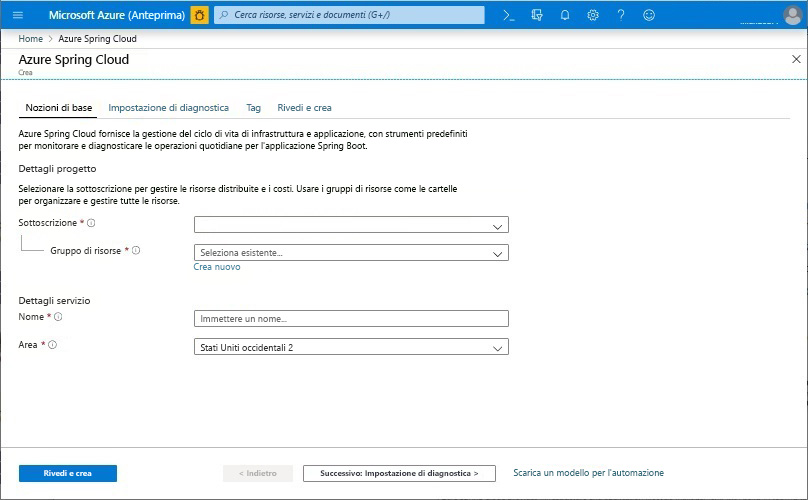
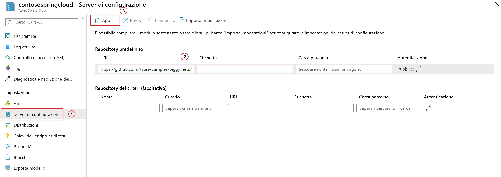

# <a name="quickstart-launch-an-azure-spring-cloud-app-using-the-maven-plug-in"></a>Guida introduttiva: Avviare un'app Azure Spring Cloud tramite il plug-in Maven

Con il plug-in Maven di Azure Spring Cloud è possibile creare e aggiornare facilmente le applicazioni di Azure Spring Cloud. Con una configurazione predefinita, è possibile distribuire applicazioni nel servizio Azure Spring Cloud esistente. In questo articolo viene usata un'applicazione di esempio denominata PiggyMetrics per dimostrare questa funzionalità.

Seguendo questo argomento di avvio rapido, si apprenderà come:

> [!div class="checklist"]
> * Effettuare il provisioning di un'istanza del servizio
> * Impostare un server di configurazione per un'istanza
> * Clonare e compilare un'applicazione di microservizi in locale
> * Distribuire ogni microservizio
> * Assegnare un endpoint pubblico per l'applicazione

>[!Note]
> Azure Spring Cloud è attualmente disponibile come anteprima pubblica. Le offerte di anteprima pubblica consentono ai clienti di sperimentare le nuove funzionalità prima del rilascio della versione ufficiale.  I servizi e le funzionalità di anteprima pubblica non sono destinati all'uso in produzione.  Per altre informazioni sul supporto durante le anteprime, vedere le [domande frequenti](https://azure.microsoft.com/support/faq/) o inviare una [richiesta di supporto](https://docs.microsoft.com/azure/azure-supportability/how-to-create-azure-support-request).


>[!TIP]
> Azure Cloud Shell è una shell interattiva gratuita che può essere usata per eseguire i comandi riportati in questo articolo. Include i comuni strumenti di Azure preinstallati, tra cui le ultime versioni di Git, Java Development Kit (JDK), Maven e dell'interfaccia della riga di comando di Azure. Se è stato effettuato l'accesso alla propria sottoscrizione di Azure, avviare [Azure Cloud Shell](https://shell.azure.com). Per altre informazioni, vedere [Panoramica di Azure Cloud Shell](../cloud-shell/overview.md).

Per completare questa guida introduttiva:

1. [Installare Git](https://git-scm.com/).
2. [Installare JDK 8](https://docs.microsoft.com/java/azure/jdk/?view=azure-java-stable).
3. [Installare Maven 3.0 o versione successiva](https://maven.apache.org/download.cgi).
4. [Iscriversi per ottenere una sottoscrizione gratuita di Azure](https://azure.microsoft.com/free/).

## <a name="provision-a-service-instance-on-the-azure-portal"></a>Effettuare il provisioning di un'istanza del servizio nel portale di Azure

1. In un Web browser aprire [questo collegamento ad Azure Spring Cloud nel portale di Azure](https://ms.portal.azure.com/#create/Microsoft.AppPlatform) e accedere al proprio account.

1. Nella sezione **Dettagli del progetto** inserire i dati per l'applicazione di esempio come indicato di seguito:

    1. Nel campo **Sottoscrizione** selezionare la sottoscrizione a cui verrà associata l'applicazione.
    1. Selezionare o creare un gruppo di risorse per l'applicazione. Si consiglia di creare un nuovo gruppo di risorse.  L'esempio seguente mostra un nuovo gruppo di risorse denominato `myspringservice`.
    1. Specificare un nome per il nuovo servizio Azure Spring Cloud.  Il nome deve essere composto da 4-32 caratteri e può contenere solo lettere in minuscolo, numeri e trattini. Il primo carattere del nome del servizio deve essere una lettera e l'ultimo deve essere una lettera o un numero.  Nell'esempio indicato di seguito il servizio è denominato `contosospringcloud`.
    1. Selezionare un percorso per l'applicazione in base alle opzioni disponibili.  In questo esempio si seleziona `East US`.
    1. Selezionare **Rivedi e crea** per rivedere un riepilogo del nuovo servizio.  Se tutte le impostazioni sono corrette, selezionare **Crea**.

    > [!div class="mx-imgBorder"]
    > Selezionare .

Per distribuire il servizio sono necessari circa 5 minuti. Dopo la distribuzione del servizio, selezionare **Vai alla risorsa**. Viene visualizzata la pagina **Panoramica** per l'istanza del servizio.

## <a name="set-up-your-configuration-server"></a>Configurare il server di configurazione

1. Nella pagina **Panoramica** selezionare **Config Server** (Server di configurazione).
1. Nella sezione **Repository predefinito** impostare **URI** su **https://github.com/Azure-Samples/piggymetrics** , **Etichetta** su **config** e quindi selezionare **Applica** per salvare le modifiche.

    > [!div class="mx-imgBorder"]
    > 

## <a name="clone-and-build-the-sample-application-repository"></a>Clonare e creare il repository dell'applicazione di esempio

1. Avviare il [Azure Cloud Shell](https://shell.azure.com).

1. Clonare il repository Git eseguendo il comando seguente:

    ```azurecli
    git clone https://github.com/Azure-Samples/PiggyMetrics
    ```
  
1. Cambiare directory e compilare il progetto eseguendo il comando seguente:

    ```azurecli
    cd piggymetrics
    mvn clean package -DskipTests
    ```

## <a name="generate-configurations-and-deploy-to-the-azure-spring-cloud"></a>Generare configurazioni ed eseguire la distribuzione in Azure Spring Cloud

1. Per generare le configurazioni, eseguire questo comando nella cartella radice di PiggyMetrics contenente il file POM padre:

    ```azurecli
    mvn com.microsoft.azure:azure-spring-cloud-maven-plugin:1.0.0:config
    ```

    a. Selezionare i moduli `gateway`, `auth-service` e `account-service`.

    b. Selezionare la sottoscrizione e il cluster del servizio Azure Spring Cloud.

    c. Nell'elenco dei progetti disponibili immettere il numero che corrisponde a `gateway` per assegnargli l'accesso pubblico.
    
    d. Verificare la configurazione.

1. Il file POM contiene ora le dipendenze e le configurazioni del plug-in. Distribuire le app usando il comando seguente:

   ```azurecli
   mvn azure-spring-cloud:deploy
   ```

1. Al termine della distribuzione, è possibile accedere a PiggyMetrics tramite l'URL fornito nell'output del comando precedente.

## <a name="next-steps"></a>Passaggi successivi

In questo argomento di avvio rapido è stata distribuita un'applicazione Spring Cloud da un repository Maven. Per altre informazioni su Azure Spring Cloud, procedere con l'esercitazione sulla preparazione dell'app per la distribuzione.

> [!div class="nextstepaction"]
> [Preparare l'applicazione Azure Spring Cloud per la distribuzione](spring-cloud-tutorial-prepare-app-deployment.md)
> [Altre informazioni sui plug-in Maven per Azure](https://github.com/microsoft/azure-maven-plugin)
