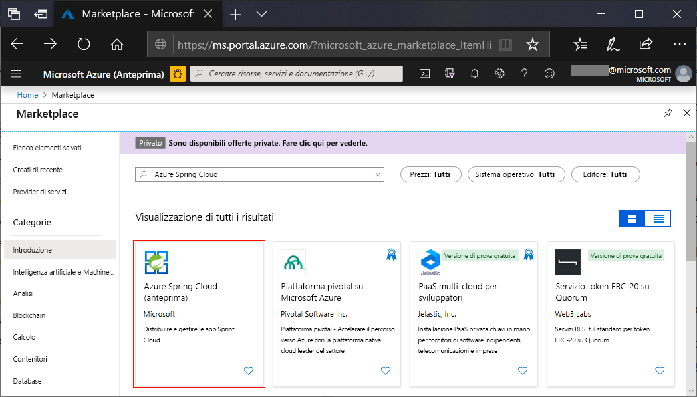

# <a name="quickstart-launch-an-azure-spring-cloud-application-using-the-azure-portal"></a>Guida introduttiva: Avviare un'applicazione Azure Spring Cloud con il portale di Azure

Azure Spring Cloud consente di eseguire facilmente applicazioni di microservizi basate su Spring Cloud in Azure.

Questo argomento di avvio rapido illustra come distribuire un'applicazione Spring Cloud esistente in Azure. [Ecco il collegamento](https://github.com/Azure-Samples/PiggyMetrics) al codice dell'applicazione di esempio usata in questa esercitazione. Al termine, l'applicazione di esempio sarà accessibile online e pronta per essere gestita tramite il portale di Azure.

Seguendo questo argomento di avvio rapido, si apprenderà come:

> [!div class="checklist"]
> * Effettuare il provisioning di un'istanza del servizio
> * Impostare un server di configurazione per un'istanza
> * Creare un'applicazione di microservizi in locale
> * Distribuire ogni microservizio
> * Assegnare un endpoint pubblico per l'applicazione

## <a name="prerequisites"></a>Prerequisiti

>[!Note]
> Prima di iniziare l'argomento di avvio rapido, assicurarsi che la propria sottoscrizione di Azure abbia accesso ad Azure Spring Cloud.  Essendo un servizio in anteprima, chiediamo ai clienti di contattarci in modo che possiamo aggiungere la loro sottoscrizione al nostro elenco di utenti autorizzati.  Se si vogliono esplorare le funzionalità di Azure Spring Cloud, contattarci tramite posta elettronica: azure-spring-cloud@service.microsoft.com.

>[!TIP]
> Azure Cloud Shell è una shell interattiva gratuita che può essere usata per eseguire la procedura di questo articolo.  Include i comuni strumenti di Azure preinstallati, tra cui le ultime versioni di Git, JDK, Maven e dell'interfaccia della riga di comando di Azure. Se è stato eseguito l'accesso alla sottoscrizione di Azure, avviare [Azure Cloud Shell](https://shell.azure.com) da shell.azure.com.  Per altre informazioni su Azure Cloud Shell, [leggere la documentazione](../cloud-shell/overview.md)

Per completare questa guida introduttiva:

1. [Installare Git](https://git-scm.com/)
2. [Installare JDK 8](https://docs.microsoft.com/java/azure/jdk/?view=azure-java-stable)
3. [Installare Maven 3.0 o versione successiva](https://maven.apache.org/download.cgi)
4. [Installare l'interfaccia della riga di comando di Azure](https://docs.microsoft.com/cli/azure/install-azure-cli?view=azure-cli-latest)
5. [Iscriversi per ottenere una sottoscrizione di Azure](https://azure.microsoft.com/free/)

## <a name="install-the-azure-cli-extension"></a>Installare l'estensione dell'interfaccia della riga di comando di Azure

Installare l'estensione Azure Spring Cloud per l'interfaccia della riga di comando di Azure usando il comando seguente

```Azure CLI
az extension add -y --source https://azureclitemp.blob.core.windows.net/spring-cloud/spring_cloud-0.1.0-py2.py3-none-any.whl
```

## <a name="provision-a-service-instance-on-the-azure-portal"></a>Effettuare il provisioning di un'istanza del servizio nel portale di Azure

1. In un Web browser aprire il [questo collegamento ad Azure Spring Cloud nel portale di Azure](https://ms.portal.azure.com/?microsoft_azure_marketplace_ItemHideKey=AppPlatformExtension#blade/Microsoft_Azure_Marketplace/MarketplaceOffersBlade/selectedMenuItemId/home/searchQuery/Azure%20Spring%20Cloud).

    

1. Selezionare **Azure Spring Cloud** per passare alla pagina di panoramica. Quindi, selezionare il pulsante **Crea** per iniziare.

1. Compilare il modulo, considerando le indicazioni seguenti:
    - Nome servizio: specificare il nome dell'istanza del servizio.  Il nome deve essere composto da 4-32 caratteri e può contenere solo lettere in minuscolo, numeri e trattini.  Il primo carattere del nome del servizio deve essere una lettera e l'ultimo deve essere una lettera o un numero.
    - Sottoscrizione: selezionare la sottoscrizione da fatturare per questa risorsa.  Assicurarsi che la sottoscrizione sia stata aggiunta al nostro elenco di utenti autorizzati per Azure Spring Cloud.
    - Gruppo di risorse: è consigliabile creare un nuovo gruppo di risorse per le nuove risorse.
    - Percorso: selezionare la località per l'istanza del servizio. Le località attualmente supportate sono Stati Uniti orientali, Stati Uniti occidentali 2, Europa occidentale e Asia sud-orientale.
    
Per distribuire il servizio sono necessari circa 5 minuti.  Una volta completata la distribuzione, verrà visualizzata la pagina **Panoramica** per l'istanza del servizio.

## <a name="set-up-your-configuration-server"></a>Configurare il server di configurazione

1. Passare alla pagina **Panoramica** e selezionare **Config Server**.

1. Nella sezione **Repository predefinito** impostare **URI** su "https://github.com/Azure-Samples/piggymetrics", **LABEL** su "config" e selezionare **Applica** per salvare le modifiche.

    

## <a name="build-and-deploy-microservice-applications"></a>Creare e distribuire applicazioni di microservizi

1. Aprire una finestra di comando ed eseguire il comando seguente per clonare il repository dell'app di esempio nel computer locale.

    ```cli
    git clone https://github.com/Azure-Samples/piggymetrics
    ```

1. Creare il progetto eseguendo questo comando.

    ```cli
    cd PiggyMetrics
    mvn clean package -DskipTests
    ```

1. Accedere all'interfaccia della riga di comando di Azure e impostare la sottoscrizione attiva.

    ```cli
    # Login to Azure CLI
    az login

    # List all subscriptions
    az account list -o table

    # Set active subscription
    az account set --subscription <target subscription ID>
    ```

1. Assegnare i nomi al gruppo di risorse e al servizio. Assicurarsi di sostituire i segnaposto con il nome del gruppo di risorse e il nome del servizio di cui è stato effettuato il provisioning in precedenza in questa esercitazione.

    ```azurecli
    az configure --defaults group=<resource group name>
    az configure --defaults spring-cloud=<service instance name>
    ```

1. Creare l'applicazione `gateway` e distribuire il file JAR.

    ```azurecli
    az spring-cloud app create -n gateway
    az spring-cloud app deploy -n gateway --jar-path ./gateway/target/gateway.jar
    ```

1. Seguendo lo stesso modello, creare le applicazioni `account-service` e `auth-service` e distribuire i rispettivi file JAR.

    ```cli
    az spring-cloud app create -n account-service
    az spring-cloud app deploy -n account-service --jar-path ./account-service/target/account-service.jar
    az spring-cloud app create -n auth-service
    az spring-cloud app deploy -n auth-service --jar-path ./auth-service/target/auth-service.jar
    ```

1. Per completare la distribuzione delle applicazioni, sono necessari alcuni minuti. Per verificare se sono state distribuite, passare al pannello **App** nel portale di Azure. Dovrebbe essere visualizzata una riga per ognuna delle tre applicazioni.

## <a name="assign-a-public-endpoint-to-gateway"></a>Assegnare un endpoint pubblico al gateway

1. Nel menu a sinistra aprire la scheda **App**.
2. Selezionare l'applicazione `gateway` per visualizzare la pagina **Panoramica**.
3. Selezionare **Assign Domain** (Assegna dominio) per assegnare un endpoint pubblico al gateway. Questa operazione può richiedere alcuni minuti.

    

1. Immettere l'IP pubblico assegnato (etichettato come **URL**) nel browser per visualizzare l'applicazione in esecuzione.

    


## <a name="next-steps"></a>Passaggi successivi

In questa guida introduttiva si è appreso come:

> [!div class="checklist"]
> * Effettuare il provisioning di un'istanza del servizio
> * Impostare un server di configurazione per un'istanza
> * Creare un'applicazione di microservizi in locale
> * Distribuire ogni microservizio
> * Assegnare un endpoint pubblico per il gateway applicazione

> [!div class="nextstepaction"]
> [Preparare l'applicazione Azure Spring Cloud per la distribuzione](spring-cloud-tutorial-prepare-app-deployment.md)
