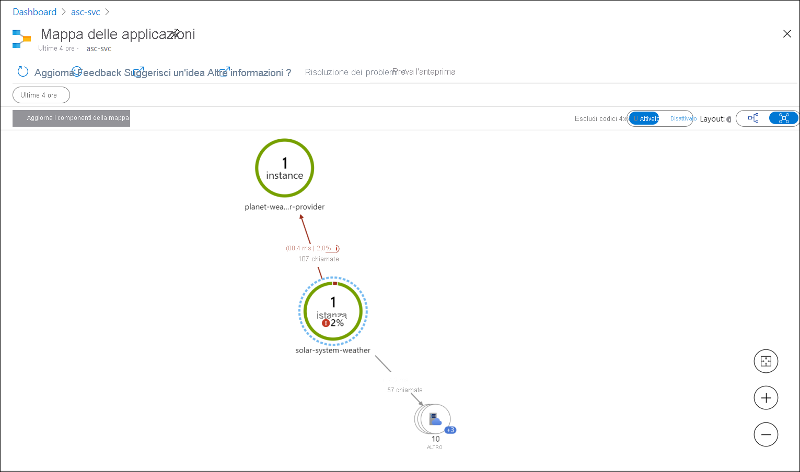

# <a name="quickstart-monitoring-azure-spring-cloud-apps-with-logs-metrics-and-tracing"></a>Avvio rapido: Monitoraggio di app Azure Spring Cloud con log, metriche e traccia

::: zone pivot="programming-language-csharp"
Le funzionalità di monitoraggio integrate in Azure Spring Cloud consentono di eseguire il debug e il monitoraggio di problemi complessi. Azure Spring Cloud integra la [traccia distribuita](https://steeltoe.io/docs/3/tracing/distributed-tracing) di Steeltoe con [Application Insights](https://docs.microsoft.com/azure/azure-monitor/app/app-insights-overview) di Azure. Questa integrazione fornisce log, metriche e funzionalità di traccia distribuita avanzate dal portale di Azure.

Le procedure seguenti illustrano come usare lo streaming di log, l'analisi dei log, le metriche e la traccia distribuita con l'app di esempio distribuita negli argomenti di avvio rapido precedenti.

## <a name="prerequisites"></a>Prerequisiti

* Completare gli argomenti di avvio rapido precedenti di questa serie:

  * [Effettuare il provisioning del servizio Azure Spring Cloud](spring-cloud-quickstart-provision-service-instance.md).
  * [Configurare il server di configurazione di Azure Spring Cloud](spring-cloud-quickstart-setup-config-server.md).
  * [Compilare e distribuire le app](spring-cloud-quickstart-deploy-apps.md)

## <a name="logs"></a>Log

È possibile visualizzare i log in Azure Spring Cloud in due modi: con lo **streaming di log** per i log in tempo reale per istanza di app o con l'**analisi dei log** per i log aggregati con funzionalità di query avanzate.

### <a name="log-streaming"></a>Streaming dei log

È possibile usare lo streaming di log nell'interfaccia della riga di comando di Azure con il comando seguente.

```azurecli
az spring-cloud app logs -n solar-system-weather -f
```

L'output sarà simile all'esempio seguente:

```output
=> ConnectionId:0HM2HOMHT82UK => RequestPath:/weatherforecast RequestId:0HM2HOMHT82UK:00000003, SpanId:|e8c1682e-46518cc0202c5fd9., TraceId:e8c1682e-46518cc0202c5fd9, ParentId: => Microsoft.Azure.SpringCloud.Sample.SolarSystemWeather.Controllers.WeatherForecastController.Get (Microsoft.Azure.SpringCloud.Sample.SolarSystemWeather)
Executing action method Microsoft.Azure.SpringCloud.Sample.SolarSystemWeather.Controllers.WeatherForecastController.Get (Microsoft.Azure.SpringCloud.Sample.SolarSystemWeather) - Validation state: Valid
←[40m←[32minfo←[39m←[22m←[49m: Microsoft.Azure.SpringCloud.Sample.SolarSystemWeather.Controllers.WeatherForecastController[0]

=> ConnectionId:0HM2HOMHT82UK => RequestPath:/weatherforecast RequestId:0HM2HOMHT82UK:00000003, SpanId:|e8c1682e-46518cc0202c5fd9., TraceId:e8c1682e-46518cc0202c5fd9, ParentId: => Microsoft.Azure.SpringCloud.Sample.SolarSystemWeather.Controllers.WeatherForecastController.Get (Microsoft.Azure.SpringCloud.Sample.SolarSystemWeather)
Retrieved weather data from 4 planets
←[40m←[32minfo←[39m←[22m←[49m: Microsoft.AspNetCore.Mvc.Infrastructure.ControllerActionInvoker[2]

=> ConnectionId:0HM2HOMHT82UK => RequestPath:/weatherforecast RequestId:0HM2HOMHT82UK:00000003, SpanId:|e8c1682e-46518cc0202c5fd9., TraceId:e8c1682e-46518cc0202c5fd9, ParentId: => Microsoft.Azure.SpringCloud.Sample.SolarSystemWeather.Controllers.WeatherForecastController.Get (Microsoft.Azure.SpringCloud.Sample.SolarSystemWeather)
Executing ObjectResult, writing value of type 'System.Collections.Generic.KeyValuePair`2[[System.String, System.Private.CoreLib, Version=4.0.0.0, Culture=neutral, PublicKeyToken=7cec85d7bea7798e],[System.String, System.Private.CoreLib, Version=4.0.0.0, Culture=neutral, PublicKeyToken=7cec85d7bea7798e]][]'.
←[40m←[32minfo←[39m←[22m←[49m: Microsoft.AspNetCore.Mvc.Infrastructure.ControllerActionInvoker[2]
```

> [!TIP]
> Usare `az spring-cloud app logs -h` per esplorare altri parametri e funzionalità di streaming dei log.

### <a name="log-analytics"></a>Log Analytics

1. Passare alla pagina **service | Overview** (servizio | Panoramica) e selezionare **Logs** (Log) nella sezione **Monitoring** (Monitoraggio). Selezionare **Run** (Esegui) in una delle query di esempio per Azure Spring Cloud.

   [  ](media/spring-cloud-quickstart-logs-metrics-tracing/logs-entry.png#lightbox)
    
1. Modificare la query per rimuovere le clausole Where che limitano la visualizzazione ai log degli errori e degli avvisi.

1. Selezionare quindi `Run` per visualizzare i log. Per altre informazioni sulla scrittura di query, vedere la [ documentazione di Azure Log Analytics](https://docs.microsoft.com/azure/azure-monitor/log-query/get-started-queries).

   [  ](media/spring-cloud-quickstart-logs-metrics-tracing/logs-query-steeltoe.png#lightbox)

## <a name="metrics"></a>Metriche

1. Nel portale di Azure passare alla pagina **servizio | Panoramica** e selezionare **Metriche** nella sezione **Monitoraggio**. Aggiungere la prima metrica selezionando `system.cpu.usage` per **Metric** (Metrica) e `Avg` per **Aggregation** (Aggregazione) per visualizzare la sequenza temporale per l'utilizzo complessivo della CPU.

   [  ](media/spring-cloud-quickstart-logs-metrics-tracing/metrics-basic-cpu-steeltoe.png#lightbox)
    
1. Fare clic su **Aggiungi filtro** nella barra degli strumenti e selezionare `App=solar-system-weather` per visualizzare l'utilizzo della CPU solo per l'app **solar-system-weather**.

   [  ](media/spring-cloud-quickstart-logs-metrics-tracing/metrics-filter-steeltoe.png#lightbox)

1. Rimuovere il filtro creato nel passaggio precedente, selezionare **Applicare separazione** e selezionare `App` per **Valori** per visualizzare l'utilizzo della CPU da parte di diverse app.

   [  ](media/spring-cloud-quickstart-logs-metrics-tracing/metrics-split-steeltoe.png#lightbox)

## <a name="distributed-tracing"></a>Analisi distribuita

1. Nel portale di Azure passare alla pagina **servizio | Panoramica** e selezionare **Distributed tracing** (Traccia distribuita) nella sezione **Monitoraggio**. Selezionare quindi la scheda **Visualizza mappa delle applicazioni** a destra.

   [  ](media/spring-cloud-quickstart-logs-metrics-tracing/tracing-entry.png#lightbox)

1. A questo punto è possibile visualizzare lo stato delle chiamate tra le app. 

   [  ](media/spring-cloud-quickstart-logs-metrics-tracing/tracing-overview-steeltoe.png#lightbox)
    
1. Selezionare il collegamento tra **solar-system-weather** e **planet-weather-provider** per visualizzare altri dettagli, ad esempio le chiamate più lente in base ai metodi HTTP.

   [  ](media/spring-cloud-quickstart-logs-metrics-tracing/tracing-call-steeltoe.png#lightbox)
    
1. Selezionare infine **Esamina prestazioni** per accedere a un'analisi delle prestazioni integrata più avanzata.

   [  ](media/spring-cloud-quickstart-logs-metrics-tracing/tracing-performance-steeltoe.png#lightbox)
::: zone-end

::: zone pivot="programming-language-java"
Le funzionalità di monitoraggio integrate in Azure Spring Cloud consentono di eseguire il debug e il monitoraggio di problemi complessi. Azure Spring Cloud integra [Spring Cloud Sleuth](https://spring.io/projects/spring-cloud-sleuth) con [Application Insights](https://docs.microsoft.com/azure/azure-monitor/app/app-insights-overview) di Azure. Questa integrazione fornisce log, metriche e funzionalità di traccia distribuita avanzate dal portale di Azure. Le procedure seguenti illustrano come usare lo streaming di log, l'analisi dei log, le metriche e la traccia distribuita con le app PiggyMetrics distribuite.

## <a name="prerequisites"></a>Prerequisiti

Completare i passaggi precedenti: 

* [Effettuare il provisioning di un'istanza di Azure Spring Cloud](spring-cloud-quickstart-provision-service-instance.md)
* [Configurare il server di configurazione](spring-cloud-quickstart-setup-config-server.md)
* [Compilare e distribuire le app](spring-cloud-quickstart-deploy-apps.md)

## <a name="logs"></a>Log

È possibile visualizzare i log in Azure Spring Cloud in due modi: con lo **streaming di log** per i log in tempo reale per istanza di app o con l'**analisi dei log** per i log aggregati con funzionalità di query avanzate.

### <a name="log-streaming"></a>Streaming dei log

#### <a name="cli"></a>[CLI](#tab/Azure-CLI)

È possibile usare lo streaming di log nell'interfaccia della riga di comando di Azure con il comando seguente.

```azurecli
az spring-cloud app logs -s <service instance name> -g <resource group name> -n gateway -f
```

I log hanno un aspetto simile al seguente:

[  ](media/spring-cloud-quickstart-logs-metrics-tracing/logs-streaming-cli.png#lightbox)

> [!TIP]
> Usare `az spring-cloud app logs -h` per esplorare altri parametri e funzionalità di streaming dei log.

#### <a name="intellij"></a>[IntelliJ](#tab/IntelliJ)

Per ottenere i log tramite Azure Toolkit for IntelliJ:

1. Selezionare **Azure Explorer**, quindi **Spring Cloud**.

1. Fare clic con il pulsante destro del mouse sull'app in esecuzione.

1. Selezionare **Streaming Logs** (Log in streaming) dall'elenco a discesa.

   
    
1. Selezionare **Instance** (Istanza).

   
    
1. Il log in streaming sarà visibile nella finestra output.

   

---
### <a name="log-analytics"></a>Log Analytics

1. Passare alla pagina **service | Overview** (servizio | Panoramica) e selezionare **Logs** (Log) nella sezione **Monitoring** (Monitoraggio). Fare clic su **Run** (Esegui) in una delle query di esempio per Azure Spring Cloud. 

   [  ](media/spring-cloud-quickstart-logs-metrics-tracing/logs-entry.png#lightbox)
    
1. Vengono visualizzati i log filtrati. Per altre informazioni sulla scrittura di query, vedere la [ documentazione di Azure Log Analytics](https://docs.microsoft.com/azure/azure-monitor/log-query/get-started-queries).

   [  ](media/spring-cloud-quickstart-logs-metrics-tracing/logs-query.png#lightbox)

## <a name="metrics"></a>Metriche

1. Passare alla pagina **service | Overview** (servizio | Panoramica) e selezionare **Metrics** (Metriche) nella sezione **Monitoring** (Monitoraggio). Aggiungere la prima metrica selezionando `system.cpu.usage` per **Metric** (Metrica) e `Avg` per **Aggregation** (Aggregazione) per visualizzare la sequenza temporale per l'utilizzo complessivo della CPU.

   [  ](media/spring-cloud-quickstart-logs-metrics-tracing/metrics-basic-cpu.png#lightbox)
    
1. Fare clic su **Add filter** (Aggiungi filtro) sulla barra degli strumenti e selezionare `App=Gateway` per visualizzare l'utilizzo della CPU solo per l'app **gateway**.

   [  ](media/spring-cloud-quickstart-logs-metrics-tracing/metrics-filter.png#lightbox)

1. Rimuovere il filtro creato in precedenza, fare clic su **Apply Splitting** (Applica separazione) e selezionare `App` per **Values** (Valori) per visualizzare l'utilizzo della CPU da parte di diverse app.

   [  ](media/spring-cloud-quickstart-logs-metrics-tracing/metrics-split.png#lightbox)

## <a name="distributed-tracing"></a>Analisi distribuita

1. Passare alla pagina **service | Overview** (servizio | Panoramica) e selezionare **Distributed tracing** (Traccia distribuita) nella sezione **Monitoring** (Monitoraggio). Quindi fare clic sulla scheda **View application map** (Visualizza mappa delle applicazioni) a destra.

   [  ](media/spring-cloud-quickstart-logs-metrics-tracing/tracing-entry.png#lightbox)

1. A questo punto è possibile visualizzare lo stato delle chiamate tra le app Piggymetrics. 

   [  ](media/spring-cloud-quickstart-logs-metrics-tracing/tracing-overview.png#lightbox)
    
1. Fare clic sul collegamento tra **gateway** e **account-service** per visualizzare altri dettagli, ad esempio le chiamate più lente da parte di metodi HTTP.

   [  ](media/spring-cloud-quickstart-logs-metrics-tracing/tracing-call.png#lightbox)
    
1. Infine, fare clic su **Investigate Performance** (Esamina prestazioni) per accedere a un'analisi delle prestazioni integrata più avanzata.

   [  ](media/spring-cloud-quickstart-logs-metrics-tracing/tracing-performance.png#lightbox)

::: zone-end

## <a name="clean-up-resources"></a>Pulire le risorse

In questi argomenti di avvio rapido sono state create risorse di Azure per cui continueranno a essere addebitati i costi se rimangono nella sottoscrizione. Se si ritiene che queste risorse non saranno necessarie in futuro, eliminare il gruppo di risorse usando il portale o eseguendo questo comando in Cloud Shell:

```azurecli
az group delete --name <your resource group name; for example: helloworld-1558400876966-rg> --yes
```

In un argomento di avvio rapido precedente è stato anche impostato il nome del gruppo di risorse predefinito. Se non si prevede di continuare con l'argomento di avvio rapido successivo, cancellare tale impostazione predefinita eseguendo il comando dell'interfaccia della riga di comando seguente:

```azurecli
az configure --defaults group=
```

## <a name="next-steps"></a>Passaggi successivi

Per esplorare altre funzionalità di monitoraggio di Azure Spring Cloud, vedere:

> [!div class="nextstepaction"]
> [Servizi diagnostici](diagnostic-services.md)
>
> [Analisi distribuita](spring-cloud-tutorial-distributed-tracing.md)
>
> [Eseguire lo streaming dei log in tempo reale](spring-cloud-howto-log-streaming.md)
