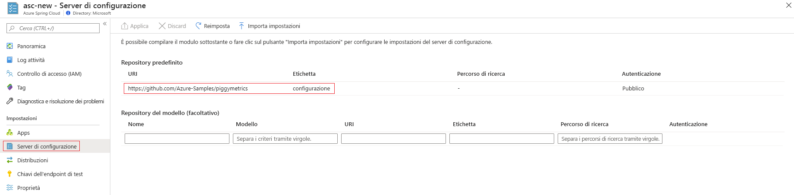

# <a name="tutorial-set-up-a-spring-cloud-config-server-instance-for-your-service"></a>Esercitazione: Configurare un'istanza del server di configurazione Spring Cloud per il servizio

Questa articolo descrive come connettere un'istanza del server di configurazione Spring Cloud al servizio Azure Spring Cloud.

Spring Cloud Config fornisce il supporto lato client e lato server per una configurazione esternalizzata in un sistema distribuito. Con l'istanza del server di configurazione è possibile gestire in modo centralizzato le proprietà esterne per le applicazioni in tutti gli ambienti. Per altre informazioni, vedere le [informazioni di riferimento sul server di configurazione Spring Cloud](https://spring.io/projects/spring-cloud-config).

## <a name="prerequisites"></a>Prerequisiti
* Una sottoscrizione di Azure. Se non si ha una sottoscrizione di Azure, creare un [account gratuito](https://azure.microsoft.com/free/?WT.mc_id=A261C142F) prima di iniziare. 
* Un servizio Azure Spring Cloud in esecuzione di cui è già stato effettuato il provisioning. Per configurare e avviare un servizio Azure Spring Cloud, vedere [Avvio rapido: Avviare un'applicazione Java Spring tramite l'interfaccia della riga di comando di Azure](spring-cloud-quickstart-launch-app-cli.md).

## <a name="restriction"></a>Restrizione

Quando si usa il server di configurazione con un back-end git, sono previste alcune restrizioni. Alcune proprietà vengono inserite automaticamente nell'ambiente dell'applicazione per accedere al server di configurazione e all'individuazione dei servizi. Se si configurano anche tali proprietà dai file del server di configurazione, è possibile che si verifichino conflitti e comportamenti imprevisti. Le proprietà includono: 

```yaml
eureka.client.service-url.defaultZone
eureka.client.tls.keystore
server.port
spring.cloud.config.tls.keystore
spring.application.name
```

> [!CAUTION]
> È consigliabile _non_ includere le proprietà sopra indicate nei file dell'applicazione del server di configurazione.

## <a name="create-your-config-server-files"></a>Creare i file del server di configurazione

Azure Spring cloud supporta Azure DevOps, GitHub, GitLab e Bitbucket per archiviare i file del server di configurazione. Quando il repository è pronto, creare i file di configurazione seguendo le istruzioni riportate di seguito e archiviarli in tale posizione.

Alcune proprietà configurabili sono inoltre disponibili solo per determinati tipi. Le sottosezioni seguenti elencano le proprietà per ogni tipo di repository.

### <a name="public-repository"></a>Repository pubblico

Quando si usa un repository pubblico, le proprietà configurabili saranno più limitate.

Tutte le proprietà configurabili usate per configurare il repository Git pubblico sono elencate nella tabella seguente:

> [!NOTE]
> L'uso di un trattino (-) per separare le parole è l'unica convenzione di denominazione attualmente supportata. Ad esempio, è possibile usare *default-label*, ma non *defaultLabel*.

| Proprietà        | Obbligatoria | Funzionalità                                                      |
| :-------------- | -------- | ------------------------------------------------------------ |
| `uri`           | Sì    | L'URI del repository Git usato come back-end del server di configurazione inizia con *http://* , *https://* , *git@* o *ssh://* . |
| `default-label` | No     | L'etichetta predefinita del repository Git deve corrispondere a *nome ramo*, *nome tag* o *commit-id* del repository. |
| `search-paths`  | No     | Matrice di stringhe usate per la ricerca nelle sottodirectory del repository Git. |

------

### <a name="private-repository-with-ssh-authentication"></a>Repository privato con autenticazione SSH

Tutte le proprietà configurabili usate per configurare il repository Git privato con autenticazione SSH sono elencate nella tabella seguente:

> [!NOTE]
> L'uso di un trattino (-) per separare le parole è l'unica convenzione di denominazione attualmente supportata. Ad esempio, è possibile usare *default-label*, ma non *defaultLabel*.

| Proprietà                   | Obbligatoria | Funzionalità                                                      |
| :------------------------- | -------- | ------------------------------------------------------------ |
| `uri`                      | Sì    | L'URI del repository Git usato come back-end del server di configurazione deve essere iniziare con *http://* , *https://* , *git@* o *ssh://* . |
| `default-label`            | No     | L'etichetta predefinita del repository Git deve corrispondere a *nome ramo*, *nome tag* o *commit-id* del repository. |
| `search-paths`             | No     | Matrice di stringhe usate per la ricerca nelle sottodirectory del repository Git. |
| `private-key`              | No     | La chiave privata SSH per accedere al repository git, _obbligatoria_ quando l'URI inizia con *git@* o *ssh://* . |
| `host-key`                 | No     | Chiave host del server del repository Git. Non deve includere il prefisso dell'algoritmo perché incluso in `host-key-algorithm`. |
| `host-key-algorithm`       | No     | L'algoritmo di chiave host deve essere *ssh-dss*, *ssh-rsa*, *ecdsa-sha2-nistp256*, *ecdsa-sha2-nistp384* o *ecdsa-sha2-nistp521*. *Obbligatorio* solo se esiste `host-key`. |
| `strict-host-key-checking` | No     | Indica se l'avvio dell'istanza del server di configurazione non riuscirà quando si utilizza la proprietà `host-key` privata. Deve essere *true* (valore predefinito) o *false*. |

-----

### <a name="private-repository-with-basic-authentication"></a>Repository privato con autenticazione di base

Di seguito sono elencate tutte le proprietà configurabili usate per configurare il repository Git privato con autenticazione di base.

> [!NOTE]
> L'uso di un trattino (-) per separare le parole è l'unica convenzione di denominazione attualmente supportata. Ad esempio, usare *default-label* e non *defaultLabel*.

| Proprietà        | Obbligatoria | Funzionalità                                                      |
| :-------------- | -------- | ------------------------------------------------------------ |
| `uri`           | Sì    | L'URI del repository Git usato come back-end del server di configurazione deve essere iniziare con *http://* , *https://* , *git@* o *ssh://* . |
| `default-label` | No     | L'etichetta predefinita del repository Git deve corrispondere a *nome ramo*, *nome tag* o *commit-id* del repository. |
| `search-paths`  | No     | Matrice di stringhe usate per la ricerca nelle sottodirectory del repository Git. |
| `username`      | No     | Nome utente usato per accedere al server del repository Git, _obbligatorio_ quando il server del repository Git supporta `Http Basic Authentication`. |
| `password`      | No     | Password usata per accedere al server del repository Git, _obbligatoria_ quando il server del repository Git supporta `Http Basic Authentication`. |

> [!NOTE]
> Molti server del repository `Git` supportano l'uso di token invece delle password per l'autenticazione HTTP di base. Alcuni repository, ad esempio GitHub, consentono la persistenza illimitata dei token. Tuttavia, alcuni server del repository Git, tra cui Azure DevOps, forzano la scadenza dei token dopo qualche ora. I repository che provocano la scadenza dei token non dovrebbero usare l'autenticazione basata su token con Azure Spring Cloud.

### <a name="git-repositories-with-pattern"></a>Repository git con criteri

Di seguito sono elencate tutte le proprietà configurabili usate per configurare i repository Git con criteri.

> [!NOTE]
> L'uso di un trattino (-) per separare le parole è l'unica convenzione di denominazione attualmente supportata. Ad esempio, usare *default-label* e non *defaultLabel*.

| Proprietà                           | Obbligatoria         | Funzionalità                                                      |
| :--------------------------------- | ---------------- | ------------------------------------------------------------ |
| `repos`                            | No             | Mappa costituita dalle impostazioni per un repository Git con un nome specificato. |
| `repos."uri"`                      | Sì in `repos` | L'URI del repository Git usato come back-end del server di configurazione deve essere iniziare con *http://* , *https://* , *git@* o *ssh://* . |
| `repos."name"`                     | Sì in `repos` | Nome per l'identificazione nel repository Git, _obbligatorio_ solo se `repos` esiste. Ad esempio, *team-A*, *team-B*. |
| `repos."pattern"`                  | No             | Matrice di stringhe utilizzata per trovare la corrispondenza con il nome di un'applicazione. Per ogni modello, usare il formato `{application}/{profile}` con caratteri jolly. |
| `repos."default-label"`            | No             | L'etichetta predefinita del repository Git deve corrispondere a *nome ramo*, *nome tag* o *commit-id* del repository. |
| `repos."search-paths`"             | No             | Matrice di stringhe usate per la ricerca nelle sottodirectory del repository Git. |
| `repos."username"`                 | No             | Nome utente usato per accedere al server del repository Git, _obbligatorio_ quando il server del repository Git supporta `Http Basic Authentication`. |
| `repos."password"`                 | No             | Password usata per accedere al server del repository Git, _obbligatoria_ quando il server del repository Git supporta `Http Basic Authentication`. |
| `repos."private-key"`              | No             | La chiave privata SSH per accedere al repository Git, _obbligatoria_ quando l'URI inizia con *git@* o *ssh://* . |
| `repos."host-key"`                 | No             | Chiave host del server del repository Git. Non deve includere il prefisso dell'algoritmo perché incluso in `host-key-algorithm`. |
| `repos."host-key-algorithm"`       | No             | L'algoritmo di chiave host deve essere *ssh-dss*, *ssh-rsa*, *ecdsa-sha2-nistp256*, *ecdsa-sha2-nistp384* o *ecdsa-sha2-nistp521*. *Obbligatorio* solo se esiste `host-key`. |
| `repos."strict-host-key-checking"` | No             | Indica se l'avvio dell'istanza del server di configurazione non riuscirà quando si utilizza la proprietà `host-key` privata. Deve essere *true* (valore predefinito) o *false*. |

## <a name="attach-your-config-server-repository-to-azure-spring-cloud"></a>Collegare il repository del server di configurazione ad Azure Spring Cloud

Ora che i file di configurazione sono stati salvati in un repository, è necessario connettere Azure Spring Cloud al repository.

1. Accedere al [portale di Azure](https://portal.azure.com).

1. Passare alla pagina **Panoramica** di Azure Spring Cloud.

1. Selezionare il servizio da configurare.

1. Nel riquadro sinistro della pagina del servizio selezionare la scheda **Server di configurazione** in **Impostazioni**.



### <a name="enter-repository-information-directly-to-the-azure-portal"></a>Immettere le informazioni sul repository direttamente nel portale di Azure

#### <a name="default-repository"></a>Repository predefinito

* **Repository pubblico**: Nella sezione **Repository predefinito** incollare l'URI del repository nella sezione **URI**.  Impostare **Etichetta** su **config**. Assicurarsi che l'impostazione di **Autenticazione** sia **Pubblica**, quindi selezionare **Applica** per terminare. 

* **Repository privato**: Azure Spring Cloud supporta l'autenticazione basata su password/token di base e SSH.

    * **Autenticazione di base**: Nella sezione **Repository predefinito** incollare l'URI del repository nella casella **URI** e quindi selezionare il pulsante **Autenticazione** (icona a forma di "matita"). Nel riquadro **Modifica autenticazione** selezionare **HTTP di base** nell'elenco a discesa **Tipo di autenticazione** e quindi immettere il nome utente e la password/token per concedere l'accesso ad Azure Spring Cloud. Fare clic su **OK** e su **Applica** per completare la configurazione dell'istanza del server di configurazione.

    
    
    > [!CAUTION]
    > Alcuni server di repository Git, ad esempio GitHub, usano un *token personale* o un *token di accesso*, ad esempio una password, per l'**Autenticazione di base**. È possibile usare questa tipologia di token come password in Azure Spring Cloud, perché non scadrà mai. Tuttavia, per altri server di repository Git, ad esempio BitBucket e Azure DevOps, il *token di accesso* scade entro una o due ore. Ciò significa che questa opzione non è praticabile quando si usano tali server di repository con Azure Spring Cloud.

    * **SSH**: Nella sezione **Repository predefinito** incollare l'URI del repository nella casella **URI** e quindi selezionare il pulsante **Autenticazione** (icona a forma di "matita"). Nel riquadro **Modifica autenticazione** selezionare **SSH** nell'elenco a discesa **Tipo di autenticazione** e quindi immettere la **chiave privata**. Facoltativamente, è possibile specificare la **Chiave host** e l'**Algoritmo di chiave host**. Assicurarsi di includere la chiave pubblica nel repository del server di configurazione. Fare clic su **OK** e su **Applica** per completare la configurazione dell'istanza del server di configurazione.

    

#### <a name="pattern-repository"></a>Repository di modelli

Per usare un **Repository di modelli** facoltativo per configurare il servizio, specificare l'**URI** e l'**Authentication** seguendo la stessa procedura del **Repository predefinito**. Assicurarsi di assegnare un **Nome** al modello e quindi fare clic su **Applica** per collegarlo all'istanza. 

### <a name="enter-repository-information-into-a-yaml-file"></a>Immettere le informazioni sul repository in un file YAML

Se è stato scritto un file YAML con le impostazioni del repository, è possibile importare il file direttamente dal computer locale in Azure Spring Cloud. Un semplice file YAML per un repository privato con autenticazione di base avrà un aspetto simile al seguente:

```yml
spring:
    cloud:
        config:
            server:
                git:
                    uri: https://github.com/azure-spring-cloud-samples/config-server-repository.git
                    username: <username>
                    password: <password/token>

```

Fare clic sul pulsante **Importa impostazioni**, quindi selezionare il file YAML nella directory del progetto. Selezionare **Importa**. Verrà quindi visualizzata un'operazione `async` nell'area **Notifiche**. Un messaggio di completamento dell'operazione verrà visualizzato entro 1 o 2 minuti.


Le informazioni del file YAML verranno visualizzate nel portale di Azure. Selezionare **Applica** per terminare. 


## <a name="delete-your-app-configuration"></a>Eliminare la configurazione dell'app

Dopo aver salvato un file di configurazione, nella scheda **Configurazione** verrà visualizzato il pulsante **Delete app configuration** (Elimina configurazione app). Se si seleziona questo pulsante le impostazioni esistenti verranno cancellate completamente. Selezionare il pulsante se si vuole connettere l'istanza del server di configurazione a un'altra origine, ad esempio per passare da GitHub ad Azure DevOps.


## <a name="next-steps"></a>Passaggi successivi

In questa esercitazione si è appreso come abilitare e configurare l'istanza del server di configurazione Spring Cloud. Per altre informazioni su come gestire l'applicazione, passare all'esercitazione sul ridimensionamento manuale dell'app.

> [!div class="nextstepaction"]
> [Esercitazione: Ridimensionare un'applicazione in Azure Spring Cloud](spring-cloud-tutorial-scale-manual.md)
