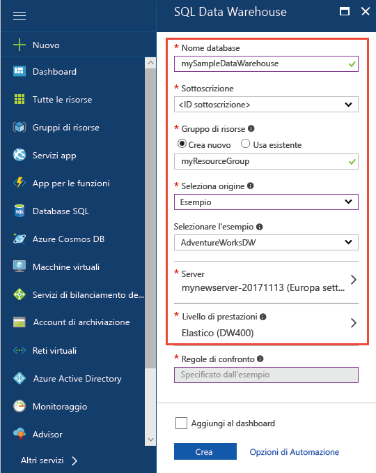
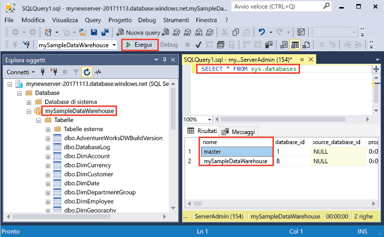
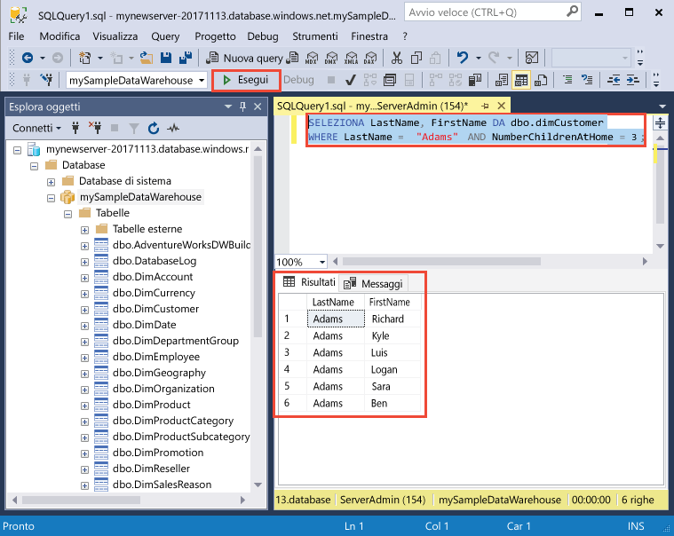

# <a name="quickstart-create-and-query-an-azure-sql-data-warehouse-in-the-azure-portal"></a>Guida introduttiva: Creare un data warehouse SQL di Azure ed eseguirvi una query nel portale di Azure

Creare rapidamente un data warehouse SQL di Azure ed eseguirvi una query usando il portale di Azure.

Se non si ha una sottoscrizione di Azure, creare un account [gratuito](https://azure.microsoft.com/free/) prima di iniziare.

> [!NOTE]
> La creazione di un'istanza di SQL Data Warehouse può dare luogo a un nuovo servizio fatturabile. Per altre informazioni, vedere [SQL Data Warehouse Prezzi](https://azure.microsoft.com/pricing/details/sql-data-warehouse/).

## <a name="before-you-begin"></a>Prima di iniziare

Scaricare e installare la versione più recente di [SQL Server Management Studio](/sql/ssms/download-sql-server-management-studio-ssms) (SSMS).

## <a name="sign-in-to-the-azure-portal"></a>Accedere al portale di Azure

Accedere al [portale di Azure](https://portal.azure.com/).

## <a name="create-a-data-warehouse"></a>Creare un data warehouse

Un data warehouse SQL di Azure viene creato con un set definito di [risorse di calcolo](memory-and-concurrency-limits.md). Il database viene creato in un [gruppo di risorse di Azure](../azure-resource-manager/resource-group-overview.md) e in un [server logico di Azure SQL](../sql-database/sql-database-logical-servers.md). 

Seguire questa procedura per creare un data warehouse SQL contenente i dati dell'esempio AdventureWorksDW. 

1. Fare clic su **Crea una risorsa** nell'angolo superiore sinistro del portale di Azure.

2. Selezionare **Database** nella pagina **Nuovo** e **SQL Data Warehouse** nell'area **In primo piano** della pagina **Nuovo**.

    

3. Compilare il modulo di SQL Data Warehouse con le informazioni seguenti:

    | Impostazione | Valore consigliato | Descrizione |
    | :------ | :-------------- | :---------- |
    | **Nome database** | mySampleDataWarehouse | Per i nomi di database validi, vedere [Identificatori del database](/sql/relational-databases/databases/database-identifiers). Si noti che un data warehouse è un tipo di database.|
    | **Sottoscrizione** | Sottoscrizione in uso | Per informazioni dettagliate sulle sottoscrizioni, vedere [Sottoscrizioni](https://account.windowsazure.com/Subscriptions). |
    | **Gruppo di risorse** | myResourceGroup | Per i nomi di gruppi di risorse validi, vedere [Regole di denominazione e restrizioni](https://docs.microsoft.com/azure/architecture/best-practices/naming-conventions). |
    | **Seleziona origine** | Esempio | Specifica di caricare un database di esempio. Si noti che un data warehouse è un tipo di database. |
    | **Selezionare l'esempio** | AdventureWorksDW | Specifica di caricare il database di esempio AdventureWorksDW. |
    ||||

    

4. Fare clic su **Server** per creare e configurare un nuovo server per il nuovo database. Compilare il **modulo del nuovo server** con le informazioni seguenti: 

    | Impostazione | Valore consigliato | Descrizione |
    | :------ | :-------------- | :---------- |
    | **Nome server** | Qualsiasi nome globalmente univoco | Per i nomi di server validi, vedere [Regole di denominazione e restrizioni](https://docs.microsoft.com/azure/architecture/best-practices/naming-conventions). |
    | **Accesso amministratore server** | Qualsiasi nome valido | Per i nomi di accesso validi, vedere [Identificatori del database](https://docs.microsoft.com/sql/relational-databases/databases/database-identifiers).|
    | **Password** | Qualsiasi password valida | La password deve contenere almeno otto caratteri delle tre categorie seguenti: maiuscole, minuscole, numeri e caratteri non alfanumerici. |
    | **Posizione** | Qualsiasi località valida | Per informazioni sulle aree, vedere [Aree di Azure](https://azure.microsoft.com/regions/). |
    ||||

    

5. Fare clic su **Seleziona**.

6. Fare clic su **Livello di prestazioni** per specificare la configurazione delle prestazioni per il data warehouse.

7. Per questa esercitazione selezionare **Seconda generazione**. Per impostazione predefinita, il dispositivo di scorrimento è impostato su **DW1000c**. Provare a spostarlo verso l'alto o il basso per vedere come funziona. 

    

8. Fare clic su **Apply**.

9. Dopo aver completato il modulo di SQL Data Warehouse, fare clic su **Crea** per effettuare il provisioning del database. Il provisioning richiede alcuni minuti.

    

10. Sulla barra degli strumenti fare clic su **Notifiche** per monitorare il processo di distribuzione.
    
     

## <a name="create-a-server-level-firewall-rule"></a>Creare una regola del firewall a livello di server

Il servizio SQL Data Warehouse crea un firewall a livello di server. Questo firewall impedisce ad applicazioni e strumenti esterni di connettersi al server o a qualsiasi database nel server. Per abilitare la connettività, è possibile aggiungere regole del firewall per aprire il firewall a indirizzi IP specifici. Seguire questa procedura per creare una [regola del firewall a livello di server](../sql-database/sql-database-firewall-configure.md) per l'indirizzo IP del client.

> [!NOTE]
> SQL Data Warehouse comunica attraverso la porta 1433. Se si sta provando a connettersi da una rete aziendale, il traffico in uscita sulla porta 1433 potrebbe non essere consentito dal firewall della rete. In questo caso, non è possibile connettersi al server di database SQL di Azure, a meno che il reparto IT non apra la porta 1433.

1. Al termine della distribuzione, selezionare **Tutti i servizi** dal menu a sinistra. Selezionare **Database** e quindi selezionare la stella accanto a **SQL Data Warehouse** per aggiungere i SQL Data Warehouse ai Preferiti.
1. Scegliere **SQL Data Warehouse** dal menu a sinistra, quindi fare clic su **mySampleDatabase** nella pagina **SQL Data Warehouse**. Viene visualizzata la pagina di panoramica per il database che mostra il nome completo del server, ad esempio **mynewserver-20180430.database.windows.net**, e offre altre opzioni per la configurazione.
1. Copiare il nome completo del server da usare per connettersi al server e ai relativi database in questa e in altre guide di avvio rapido. Per aprire le impostazioni del server, fare clic sul nome del server.

   

1. Fare clic su **Mostra impostazioni firewall**.

   

1. Si apre la pagina **Impostazioni del firewall** per il server di database SQL.

   

1. Per aggiungere l'indirizzo IP corrente a una nuova regola del firewall, fare clic su **Aggiungi IP client** sulla barra degli strumenti. Una regola del firewall può aprire la porta 1433 per un indirizzo IP singolo o un intervallo di indirizzi IP.

1. Fare clic su **Salva**. Viene creata una regola del firewall a livello di server per l'indirizzo IP corrente, che apre la porta 1433 nel server logico.

1. Fare clic su **OK** e quindi chiudere la pagina **Impostazioni del firewall**.

È ora possibile connettersi al server SQL e ai relativi data warehouse usando questo indirizzo IP. La connessione funziona da SQL Server Management Studio o un altro strumento di propria scelta. Quando ci si connette, usare l'account ServerAdmin creato in precedenza.

> [!IMPORTANT]
> Per impostazione predefinita, l'accesso attraverso il firewall del database SQL è abilitato per tutti i servizi di Azure. Fare clic su **DISATTIVATO** in questa pagina e quindi fare clic su **Salva** per disabilitare il firewall per tutti i servizi di Azure.

## <a name="get-the-fully-qualified-server-name"></a>Ottenere il nome completo del server

Ottenere il nome completo del server SQL nel portale di Azure. Questo nome verrà usato nei passaggi successivi per la connessione al server.

1. Accedere al [portale di Azure](https://portal.azure.com/).
2. Scegliere **SQL Data Warehouse** dal menu a sinistra, quindi fare clic sul data warehouse nella pagina **SQL Data Warehouse**.
3. Nel riquadro **Informazioni di base** della pagina del portale di Azure per il database individuare e quindi copiare il **Nome server**. In questo esempio il nome completo è mynewserver-20180430.database.windows.net.

    

## <a name="connect-to-the-server-as-server-admin"></a>Connettersi al server come amministratore del server

In questa sezione si usa [SQL Server Management Studio](/sql/ssms/download-sql-server-management-studio-ssms) (SSMS) per stabilire una connessione al server SQL di Azure.

1. Aprire SQL Server Management Studio.

2. Nella finestra di dialogo **Connetti al server** immettere le informazioni seguenti:

   | Impostazione | Valore consigliato | DESCRIZIONE |
   | :------ | :-------------- | :---------- |
   | Tipo di server | Motore di database | Questo valore è obbligatorio |
   | Nome server | Nome completo del server | Di seguito è riportato un esempio: **mynewserver-20180430.database.windows.net**. |
   | Authentication | Autenticazione di SQL Server | L'autenticazione SQL è il solo tipo di autenticazione configurato in questa esercitazione. |
   | Login | Account amministratore del server | Account specificato quando è stato creato il server. |
   | Password | Password per l'account amministratore del server | Password specificata quando è stato creato il server. |
   ||||

    

3. Fare clic su **Connetti**. La finestra Esplora oggetti viene visualizzata in SSMS. 

4. In Esplora oggetti espandere **Database**. Espandere quindi **mySampleDatabase** per visualizzare gli oggetti nel nuovo database.

     

## <a name="run-some-queries"></a>Eseguire alcune query

SQL Data Warehouse usa T-SQL come linguaggio di query. Per aprire una finestra di query ed eseguire alcune query T-SQL, seguire questa procedura:

1. Fare clic con il pulsante destro del mouse su **mySampleDataWarehouse** e scegliere **Nuova query**. Verrà visualizzata una nuova finestra di query.
2. Nella finestra di query immettere il comando seguente per visualizzare un elenco di database.

    ```sql
    SELECT * FROM sys.databases
    ```

3. Fare clic su **Execute**. I risultati della query mostrano due database: **master** e **mySampleDataWarehouse**.

    

4. Per esaminare alcuni dati, usare il comando seguente per visualizzare il numero di clienti con il cognome Adams che hanno tre figli a casa. L'elenco dei risultati include sei clienti. 

    ```sql
    SELECT LastName, FirstName FROM dbo.dimCustomer
    WHERE LastName = 'Adams' AND NumberChildrenAtHome = 3;
    ```

    

## <a name="clean-up-resources"></a>Pulire le risorse

Per le unità del data warehouse e i dati archiviati vengono addebitati dei costi. Le risorse di calcolo e archiviazione vengono fatturate separatamente.

- Se si vogliono mantenere i dati nelle risorse di archiviazione, è possibile sospendere il calcolo quando il data warehouse non è in uso. In questo modo, vengono addebitati solo i costi per l'archiviazione dei dati. È possibile riprendere il calcolo ogni volta che si è pronti a lavorare con i dati.
- Per evitare di ricevere addebiti in futuro, è possibile eliminare il data warehouse.

Seguire questa procedura per pulire le risorse non più necessarie.

1. Accedere al [portale di Azure](https://portal.azure.com) e fare clic sul data warehouse.

    

2. Per sospendere il calcolo, fare clic sul pulsante **Pausa**. Quando si sospende il data warehouse, viene visualizzato il pulsante **Riprendi**. Per riprendere il calcolo, fare clic su **Riprendi**.

3. Per rimuovere il data warehouse in modo da non ricevere addebiti per operazioni di calcolo o archiviazione, fare clic su **Elimina**.

4. Per rimuovere il server SQL creato, fare clic su **mynewserver-20180430.database.windows.net** nell'immagine precedente e quindi fare clic su **Elimina**. Fare attenzione quando si esegue questa operazione perché l'eliminazione del server comporta anche quella di tutti i database assegnati al server.

5. Per rimuovere il gruppo di risorse, fare clic su **myResourceGroup** e quindi su **Elimina gruppo di risorse**.

## <a name="next-steps"></a>Passaggi successivi

Sono stati creati un data warehouse e una regola del firewall, è stata stabilita una connessione al data warehouse e sono state eseguite alcune query. Per altre informazioni su Azure SQL Data Warehouse, continuare con l'esercitazione per il caricamento dei dati.

> [!div class="nextstepaction"]
> [Caricare i dati in SQL Data Warehouse](load-data-from-azure-blob-storage-using-polybase.md)
