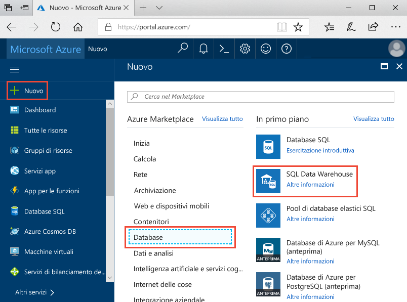
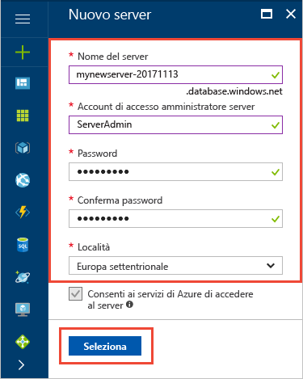
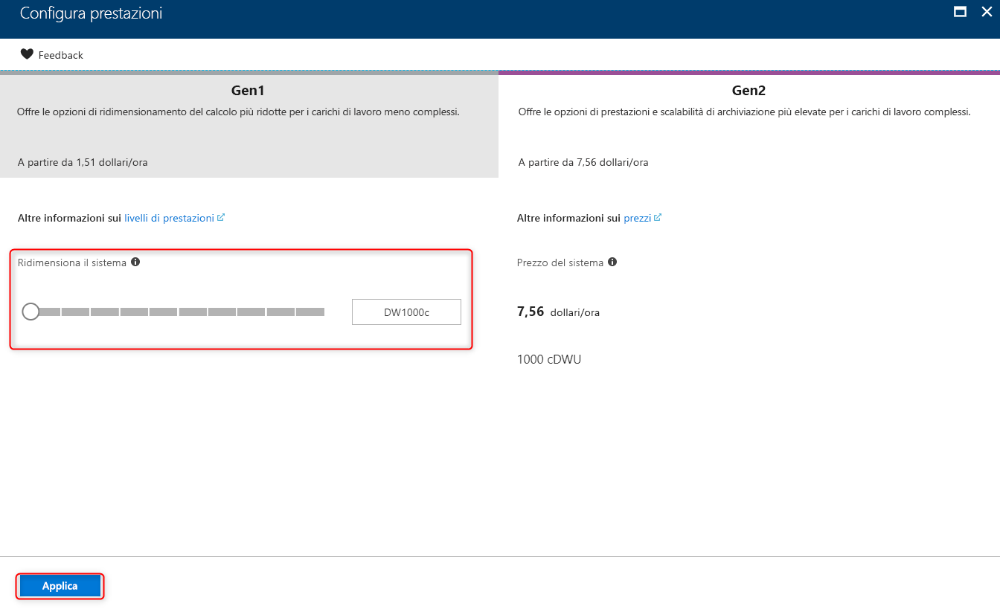
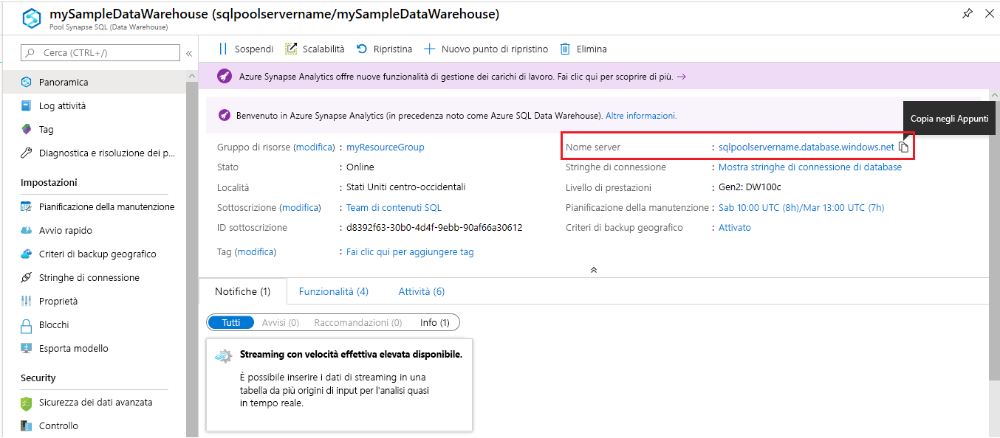
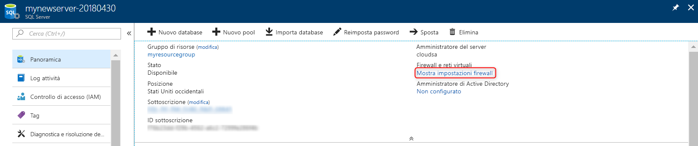
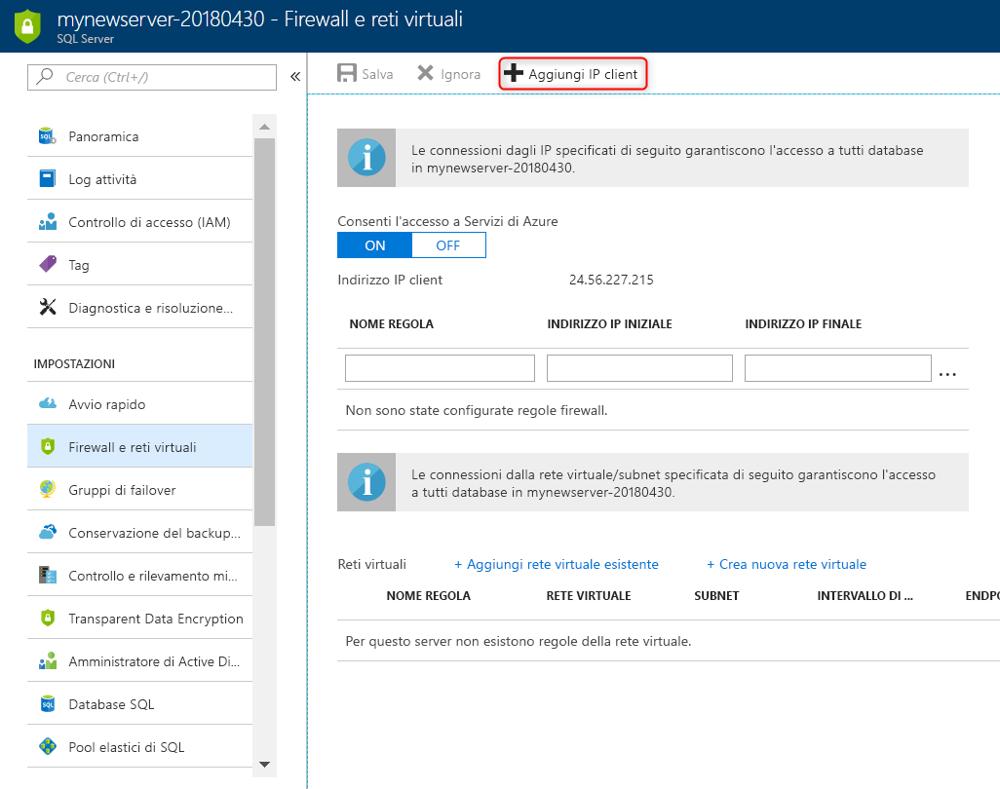
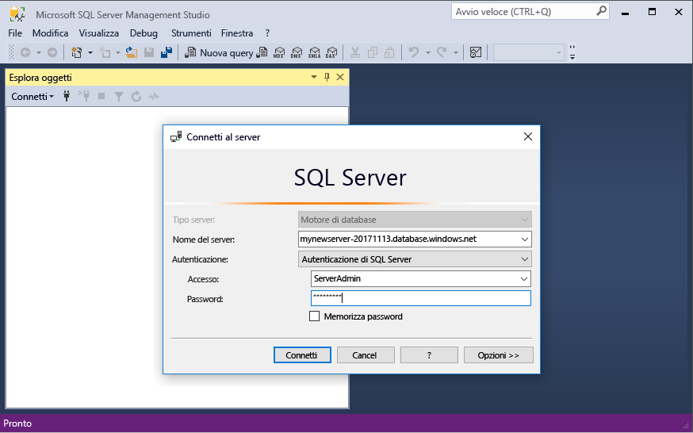
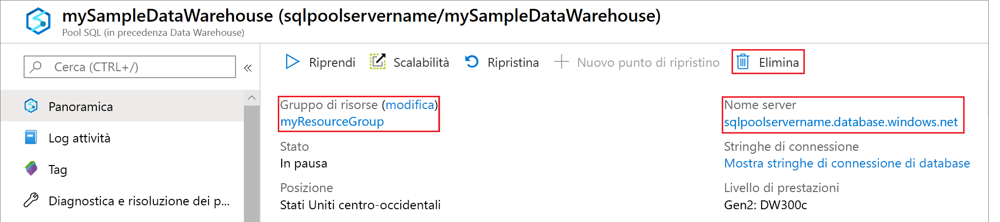

# <a name="tutorial-use-polybase-to-load-data-from-azure-blob-storage-to-azure-sql-data-warehouse"></a>Esercitazione: Usare PolyBase per caricare dati dall'archivio BLOB di Azure ad Azure SQL Data Warehouse

PolyBase è la tecnologia di caricamento standard per inserire dati in SQL Data Warehouse. In questa esercitazione si usa PolyBase per caricare dati dei taxi di New York dall'archivio BLOB di Azure a SQL Data Warehouse. Questa esercitazione usa il [portale di Azure](https://portal.azure.com) e [SQL Server Management Studio](/sql/ssms/download-sql-server-management-studio-ssms.md) (SSMS) per: 

> [!div class="checklist"]
> * Creare data warehouse nel portale di Azure
> * Impostare una regola del firewall a livello di server nel portale di Azure
> * Connettersi al data warehouse con SSMS
> * Creare un utente designato per il caricamento dei dati
> * Creare tabelle esterne per i dati nell'archivio BLOB di Azure
> * Usare l'istruzione T-SQL CTAS per caricare i dati nel data warehouse
> * Visualizzare lo stato di avanzamento dei dati durante il caricamento
> * Creare statistiche sui nuovi dati caricati

Se non si ha una sottoscrizione di Azure, [creare un account gratuito](https://azure.microsoft.com/free/) prima di iniziare.

## <a name="before-you-begin"></a>Prima di iniziare

Prima di iniziare questa esercitazione, scaricare e installare la versione più recente di [SQL Server Management Studio](/sql/ssms/download-sql-server-management-studio-ssms.md) (SSMS).


## <a name="log-in-to-the-azure-portal"></a>Accedere al Portale di Azure

Accedere al [Portale di Azure](https://portal.azure.com/).

## <a name="create-a-blank-sql-data-warehouse"></a>Creare un SQL Data Warehouse vuoto

Un SQL Data Warehouse viene creato con un set definito di [risorse di calcolo](performance-tiers.md). Il database viene creato in un [gruppo di risorse di Azure](../azure-resource-manager/resource-group-overview.md) e in un [server logico di Azure SQL](../sql-database/sql-database-features.md). 

Per creare un SQL Data Warehouse vuoto, eseguire la procedura seguente. 

1. Fare clic su **Crea una risorsa** nell'angolo superiore sinistro del portale di Azure.

2. Selezionare **Database** nella pagina **Nuovo** e **SQL Data Warehouse** nell'area **In primo piano** della pagina **Nuovo**.

    

3. Compilare il modulo di SQL Data Warehouse con le informazioni seguenti:   

   | Impostazione | Valore consigliato | DESCRIZIONE | 
   | ------- | --------------- | ----------- | 
   | **Database name** (Nome database) | mySampleDataWarehouse | Per i nomi di database validi, vedere [Database Identifiers](/sql/relational-databases/databases/database-identifiers) (Identificatori di database). | 
   | **Sottoscrizione** | Sottoscrizione in uso  | Per informazioni dettagliate sulle sottoscrizioni, vedere [Subscriptions](https://account.windowsazure.com/Subscriptions) (Sottoscrizioni). |
   | **Gruppo di risorse** | myResourceGroup | Per i nomi di gruppi di risorse validi, vedere [Naming rules and restrictions](https://docs.microsoft.com/azure/architecture/best-practices/naming-conventions) (Regole di denominazione e restrizioni). |
   | **Select source** (Seleziona origine) | Database vuoto | Specificare che venga creato un database vuoto. Si noti che un data warehouse è un tipo di database.|

    

4. Fare clic su **Server** per creare e configurare un nuovo server per il nuovo database. Compilare il **modulo del nuovo server** con le informazioni seguenti: 

    | Impostazione | Valore consigliato | DESCRIZIONE | 
    | ------- | --------------- | ----------- |
    | **Server name** (Nome server) | Qualsiasi nome globalmente univoco | Per i nomi di server validi, vedere [Naming rules and restrictions](https://docs.microsoft.com/azure/architecture/best-practices/naming-conventions) (Regole di denominazione e restrizioni). | 
    | **Accesso amministratore server** | Qualsiasi nome valido | Per i nomi di accesso validi, vedere [Database Identifiers](https://docs.microsoft.com/sql/relational-databases/databases/database-identifiers) (Identificatori di database).|
    | **Password** | Qualsiasi password valida | La password deve contenere almeno otto caratteri delle tre categorie seguenti: maiuscole, minuscole, numeri e caratteri non alfanumerici. |
    | **Posizione** | Qualsiasi località valida | Per informazioni sulle aree, vedere [Aree di Azure](https://azure.microsoft.com/regions/). |

    

5. Fare clic su **Seleziona**.

6. Fare clic su **Livello di prestazioni** per specificare se il data warehouse è ottimizzato per l'elasticità o il calcolo e il numero di unità del data warehouse. 

7. Per questa esercitazione selezionare il livello di servizio **Ottimizzato per l'elasticità**. Il dispositivo di scorrimento, per impostazione predefinita, è impostato su **DW400**.  Provare a spostarlo verso l'alto o il basso per vedere come funziona. 

    

8. Fare clic su **Apply**.
9. Nella pagina SQL Data Warehouse selezionare le **regole di confronto** per il database vuoto. Per questa esercitazione usare il valore predefinito. Per altre informazioni sulle regole di confronto, vedere [Collations](/sql/t-sql/statements/collations.md) (Regole di confronto)

11. Dopo aver completato il modulo del database SQL, fare clic su **Crea** per effettuare il provisioning del database. Il provisioning richiede alcuni minuti. 

    

12. Sulla barra degli strumenti fare clic su **Notifiche** per monitorare il processo di distribuzione.
    
     

## <a name="create-a-server-level-firewall-rule"></a>Creare una regola del firewall a livello di server

Il servizio SQL Data Warehouse crea un firewall a livello di server che impedisce alle applicazioni e agli strumenti esterni di connettersi al server o ai database sul server. Per abilitare la connettività, è possibile aggiungere regole del firewall per aprire il firewall a indirizzi IP specifici.  Seguire questa procedura per creare una [regola del firewall a livello di server](../sql-database/sql-database-firewall-configure.md) per l'indirizzo IP del client. 

> [!NOTE]
> SQL Data Warehouse comunica attraverso la porta 1433. Se si sta provando a connettersi da una rete aziendale, il traffico in uscita sulla porta 1433 potrebbe non essere consentito dal firewall della rete. In questo caso, non è possibile connettersi al server del database SQL di Azure, a meno che il reparto IT non apra la porta 1433.
>

1. Al termine della distribuzione, scegliere **Database SQL** dal menu a sinistra e fare clic su **mySampleDatabase** nella pagina **Database SQL**. Viene visualizzata la pagina di panoramica per il database che mostra il nome completo del server, ad esempio **mynewserver-20171113.database.windows.net**, e offre altre opzioni per la configurazione. 

2. Copiare il nome completo del server per connettersi al server e ai relativi database nelle guide introduttive successive. Quindi fare clic sul nome del server per aprire le impostazioni del server.

     

3. Fare clic sul nome del server per aprire le impostazioni del server.

     

5. Fare clic su **Mostra impostazioni firewall**. Si apre la pagina **Impostazioni del firewall** per il server del database SQL. 

     

4. Fare clic su **Aggiungi IP client** sulla barra degli strumenti per aggiungere l'indirizzo IP corrente a una nuova regola del firewall. Una regola del firewall può aprire la porta 1433 per un indirizzo IP singolo o un intervallo di indirizzi IP.

5. Fare clic su **Save**. Viene creata una regola del firewall a livello di server per l'indirizzo IP corrente, che apre la porta 1433 nel server logico.

6. Fare clic su **OK** e quindi chiudere la pagina **Impostazioni del firewall**.

È ora possibile connettersi al server SQL e ai relativi data warehouse usando questo indirizzo IP. La connessione funziona da SQL Server Management Studio o un altro strumento di propria scelta. Quando ci si connette, usare l'account ServerAdmin creato in precedenza.  

> [!IMPORTANT]
> Per impostazione predefinita, l'accesso attraverso il firewall del database SQL è abilitato per tutti i servizi di Azure. Fare clic su **DISATTIVATO** in questa pagina e quindi fare clic su **Salva** per disabilitare il firewall per tutti i servizi di Azure.

## <a name="get-the-fully-qualified-server-name"></a>Ottenere il nome completo del server

Ottenere il nome completo del server SQL nel portale di Azure. In seguitò si userà il nome completo per la connessione al server.

1. Accedere al [Portale di Azure](https://portal.azure.com/).
2. Scegliere **Database SQL** dal menu a sinistra, quindi fare clic sul database nella pagina **Database SQL**. 
3. Nel riquadro **Informazioni di base** della pagina del portale di Azure per il database individuare e quindi copiare il **Nome server**. In questo esempio il nome completo è mynewserver-20171113.database.windows.net. 

      

## <a name="connect-to-the-server-as-server-admin"></a>Connettersi al server come amministratore del server

In questa sezione si usa [SQL Server Management Studio](/sql/ssms/download-sql-server-management-studio-ssms.md) (SSMS) per stabilire una connessione al server SQL di Azure.

1. Aprire SQL Server Management Studio.

2. Nella finestra di dialogo **Connetti al server** immettere le informazioni seguenti:

    | Impostazione      | Valore consigliato | DESCRIZIONE | 
    | ------------ | --------------- | ----------- | 
    | Tipo di server | Motore di database | Questo valore è obbligatorio |
    | Nome server | Nome completo del server | Il nome sarà simile a: **mynewserver-20171113.database.windows.net**. |
    | Authentication | Autenticazione di SQL Server | L'autenticazione SQL è il solo tipo di autenticazione configurato in questa esercitazione. |
    | Login | Account amministratore del server | Si tratta dell'account specificato quando è stato creato il server. |
    | Password | Password per l'account amministratore del server | Si tratta della password specificata quando è stato creato il server. |

    

4. Fare clic su **Connetti**. La finestra Esplora oggetti viene visualizzata in SSMS. 

5. In Esplora oggetti espandere **Database**. Espandere quindi **Database di sistema** e **master** per visualizzare gli oggetti nel database master.  Espandere **mySampleDatabase** per visualizzare gli oggetti nel nuovo database.

     

## <a name="create-a-user-for-loading-data"></a>Creare un utente per il caricamento dei dati

L'account amministratore del server ha la funzione di eseguire operazioni di gestione e non è appropriato per l'esecuzione di query sui dati degli utenti. Il caricamento di dati è un'operazione a elevato utilizzo di memoria. I [valori massimi di memoria](performance-tiers.md#memory-maximums) sono definiti in base al [livello di prestazioni](performance-tiers.md) e alla [classe di risorse](resource-classes-for-workload-management.md). 

È consigliabile creare un account di accesso e un utente dedicato per il caricamento dei dati. Quindi aggiungere l'utente con il compito di caricare i dati a una [classe di risorse](resource-classes-for-workload-management.md) che consente un'allocazione di memoria massima appropriata.

Poiché l'accesso è stato eseguito come amministratore del server, è possibile creare account di accesso e utenti. Usare questa procedura per creare un account di accesso e un utente denominato **LoaderRC20**. Quindi assegnare l'utente alla classe di risorse **staticrc20**. 

1.  In SSMS fare clic con il pulsante destro del mouse su **master** per visualizzare un menu a discesa e scegliere **Nuova query**. Verrà visualizzata una nuova finestra di query.

    

2. Nella finestra della query immettere i comandi T-SQL per creare un account di accesso e un utente denominato LoaderRC20, sostituendo la propria password al valore "a123STRONGpassword!". 

    ```sql
    CREATE LOGIN LoaderRC20 WITH PASSWORD = 'a123STRONGpassword!';
    CREATE USER LoaderRC20 FOR LOGIN LoaderRC20;
    ```

3. Fare clic su **Execute**.

4. Fare clic con il pulsante destro del mouse su **mySampleDataWarehouse** e scegliere **Nuova query**. Viene visualizzata una nuova finestra della query.  

    
 
5. Immettere i comandi T-SQL seguenti per creare un utente del database denominato LoaderRC20 per l'account di accesso LoaderRC20. La seconda riga concede al nuovo utente autorizzazioni di CONTROLLO sul nuovo data warehouse.  Queste autorizzazioni sono simili a rendere l'utente proprietario del database. La terza riga aggiunge il nuovo utente come membro della [classe di risorse](resource-classes-for-workload-management.md) staticrc20.

    ```sql
    CREATE USER LoaderRC20 FOR LOGIN LoaderRC20;
    GRANT CONTROL ON DATABASE::[mySampleDataWarehouse] to LoaderRC20;
    EXEC sp_addrolemember 'staticrc20', 'LoaderRC20';
    ```

6. Fare clic su **Execute**.

## <a name="connect-to-the-server-as-the-loading-user"></a>Connettersi al server come utente addetto al caricamento

Il primo passo per caricare dati è eseguire l'accesso come LoaderRC20.  

1. In Esplora oggetti fare clic su **Connetti** nel menu a discesa e selezionare **Motore di database**. Viene visualizzata la finestra di dialogo **Connetti al server** .

    

2. Immettere il nome completo del server e **LoaderRC20** come account di accesso.  Immettere la password per LoaderRC20.

3. Fare clic su **Connetti**.

4. Quando la connessione è pronta, si vedranno due connessioni server in Esplora oggetti. Una connessione ServerAdmin e una connessione MedRCLogin.

    

## <a name="create-external-tables-for-the-sample-data"></a>Creare una tabella esterna per i dati di esempio

Ora è possibile iniziare il processo di caricamento dei dati nel nuovo data warehouse. Questa esercitazione illustra come usare [Polybase](/sql/relational-databases/polybase/polybase-guide.md) per caricare i dati relativi ai taxi di New York City da un BLOB del servizio di archiviazione di Azure. Per riferimento futuro, per informazioni su come ottenere i dati nell'archivio BLOB di Azure o come caricarli direttamente dall'origine in SQL Data Warehouse, vedere la [panoramica del caricamento](sql-data-warehouse-overview-load.md).

Eseguire gli script SQL seguenti per specificare le informazioni sui dati che si vuole caricare. Queste informazioni includono la posizione dei dati, il formato del contenuto dei dati e la definizione della tabella per i dati. 

1. Nella sezione precedente è stato eseguito l'accesso al data warehouse come LoaderRC20. In SSMS fare clic con il pulsante destro del mouse sulla connessione LoaderRC20 e selezionare **Nuova query**.  Verrà visualizzata una nuova finestra di query, 

    

2. Confrontare la finestra della query all'immagine precedente.  Verificare che la nuova finestra della query sia in esecuzione come LoaderRC20 ed esegua query sul database MySampleDataWarehouse. Usare questa finestra della query per eseguire tutte le operazioni di caricamento.

3. Creare una chiave master per il database MySampleDataWarehouse. È necessario creare una chiave master solo una volta per ogni database. 

    ```sql
    CREATE MASTER KEY;
    ```

4. Eseguire la seguente istruzione [CREATE EXTERNAL DATA SOURCE](/sql/t-sql/statements/create-external-data-source-transact-sql.md) per definire la posizione del BLOB di Azure. Questo è il percorso dei dati esterni relativi ai taxi.  Per eseguire un comando che è stato accodato nella finestra della query, evidenziare i comandi che si vuole eseguire e fare clic su **Esegui**.

    ```sql
    CREATE EXTERNAL DATA SOURCE NYTPublic
    WITH
    (
        TYPE = Hadoop,
        LOCATION = 'wasbs://2013@nytaxiblob.blob.core.windows.net/'
    );
    ```

5. Eseguire la seguente istruzione T-SQL [CREATE EXTERNAL FILE FORMAT](/sql/t-sql/statements/create-external-file-format-transact-sql.md) per specificare le caratteristiche di formattazione e le opzioni per il file di dati esterno. Questa istruzione specifica che i dati esterni sono archiviati come testo e i valori sono separati dal carattere pipe ("|"). Il file esterno è compresso con Gzip. 

    ```sql
    CREATE EXTERNAL FILE FORMAT uncompressedcsv
    WITH (
        FORMAT_TYPE = DELIMITEDTEXT,
        FORMAT_OPTIONS ( 
            FIELD_TERMINATOR = ',',
            STRING_DELIMITER = '',
            DATE_FORMAT = '',
            USE_TYPE_DEFAULT = False
        )
    );
    CREATE EXTERNAL FILE FORMAT compressedcsv
    WITH ( 
        FORMAT_TYPE = DELIMITEDTEXT,
        FORMAT_OPTIONS ( FIELD_TERMINATOR = '|',
            STRING_DELIMITER = '',
        DATE_FORMAT = '',
            USE_TYPE_DEFAULT = False
        ),
        DATA_COMPRESSION = 'org.apache.hadoop.io.compress.GzipCodec'
    );
    ```

6.  Eseguire la seguente istruzione [CREATE SCHEMA](/sql/t-sql/statements/create-schema-transact-sql.md) per creare uno schema per il formato di file esterno. Lo schema fornisce un modo per organizzare le tabelle esterne da creare.

    ```sql
    CREATE SCHEMA ext;
    ```

7. Creare le tabelle esterne. La definizioni di tabella vengono archiviate in SQL Data Warehouse, ma le tabelle fanno riferimento a dati archiviati nell'archivio BLOB di Azure. Eseguire i comandi T-SQL seguenti per creare alcune tabelle esterne che fanno riferimento al BLOB di Azure definito in precedenza nelle origini dati esterne.

    ```sql
    CREATE EXTERNAL TABLE [ext].[Date] 
    (
        [DateID] int NOT NULL,
        [Date] datetime NULL,
        [DateBKey] char(10) COLLATE SQL_Latin1_General_CP1_CI_AS NULL,
        [DayOfMonth] varchar(2) COLLATE SQL_Latin1_General_CP1_CI_AS NULL,
        [DaySuffix] varchar(4) COLLATE SQL_Latin1_General_CP1_CI_AS NULL,
        [DayName] varchar(9) COLLATE SQL_Latin1_General_CP1_CI_AS NULL,
        [DayOfWeek] char(1) COLLATE SQL_Latin1_General_CP1_CI_AS NULL,
        [DayOfWeekInMonth] varchar(2) COLLATE SQL_Latin1_General_CP1_CI_AS NULL,
        [DayOfWeekInYear] varchar(2) COLLATE SQL_Latin1_General_CP1_CI_AS NULL,
        [DayOfQuarter] varchar(3) COLLATE SQL_Latin1_General_CP1_CI_AS NULL,
        [DayOfYear] varchar(3) COLLATE SQL_Latin1_General_CP1_CI_AS NULL,
        [WeekOfMonth] varchar(1) COLLATE SQL_Latin1_General_CP1_CI_AS NULL,
        [WeekOfQuarter] varchar(2) COLLATE SQL_Latin1_General_CP1_CI_AS NULL,
        [WeekOfYear] varchar(2) COLLATE SQL_Latin1_General_CP1_CI_AS NULL,
        [Month] varchar(2) COLLATE SQL_Latin1_General_CP1_CI_AS NULL,
        [MonthName] varchar(9) COLLATE SQL_Latin1_General_CP1_CI_AS NULL,
        [MonthOfQuarter] varchar(2) COLLATE SQL_Latin1_General_CP1_CI_AS NULL,
        [Quarter] char(1) COLLATE SQL_Latin1_General_CP1_CI_AS NULL,
        [QuarterName] varchar(9) COLLATE SQL_Latin1_General_CP1_CI_AS NULL,
        [Year] char(4) COLLATE SQL_Latin1_General_CP1_CI_AS NULL,
        [YearName] char(7) COLLATE SQL_Latin1_General_CP1_CI_AS NULL,
        [MonthYear] char(10) COLLATE SQL_Latin1_General_CP1_CI_AS NULL,
        [MMYYYY] char(6) COLLATE SQL_Latin1_General_CP1_CI_AS NULL,
        [FirstDayOfMonth] date NULL,
        [LastDayOfMonth] date NULL,
        [FirstDayOfQuarter] date NULL,
        [LastDayOfQuarter] date NULL,
        [FirstDayOfYear] date NULL,
        [LastDayOfYear] date NULL,
        [IsHolidayUSA] bit NULL,
        [IsWeekday] bit NULL,
        [HolidayUSA] varchar(50) COLLATE SQL_Latin1_General_CP1_CI_AS NULL
    )
    WITH
    (
        LOCATION = 'Date',
        DATA_SOURCE = NYTPublic,
        FILE_FORMAT = uncompressedcsv,
        REJECT_TYPE = value,
        REJECT_VALUE = 0
    ); 
    CREATE EXTERNAL TABLE [ext].[Geography]
    (
        [GeographyID] int NOT NULL,
        [ZipCodeBKey] varchar(10) COLLATE SQL_Latin1_General_CP1_CI_AS NOT NULL,
        [County] varchar(50) COLLATE SQL_Latin1_General_CP1_CI_AS NULL,
        [City] varchar(50) COLLATE SQL_Latin1_General_CP1_CI_AS NULL,
        [State] varchar(50) COLLATE SQL_Latin1_General_CP1_CI_AS NULL,
        [Country] varchar(50) COLLATE SQL_Latin1_General_CP1_CI_AS NULL,
        [ZipCode] varchar(50) COLLATE SQL_Latin1_General_CP1_CI_AS NULL
    )
    WITH
    (
        LOCATION = 'Geography',
        DATA_SOURCE = NYTPublic,
        FILE_FORMAT = uncompressedcsv,
        REJECT_TYPE = value,
        REJECT_VALUE = 0 
    );      
    CREATE EXTERNAL TABLE [ext].[HackneyLicense]
    (
        [HackneyLicenseID] int NOT NULL,
        [HackneyLicenseBKey] varchar(50) COLLATE SQL_Latin1_General_CP1_CI_AS NOT NULL,
        [HackneyLicenseCode] varchar(50) COLLATE SQL_Latin1_General_CP1_CI_AS NULL
    )
    WITH
    (
        LOCATION = 'HackneyLicense',
        DATA_SOURCE = NYTPublic,
        FILE_FORMAT = uncompressedcsv,
        REJECT_TYPE = value,
        REJECT_VALUE = 0
    );
    CREATE EXTERNAL TABLE [ext].[Medallion]
    (
        [MedallionID] int NOT NULL,
        [MedallionBKey] varchar(50) COLLATE SQL_Latin1_General_CP1_CI_AS NOT NULL,
        [MedallionCode] varchar(50) COLLATE SQL_Latin1_General_CP1_CI_AS NULL
    )
    WITH
    (
        LOCATION = 'Medallion',
        DATA_SOURCE = NYTPublic,
        FILE_FORMAT = uncompressedcsv,
        REJECT_TYPE = value,
        REJECT_VALUE = 0
    )
    ;  
    CREATE EXTERNAL TABLE [ext].[Time]
    (
        [TimeID] int NOT NULL,
        [TimeBKey] varchar(8) COLLATE SQL_Latin1_General_CP1_CI_AS NOT NULL,
        [HourNumber] tinyint NOT NULL,
        [MinuteNumber] tinyint NOT NULL,
        [SecondNumber] tinyint NOT NULL,
        [TimeInSecond] int NOT NULL,
        [HourlyBucket] varchar(15) COLLATE SQL_Latin1_General_CP1_CI_AS NOT NULL,
        [DayTimeBucketGroupKey] int NOT NULL,
        [DayTimeBucket] varchar(100) COLLATE SQL_Latin1_General_CP1_CI_AS NOT NULL
    )
    WITH
    (
        LOCATION = 'Time',
        DATA_SOURCE = NYTPublic,
        FILE_FORMAT = uncompressedcsv,
        REJECT_TYPE = value,
        REJECT_VALUE = 0
    );
    CREATE EXTERNAL TABLE [ext].[Trip]
    (
        [DateID] int NOT NULL,
        [MedallionID] int NOT NULL,
        [HackneyLicenseID] int NOT NULL,
        [PickupTimeID] int NOT NULL,
        [DropoffTimeID] int NOT NULL,
        [PickupGeographyID] int NULL,
        [DropoffGeographyID] int NULL,
        [PickupLatitude] float NULL,
        [PickupLongitude] float NULL,
        [PickupLatLong] varchar(50) COLLATE SQL_Latin1_General_CP1_CI_AS NULL,
        [DropoffLatitude] float NULL,
        [DropoffLongitude] float NULL,
        [DropoffLatLong] varchar(50) COLLATE SQL_Latin1_General_CP1_CI_AS NULL,
        [PassengerCount] int NULL,
        [TripDurationSeconds] int NULL,
        [TripDistanceMiles] float NULL,
        [PaymentType] varchar(50) COLLATE SQL_Latin1_General_CP1_CI_AS NULL,
        [FareAmount] money NULL,
        [SurchargeAmount] money NULL,
        [TaxAmount] money NULL,
        [TipAmount] money NULL,
        [TollsAmount] money NULL,
        [TotalAmount] money NULL
    )
    WITH
    (
        LOCATION = 'Trip2013',
        DATA_SOURCE = NYTPublic,
        FILE_FORMAT = compressedcsv,
        REJECT_TYPE = value,
        REJECT_VALUE = 0
    );
    CREATE EXTERNAL TABLE [ext].[Weather]
    (
        [DateID] int NOT NULL,
        [GeographyID] int NOT NULL,
        [PrecipitationInches] float NOT NULL,
        [AvgTemperatureFahrenheit] float NOT NULL
    )
    WITH
    (
        LOCATION = 'Weather',
        DATA_SOURCE = NYTPublic,
        FILE_FORMAT = uncompressedcsv,
        REJECT_TYPE = value,
        REJECT_VALUE = 0
    )
    ;
    ```

8. In Esplora oggetti espandere mySampleDataWarehouse per vedere l'elenco delle tabelle esterne appena create.

    

## <a name="load-the-data-into-your-data-warehouse"></a>Caricare i dati nel data warehouse

Questa sezione usa le tabelle esterne appena definite per caricare i dati di esempio dal BLOB del servizio di archiviazione di Azure a SQL Data warehouse.  

> [!NOTE]
> Questa esercitazione carica i dati direttamente nella tabella finale. In un ambiente di produzione si userà in genere CREATE TABLE AS SELECT per eseguire il caricamento in una tabella di staging. Mentre i dati si trovano nella tabella di staging è possibile eseguire le trasformazioni eventualmente necessarie. Per accodare i dati della tabella di staging a una tabella di produzione, è possibile usare l'istruzione INSERT...SELECT. Per altre informazioni, vedere [Inserimento di dati in una tabella di produzione](guidance-for-loading-data.md#inserting-data-into-a-production-table).
> 

Lo script usa l'istruzione T-SQL [CREATE TABLE AS SELECT (CTAS)](/sql/t-sql/statements/create-table-as-select-azure-sql-data-warehouse.md) per caricare i dati dal BLOB del servizio di archiviazione di Azure nelle nuove tabelle del data warehouse. CTAS crea una nuova tabella in base ai risultati di un'istruzione SELECT. La nuova tabella ha le stesse colonne e gli stessi tipi di dati dei risultati dell'istruzione SELECT. Quando l'istruzione SELECT seleziona da una tabella esterna, SQL Data Warehouse importa i dati in una tabella relazionale del data warehouse. 

1. Eseguire lo script seguente per caricare i dati nelle nuove tabelle nel data warehouse.

    ```sql
    CREATE TABLE [dbo].[Date]
    WITH
    ( 
        DISTRIBUTION = ROUND_ROBIN,
        CLUSTERED COLUMNSTORE INDEX
    )
    AS SELECT * FROM [ext].[Date]
    OPTION (LABEL = 'CTAS : Load [dbo].[Date]')
    ;
    CREATE TABLE [dbo].[Geography]
    WITH
    ( 
        DISTRIBUTION = ROUND_ROBIN,
        CLUSTERED COLUMNSTORE INDEX
    )
    AS
    SELECT * FROM [ext].[Geography]
    OPTION (LABEL = 'CTAS : Load [dbo].[Geography]')
    ;
    CREATE TABLE [dbo].[HackneyLicense]
    WITH
    ( 
        DISTRIBUTION = ROUND_ROBIN,
        CLUSTERED COLUMNSTORE INDEX
    )
    AS SELECT * FROM [ext].[HackneyLicense]
    OPTION (LABEL = 'CTAS : Load [dbo].[HackneyLicense]')
    ;
    CREATE TABLE [dbo].[Medallion]
    WITH
    (
        DISTRIBUTION = ROUND_ROBIN,
        CLUSTERED COLUMNSTORE INDEX
    )
    AS SELECT * FROM [ext].[Medallion]
    OPTION (LABEL = 'CTAS : Load [dbo].[Medallion]')
    ;
    CREATE TABLE [dbo].[Time]
    WITH
    (
        DISTRIBUTION = ROUND_ROBIN,
        CLUSTERED COLUMNSTORE INDEX
    )
    AS SELECT * FROM [ext].[Time]
    OPTION (LABEL = 'CTAS : Load [dbo].[Time]')
    ;
    CREATE TABLE [dbo].[Weather]
    WITH
    ( 
        DISTRIBUTION = ROUND_ROBIN,
        CLUSTERED COLUMNSTORE INDEX
    )
    AS SELECT * FROM [ext].[Weather]
    OPTION (LABEL = 'CTAS : Load [dbo].[Weather]')
    ;
    CREATE TABLE [dbo].[Trip]
    WITH
    (
        DISTRIBUTION = ROUND_ROBIN,
        CLUSTERED COLUMNSTORE INDEX
    )
    AS SELECT * FROM [ext].[Trip]
    OPTION (LABEL = 'CTAS : Load [dbo].[Trip]')
    ;
    ```

2. Visualizzare i dati man mano che vengono caricati. Vengono caricati alcuni GB di dati, che vengono compressi in indici cluster columnstore a prestazioni elevate. Eseguire la query riportata di seguito, che usa le viste a gestione dinamica (DMV) per visualizzare lo stato del caricamento. Dopo aver avviato la query, attendere che SQL Data Warehouse esegua le operazioni necessarie.

    ```sql
    SELECT
        r.command,
        s.request_id,
        r.status,
        count(distinct input_name) as nbr_files,
        sum(s.bytes_processed)/1024/1024/1024 as gb_processed
    FROM 
        sys.dm_pdw_exec_requests r
        INNER JOIN sys.dm_pdw_dms_external_work s
        ON r.request_id = s.request_id
    WHERE
        r.[label] = 'CTAS : Load [dbo].[Date]' OR
        r.[label] = 'CTAS : Load [dbo].[Geography]' OR
        r.[label] = 'CTAS : Load [dbo].[HackneyLicense]' OR
        r.[label] = 'CTAS : Load [dbo].[Medallion]' OR
        r.[label] = 'CTAS : Load [dbo].[Time]' OR
        r.[label] = 'CTAS : Load [dbo].[Weather]' OR
        r.[label] = 'CTAS : Load [dbo].[Trip]'
    GROUP BY
        r.command,
        s.request_id,
        r.status
    ORDER BY
        nbr_files desc, 
        gb_processed desc;
    ```

3. Visualizzare tutte le query di sistema.

    ```sql
    SELECT * FROM sys.dm_pdw_exec_requests;
    ```

4. I dati vengono caricati nel data warehouse.

    

## <a name="create-statistics-on-newly-loaded-data"></a>Creare statistiche sui dati appena caricati

SQL Data Warehouse non crea automaticamente o aggiorna automaticamente le statistiche. Per ottenere prestazioni elevate per le query, è quindi importante creare statistiche su ogni colonna di ogni tabella dopo il primo carico. È anche importante aggiornare le statistiche dopo modifiche sostanziali dei dati.

Eseguire questi comandi per creare statistiche su colonne che possono essere usate nelle operazioni di join.

    ```sql
    CREATE STATISTICS [dbo.Date DateID stats] ON dbo.Date (DateID);
    CREATE STATISTICS [dbo.Trip DateID stats] ON dbo.Trip (DateID);
    ```

## <a name="clean-up-resources"></a>Pulire le risorse

Le risorse di calcolo e i dati caricati nel data warehouse prevedono un addebito. Questi costi vengono addebitati separatamente. 

- Se si vuole mantenere i dati nell'archivio, è possibile sospendere il calcolo quando non si usa il data warehouse. Sospendendo il calcolo verrà addebitata solo l'archiviazione dati: sarà possibile riprendere il calcolo quando sarà necessario elaborare i dati.
- Se si vuole evitare addebiti futuri, è possibile eliminare il data warehouse. 

Seguire questi passaggi per pulire le risorse come desiderato.

1. Accedere al [portale di Azure](https://portal.azure.com) e fare clic sul data warehouse.

    

2. Per sospendere il calcolo, fare clic sul pulsante **Pausa**. Quando si sospende il data warehouse, viene visualizzato il pulsante **Avvia**.  Per riprendere il calcolo, fare clic su **Avvia**.

3. Per rimuovere il data warehouse in modo da non ricevere addebiti per calcoli o archiviazioni, fare clic su **Elimina**.

4. Per rimuovere il server SQL che è stato creato, fare clic su **mynewserver-20171113.database.windows.net** nell'immagine precedente e quindi fare clic su **Elimina**.  Prestare attenzione con questa operazione perché eliminando il server saranno eliminati tutti i database assegnati al server.

5. Per rimuovere il gruppo di risorse, fare clic su **myResourceGroup** e quindi su **Elimina gruppo di risorse**.

## <a name="next-steps"></a>Passaggi successivi 
In questa esercitazione è stato descritto come creare un data warehouse e creare un utente per il caricamento dei dati. Sono state create tabelle esterne per definire la struttura per i dati archiviati nel BLOB del servizio di archiviazione di Azure e quindi è stata usata l'istruzione PolyBase CREATE TABLE AS SELECT per caricare dati nel data warehouse. 

Sono state eseguite queste operazioni:
> [!div class="checklist"]
> * È stato creato un data warehouse nel portale di Azure
> * Impostare una regola del firewall a livello di server nel portale di Azure
> * Ci si è connessi al data warehouse con SSMS
> * È stato creato un utente designato per il caricamento dei dati
> * Sono state create tabelle esterne per i dati nel BLOB del servizio di archiviazione di Azure
> * È stata usata l'istruzione T-SQL CTAS per caricare i dati nel data warehouse
> * È stato visualizzato lo stato di avanzamento dei dati durante il caricamento
> * Sono state create statistiche sui nuovi dati caricati

Per informazioni su come eseguire la migrazione di un database esistente in SQL Data Warehouse, passare alla panoramica sulla migrazione.

> [!div class="nextstepaction"]
>[Informazioni su come eseguire la migrazione di un database esistente in SQL Data Warehouse](sql-data-warehouse-overview-migrate.md)
