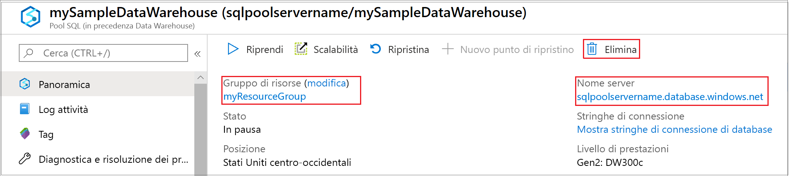

# Guida introduttiva: Sospendere e riprendere le risorse di calcolo in un pool SQL di Synapse con il portale di Azure

È possibile usare il portale di Azure per sospendere e riprendere le risorse di calcolo del pool SQL di Synapse (data warehouse). Se non si ha una sottoscrizione di Azure, creare un account [gratuito](https://azure.microsoft.com/free/) prima di iniziare.

## Accedere al portale di Azure

Accedere al [portale di Azure](https://portal.azure.com/).

## Prima di iniziare

Vedere [Creare e connettere - portale](create-data-warehouse-portal.md) per creare un pool SQL denominato **mySampleDataWarehouse**. 

## Sospendere le risorse di calcolo

Per ridurre i costi, è possibile sospendere e riprendere le risorse di calcolo su richiesta. Ad esempio, se non si usa il database durante la notte e nei fine settimana, è possibile sospenderlo in questi intervalli di tempo e riprenderne l'esecuzione durante il giorno. 
>[!NOTE]
>Mentre il database è sospeso, non verranno addebitati costi per le risorse di calcolo. Continueranno tuttavia a essere applicati addebiti per l'archiviazione. 

Per sospendere un pool SQL, seguire questa procedura:

1. Accedere al [portale di Azure](https://portal.azure.com/).
2. Fare clic su **Azure Synapse Analytics (in precedenza SQL DW)** nella pagina di spostamento sinistra del portale di Azure.
2. Selezionare **mySampleDataWarehouse** nella pagina **Azure Synapse Analytics (in precedenza SQL DW)** per aprire il pool SQL. 
3. Nella pagina **mySampleDataWarehouse** verificare che **Stato** sia **Online**.

    

4. Per sospendere il pool SQL, fare clic sul pulsante **Sospendi**. 
5. Viene visualizzato un messaggio in cui viene chiesto se si vuole continuare. Fare clic su **Sì**.
6. Attendere qualche minuto e quindi verificare che lo **Stato** sia **Sospensione**.

    

7. Al termine dell'operazione di sospensione, lo stato diventa **Sospeso** e il pulsante di opzione è **Riprendi**.
8. Le risorse di calcolo per il pool SQL sono ora offline. Non verranno addebitate le risorse di calcolo fino al ripristino del servizio.

    

## Riavviare le risorse di calcolo

Per riprendere un pool SQL, seguire questa procedura.

1. Fare clic su **Azure Synapse Analytics (in precedenza SQL DW)** nella pagina sinistra del portale di Azure.
2. Selezionare **mySampleDataWarehouse** nella pagina **Azure Synapse Analytics (in precedenza SQL DW)** per aprire la pagina del pool SQL. 
3. Nella pagina **mySampleDataWarehouse** verificare che **Stato** sia **Sospeso**.

    

4. Per riprendere il pool SQL, fare clic su **Riprendi**. 
5. Viene visualizzato un messaggio in cui viene chiesto se si vuole avviare. Fare clic su **Sì**.
6. Si noti che lo **Stato** è **Ripresa**.

    

7. Quando il pool SQL è di nuovo online, lo stato diventa **Online** e il pulsante di opzione è **Sospendi**.
8. Le risorse di calcolo per il pool SQL sono ora online ed è possibile usare il servizio. Verranno ripresi gli addebiti per il calcolo.

    

## Pulire le risorse

Verranno addebitati i costi per le unità di data warehouse e i dati archiviati nel pool SQL. Le risorse di calcolo e archiviazione vengono fatturate separatamente. 

- Se si vogliono mantenere i dati nelle risorse di archiviazione, sospendere il calcolo.
- Per evitare di ricevere addebiti in futuro, è possibile eliminare il pool SQL. 

Seguire questa procedura per pulire le risorse nel modo desiderato.

1. Accedere al [portale di Azure](https://portal.azure.com) e fare clic sul pool SQL.

    

1. Per sospendere il calcolo, fare clic sul pulsante **Pausa**. 

2. Per rimuovere il pool SQL in modo da non ricevere addebiti per risorse di calcolo o di archiviazione, fare clic su **Elimina**.

3. Per rimuovere il server SQL creato, fare clic su **sqlpoolservername.database.windows.net** e quindi su **Elimina**.  

   > [!CAUTION]
   > Fare attenzione quando si esegue questa operazione perché l'eliminazione del server comporta anche quella di tutti i database assegnati al server.

5. Per rimuovere il gruppo di risorse, fare clic su **myResourceGroup** e quindi su **Elimina gruppo di risorse**.

## Passaggi successivi

È stato sospeso e ripreso il calcolo per il pool SQL. Per altre informazioni, vedere l'articolo successivo [Caricare i dati in un pool SQL](load-data-from-azure-blob-storage-using-polybase.md). Per altre informazioni sulla gestione delle funzionalità di calcolo, vedere l'articolo [Panoramica sulla gestione delle risorse di calcolo](sql-data-warehouse-manage-compute-overview.md). 

