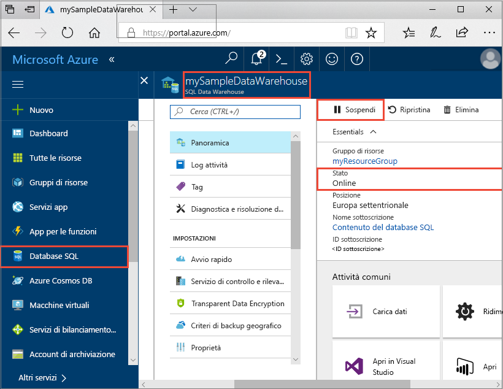
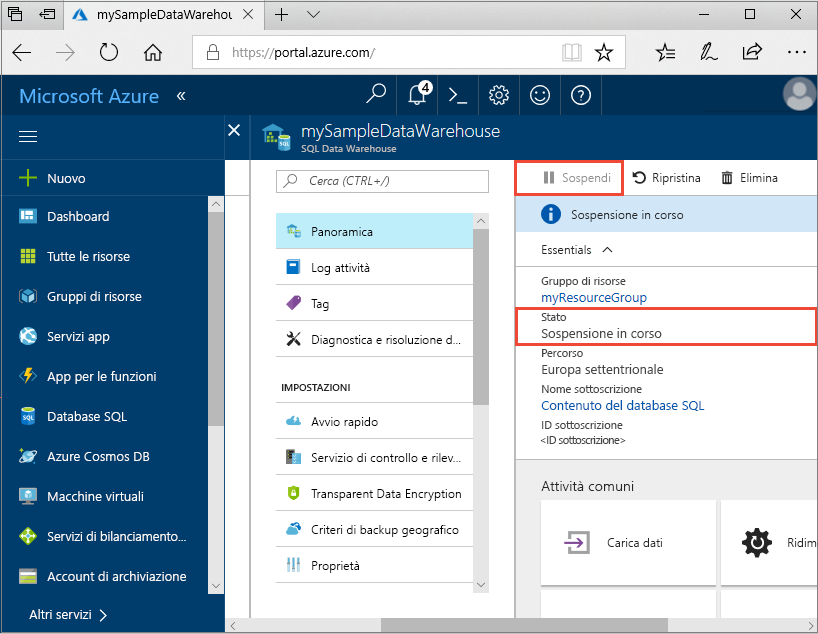
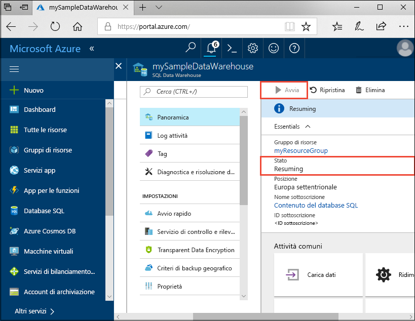

# Guida introduttiva: sospendere e riprendere il calcolo per un Azure SQL Data Warehouse nel portale di Azure
Sospendere il calcolo per un'istanza di Azure SQL Data Warehouse per risparmiare sui costi. Riprendere il calcolo quando si è pronti a utilizzare il data warehouse.

Se non si ha una sottoscrizione di Azure, creare un account [gratuito](https://azure.microsoft.com/free/) prima di iniziare.

## Accedere al portale di Azure

Accedere al [portale di Azure](https://portal.azure.com/).

## Prima di iniziare

Usare [Creare e connettere - portale](create-data-warehouse-portal.md) per creare un data warehouse denominato **mySampleDataWarehouse**. 

## Sospendere le risorse di calcolo
Per ridurre i costi, è possibile sospendere e riprendere le risorse di calcolo su richiesta. Ad esempio, se non si usa il database durante la notte e nei fine settimana, è possibile sospenderlo in questi intervalli di tempo e riprenderne l'esecuzione durante il giorno. Mentre il database è sospeso, non verranno addebitate le risorse di calcolo. Verranno tuttavia applicati comunque addebiti per l'archiviazione. 

Per sospendere un SQL Data Warehouse, seguire questa procedura.

1. Nella pagina di sinistra del portale di Azure fare clic su **Database SQL**.
2. Selezionare **mySampleDataWarehouse** nella pagina **SQL database**. Verrà aperto il data warehouse. 
3. Nella pagina **mySampleDataWarehouse** verificare che **Stato** sia **Online**.

    

4. Per sospendere il data warehouse, fare clic sul pulsante **Pausa**. 
5. Viene visualizzato un messaggio in cui viene chiesto se si vuole continuare. Fare clic su **Sì**.
6. Attendere qualche minuto e quindi verificare che lo **Stato** sia **Sospensione**.

    

7. Al termine dell'operazione di sospensione, lo stato diventa **Sospeso** e il pulsante di opzione è **Avvia**.
8. Le risorse di calcolo per il data warehouse sono offline. Non verranno addebitate le risorse di calcolo fino al ripristino del servizio.

    

## Riavviare le risorse di calcolo
Per riprendere un SQL Data Warehouse, seguire questa procedura.

1. Nella pagina di sinistra del portale di Azure fare clic su **Database SQL**.
2. Selezionare **mySampleDataWarehouse** nella pagina **SQL database**. Verrà aperto il data warehouse. 
3. Nella pagina **mySampleDataWarehouse** verificare che **Stato** sia **Sospeso**.

    

4. Per riprendere il data warehouse, fare clic sul pulsante **Avvia**. 
5. Viene visualizzato un messaggio in cui viene chiesto se si vuole avviare. Fare clic su **Sì**.
6. Si noti che lo **Stato** è **Ripresa**.

    

7. Quando il data warehouse è di nuovo online, lo stato diventa **Online** e il pulsante di opzione è **Pausa**.
8. Le risorse di calcolo per il data warehouse sono online ed è possibile usare il servizio. Verranno ripresi gli addebiti per il calcolo.

    

## Pulire le risorse

Verranno addebitati le unità del data warehouse e i dati archiviati nel data warehouse. Le risorse di calcolo e archiviazione vengono fatturate separatamente. 

- Se si vogliono mantenere i dati nelle risorse di archiviazione, sospendere il calcolo.
- Per evitare di ricevere addebiti in futuro, è possibile eliminare il data warehouse. 

Seguire questa procedura per pulire le risorse nel modo desiderato.

1. Accedere al [portale di Azure](https://portal.azure.com) e fare clic sul data warehouse.

    

1. Per sospendere il calcolo, fare clic sul pulsante **Pausa**. Quando si sospende il data warehouse, viene visualizzato il pulsante **Avvia**.  Per riprendere il calcolo, fare clic su **Avvia**.

2. Per rimuovere il data warehouse in modo da non ricevere addebiti per operazioni di calcolo o archiviazione, fare clic su **Elimina**.

3. Per rimuovere il server SQL creato, fare clic su **mynewserver-20171113.database.windows.net** e quindi fare clic su **Elimina**.  Fare attenzione quando si esegue questa operazione perché l'eliminazione del server comporta anche quella di tutti i database assegnati al server.

4. Per rimuovere il gruppo di risorse, fare clic su **myResourceGroup** e quindi su **Elimina gruppo di risorse**.

## Passaggi successivi
In questo modo è stato sospeso e ripreso il calcolo per il data warehouse. Per altre informazioni su Azure SQL Data Warehouse, continuare con l'esercitazione per il caricamento dei dati.

> [!div class="nextstepaction"]
>[Caricare i dati in SQL Data Warehouse](load-data-from-azure-blob-storage-using-polybase.md)
