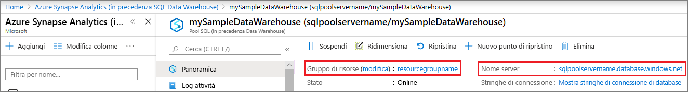

# <a name="quickstart-pause-and-resume-compute-for-an-azure-sql-data-warehouse-in-powershell"></a>Guida introduttiva: sospendere e riprendere il calcolo per un'istanza di Azure SQL Data Warehouse in PowerShell
PowerShell consente di sospendere il calcolo per un'istanza di Azure SQL Data Warehouse per ridurre i costi. Riprendere il calcolo quando si è pronti a usare il data warehouse.

Se non si ha una sottoscrizione di Azure, creare un account [gratuito](https://azure.microsoft.com/free/) prima di iniziare.

Questa esercitazione richiede il modulo Azure PowerShell 5.1.1 o versioni successive. Eseguire ` Get-Module -ListAvailable AzureRM` per trovare la versione attualmente in uso. Se è necessario eseguire l'installazione o l'aggiornamento, vedere come [installare il modulo Azure PowerShell](/powershell/azure/install-azurerm-ps.md). 

## <a name="before-you-begin"></a>Prima di iniziare

Questa guida introduttiva presuppone che l'utente abbia già un data warehouse SQL di cui è possibile sospendere e riprendere l'esecuzione. Se è necessario crearne uno, è possibile usare [Creare e connettere - portale](create-data-warehouse-portal.md) per creare un data warehouse denominato **mySampleDataWarehouse**. 

## <a name="log-in-to-azure"></a>Accedere ad Azure

Accedere alla sottoscrizione di Azure con il comando [Add-AzureRmAccount](/powershell/module/azurerm.profile/add-azurermaccount) e seguire le istruzioni visualizzate.

```powershell
Add-AzureRmAccount
```

Per vedere quale sottoscrizione si sta usando, eseguire [Get-AzureRmSubscription](/powershell/module/azurerm.profile/get-azurermsubscription).

```powershell
Get-AzureRmSubscription
```

Per usare una sottoscrizione diversa da quella predefinita, eseguire [Select-AzureRmSubscription](/powershell/module/azurerm.profile/select-azurermsubscription).

```powershell
Select-AzureRmSubscription -SubscriptionName "MySubscription"
```

## <a name="look-up-data-warehouse-information"></a>Cercare informazioni sul data warehouse

Individuare il nome del database, il nome del server e il gruppo di risorse del data warehouse di cui si prevede di sospendere e riprendere l'esecuzione. 

Seguire questa procedura per trovare le informazioni sulla posizione del data warehouse.

1. Accedere al [portale di Azure](https://portal.azure.com/).
2. Nella pagina di sinistra del portale di Azure fare clic su **Database SQL**.
3. Selezionare **mySampleDataWarehouse** nella pagina **Database SQL**. Verrà aperto il data warehouse. 

    

4. Annotare il nome del data warehouse che verrà usato come nome del database. Annotare anche il nome del server e il gruppo di risorse. Queste informazioni verranno usate nei comandi di sospensione e ripresa.
5. Se il server è foo.database.windows.net, usare solo la prima parte come nome del server nei cmdlet PowerShell. Nella figura precedente il nome completo del server è newserver-20171113.database.windows.net. Come nome del server nel cmdlet PowerShell si userà **newserver-20171113**.

## <a name="pause-compute"></a>Sospendere le risorse di calcolo
Per ridurre i costi, è possibile sospendere e riprendere le risorse di calcolo su richiesta. Ad esempio, se non si usa il database durante la notte e nei fine settimana, è possibile sospenderlo in questi intervalli di tempo e riprenderne l'esecuzione durante il giorno. Mentre il database è sospeso, non verranno addebitati costi per le risorse di calcolo. Continueranno tuttavia a essere applicati addebiti per l'archiviazione. 

Per sospendere l'esecuzione di un database, usare il cmdlet [Suspend-AzureRmSqlDatabase](/powershell/module/azurerm.sql/suspend-azurermsqldatabase.md). Nell'esempio seguente viene sospeso un data warehouse denominato **mySampleDataWarehouse** ospitato in un server denominato **newserver 20171113**. Il server appartiene a un gruppo di risorse di Azure denominato **myResourceGroup**.


```Powershell
Suspend-AzureRmSqlDatabase –ResourceGroupName "myResourceGroup" `
–ServerName "newserver-20171113" –DatabaseName "mySampleDataWarehouse"
```

Come variazione, il database dell'esempio seguente viene recuperato nell'oggetto $database. L'oggetto viene quindi inviato tramite pipe a [Suspend-AzureRmSqlDatabase](/powershell/module/azurerm.sql/suspend-azurermsqldatabase). I risultati vengono archiviati nell'oggetto resultDatabase. Il comando finale mostra i risultati.

```Powershell
$database = Get-AzureRmSqlDatabase –ResourceGroupName "myResourceGroup" `
–ServerName "newserver-20171113" –DatabaseName "mySampleDataWarehouse"
$resultDatabase = $database | Suspend-AzureRmSqlDatabase
$resultDatabase
```


## <a name="resume-compute"></a>Riavviare le risorse di calcolo
Per avviare un database, usare il cmdlet [Resume-AzureRmSqlDatabase](/powershell/module/azurerm.sql/resume-azurermsqldatabase). Nell'esempio seguente viene avviato un database denominato mySampleDataWarehouse ospitato in un server denominato newserver 20171113. Il server appartiene a un gruppo di risorse di Azure denominato myResourceGroup.

```Powershell
Resume-AzureRmSqlDatabase –ResourceGroupName "myResourceGroup" `
–ServerName "newserver-20171113" -DatabaseName "mySampleDataWarehouse"
```

Come variazione, il database dell'esempio seguente viene recuperato nell'oggetto $database. L'oggetto viene quindi inviato tramite pipe a [Resume-AzureRmSqlDatabase](/powershell/module/azurerm.sql/resume-azurermsqldatabase.md) e i risultati vengono archiviati in $resultDatabase. Il comando finale mostra i risultati.

```Powershell
$database = Get-AzureRmSqlDatabase –ResourceGroupName "ResourceGroup1" `
–ServerName "Server01" –DatabaseName "Database02"
$resultDatabase = $database | Resume-AzureRmSqlDatabase
$resultDatabase
```

## <a name="clean-up-resources"></a>Pulire le risorse

Per le unità del data warehouse e i dati archiviati vengono addebitati costi. Le risorse di calcolo e archiviazione vengono fatturate separatamente. 

- Se si vogliono mantenere i dati nelle risorse di archiviazione, sospendere il calcolo.
- Per evitare di ricevere addebiti in futuro, è possibile eliminare il data warehouse. 

Seguire questa procedura per pulire le risorse nel modo desiderato.

1. Accedere al [portale di Azure](https://portal.azure.com) e fare clic sul data warehouse.

    

1. Per sospendere il calcolo, fare clic sul pulsante **Pausa**. Quando si sospende il data warehouse, viene visualizzato il pulsante **Avvia**.  Per riprendere il calcolo, fare clic su **Avvia**.

2. Per rimuovere il data warehouse in modo da non ricevere addebiti per operazioni di calcolo o archiviazione, fare clic su **Elimina**.

3. Per rimuovere il server SQL creato, fare clic su **mynewserver-20171113.database.windows.net** e quindi fare clic su **Elimina**.  Fare attenzione quando si esegue questa operazione perché l'eliminazione del server comporta anche quella di tutti i database assegnati al server.

4. Per rimuovere il gruppo di risorse, fare clic su **myResourceGroup** e quindi su **Elimina gruppo di risorse**.


## <a name="next-steps"></a>Passaggi successivi
È stato sospeso e ripreso il calcolo per il data warehouse. Per altre informazioni su Azure SQL Data Warehouse, continuare con l'esercitazione per il caricamento dei dati.

> [!div class="nextstepaction"]
>[Caricare i dati in SQL Data Warehouse](load-data-from-azure-blob-storage-using-polybase.md)