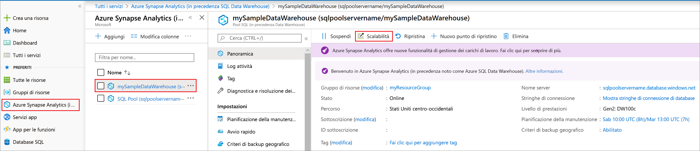
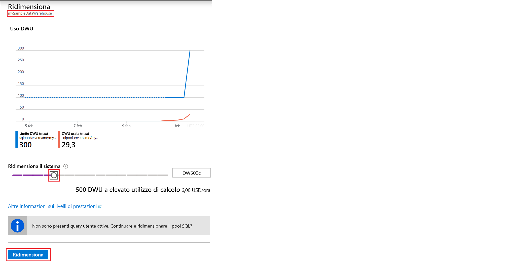

# Guida introduttiva: ridimensionare le risorse di calcolo in Azure SQL Data Warehouse dal portale di Azure

È possibile ridimensionare le risorse di calcolo in Azure SQL Data Warehouse dal portale di Azure, aumentandone il numero per ottenere prestazioni migliori o riducendolo per diminuire i costi. 

Se non si ha una sottoscrizione di Azure, creare un account [gratuito](https://azure.microsoft.com/free/) prima di iniziare.

## Accedere al portale di Azure

Accedere al [portale di Azure](https://portal.azure.com/).

## Prima di iniziare

È possibile ridimensionare un data warehouse di cui già si dispone o fare riferimento a [Guida introduttiva: Creare e connettere - portale](create-data-warehouse-portal.md) per creare un data warehouse denominato **mySampleDataWarehouse**.  In questa Guida introduttiva viene ridimensionato **mySampleDataWarehouse**.

## Ridimensionare le risorse di calcolo

In SQL Data Warehouse è possibile aumentare o ridurre le risorse di calcolo agendo sulle unità Data Warehouse. Nella pagina [Creare e connettere - portale](create-data-warehouse-portal.md) **mySampleDataWarehouse** è stato creato e inizializzato con 400 unità Data Warehouse. La procedura seguente modifica le unità Data Warehouse per **mySampleDataWarehouse**.

Per modificare le unità Data Warehouse:

1. Nella pagina di sinistra del portale di Azure fare clic su **Database SQL**.
2. Selezionare **mySampleDataWarehouse** nella pagina **Database SQL**. Verrà aperto il data warehouse.
3. Fare clic su **Scale**.

    

2. Nel pannello Ridimensiona spostare il dispositivo di scorrimento a sinistra o a destra per modificare l'impostazione delle unità Data Warehouse.

    

3. Fare clic su **Save**. Viene visualizzato un messaggio di conferma. Fare clic su **Sì** per confermare o su **No** per annullare.

    

## Passaggi successivi
Si è appreso come ridimensionare le risorse di calcolo per il data warehouse. Per altre informazioni su Azure SQL Data Warehouse, continuare con l'esercitazione per il caricamento dei dati.

> [!div class="nextstepaction"]
>[Caricare i dati in SQL Data Warehouse](load-data-from-azure-blob-storage-using-polybase.md)
