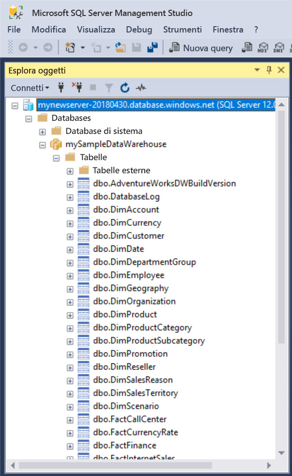
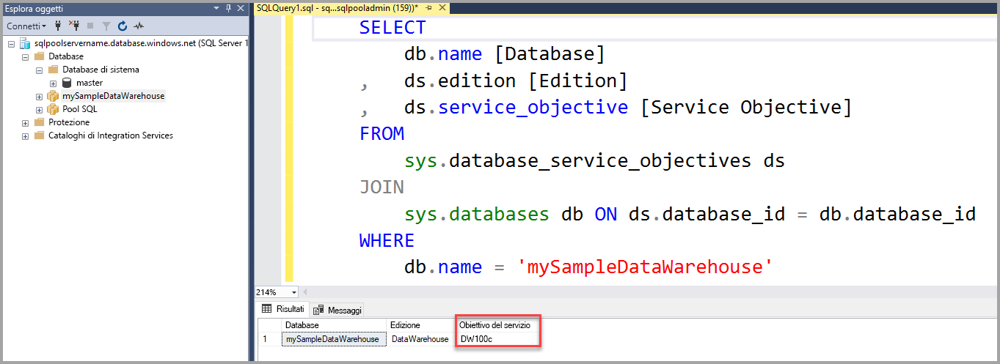

# <a name="quickstart-scale-compute-in-azure-sql-data-warehouse-using-t-sql"></a>Guida introduttiva: ridimensionare le risorse di calcolo in Azure SQL Data Warehouse tramite T-SQL

È possibile ridimensionare le risorse di calcolo in Azure SQL Data Warehouse tramite T-SQL e SQL Server Management Studio (SSMS), aumentandone il numero per ottenere prestazioni migliori o riducendolo per diminuire i costi. 

Se non si ha una sottoscrizione di Azure, creare un account [gratuito](https://azure.microsoft.com/free/) prima di iniziare.

## <a name="before-you-begin"></a>Prima di iniziare

Scaricare e installare la versione più recente di [SQL Server Management Studio](/sql/ssms/download-sql-server-management-studio-ssms.md) (SSMS).

Si presuppone che sia stata completata la [Guida introduttiva: Creare e connettere - portale](create-data-warehouse-portal.md). Dopo avere completato la guida introduttiva Creare e connettere si sarà appreso come creare un data warehouse denominato **mySampleDataWarehouse**, creare una regola del firewall che consenta al client di accedere al server e installarlo.
 
## <a name="create-a-data-warehouse"></a>Creare un data warehouse

Fare riferimento a [Guida introduttiva: Creare e connettere - portale](create-data-warehouse-portal.md) per creare un data warehouse denominato **mySampleDataWarehouse**. Completare la guida introduttiva per verificare di disporre di una regola del firewall e di essere in grado di connettersi al data warehouse da SQL Server Management Studio.

## <a name="connect-to-the-server-as-server-admin"></a>Connettersi al server come amministratore del server

In questa sezione si usa [SQL Server Management Studio](/sql/ssms/download-sql-server-management-studio-ssms.md) (SSMS) per stabilire una connessione al server SQL di Azure.

1. Aprire SQL Server Management Studio.

2. Nella finestra di dialogo **Connetti al server** immettere le informazioni seguenti:

   | Impostazione       | Valore consigliato | DESCRIZIONE | 
   | ------------ | ------------------ | ------------------------------------------------- | 
   | Tipo di server | Motore di database | Questo valore è obbligatorio |
   | Nome server | Nome completo del server | Ecco un esempio: **mynewserver-20171113.database.windows.net**. |
   | Authentication | Autenticazione di SQL Server | L'autenticazione SQL è il solo tipo di autenticazione configurato in questa esercitazione. |
   | Login | Account amministratore del server | Si tratta dell'account specificato quando è stato creato il server. |
   | Password | Password per l'account amministratore del server | Si tratta della password specificata quando è stato creato il server. |

    

4. Fare clic su **Connetti**. La finestra Esplora oggetti viene visualizzata in SSMS. 

5. In Esplora oggetti espandere **Database**. Espandere quindi **mySampleDatabase** per visualizzare gli oggetti nel nuovo database.

     

## <a name="view-service-objective"></a>Visualizzare l'obiettivo di servizio
L'impostazione relativa all'obiettivo di servizio contiene il numero di unità Data Warehouse per il data warehouse. 

Per visualizzare le unità Data Warehouse correnti per il data warehouse:

1. Nella connessione a **mynewserver-20171113.database.windows.net** espandere **Database di sistema**.
2. Fare clic con il pulsante destro del mouse su **Master** e selezionare **Nuova query**. Verrà visualizzata una nuova finestra di query.
3. Eseguire la query seguente per effettuare una selezione nella vista a gestione dinamica sys.database_service_objectives. 

    ```sql
    SELECT
        db.name [Database]
    ,   ds.edition [Edition]
    ,   ds.service_objective [Service Objective]
    FROM
        sys.database_service_objectives ds
    JOIN
        sys.databases db ON ds.database_id = db.database_id
    WHERE 
        db.name = 'mySampleDataWarehouse'
    ```

4. I risultati seguenti mostrano che **mySampleDataWarehouse** ha un obiettivo di servizio di DW400. 

    


## <a name="scale-compute"></a>Ridimensionare le risorse di calcolo
In SQL Data Warehouse è possibile aumentare o ridurre le risorse di calcolo agendo sulle unità Data Warehouse. Nella pagina [Creare e connettere - portale](create-data-warehouse-portal.md) **mySampleDataWarehouse** è stato creato e inizializzato con 400 unità Data Warehouse. La procedura seguente modifica le unità Data Warehouse per **mySampleDataWarehouse**.

Per modificare le unità Data Warehouse:

1. Fare clic con il pulsante destro del mouse su **Master** e selezionare **Nuova query**.
2. Usare l'istruzione T-SQL [ALTER DATABASE](/sql/t-sql/statements/alter-database-azure-sql-database) per modificare l'obiettivo di servizio. Eseguire la query seguente per modificare l'obiettivo di servizio impostandolo su DW300. 

```Sql
ALTER DATABASE mySampleDataWarehouse
MODIFY (SERVICE_OBJECTIVE = 'DW300')
;
```

## <a name="check-database-state"></a>Controllare lo stato del database

Per controllare lo stato del database, eseguire la query seguente nel database **master**.

```sql
SELECT name AS "Database Name", state_desc AS "Status" 
FROM sys.databases db
WHERE db.name = 'mySampleDataWarehouse'
;
```

Quando si esegue questo comando, è possibile ricevere un valore di stato Online, In pausa, Ripresa, Ridimensionamento o Sospeso.

## <a name="check-operation-status"></a>Controllare lo stato dell'operazione

Per restituire informazioni sulle varie operazioni di gestione in SQL Data Warehouse, eseguire la query seguente nella DMV [sys.dm_operation_status](/sql/relational-databases/system-dynamic-management-views/sys-dm-operation-status-azure-sql-database). Ad esempio, restituisce l'operazione e lo stato dell'operazione, che sarà IN_PROGRESS o COMPLETED.

```sql
SELECT *
FROM
    sys.dm_operation_status
WHERE
    resource_type_desc = 'Database'
AND 
    major_resource_id = 'MySQLDW'
```


## <a name="next-steps"></a>Passaggi successivi
Si è appreso come ridimensionare le risorse di calcolo per il data warehouse. Per altre informazioni su Azure SQL Data Warehouse, continuare con l'esercitazione per il caricamento dei dati.

> [!div class="nextstepaction"]
>[Caricare i dati in SQL Data Warehouse](load-data-from-azure-blob-storage-using-polybase.md)
