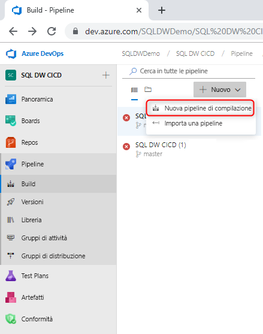
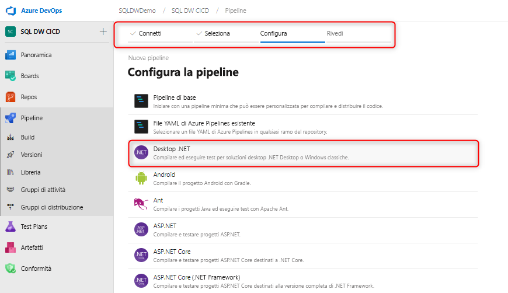
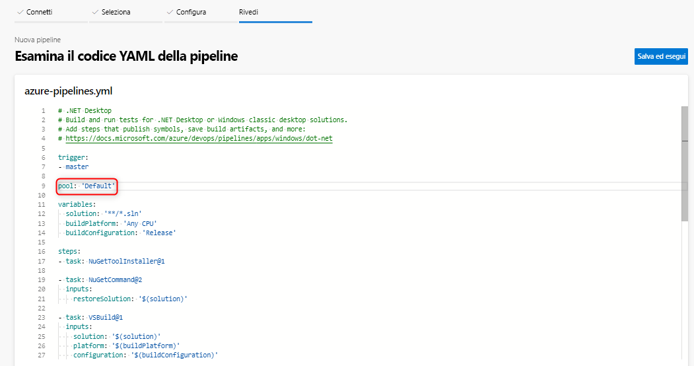
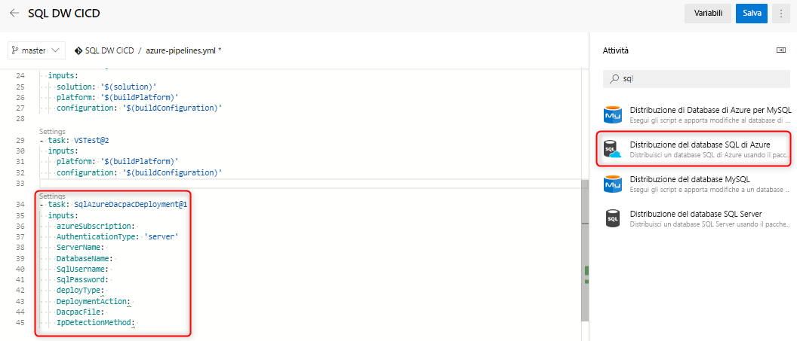

# Integrazione e distribuzione continue per Azure SQL Data Warehouse

Questa semplice esercitazione illustra come integrare il progetto di database di SQL Server Data Tools (SSDT) con Azure DevOps e sfruttare Azure Pipelines per configurare l'integrazione e la distribuzione continue. Si tratta del secondo passaggio per la creazione della pipeline di integrazione e distribuzione continua con SQL Data Warehouse. 

## Prima di iniziare

- Completare l'[esercitazione sull'integrazione del controllo del codice sorgente](https://docs.microsoft.com/azure/sql-data-warehouse/sql-data-warehouse-source-control-integration)

- Creare un [agente self-hosted](https://docs.microsoft.com/azure/devops/pipelines/agents/agents?view=azure-devops#install) con i bit di anteprima di SSDT (16.3 anteprima 2 e versioni successive) installati per SQL Data Warehouse (anteprima)

- Configurare Azure DevOps e connettersi

  > [!NOTE]
  > SSDT è attualmente disponibile in anteprima ed è necessario usare un agente self-hosted. Gli agenti ospitati da Microsoft verranno aggiornati nei prossimi mesi.

## Integrazione continua con compilazione di Visual Studio

1. Passare ad Azure Pipelines e creare una nuova pipeline di compilazione

      

2. Selezionare il repository del codice sorgente (Git Azure Repos) e selezionare il modello di app desktop .NET

       

3. Modificare il file YAML per usare il pool appropriato dell'agente. Il file YAML sarà simile al seguente:

      

A questo punto, si avrà un ambiente semplice in cui qualsiasi archiviazione nel ramo master del repository del controllo del codice sorgente dovrebbe attivare automaticamente una compilazione di Visual Studio corretta del progetto di database. Verificare se l'automazione funziona end-to-end apportando una modifica nel progetto di database locale e archiviandola nel ramo master.

## Distribuzione continua con l'attività di distribuzione del database SQL di Azure

1. Aggiungere una nuova attività usando l'[attività di distribuzione del database SQL di Azure](https://docs.microsoft.com/azure/devops/pipelines/tasks/deploy/sql-azure-dacpac-deployment?view=azure-devops) e compilare i campi obbligatori per connettersi al data warehouse di destinazione. Quando questa attività viene eseguita, il pacchetto di applicazione livello dati generato dal processo di compilazione precedente viene distribuito nel data warehouse di destinazione.

      

2. Quando si usa un agente self-hosted, assicurarsi di impostare la variabile di ambiente per l'uso del file SqlPackage.exe corretto per SQL Data Warehouse. Il percorso dovrà essere simile a questo:

      

   C:\Programmi (x86)\Microsoft Visual Studio\2019\Preview\Common7\IDE\Extensions\Microsoft\SQLDB\DAC\150  

   Eseguire e convalidare la pipeline. È possibile apportare modifiche localmente e archiviarle nel controllo del codice sorgente per generare una compilazione e una distribuzione automatiche.

## Passaggi successivi

- Esplorare l'[architettura di Azure SQL Data Warehouse](/azure/sql-data-warehouse/massively-parallel-processing-mpp-architecture)
- [Creare rapidamente un'istanza di SQL Data Warehouse][create a SQL Data Warehouse]
- [Caricare dati di esempio][load sample data].
- Esplorare i [video](/azure/sql-data-warehouse/sql-data-warehouse-videos)

<!--Image references-->

[1]: ./media/sql-data-warehouse-overview-what-is/dwarchitecture.png

<!--Article references-->
[Create a support ticket]: ./sql-data-warehouse-get-started-create-support-ticket.md
[load sample data]: ./sql-data-warehouse-load-sample-databases.md
[create a SQL Data Warehouse]: ./sql-data-warehouse-get-started-provision.md
[Migration documentation]: ./sql-data-warehouse-overview-migrate.md
[SQL Data Warehouse solution partners]: ./sql-data-warehouse-partner-business-intelligence.md
[Integrated tools overview]: ./sql-data-warehouse-overview-integrate.md
[Backup and restore overview]: ./sql-data-warehouse-restore-database-overview.md
[Azure glossary]: ../azure-glossary-cloud-terminology.md

<!--MSDN references-->

<!--Other Web references-->
[Blogs]: https://azure.microsoft.com/blog/tag/azure-sql-data-warehouse/
[Customer Advisory Team blogs]: https://blogs.msdn.microsoft.com/sqlcat/tag/sql-dw/
[Feature requests]: https://feedback.azure.com/forums/307516-sql-data-warehouse
[MSDN forum]: https://social.msdn.microsoft.com/Forums/azure/home?forum=AzureSQLDataWarehouse
[Stack Overflow forum]: https://stackoverflow.com/questions/tagged/azure-sqldw
[Twitter]: https://twitter.com/hashtag/SQLDW
[Videos]: https://azure.microsoft.com/documentation/videos/index/?services=sql-data-warehouse
[SLA for SQL Data Warehouse]: https://azure.microsoft.com/support/legal/sla/sql-data-warehouse/v1_0/
[Volume Licensing]: https://www.microsoftvolumelicensing.com/DocumentSearch.aspx?Mode=3&DocumentTypeId=37
[Service Level Agreements]: https://azure.microsoft.com/support/legal/sla/
