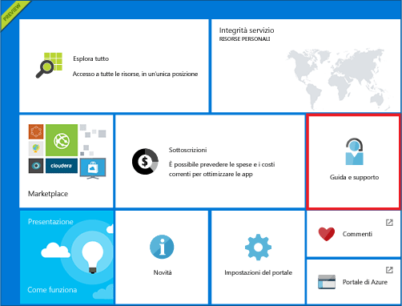
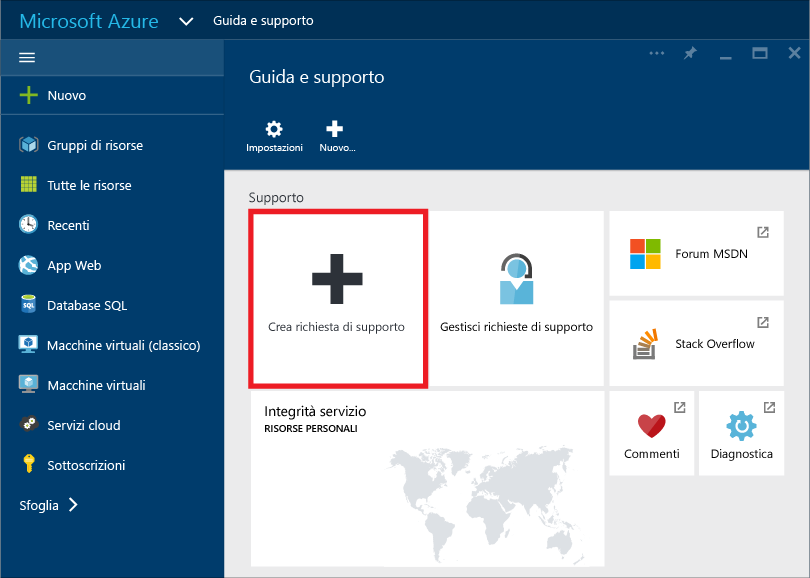
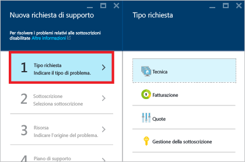
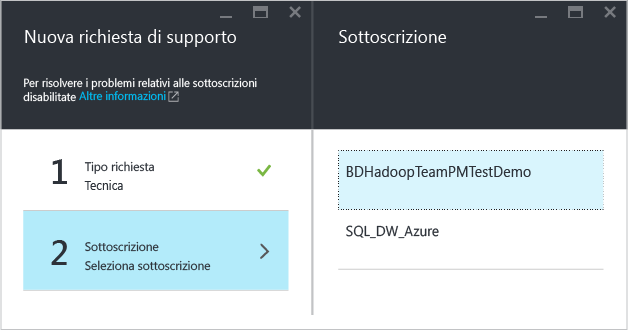
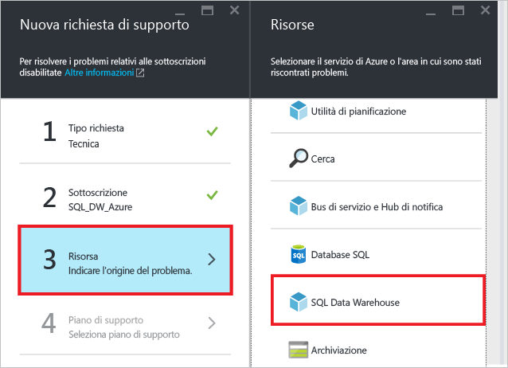
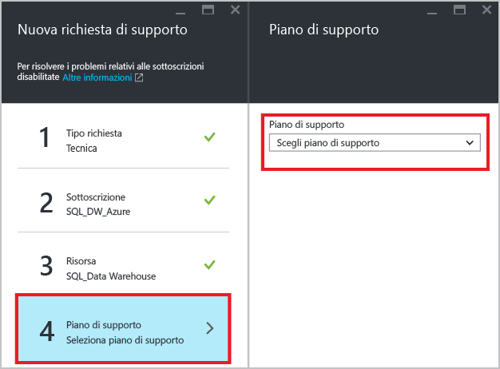
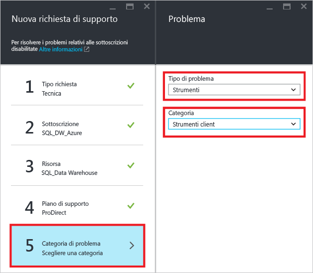
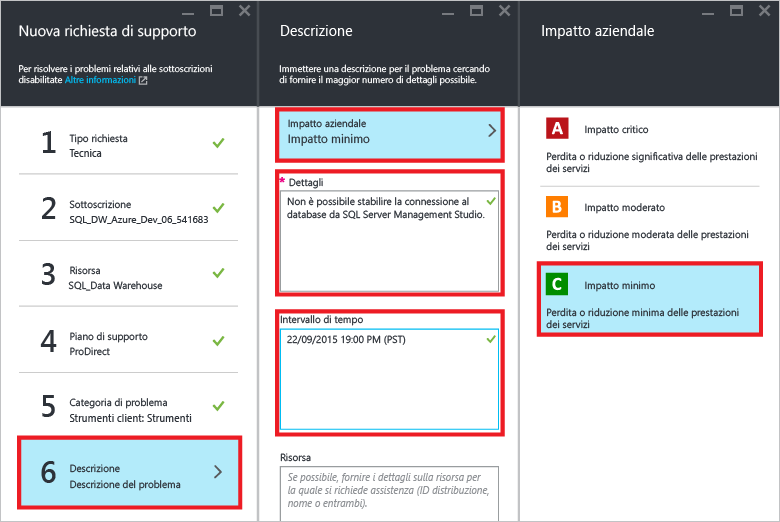
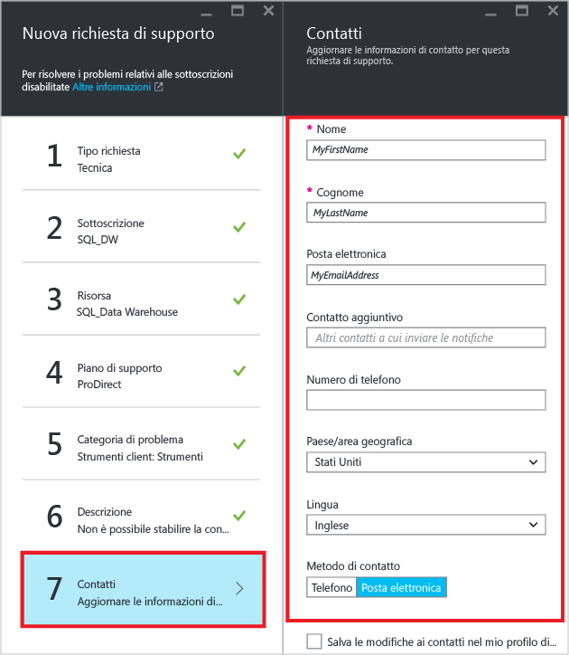
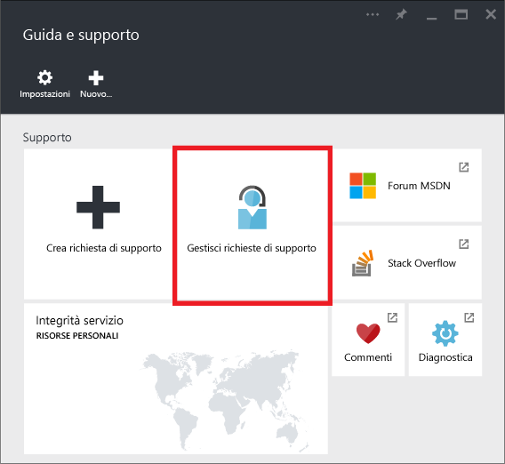

# Come creare un ticket di supporto per SQL Data Warehouse
In caso di problemi con SQL Data Warehouse, creare un ticket di supporto per ottenere assistenza dal team tecnico.

> [!NOTE] 
> In data 20/12/2016, il controllo dell'integrità delle risorse nel portale di Azure non è accurato. Microsoft sta lavorando attivamente per risolvere il problema. 

## Creare un ticket di supporto
1. Aprire il [portale di Azure][Azure portal].
2. Nella schermata iniziale fare clic sul riquadro **Guida e supporto tecnico** .
   
    
3. Nel pannello Guida e supporto tecnico fare clic su **Crea un ticket di supporto**.
   
    
   
     
4. Selezionare il **tipo di richiesta**.
   
    
   
   > [!NOTE]
   > Per impostazione predefinita, ogni server SQL, ad esempio myserver.database.windows.net, ha una **Quota DTU** pari a 45.000. Questa quota è semplicemente un limite di sicurezza. È possibile aumentare la quota creando un ticket di supporto e selezionando *Quota* come tipo di richiesta. Per calcolare le esigenze in termini di DTU, moltiplicare le [DWU][DWU] totali necessarie per 7,5. Se, ad esempio, si vogliono ospitare due DW6000 in una istanza di SQL Server, è necessario richiedere una quota di DTU pari a 90.000.  È possibile visualizzare l'utilizzo di DTU attuale nel pannello SQL Server del portale. I database in pausa e non in pausa vengono conteggiati nella quota di DTU. 
   > 
   > 
5. Selezionare la **sottoscrizione** che ospita il database con il problema segnalato.
   
    
6. Selezionare **SQL Data Warehouse** come risorsa.
   
    
7. Selezionare il proprio [piano di supporto di Azure][Azure support plan].
   
   * **fatturazione, quota e gestione delle sottoscrizioni** è disponibile per tutti i livelli.
   * Il supporto **in garanzia** viene fornito tramite il supporto tecnico [Developer][Developer], [Standard][Standard], [Professional Direct][Professional Direct] o [Premier][Premier]. I problemi in garanzia si verificano quando i clienti usano Azure ed è ragionevolmente probabile che il problema sia provocato da Microsoft.
   * Servizi di **consulenza** e **mentoring per sviluppatori** sono disponibili solo per i livelli di supporto tecnico [Professional Direct][Professional Direct] e [Premier][Premier]. 
     
     Se si ha un piano di supporto tecnico Premier, è anche possibile segnalare problemi relativi a SQL Data Warehouse nel [portale Microsoft Premier online][Microsoft Premier online portal].  Per altre informazioni sui vari piani di supporto, ad esempio su ambito, tempi di risposta, prezzi e così via, vedere la pagina relativa ai [piani di supporto di Azure][Azure support plan].  Per domande frequenti sul supporto di Azure, vedere [Domande frequenti sul supporto di Azure][Azure support FAQs].  
     
     
8. Selezionare **Tipo di problema** e **Categoria**. In questo esempio è stato scelto "Strumenti" come tipo di problema e "Strumenti client" come categoria. 
   
    
9. Descrivere il problema e scegliere il livello di impatto aziendale.
   
    
10. Le **informazioni di contatto** per il ticket di supporto saranno precompilate. Aggiornare le informazioni, se necessario.
    
    
11. Fare clic su **Crea** per inviare la richiesta di supporto.

## Monitorare un ticket di supporto
Dopo avere inviato la richiesta di supporto, si verrà contattati dal team di supporto di Azure. Per controllare i dettagli e lo stato della richiesta, fare clic su **Gestisci richieste di supporto** nel dashboard.

## Altre risorse
È anche possibile connettersi alla community di SQL Data Warehouse in [Stack Overflow][Stack Overflow] o nel [forum MSDN su Azure SQL Data Warehouse][Azure SQL Data Warehouse MSDN forum].

<!--Image references--> 

<!--Article references--> 
[DWU]: ./sql-data-warehouse-overview-what-is.md

<!--MSDN references--> 

<!--Other web references--> 
[Azure portal]: https://portal.azure.com/
[Azure support plan]: https://azure.microsoft.com/support/plans/?WT.mc_id=Support_Plan_510979/  
[Developer]: https://azure.microsoft.com/support/plans/developer/  
[Standard]: https://azure.microsoft.com/support/plans/standard/  
[Professional Direct]: https://azure.microsoft.com/support/plans/prodirect/  
[Premier]: https://azure.microsoft.com/support/plans/premier/  
[Azure support FAQs]: https://azure.microsoft.com/support/faq/
[Microsoft Premier online portal]: https://premier.microsoft.com/
[Stack Overflow]: https://stackoverflow.com/questions/tagged/azure-sqldw/
[Azure SQL Data Warehouse MSDN forum]: https://social.msdn.microsoft.com/Forums/home?forum=AzureSQLDataWarehouse/

