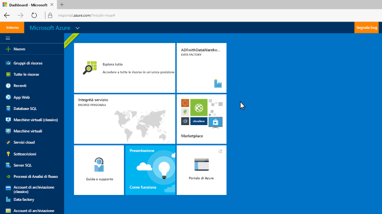
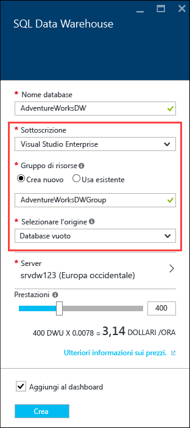
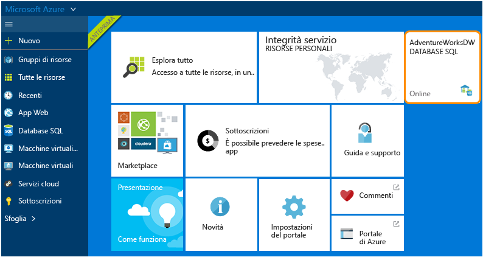

# Creare un Azure SQL Data Warehouse
> [!div class="op_single_selector"]
> * [portale di Azure](sql-data-warehouse-get-started-provision.md)
> * [TSQL](sql-data-warehouse-get-started-create-database-tsql.md)
> * [PowerShell](sql-data-warehouse-get-started-provision-powershell.md)
>
>

In questa esercitazione si usa il portale di Azure per creare un'istanza di SQL Data Warehouse contenente un database di esempio AdventureWorksDW.

## Prerequisiti
Per iniziare, è necessario:

* **Account Azure**: per creare un account, vedere la [versione di valutazione gratuita][Azure Free Trial] o [MSDN Azure Credits][MSDN Azure Credits] (Crediti Azure MSDN).
* **Server SQL di Azure**: per altre informazioni dettagliate, vedere [Create an Azure SQL database with the Azure portal][Create an Azure SQL database in the Azure portal] (Creare un database SQL di Azure con il portale di Azure).

> [!NOTE]
> La creazione di un'istanza di SQL Data Warehouse può avere come risultato un nuovo servizio fatturabile.  Per altri dettagli, vedere la pagina relativa ai [prezzi di SQL Data Warehouse][SQL Data Warehouse pricing].
>
>

## Creare un SQL Data Warehouse
1. Accedere al [portale di Azure](https://portal.azure.com).
2. Fare clic su **+ Nuovo** > **Database** > **SQL Data Warehouse**.

    
3. Nel pannello **SQL Data Warehouse** specificare le informazioni necessarie, quindi fare clic su 'Crea'.

    

   * **Server**: è consigliabile selezionare prima di tutto il server.  
   * **Nome database**: nome che verrà usato per fare riferimento a SQL Data Warehouse.  Il nome deve essere univoco per il server.
   * **Prestazioni**: è consigliabile iniziare con 400 [DWU][DWU]. È possibile spostare il dispositivo di scorrimento a sinistra o a destra per regolare le prestazioni del data warehouse oppure aumentare o ridurre le prestazioni dopo la creazione.  Per altre informazioni sulle DWU, vedere la documentazione sul [ridimensionamento](sql-data-warehouse-manage-compute-overview.md) o la [pagina relativa ai prezzi][SQL Data Warehouse pricing].
   * **Sottoscrizione**: selezionare la [sottoscrizione] per la fatturazione di questa istanza di SQL Data Warehouse.
   * **Gruppo di risorse**: i [gruppi di risorse][Resource group] sono contenitori progettati per semplificare la gestione di una raccolta di risorse di Azure. Altre informazioni sui [gruppi di risorse](../azure-resource-manager/resource-group-overview.md).
   * **Selezionare l'origine**: fare clic su **Selezionare l'origine** > **Esempio**. Azure inserisce automaticamente AdventureWorksDW per l'opzione **Selezionare l'esempio selezionare** .

   > [!NOTE]
   > Le regole di confronto predefinite per un'istanza di SQL Data Warehouse sono SQL_Latin1_General_CP1_CI_AS. Se sono necessarie regole di confronto diverse, è possibile usare [T-SQL][T-SQL] per creare il database con altre regole di confronto.
   >
   >

1. Fare clic su **Crea** per creare l'istanza di SQL Data Warehouse.
2. Attendere alcuni minuti. Quando il data warehouse è pronto, verrà visualizzato di nuovo il [portale di Azure](https://portal.azure.com). SQL Data Warehouse è disponibile nel dashboard, elencato tra i database SQL o nel gruppo di risorse usato per crearlo.

    

[!INCLUDE [SQL Database create server](../../includes/sql-database-create-new-server-firewall-portal.md)]

## Passaggi successivi
Dopo aver creato un'istanza di SQL Data Warehouse è possibile [connettersi](sql-data-warehouse-connect-overview.md) e iniziare a eseguire query.

Per una panoramica del caricamento, vedere [Caricare i dati in SQL Data Warehouse](sql-data-warehouse-overview-load.md).

Se si sta cercando di eseguire la migrazione di un database esistente a SQL Data Warehouse, vedere la [panoramica della migrazione](sql-data-warehouse-overview-migrate.md) o usare l'[utilità di migrazione](sql-data-warehouse-migrate-migration-utility.md).

Le regole firewall possono anche essere configurate con Transact-SQL. Per altre informazioni, vedere [sp_set_firewall_rule][sp_set_firewall_rule] e [sp_set_database_firewall_rule][sp_set_database_firewall_rule].

È anche opportuno vedere le [procedure consigliate][Best practices].

<!--Article references-->
[Create an Azure SQL database in the Azure portal]: ../sql-database/sql-database-get-started.md
[Create an Azure SQL database with PowerShell]: ../sql-database/sql-database-create-and-configure-database-powershell
[resource groups]: ../azure-resource-manager/resource-group-template-deploy-portal.md
[Best practices]: sql-data-warehouse-best-practices.md
[DWU]: sql-data-warehouse-overview-what-is.md
[sottoscrizione]: ../azure-glossary-cloud-terminology.md#subscription
[resource group]: ../azure-glossary-cloud-terminology.md#resource-group
[T-SQL]: ./sql-data-warehouse-get-started-create-database-tsql.md

<!--MSDN references-->
[sp_set_firewall_rule]: https://msdn.microsoft.com/library/dn270017.aspx
[sp_set_database_firewall_rule]: https://msdn.microsoft.com/library/dn270010.aspx

<!--Other Web references-->
[SQL Data Warehouse pricing]: https://azure.microsoft.com/pricing/details/sql-data-warehouse/
[Azure Free Trial]: https://azure.microsoft.com/pricing/free-trial/?WT.mc_id=A261C142F
[MSDN Azure Credits]: https://azure.microsoft.com/pricing/member-offers/msdn-benefits-details/?WT.mc_id=A261C142F
