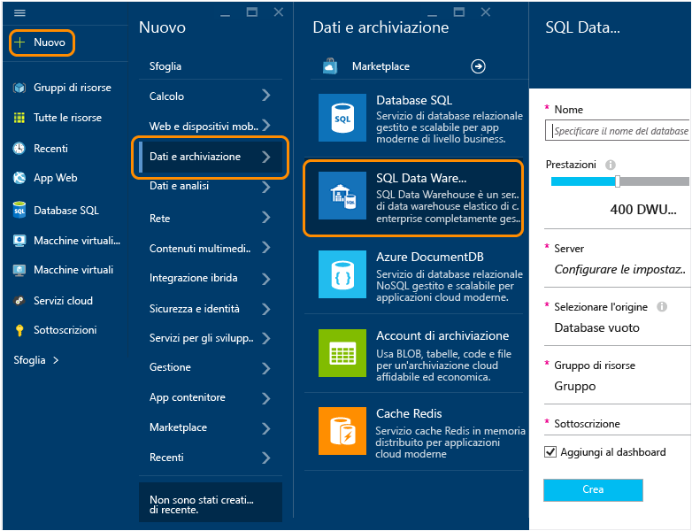
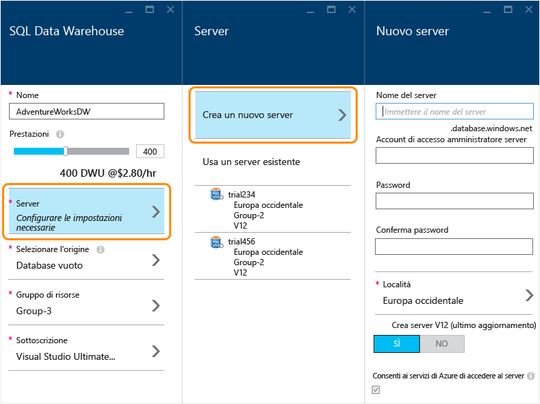
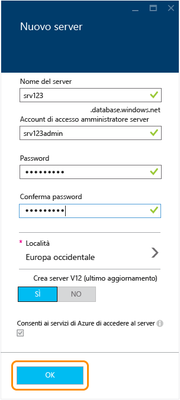
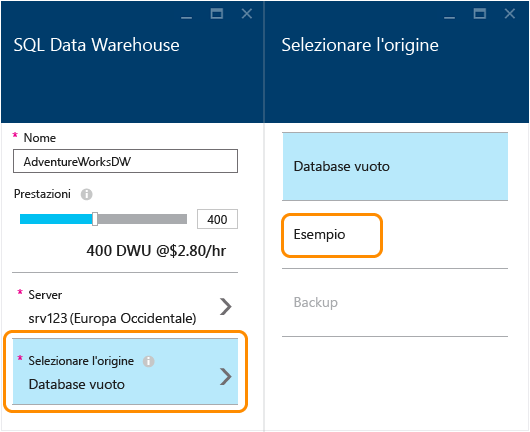
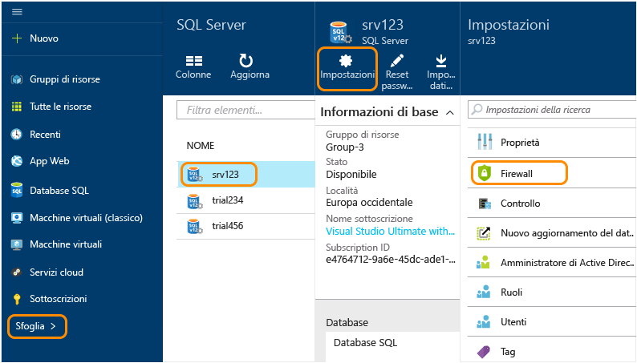
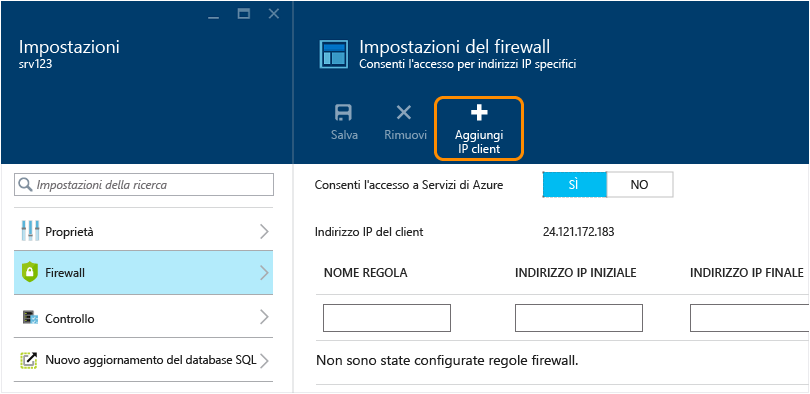

<properties
	pageTitle="Creare un database di SQL Data Warehouse nel portale di anteprima di Azure | Microsoft Azure"
	description="Informazioni su come creare un database di SQL Data Warehouse nel portale di anteprima di Azure"
	services="sql-data-warehouse"
	documentationCenter="NA"
	authors="barbkess"
	manager="jhubbard"
	editor=""
	tags="azure-sql-data-warehouse"/>
<tags
   ms.service="sql-data-warehouse"
   ms.devlang="NA"
   ms.topic="get-started-article"
   ms.tgt_pltfrm="NA"
   ms.workload="data-services"
   ms.date="10/08/2015"
   ms.author="lodipalm;barbkess"/>

# Creare un database di SQL Data Warehouse usando il portale di anteprima di Azure#

> [AZURE.SELECTOR]
- [Azure preview portal](sql-data-warehouse-get-started-provision.md)
- [TSQL](sql-data-warehouse-get-started-create-database-tsql.md)
- [PowerShell](sql-data-warehouse-get-started-provision-powershell.md)

Questa esercitazione mostra come creare un database di SQL Data Warehouse di Azure in pochi minuti usando il portale di anteprima di Azure.

In questa esercitazione si apprenderà come:

- Creare un server per ospitare il database.
- Creare un database contenente il database di esempio AdventureWorksDW.

[AZURE.INCLUDE [free-trial-note](../../includes/free-trial-note.md)]

## Passaggio 1: Eseguire l'accesso e iniziare

1. Accedere al [portale di anteprima di Azure](https://portal.azure.com).

2. Fare clic su **Nuovo** > **Dati + Archiviazione** > **SQL Data Warehouse**.

	

1. Immettere un nome per il database nel pannello di SQL Data Warehouse. In questo esempio il database verrà denominato AdventureWorksDW.

    

## Passaggio 2: Configurare e creare un server
Nel database SQL e in SQL Data Warehouse ogni database viene assegnato a un server e ogni server viene assegnato a una posizione geografica. Il server è definito server SQL logico.

> [AZURE.NOTE]Un server SQL logico: > > + Fornisce un sistema coerente per configurare più database nella stessa posizione geografica. > + Non è un hardware fisico come avviene invece per i server locali. Fa parte del software del servizio. Ecco perché viene chiamato *server logico*. > + Può ospitare più database senza rallentarne le prestazioni. > + Usa una *s* minuscola per il nome. Il **s**erver SQL è un server logico di Azure, mentre SQL **S**erver è il prodotto per database locali di Microsoft.

1. Fare clic su **Server** > **Crea un nuovo server**. Non è previsto alcun addebito per il server. Se si ha già un server SQL logico versione 12 che si vuole usare, scegliere il server esistente e andare al passaggio successivo. 

    

3. Inserire le informazioni in **Nuovo server**.
    
	- **Nome server**. Immettere un nome per il server logico. Questo nome è univoco per ogni località geografica.
	- **Nome amministratore server**. Immettere un nome utente per l'account amministratore del server.
	- **Password**. Immettere la password dell'amministratore per il server. 
	- **Località**. Scegliere una località geografica per il server. Per ridurre i tempi di trasferimento dei dati, è consigliabile posizionare il server in una località geograficamente vicina alle altre risorse dati a cui accederà il database.
	- **Crea server V12**. SÌ è la sola opzione per SQL Data Warehouse. 
	- **Consenti ai servizi di Azure di accedere al server**. Questa opzione è sempre selezionata per SQL Data Warehouse.

    >[AZURE.NOTE]Assicurarsi di registrare il nome del server, il nome dell'amministratore e la password per conservarli in un luogo sicuro. Queste informazioni saranno necessarie per accedere al server.

1. Fare clic su **OK** per salvare le impostazioni di configurazione del server SQL logico e tornare al pannello di SQL Data Warehouse.

    

## Passaggio 3: Configurare e creare un database
Ora che il server SQL logico è stato selezionato, è possibile completare la creazione del database.
 
2. Nel pannello **SQL Data Warehouse** compilare i campi restanti. 

    
    
    - **Prestazioni**: si consiglia di iniziare con 400 DWU. È possibile spostare il dispositivo di scorrimento a sinistra o a destra per regolare il livello di prestazioni del database, sia ora che dopo la creazione del database. 

        > [AZURE.NOTE]SQL Data Warehouse misura le prestazioni in unità Data Warehouse (DWU, Data Warehouse Unit). Con l'aumento delle unità DWU, SQL Data Warehouse aumenta le risorse di elaborazione disponibili per le operazioni con il database. Mentre si esegue il carico di lavoro, sarà possibile osservare come le unità DWU siano correlate alle prestazioni del carico di lavoro.
        > 
        > È possibile modificare rapidamente e facilmente il livello di prestazioni dopo la creazione del database. Ad esempio, se non si usa il database, spostare il dispositivo di scorrimento verso sinistra per ridurre i costi. Oppure, aumentare le prestazioni quando sono necessarie ulteriori risorse. Per non incorrere in alcun costo, è possibile sospendere il database. Questo è il vantaggio a livello di scalabilità offerto da SQL Data Warehouse.

    - **Seleziona origine**. Fare clic su **Seleziona origine** > **Esempio**. Poiché per ora è disponibile un solo database di esempio, quando si seleziona Esempio, Azure popola automaticamente l'opzione **Selezionare l'esempio** con AdventureWorksDW.
  
        

    - **Gruppo di risorse**. È possibile lasciare i valori predefiniti. I gruppi di risorse sono contenitori progettati per facilitare la gestione di una raccolta di risorse di Azure. Per altre informazioni, vedere la pagina relativa ai [gruppi di risorse](../azure-portal/resource-group-portal.md).
    
    - **Sottoscrizione**. Selezionare la sottoscrizione per la fatturazione del database.

1. Fare clic su **Crea** per creare il database di SQL Data Warehouse.

1. Dopo alcuni minuti il database sarà pronto. Al termine, dovrebbe essere visualizzato di nuovo il [portale di anteprima di Azure](https://portal.azure.com). Notare che il nuovo database di SQL Data Warehouse è stato aggiunto al dashboard.

    

## Passaggio 4: Configurare l'accesso al server attraverso il firewall per l'IP client
Per connettersi al server dall'indirizzo IP corrente, aggiungere l'indirizzo IP client alle regole del firewall. Questo passaggio mostra come procedere.

1. Fare clic su **Sfoglia** > **SQL Server** > Scegliere il server > **Impostazioni** > **Firewall**.

    

4. Fare clic su **Aggiungi IP client** per consentire ad Azure di creare una regola per l'indirizzo IP client specificato. Fare clic su **Save**.

	

1. Creare una regola del firewall con un intervallo di indirizzi IP. È possibile eseguire questa operazione subito o più avanti.

	>[AZURE.IMPORTANT]È possibile che l'indirizzo IP cambi nel tempo. In questo caso, non sarà possibile accedere al server fino a quando non viene creata una nuova regola firewall. Per assicurare un accesso coerente, è consigliabile aggiungere un intervallo di indirizzi IP. Per altre informazioni, vedere [Come configurare le impostazioni del firewall](../sql-database/sql-database-configure-firewall-settings.md).

    Per creare una regola, immettere un nome e l'intervallo di indirizzi IP e fare clic su **Salva**.

    

Dopo aver configurato il firewall, si potranno stabilire connessioni dal desktop al database di Azure SQL Data Warehouse appena creato.

## Passaggi successivi

Dopo avere creato un database di esempio per SQL Data Warehouse, è possibile scoprire come usare SQL Data Warehouse in [Connettersi ed effettuare una query](./sql-data-warehouse-get-started-connect-query.md).

<!---HONumber=Oct15_HO3-->