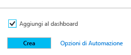
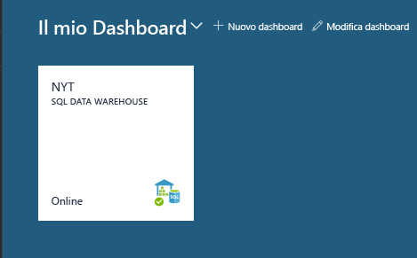
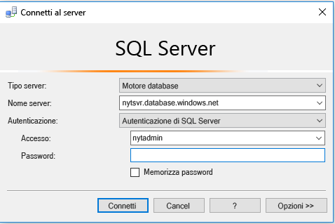
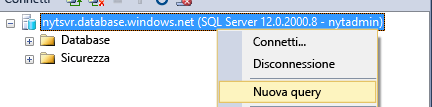
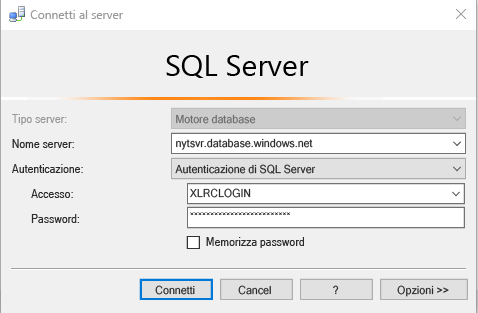
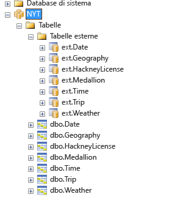
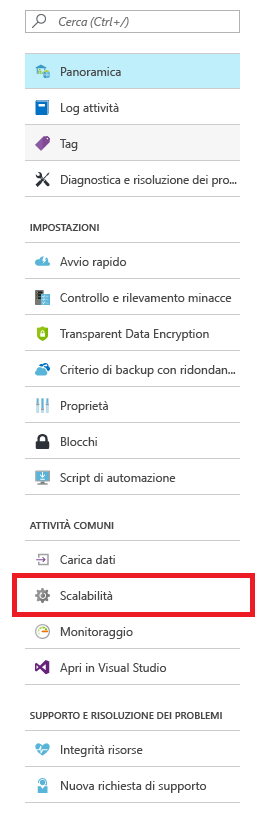
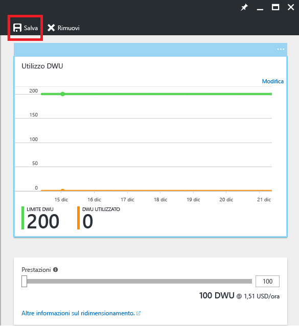

# Introduzione a SQL Data Warehouse
<a id="get-started-with-sql-data-warehouse" class="xliff"></a>

Questa esercitazione mostra come effettuare il provisioning e caricare i dati in Azure SQL Data Warehouse. Verranno illustrati anche i concetti di base relativi a scalabilità, sospensione e ottimizzazione. Al termine, sarà possibile eseguire query ed esplorare il data warehouse.

**Tempo previsto per il completamento:** per il completamento di questa esercitazione end-to-end con codice di esempio sono necessari circa 30 minuti, dopo avere soddisfatto i prerequisiti. 

## Prerequisiti
<a id="prerequisites" class="xliff"></a>

Questa esercitazione presuppone una familiarità con i concetti di base di SQL Data Warehouse. Se sono necessarie informazioni introduttive, vedere [Informazioni su Azure SQL Data Warehouse](sql-data-warehouse-overview-what-is.md) 

### Iscrizione a Microsoft Azure
<a id="sign-up-for-microsoft-azure" class="xliff"></a>
Se non si ha ancora un account Microsoft Azure, crearne uno per usare questo servizio. Se si ha già un account, è possibile ignorare questo passaggio. 

1. Passare alle pagine dell'account [https://azure.microsoft.com/account/](https://azure.microsoft.com/account/)
2. Creare un account Azure gratuito o acquistare un account.
3. Seguire le istruzioni

### Installare i driver del client SQL e gli strumenti appropriati
<a id="install-appropriate-sql-client-drivers-and-tools" class="xliff"></a>

La maggior parte degli strumenti del client SQL può connettersi a SQL Data Warehouse usando JDBC, ODBC o ADO.NET. A causa del numero elevato di funzionalità di T-SQL supportate da SQL Data Warehouse, alcune applicazioni client non sono completamente compatibili con SQL Data Warehouse.

Se si esegue un sistema operativo Windows, è consigliabile usare [Visual Studio] o [SQL Server Management Studio].

[!INCLUDE [Create a new logical server](../../includes/sql-data-warehouse-create-logical-server.md)] 

[!INCLUDE [SQL Database create server](../../includes/sql-database-create-new-server-firewall-portal.md)]

## Creare un SQL Data Warehouse
<a id="create-a-sql-data-warehouse" class="xliff"></a>

SQL Data Warehouse è un tipo di database speciale, progettato per l'elaborazione parallela massiva (MPP, Massively Parallel Processing). Il database viene distribuito in più nodi ed elabora le query in parallelo. SQL Data Warehouse ha un nodo di controllo che orchestra le attività di tutti i nodi. I nodi stessi usano il database SQL per gestire i dati.  

> [!NOTE]
> La creazione di un'istanza di SQL Data Warehouse può avere come risultato un nuovo servizio fatturabile.  Per altre informazioni, vedere [SQL Data Warehouse Prezzi](https://azure.microsoft.com/pricing/details/sql-data-warehouse/).
>

### Creare un data warehouse
<a id="create-a-data-warehouse" class="xliff"></a>

1. Accedere al [portale di Azure](https://portal.azure.com).
2. Fare clic su **Nuovo** > **Database** > **SQL Data Warehouse**.

    
    

3. Compilare i dettagli della distribuzione

    **Nome database**: scegliere un nome qualsiasi. Se sono disponibili più data warehouse, è consigliabile che i nomi includano dettagli quali l'area o l'ambiente, ad esempio *mydw-westus-1-test*.

    **Sottoscrizione**: sottoscrizione di Azure.

    **Gruppo di risorse**: creare un gruppo di risorse o selezionarne uno esistente.
    > [!NOTE]
    > I gruppi di risorse sono utili per l'amministrazione delle risorse, ad esempio per la definizione dell'ambito del controllo di accesso e per la distribuzione basata su modelli. Per altre informazioni sui gruppi di risorse di Azure e sulle procedure consigliate, vedere [qui](https://docs.microsoft.com/azure/azure-resource-manager/resource-group-overview#resource-groups)

    **Origine**: database vuoto.

    **Server**: selezionare il server creato in [Prerequisiti].

    **Regole di confronto**: lasciare le regole di confronto predefinite SQL_Latin1_General_CP1_CI_AS.

    **Selezione delle prestazioni**: è consigliabile mantenere il valore standard di 400 DWU.

4. Scegliere **Aggiungi al dashboard**
    .

5. Attendere il completamento della distribuzione del data warehouse. Il processo richiede normalmente qualche minuto. Il portale invia una notifica che indica quando il data warehouse è pronto per l'uso. 

## Connettersi a SQL Data Warehouse
<a id="connect-to-sql-data-warehouse" class="xliff"></a>

Questa esercitazione usa SQL Server Management Studio (SSMS) per la connessione al data warehouse. È possibile connettersi a SQL Data Warehouse tramite questi connettori supportati: ADO.NET, JDBC, ODBC e PHP. È possibile che le funzionalità siano limitate per gli strumenti non supportati da Microsoft.


### Ottenere informazioni di connessione
<a id="get-connection-information" class="xliff"></a>

Per connettersi al data warehouse, è necessario usare il server logico di SQL Server creato in [Prerequisiti].

1. Selezionare il data warehouse dal dashboard o cercarlo nelle risorse.

    

2. Trovare il nome completo del server logico di SQL Server.

    

3. Aprire SSMS e usare Esplora oggetti per connettersi a questo server usando le credenziali amministrative del server create in [Prerequisiti].

    

Se non si verificano errori, si dovrebbe essere connessi al server logico di SQL Server. Poiché l'accesso è stato eseguito come amministratore del server, è possibile connettersi a qualsiasi database ospitato dal server, incluso il database master. 

È presente solo un account di amministratore del server, a cui è assegnata una quantità di privilegi superiore rispetto agli altri utenti. Occorre evitare di comunicare la password dell'amministratore a un numero eccessivo di utenti dell'organizzazione. 

È anche possibile usare un account di amministratore di Azure Active Directory. Questo articolo non include dettagli specifici. Per altre informazioni sull'uso dell'autenticazione di Azure Active Directory, vedere [Autenticazione di Azure AD](https://docs.microsoft.com/azure/sql-database/sql-database-aad-authentication).

Verrà ora illustrata la creazione di altri account di accesso e utenti.


## Creare un utente database
<a id="create-a-database-user" class="xliff"></a>

In questo passaggio viene creato un account utente per accedere al data warehouse. Viene illustrato anche come consentire all'utente di eseguire query con una quantità elevata di memoria e di risorse della CPU.

### Note sulle classi di risorse per l'allocazione di risorse alle query
<a id="notes-about-resource-classes-for-allocating-resources-to-queries" class="xliff"></a>

- Per proteggere i dati, non usare l'amministratore del server per eseguire query nei database di produzione. Questo account ha una quantità di privilegi superiore rispetto agli altri utenti e usarlo per eseguire operazioni sui dati utente comporta rischi per i dati. Poiché l'amministratore del server deve eseguire operazioni di gestione, esegue operazioni solo con una allocazione ridotta della memoria e di risorse della CPU. 

- SQL Data Warehouse usa ruoli di database predefiniti, definiti classi di risorse, per allocare quantità diverse di memoria, risorse della CPU e slot di concorrenza agli utenti. Ogni utente può appartenere a classi di risorse piccole, medie, grandi o molto grandi. La classe di risorse dell'utente determina le risorse a disposizione dell'utente per eseguire query e operazioni di carico.

- Per ottimizzare la compressione dei dati, potrebbe essere necessario che l'utente carichi i dati con allocazioni di risorse grandi o molto grandi. Per altre informazioni sulle classi di risorse, vedere [qui](./sql-data-warehouse-develop-concurrency.md#resource-classes):

### Creare un account che possa controllare un database
<a id="create-an-account-that-can-control-a-database" class="xliff"></a>

Poiché l'accesso è stato eseguito come amministratore del server, si è autorizzati a creare account di accesso e utenti.

1. Usando SSMS o un altro client di query, aprire una nuova query per **master**.

    

    

2. Eseguire questo comando T-SQL nella finestra di query per creare un account di accesso denominato MedRCLogin e un utente denominato LoadingUser. Questo account di accesso può connettersi al server logico di SQL Server.

    ```sql
    CREATE LOGIN MedRCLogin WITH PASSWORD = 'a123reallySTRONGpassword!';
    CREATE USER LoadingUser FOR LOGIN MedRCLogin;
    ```

3. L'esecuzione di query nel *database di SQL Data Warehouse* consente ora di creare un utente di database basato sull'account di accesso creato per accedere al database ed eseguirvi operazioni.

    ```sql
    CREATE USER LoadingUser FOR LOGIN MedRCLogin;
    ```

4. Concedere all'utente di database le autorizzazioni di controllo per il database denominato NYT. 

    ```sql
    GRANT CONTROL ON DATABASE::[NYT] to LoadingUser;
    ```
    > [!NOTE]
    > Se il nome del database include trattini, assicurarsi di racchiuderlo tra parentesi. 
    >

### Concedere all'utente allocazioni di risorse medie
<a id="give-the-user-medium-resource-allocations" class="xliff"></a>

1. Eseguire questo comando T-SQL per rendere l'utente membro della classe di risorse media, denominata mediumrc. 

    ```sql
    EXEC sp_addrolemember 'mediumrc', 'LoadingUser';
    ```
    > [!NOTE]
    > Per altre informazioni sulla concorrenza e le classi di risorse, fare clic [qui](sql-data-warehouse-develop-concurrency.md#resource-classes). 
    >

2. Connettersi al server logico con le nuove credenziali

    


## Caricare dati dall'archiviazione BLOB di Azure
<a id="load-data-from-azure-blob-storage" class="xliff"></a>

È ora possibile caricare i dati nel data warehouse. Questo passaggio illustra come caricare i dati relativi ai taxi di New York City da un BLOB pubblico di archiviazione di Azure. 

- Un approccio diffuso per il caricamento di dati in SQL Data Warehouse consiste nello spostare prima di tutto i dati in un archivio BLOB di Azure e quindi nel caricarli nel data warehouse. Per semplificare la comprensione della modalità di caricamento, i dati relativi ai taxi di New York sono già ospitati in un BLOB pubblico di archiviazione di Azure. 

- Per riferimento futuro, per informazioni su come ottenere i dati nell'archivio BLOB di Azure o come caricarli direttamente dall'origine in SQL Data Warehouse, vedere la [panoramica del caricamento](sql-data-warehouse-overview-load.md).


### Definire i dati esterni
<a id="define-external-data" class="xliff"></a>

1. Creare una chiave master. È necessario creare una chiave master solo una volta per ogni database. 

    ```sql
    CREATE MASTER KEY;
    ```

2. Definire la posizione del BLOB di Azure che include i dati relativi ai taxi.  

    ```sql
    CREATE EXTERNAL DATA SOURCE NYTPublic
    WITH
    (
        TYPE = Hadoop,
        LOCATION = 'wasbs://2013@nytpublic.blob.core.windows.net/'
    );
    ```

3. Definire i formati di file esterni

    Il comando ```CREATE EXTERNAL FILE FORMAT``` viene usato per specificare il formato dei file che contengono i dati esterni. Questi file includono testo delimitato da uno o più caratteri, definiti delimitatori. Per fini dimostrativi, i dati relativi ai taxi vengono archiviati come dati non compressi e come dati con compressione gzip.

    Eseguire questi comandi T-SQL per definire due formati diversi, ovvero non compressi e compressi.

    ```sql
    CREATE EXTERNAL FILE FORMAT uncompressedcsv
    WITH (
        FORMAT_TYPE = DELIMITEDTEXT,
        FORMAT_OPTIONS ( 
            FIELD_TERMINATOR = ',',
            STRING_DELIMITER = '',
            DATE_FORMAT = '',
            USE_TYPE_DEFAULT = False
        )
    );

    CREATE EXTERNAL FILE FORMAT compressedcsv
    WITH ( 
        FORMAT_TYPE = DELIMITEDTEXT,
        FORMAT_OPTIONS ( FIELD_TERMINATOR = '|',
            STRING_DELIMITER = '',
        DATE_FORMAT = '',
            USE_TYPE_DEFAULT = False
        ),
        DATA_COMPRESSION = 'org.apache.hadoop.io.compress.GzipCodec'
    );
    ```

4.  Creare uno schema per il formato di file esterni. 

    ```sql
    CREATE SCHEMA ext;
    ```
5. Creare le tabelle esterne. Queste tabelle fanno riferimento a dati archiviati nell'archivio BLOB di Azure. Eseguire i comandi T-SQL seguenti per creare alcune tabelle esterne che fanno riferimento al BLOB di Azure definito in precedenza nelle origini dati esterne.

```sql
    CREATE EXTERNAL TABLE [ext].[Date] 
    (
        [DateID] int NOT NULL,
        [Date] datetime NULL,
        [DateBKey] char(10) COLLATE SQL_Latin1_General_CP1_CI_AS NULL,
        [DayOfMonth] varchar(2) COLLATE SQL_Latin1_General_CP1_CI_AS NULL,
        [DaySuffix] varchar(4) COLLATE SQL_Latin1_General_CP1_CI_AS NULL,
        [DayName] varchar(9) COLLATE SQL_Latin1_General_CP1_CI_AS NULL,
        [DayOfWeek] char(1) COLLATE SQL_Latin1_General_CP1_CI_AS NULL,
        [DayOfWeekInMonth] varchar(2) COLLATE SQL_Latin1_General_CP1_CI_AS NULL,
        [DayOfWeekInYear] varchar(2) COLLATE SQL_Latin1_General_CP1_CI_AS NULL,
        [DayOfQuarter] varchar(3) COLLATE SQL_Latin1_General_CP1_CI_AS NULL,
        [DayOfYear] varchar(3) COLLATE SQL_Latin1_General_CP1_CI_AS NULL,
        [WeekOfMonth] varchar(1) COLLATE SQL_Latin1_General_CP1_CI_AS NULL,
        [WeekOfQuarter] varchar(2) COLLATE SQL_Latin1_General_CP1_CI_AS NULL,
        [WeekOfYear] varchar(2) COLLATE SQL_Latin1_General_CP1_CI_AS NULL,
        [Month] varchar(2) COLLATE SQL_Latin1_General_CP1_CI_AS NULL,
        [MonthName] varchar(9) COLLATE SQL_Latin1_General_CP1_CI_AS NULL,
        [MonthOfQuarter] varchar(2) COLLATE SQL_Latin1_General_CP1_CI_AS NULL,
        [Quarter] char(1) COLLATE SQL_Latin1_General_CP1_CI_AS NULL,
        [QuarterName] varchar(9) COLLATE SQL_Latin1_General_CP1_CI_AS NULL,
        [Year] char(4) COLLATE SQL_Latin1_General_CP1_CI_AS NULL,
        [YearName] char(7) COLLATE SQL_Latin1_General_CP1_CI_AS NULL,
        [MonthYear] char(10) COLLATE SQL_Latin1_General_CP1_CI_AS NULL,
        [MMYYYY] char(6) COLLATE SQL_Latin1_General_CP1_CI_AS NULL,
        [FirstDayOfMonth] date NULL,
        [LastDayOfMonth] date NULL,
        [FirstDayOfQuarter] date NULL,
        [LastDayOfQuarter] date NULL,
        [FirstDayOfYear] date NULL,
        [LastDayOfYear] date NULL,
        [IsHolidayUSA] bit NULL,
        [IsWeekday] bit NULL,
        [HolidayUSA] varchar(50) COLLATE SQL_Latin1_General_CP1_CI_AS NULL
    )
    WITH
    (
        LOCATION = 'Date',
        DATA_SOURCE = NYTPublic,
        FILE_FORMAT = uncompressedcsv,
        REJECT_TYPE = value,
        REJECT_VALUE = 0
    );
    
    CREATE EXTERNAL TABLE [ext].[Geography]
    (
        [GeographyID] int NOT NULL,
        [ZipCodeBKey] varchar(10) COLLATE SQL_Latin1_General_CP1_CI_AS NOT NULL,
        [County] varchar(50) COLLATE SQL_Latin1_General_CP1_CI_AS NULL,
        [City] varchar(50) COLLATE SQL_Latin1_General_CP1_CI_AS NULL,
        [State] varchar(50) COLLATE SQL_Latin1_General_CP1_CI_AS NULL,
        [Country] varchar(50) COLLATE SQL_Latin1_General_CP1_CI_AS NULL,
        [ZipCode] varchar(50) COLLATE SQL_Latin1_General_CP1_CI_AS NULL
    )
    WITH
    (
        LOCATION = 'Geography',
        DATA_SOURCE = NYTPublic,
        FILE_FORMAT = uncompressedcsv,
        REJECT_TYPE = value,
        REJECT_VALUE = 0 
    );
        
    
    CREATE EXTERNAL TABLE [ext].[HackneyLicense]
    (
        [HackneyLicenseID] int NOT NULL,
        [HackneyLicenseBKey] varchar(50) COLLATE SQL_Latin1_General_CP1_CI_AS NOT NULL,
        [HackneyLicenseCode] varchar(50) COLLATE SQL_Latin1_General_CP1_CI_AS NULL
    )
    WITH
    (
        LOCATION = 'HackneyLicense',
        DATA_SOURCE = NYTPublic,
        FILE_FORMAT = uncompressedcsv,
        REJECT_TYPE = value,
        REJECT_VALUE = 0
    )
    ;
        
    
    CREATE EXTERNAL TABLE [ext].[Medallion]
    (
        [MedallionID] int NOT NULL,
        [MedallionBKey] varchar(50) COLLATE SQL_Latin1_General_CP1_CI_AS NOT NULL,
        [MedallionCode] varchar(50) COLLATE SQL_Latin1_General_CP1_CI_AS NULL
    )
    WITH
    (
        LOCATION = 'Medallion',
        DATA_SOURCE = NYTPublic,
        FILE_FORMAT = uncompressedcsv,
        REJECT_TYPE = value,
        REJECT_VALUE = 0
    )
    ;
        
    CREATE EXTERNAL TABLE [ext].[Time]
    (
        [TimeID] int NOT NULL,
        [TimeBKey] varchar(8) COLLATE SQL_Latin1_General_CP1_CI_AS NOT NULL,
        [HourNumber] tinyint NOT NULL,
        [MinuteNumber] tinyint NOT NULL,
        [SecondNumber] tinyint NOT NULL,
        [TimeInSecond] int NOT NULL,
        [HourlyBucket] varchar(15) COLLATE SQL_Latin1_General_CP1_CI_AS NOT NULL,
        [DayTimeBucketGroupKey] int NOT NULL,
        [DayTimeBucket] varchar(100) COLLATE SQL_Latin1_General_CP1_CI_AS NOT NULL
    )
    WITH
    (
        LOCATION = 'Time',
        DATA_SOURCE = NYTPublic,
        FILE_FORMAT = uncompressedcsv,
        REJECT_TYPE = value,
        REJECT_VALUE = 0
    )
    ;
    
    
    CREATE EXTERNAL TABLE [ext].[Trip]
    (
        [DateID] int NOT NULL,
        [MedallionID] int NOT NULL,
        [HackneyLicenseID] int NOT NULL,
        [PickupTimeID] int NOT NULL,
        [DropoffTimeID] int NOT NULL,
        [PickupGeographyID] int NULL,
        [DropoffGeographyID] int NULL,
        [PickupLatitude] float NULL,
        [PickupLongitude] float NULL,
        [PickupLatLong] varchar(50) COLLATE SQL_Latin1_General_CP1_CI_AS NULL,
        [DropoffLatitude] float NULL,
        [DropoffLongitude] float NULL,
        [DropoffLatLong] varchar(50) COLLATE SQL_Latin1_General_CP1_CI_AS NULL,
        [PassengerCount] int NULL,
        [TripDurationSeconds] int NULL,
        [TripDistanceMiles] float NULL,
        [PaymentType] varchar(50) COLLATE SQL_Latin1_General_CP1_CI_AS NULL,
        [FareAmount] money NULL,
        [SurchargeAmount] money NULL,
        [TaxAmount] money NULL,
        [TipAmount] money NULL,
        [TollsAmount] money NULL,
        [TotalAmount] money NULL
    )
    WITH
    (
        LOCATION = 'Trip2013',
        DATA_SOURCE = NYTPublic,
        FILE_FORMAT = compressedcsv,
        REJECT_TYPE = value,
        REJECT_VALUE = 0
    )
    ;
    
    CREATE EXTERNAL TABLE [ext].[Weather]
    (
        [DateID] int NOT NULL,
        [GeographyID] int NOT NULL,
        [PrecipitationInches] float NOT NULL,
        [AvgTemperatureFahrenheit] float NOT NULL
    )
    WITH
    (
        LOCATION = 'Weather2013',
        DATA_SOURCE = NYTPublic,
        FILE_FORMAT = uncompressedcsv,
        REJECT_TYPE = value,
        REJECT_VALUE = 0
    )
    ;
```

### Importare i dati dall'archivio BLOB di Azure.
<a id="import-the-data-from-azure-blob-storage" class="xliff"></a>

SQL Data Warehouse supporta un'istruzione chiave denominata CREATE TABLE AS SELECT (CTAS). Questa istruzione crea una nuova tabella in base ai risultati di un'istruzione SELECT. La nuova tabella ha le stesse colonne e gli stessi tipi di dati dei risultati dell'istruzione SELECT.  In questo modo è possibile importare dati dall'archivio BLOB di Azure in SQL Data Warehouse.

1. Eseguire questo script per importare i dati.

    ```sql
    CREATE TABLE [dbo].[Date]
    WITH
    ( 
        DISTRIBUTION = ROUND_ROBIN,
        CLUSTERED COLUMNSTORE INDEX
    )
    AS SELECT * FROM [ext].[Date]
    OPTION (LABEL = 'CTAS : Load [dbo].[Date]')
    ;
    
    CREATE TABLE [dbo].[Geography]
    WITH
    ( 
        DISTRIBUTION = ROUND_ROBIN,
        CLUSTERED COLUMNSTORE INDEX
    )
    AS
    SELECT * FROM [ext].[Geography]
    OPTION (LABEL = 'CTAS : Load [dbo].[Geography]')
    ;
    
    CREATE TABLE [dbo].[HackneyLicense]
    WITH
    ( 
        DISTRIBUTION = ROUND_ROBIN,
        CLUSTERED COLUMNSTORE INDEX
    )
    AS SELECT * FROM [ext].[HackneyLicense]
    OPTION (LABEL = 'CTAS : Load [dbo].[HackneyLicense]')
    ;
    
    CREATE TABLE [dbo].[Medallion]
    WITH
    (
        DISTRIBUTION = ROUND_ROBIN,
        CLUSTERED COLUMNSTORE INDEX
    )
    AS SELECT * FROM [ext].[Medallion]
    OPTION (LABEL = 'CTAS : Load [dbo].[Medallion]')
    ;
    
    CREATE TABLE [dbo].[Time]
    WITH
    (
        DISTRIBUTION = ROUND_ROBIN,
        CLUSTERED COLUMNSTORE INDEX
    )
    AS SELECT * FROM [ext].[Time]
    OPTION (LABEL = 'CTAS : Load [dbo].[Time]')
    ;
    
    CREATE TABLE [dbo].[Weather]
    WITH
    ( 
        DISTRIBUTION = ROUND_ROBIN,
        CLUSTERED COLUMNSTORE INDEX
    )
    AS SELECT * FROM [ext].[Weather]
    OPTION (LABEL = 'CTAS : Load [dbo].[Weather]')
    ;
    
    CREATE TABLE [dbo].[Trip]
    WITH
    (
        DISTRIBUTION = ROUND_ROBIN,
        CLUSTERED COLUMNSTORE INDEX
    )
    AS SELECT * FROM [ext].[Trip]
    OPTION (LABEL = 'CTAS : Load [dbo].[Trip]')
    ;
    ```

2. Visualizzare i dati man mano che vengono caricati.

   Vengono caricati alcuni GB di dati, che vengono compressi in indici cluster columnstore a prestazioni elevate. Eseguire la query riportata di seguito, che usa le viste a gestione dinamica (DMV) per visualizzare lo stato del caricamento. Dopo aver avviato la query, attendere che SQL Data Warehouse esegua le operazioni necessarie.
    
    ```sql
    SELECT
        r.command,
        s.request_id,
        r.status,
        count(distinct input_name) as nbr_files,
        sum(s.bytes_processed)/1024/1024/1024 as gb_processed
    FROM 
        sys.dm_pdw_exec_requests r
        INNER JOIN sys.dm_pdw_dms_external_work s
        ON r.request_id = s.request_id
    WHERE
        r.[label] = 'CTAS : Load [dbo].[Date]' OR
        r.[label] = 'CTAS : Load [dbo].[Geography]' OR
        r.[label] = 'CTAS : Load [dbo].[HackneyLicense]' OR
        r.[label] = 'CTAS : Load [dbo].[Medallion]' OR
        r.[label] = 'CTAS : Load [dbo].[Time]' OR
        r.[label] = 'CTAS : Load [dbo].[Weather]' OR
        r.[label] = 'CTAS : Load [dbo].[Trip]'
    GROUP BY
        r.command,
        s.request_id,
        r.status
    ORDER BY
        nbr_files desc, 
        gb_processed desc;
    ```

3. Visualizzare tutte le query di sistema.

    ```sql
    SELECT * FROM sys.dm_pdw_exec_requests;
    ```

4. I dati vengono caricati in Azure SQL Data Warehouse.

    


## Ottimizzare le prestazioni di query
<a id="improve-query-performance" class="xliff"></a>

È possibile procedere in diversi modi per migliorare le prestazioni di query e ottenere prestazioni ad alta velocità da SQL Data Warehouse.  

### Vedere l'effetto del ridimensionamento sulle prestazioni di query
<a id="see-the-effect-of-scaling-on-query-performance" class="xliff"></a> 

Un modo per migliorare le prestazioni di query è il ridimensionamento delle risorse, modificando il livello di servizio DWU per il data warehouse. Ogni livello di servizio ha un costo maggiore, ma è possibile ridurre o sospendere le risorse in qualsiasi momento. 

In questo passaggio si confrontano le prestazioni in due diverse impostazioni DWU.

Prima di tutto, ridurre le dimensioni a 100 DWU, in modo da ottenere informazioni sulle prestazioni di un singolo nodo di calcolo.

1. Passare al portale e selezionare l'istanza di SQL Data Warehouse.

2. Selezionare Ridimensiona nel pannello SQL Data Warehouse. 

    

3. Ridurre le prestazioni a 100 DWU e scegliere Salva.

    

4. Attendere il completamento dell'operazione di ridimensionamento.

    > [!NOTE]
    > Non è possibile eseguire query durante il ridimensionamento. Il ridimensionamento **termina** tutte le query attualmente in esecuzione. È possibile riavviarle al termine dell'operazione.
    >
    
5. Eseguire un'analisi sui dati relativi alla corsa, selezionando il primo milione di voci per tutte le colonne. Se si preferisce velocizzare le operazioni, è possibile selezionare un numero minore di righe. Annotare il tempo necessario per eseguire l'operazione.

    ```sql
    SELECT TOP(1000000) * FROM dbo.[Trip]
    ```
6. Riportare il data warehouse a 400 DWU. Occorre ricordare che ogni incremento di 100 DWU aggiunge un altro nodo di calcolo ad Azure SQL Data Warehouse.

7. Eseguire di nuovo la query. La differenza dovrebbe essere significativa. 

    > [!NOTE]
    > Dato che la query restituisce una grande quantità di dati, la disponibilità di larghezza di banda del computer che esegue SQL Server Management Studio potrebbe rappresentare un collo di bottiglia per le prestazioni e ciò potrebbe impedire di notare miglioramenti delle prestazioni.

> [!NOTE]
> Questo perché SQL Data Warehouse fa uso dell'elaborazione parallela massiva (Massively Parallel Processing, MPP). Le query che eseguono analisi o funzioni analitiche su milioni di righe mostrano tutta l'efficacia di Azure SQL Data Warehouse.
>

### Vedere l'effetto delle statistiche sulle prestazioni di query
<a id="see-the-effect-of-statistics-on-query-performance" class="xliff"></a>

1. Eseguire una query che consente il join della tabella Date alla tabella Trip

    ```sql
    SELECT TOP (1000000) 
        dt.[DayOfWeek],
        tr.[MedallionID],
        tr.[HackneyLicenseID],
        tr.[PickupTimeID],
        tr.[DropoffTimeID],
        tr.[PickupGeographyID],
        tr.[DropoffGeographyID],
        tr.[PickupLatitude],
        tr.[PickupLongitude],
        tr.[PickupLatLong],
        tr.[DropoffLatitude],
        tr.[DropoffLongitude],
        tr.[DropoffLatLong],
        tr.[PassengerCount],
        tr.[TripDurationSeconds],
        tr.[TripDistanceMiles],
        tr.[PaymentType],
        tr.[FareAmount],
        tr.[SurchargeAmount],
        tr.[TaxAmount],
        tr.[TipAmount],
        tr.[TollsAmount],
        tr.[TotalAmount]
    FROM [dbo].[Trip] as tr
        JOIN dbo.[Date] as dt
        ON  tr.DateID = dt.DateID
    ```

    Questa query richiede più tempo, perché SQL Data Warehouse deve selezionare i dati in ordine casuale prima di eseguire il join. I join non devono selezionare i dati in ordine casuale se sono progettati per unire i dati nello stesso modo in cui vengono distribuiti. L'argomento non viene approfondito oltre in questo articolo. 

2. Le statistiche fanno la differenza. 
3. Eseguire questa istruzione per creare statistiche sulle colonne del join.

    ```sql
    CREATE STATISTICS [dbo.Date DateID stats] ON dbo.Date (DateID);
    CREATE STATISTICS [dbo.Trip DateID stats] ON dbo.Trip (DateID);
    ```

    > [!NOTE]
    > SQL Data Warehouse non gestisce automaticamente le statistiche. Le statistiche sono importanti per le prestazioni delle query ed è consigliabile creare e aggiornare le statistiche.
    > 
    > **Il massimo vantaggio è offerto dalle statistiche su colonne usate nei join, colonne usate nella clausola WHERE e colonne presenti in GROUP BY.**
    >

3. Eseguire di nuovo la query da Prerequisiti ed esaminare eventuali differenze tra le prestazioni. Anche se le differenze tra le prestazioni di query non saranno significative come nell'aumento delle prestazioni, si dovrebbe notare una maggiore velocità. 

## Passaggi successivi
<a id="next-steps" class="xliff"></a>

È ora possibile eseguire query ed esplorare. Vedere le procedure consigliate o i suggerimenti.

Al termine dell'esplorazione, ricordare di sospendere l'istanza. In produzione è possibile ottenere risparmi notevoli sospendendo e ridimensionando l'istanza in base alle esigenze aziendali.


## Vedere anche
<a id="useful-readings" class="xliff"></a>

[Gestione della concorrenza e del carico di lavoro][]

[Procedure consigliate per Azure SQL Data Warehouse][]

[Monitoraggio delle query][]

[Post di blog Prime 10 procedure consigliate per la creazione di un data warehouse relazionale di dimensioni elevate][]

[Post di blog Migrazione di dati in Azure SQL Data Warehouse][]

[Gestione della concorrenza e del carico di lavoro]: sql-data-warehouse-develop-concurrency.md#change-a-user-resource-class-example
[Procedure consigliate per Azure SQL Data Warehouse]: sql-data-warehouse-best-practices.md#hash-distribute-large-tables
[Monitoraggio delle query]: sql-data-warehouse-manage-monitor.md
[Post di blog Prime 10 procedure consigliate per la creazione di un data warehouse relazionale di dimensioni elevate]: https://blogs.msdn.microsoft.com/sqlcat/2013/09/16/top-10-best-practices-for-building-a-large-scale-relational-data-warehouse/
[Post di blog Migrazione di dati in Azure SQL Data Warehouse]: https://blogs.msdn.microsoft.com/sqlcat/2016/08/18/migrating-data-to-azure-sql-data-warehouse-in-practice/


[!INCLUDE [Additional Resources](../../includes/sql-data-warehouse-article-footer.md)]

<!-- Internal Links -->
[Prerequisiti]: sql-data-warehouse-get-started-tutorial.md#prerequisites

<!--Other Web references-->
[Visual Studio]: https://www.visualstudio.com/
[SQL Server Management Studio]: https://msdn.microsoft.com/en-us/library/mt238290.aspx

