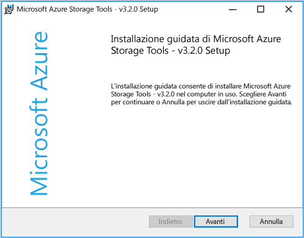
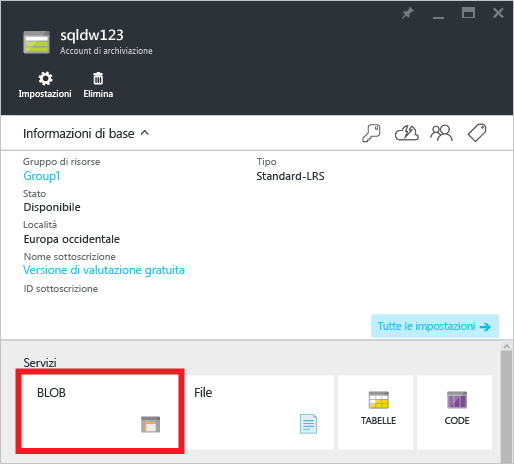
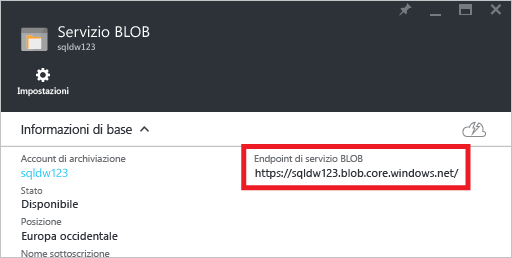
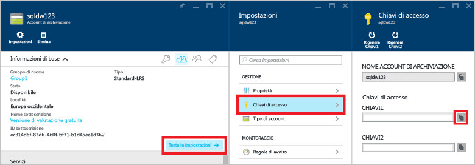
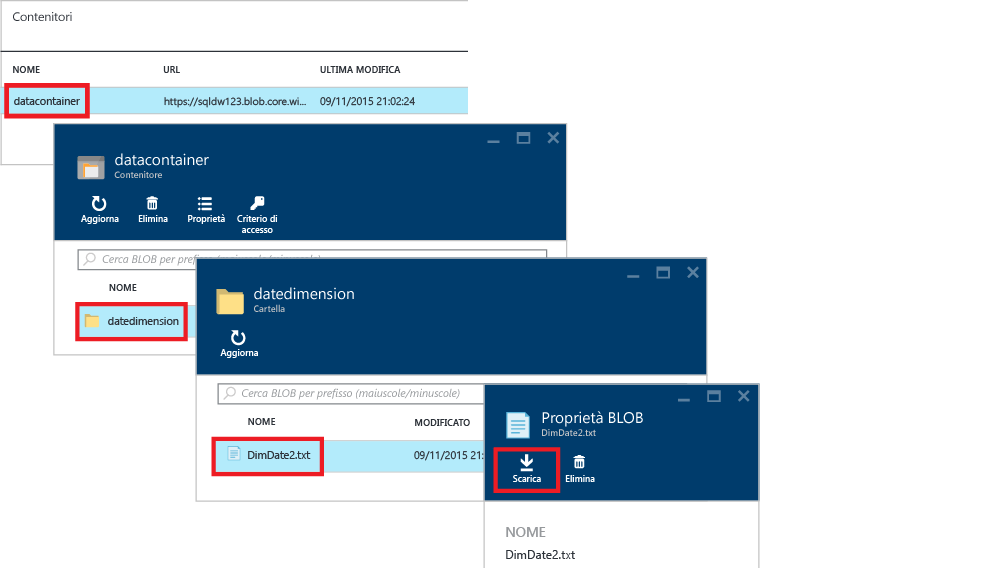
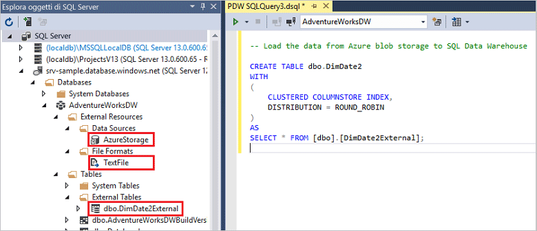

# <a name="load-data-with-polybase-in-sql-data-warehouse"></a>Caricare dati con PolyBase in SQL Data Warehouse
> [!div class="op_single_selector"]
> * [SSIS](sql-data-warehouse-load-from-sql-server-with-integration-services.md)
> * [PolyBase](sql-data-warehouse-load-from-sql-server-with-polybase.md)
> * [bcp](sql-data-warehouse-load-from-sql-server-with-bcp.md)
> 
> 

Questa esercitazione illustra come caricare dati in SQL Data Warehouse mediante AzCopy e PolyBase. Al termine, si sarà in grado di:

* Usare AzCopy per copiare dati nell'archivio BLOB di Azure
* Creare oggetti di database per definire i dati
* Eseguire una query T-SQL per caricare i dati

> [!VIDEO https://channel9.msdn.com/Blogs/Windows-Azure/Loading-data-with-PolyBase-in-Azure-SQL-Data-Warehouse/player]
> 
> 

## <a name="prerequisites"></a>Prerequisiti
Per eseguire questa esercitazione, sono necessari:

* Un database di SQL Data Warehouse.
* Un account di archiviazione di Azure di tipo Archiviazione con ridondanza locale Standard (Standard-LRS), Archiviazione con ridondanza geografica Standard (Standard-GRS) o Archiviazione con ridondanza geografica e accesso in lettura Standard (Standard-RAGRS).
* Utilità da riga di comando di AzCopy. Scaricare e installare la [versione più recente di AzCopy][versione più recente di AzCopy], installata insieme agli Strumenti di archiviazione di Microsoft Azure.
  
    

## <a name="step-1-add-sample-data-to-azure-blob-storage"></a>Passaggio 1: Aggiungere dati di esempio all'archivio BLOB di Azure
Per caricare dati, è necessario inserire dati di esempio in un archivio BLOB di Azure. In questo passaggio un BLOB di Archiviazione di Azure viene popolato con dati di esempio. In seguito verrà usato PolyBase per caricare i dati esempio nel database di SQL Data Warehouse.

### <a name="a-prepare-a-sample-text-file"></a>A. Preparare un file di testo di esempio
Per preparare un file di testo di esempio:

1. Aprire il Blocco note e copiare le righe di dati seguenti in un nuovo file. Salvare il file nella directory temporanea locale come %temp%\DimDate2.txt.

```
20150301,1,3
20150501,2,4
20151001,4,2
20150201,1,3
20151201,4,2
20150801,3,1
20150601,2,4
20151101,4,2
20150401,2,4
20150701,3,1
20150901,3,1
20150101,1,3
```

### <a name="b-find-your-blob-service-endpoint"></a>B. Individuare l'endpoint di servizio BLOB
Per individuare l'endpoint di servizio BLOB:

1. Nel portale di Azure selezionare **Esplora** > **Account di archiviazione**.
2. Fare clic sull'account di archiviazione da usare.
3. Nel pannello Account di archiviazione fare clic su BLOB.
   
    
4. Salvare l'URL dell'endpoint di servizio BLOB per un momento successivo.
   
    

### <a name="c-find-your-azure-storage-key"></a>C. Individuare la chiave di archiviazione di Azure
Per individuare la chiave di archiviazione di Azure:

1. Nel portale di Azure selezionare **Esplora** > **Account di archiviazione**.
2. Fare clic sull'account di archiviazione da usare.
3. Selezionare **Tutte le impostazioni** > **Chiavi di accesso**.
4. Fare clic sulla casella Copia per copiare una delle chiavi di accesso negli Appunti.
   
    

### <a name="d-copy-the-sample-file-to-azure-blob-storage"></a>D. Copiare il file di esempio nell'archivio BLOB di Azure
Per copiare i dati nell'archivio BLOB di Azure:

1. Aprire un prompt dei comandi e cambiare le directory, specificando la directory di installazione di AzCopy. Questo comando imposta la directory di installazione predefinita in un client Windows a 64 bit.
   
    ```
    cd /d "%ProgramFiles(x86)%\Microsoft SDKs\Azure\AzCopy"
    ```
2. Eseguire il comando seguente per caricare il file. Specificare l'URL dell'endpoint di servizio BLOB per <blob service endpoint URL> e la chiave dell'account di archiviazione di Azure per <azure_storage_account_key>.
   
    ```
    .\AzCopy.exe /Source:C:\Temp\ /Dest:<blob service endpoint URL> /datacontainer/datedimension/ /DestKey:<azure_storage_account_key> /Pattern:DimDate2.txt
    ```

Vedere anche [Introduzione all'utilità della riga di comando AzCopy][versione più recente di AzCopy].

### <a name="e-explore-your-blob-storage-container"></a>E. Esplorare il contenitore di archiviazione BLOB
Per visualizzare il file caricato nell'archivio BLOB:

1. Tornare al pannello del servizio BLOB.
2. In Contenitori fare doppio clic su **datacontainer**.
3. Per esplorare il percorso dei dati, fare clic sulla cartella **datedimension**, in cui è disponibile il file caricato **DimDate2.txt**.
4. Per visualizzare le proprietà, fare clic su **DimDate2.txt**.
5. Si noti che nel pannello delle proprietà BLOB è possibile scaricare o eliminare il file.
   
    

## <a name="step-2-create-an-external-table-for-the-sample-data"></a>Passaggio 2: Creare una tabella esterna per i dati di esempio
In questa sezione viene creata una tabella esterna che definisce i dati di esempio.

PolyBase usa le tabelle esterne per accedere ai dati nell'archivio BLOB di Azure. Poiché i dati non vengono archiviati in SQL Data Warehouse, PolyBase gestisce l'autenticazione per i dati esterni usando credenziali con ambito database.

L'esempio in questo passaggio usa queste istruzioni Transact-SQL per creare una tabella esterna.

* [Create Master Key (Transact-SQL)][Create Master Key (Transact-SQL)] per crittografare il segreto delle credenziali con ambito database.
* [Create Database Scoped Credential (Transact-SQL)][Create Database Scoped Credential (Transact-SQL)] per specificare le informazioni di autenticazione per l'account di archiviazione di Azure.
* [Create External Data Source (Transact-SQL)][Create External Data Source (Transact-SQL)] per specificare la posizione dell'archivio BLOB di Azure.
* [Create External File Format (Transact-SQL)][Create External File Format (Transact-SQL)] per specificare il formato dei dati.
* [Create External Table (Transact-SQL)][Create External Table (Transact-SQL)] per specificare la definizione di tabella e la posizione dei dati.

Eseguire questa query nel database di SQL Data Warehouse. Verrà creata una tabella esterna denominata DimDate2External nello schema dbo che fa riferimento ai dati di esempio DimDate2.txt nell'archivio BLOB di Azure.

```sql
-- A: Create a master key.
-- Only necessary if one does not already exist.
-- Required to encrypt the credential secret in the next step.

CREATE MASTER KEY;


-- B: Create a database scoped credential
-- IDENTITY: Provide any string, it is not used for authentication to Azure storage.
-- SECRET: Provide your Azure storage account key.


CREATE DATABASE SCOPED CREDENTIAL AzureStorageCredential
WITH
    IDENTITY = 'user',
    SECRET = '<azure_storage_account_key>'
;


-- C: Create an external data source
-- TYPE: HADOOP - PolyBase uses Hadoop APIs to access data in Azure blob storage.
-- LOCATION: Provide Azure storage account name and blob container name.
-- CREDENTIAL: Provide the credential created in the previous step.

CREATE EXTERNAL DATA SOURCE AzureStorage
WITH (
    TYPE = HADOOP,
    LOCATION = 'wasbs://<blob_container_name>@<azure_storage_account_name>.blob.core.windows.net',
    CREDENTIAL = AzureStorageCredential
);


-- D: Create an external file format
-- FORMAT_TYPE: Type of file format in Azure storage (supported: DELIMITEDTEXT, RCFILE, ORC, PARQUET).
-- FORMAT_OPTIONS: Specify field terminator, string delimiter, date format etc. for delimited text files.
-- Specify DATA_COMPRESSION method if data is compressed.

CREATE EXTERNAL FILE FORMAT TextFile
WITH (
    FORMAT_TYPE = DelimitedText,
    FORMAT_OPTIONS (FIELD_TERMINATOR = ',')
);


-- E: Create the external table
-- Specify column names and data types. This needs to match the data in the sample file.
-- LOCATION: Specify path to file or directory that contains the data (relative to the blob container).
-- To point to all files under the blob container, use LOCATION='.'

CREATE EXTERNAL TABLE dbo.DimDate2External (
    DateId INT NOT NULL,
    CalendarQuarter TINYINT NOT NULL,
    FiscalQuarter TINYINT NOT NULL
)
WITH (
    LOCATION='/datedimension/',
    DATA_SOURCE=AzureStorage,
    FILE_FORMAT=TextFile
);


-- Run a query on the external table

SELECT count(*) FROM dbo.DimDate2External;

```


In Esplora oggetti di SQL Server in Visual Studio è possibile visualizzare il formato di file esterno, l'origine dati esterna e la tabella DimDate2External.



## <a name="step-3-load-data-into-sql-data-warehouse"></a>Passaggio 3: Caricare i dati in SQL Data Warehouse
Dopo la creazione della tabella esterna, è possibile caricare i dati in una nuova tabella o inserirli in una tabella esistente.

* Per caricare i dati in una nuova tabella, eseguire l'istruzione [CREATE TABLE AS SELECT (Transact-SQL)][CREATE TABLE AS SELECT (Transact-SQL)]. La nuova tabella includerà le colonne indicate nella query. I tipi di dati della colonna corrisponderanno ai tipi di dati nella definizione della tabella esterna.
* Per caricare i dati in una tabella esistente, usare l'istruzione [INSERT...SELECT (Transact-SQL)][INSERT...SELECT (Transact-SQL)].

```sql
-- Load the data from Azure blob storage to SQL Data Warehouse

CREATE TABLE dbo.DimDate2
WITH
(   
    CLUSTERED COLUMNSTORE INDEX,
    DISTRIBUTION = ROUND_ROBIN
)
AS
SELECT * FROM [dbo].[DimDate2External];
```

## <a name="step-4-create-statistics-on-your-newly-loaded-data"></a>Passaggio 4: Creare statistiche sui dati appena caricati
SQL Data Warehouse non crea automaticamente o aggiorna automaticamente le statistiche. Per ottenere prestazioni elevate per le query, è quindi importante creare statistiche su ogni colonna di ogni tabella dopo il primo carico. È anche importante aggiornare le statistiche dopo modifiche sostanziali dei dati.

Questo esempio crea statistiche relative a singole colonne nella nuova tabella DimDate2.

```sql
CREATE STATISTICS [DateId] on [DimDate2] ([DateId]);
CREATE STATISTICS [CalendarQuarter] on [DimDate2] ([CalendarQuarter]);
CREATE STATISTICS [FiscalQuarter] on [DimDate2] ([FiscalQuarter]);
```

Per altre informazioni, vedere [Statistiche][Statistiche].  

## <a name="next-steps"></a>Passaggi successivi
Per altre informazioni utili durante lo sviluppo di una soluzione che usa PolyBase, vedere la [guida su PolyBase][guida su PolyBase].

<!--Image references-->


<!--Article references-->
[Esercitazione su PolyBase in SQL Data Warehouse]: ./sql-data-warehouse-get-started-load-with-polybase.md
[Caricare dati con bcp]: ./sql-data-warehouse-load-with-bcp.md
[Statistiche]: ./sql-data-warehouse-tables-statistics.md
[guida su PolyBase]: ./sql-data-warehouse-load-polybase-guide.md
[versione più recente di AzCopy]: ../storage/storage-use-azcopy.md

<!--External references-->
[Origine e sink supportati]: https://msdn.microsoft.com/library/dn894007.aspx
[Attività di copia]: https://msdn.microsoft.com/library/dn835035.aspx
[Adattatore di destinazione SQL Server]: https://msdn.microsoft.com/library/ms141095.aspx
[SSIS]: https://msdn.microsoft.com/library/ms141026.aspx


[CREATE EXTERNAL DATA SOURCE (Transact-SQL)]:https://msdn.microsoft.com/library/dn935022.aspx
[CREATE EXTERNAL FILE FORMAT (Transact-SQL)]:https://msdn.microsoft.com/library/dn935026.aspx
[CREATE EXTERNAL TABLE (Transact-SQL)]:https://msdn.microsoft.com/library/dn935021.aspx

[DROP EXTERNAL DATA SOURCE (Transact-SQL)]:https://msdn.microsoft.com/library/mt146367.aspx
[DROP EXTERNAL FILE FORMAT (Transact-SQL)]:https://msdn.microsoft.com/library/mt146379.aspx
[DROP EXTERNAL TABLE (Transact-SQL)]:https://msdn.microsoft.com/library/mt130698.aspx

[CREATE TABLE AS SELECT (Transact-SQL)]:https://msdn.microsoft.com/library/mt204041.aspx
[INSERT...SELECT (Transact-SQL)]:https://msdn.microsoft.com/library/ms174335.aspx
[CREATE MASTER KEY (Transact-SQL)]:https://msdn.microsoft.com/library/ms174382.aspx
[CREATE CREDENTIAL (Transact-SQL)]:https://msdn.microsoft.com/library/ms189522.aspx
[CREATE DATABASE SCOPED CREDENTIAL (Transact-SQL)]:https://msdn.microsoft.com/library/mt270260.aspx
[DROP CREDENTIAL (Transact-SQL)]:https://msdn.microsoft.com/library/ms189450.aspx


<!--HONumber=Nov16_HO2-->


