# Integrazione del controllo del codice sorgente per Azure SQL Data Warehouse

Questa esercitazione illustra come integrare il progetto di database SQL Server Data Tools (SSDT) con il controllo del codice sorgente.  L'integrazione del controllo del codice sorgente è il primo passaggio per la creazione della pipeline di integrazione e distribuzione continua con SQL Data Warehouse. 

## Prima di iniziare

- Iscriversi per ottenere un'[organizzazione di Azure DevOps](https://azure.microsoft.com/services/devops/)
- Completare l'esercitazione [Creare e connettere](https://docs.microsoft.com/azure/sql-data-warehouse/create-data-warehouse-portal)
-  [Installare Visual Studio 2019](https://visualstudio.microsoft.com/vs/older-downloads/) 

## Configurare Azure DevOps e connettersi

1. Nell'organizzazione di Azure DevOps creare un progetto che ospiterà il progetto di database SSDT tramite un repository di Azure

   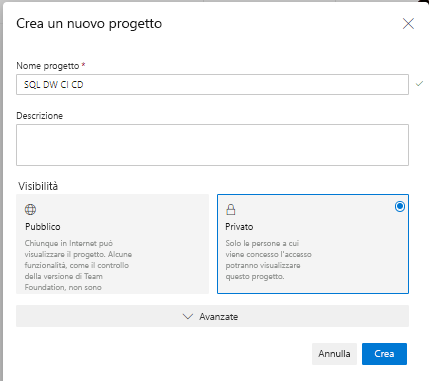

2. Aprire Visual Studio e connettersi all'organizzazione e al progetto di Azure DevOps del passaggio 1 selezionando "Gestisci connessioni"

   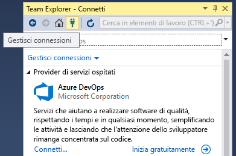

   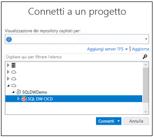

3. Clonare il repository Azure Repos del progetto nel computer locale

   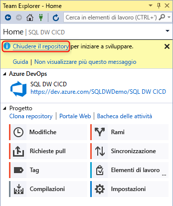

## Creare il progetto e connettersi

1. In Visual Studio creare un nuovo progetto di database SQL Server con una directory e un repository Git locale nel **repository clonato locale**

   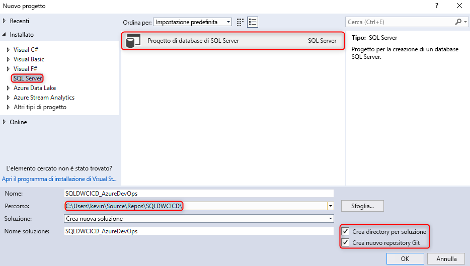  

2. Fare clic con il pulsante destro del mouse sul progetto SQL vuoto e importarvi il data warehouse

   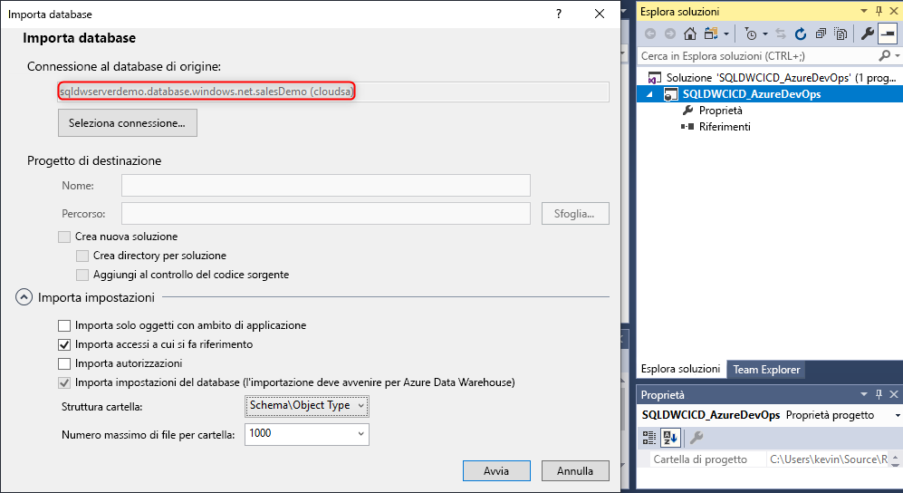  

3. In Team Explorer di Visual Studio eseguire il commit di tutte le modifiche apportate al repository Git locale 

   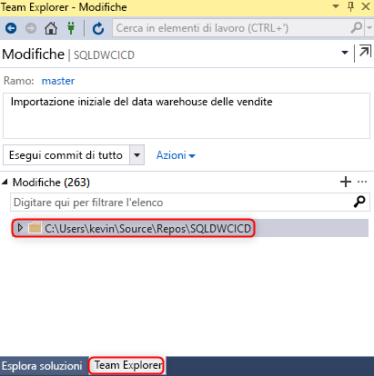  

4. A questo punto, dopo aver eseguito il commit delle modifiche in locale nel repository clonato, sincronizzare ed effettuare il push delle modifiche nel repository Azure Repos nel progetto Azure DevOps.

   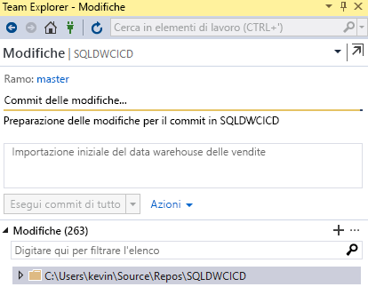

   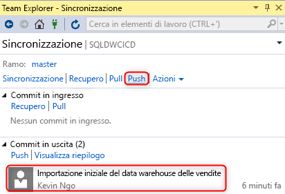  

## Convalida

1. Verificare che il push delle modifiche sia stato eseguito nel repository Azure Repos aggiornando una colonna della tabella nel progetto di database da Visual Studio SQL Server Data Tools (SSDT)

   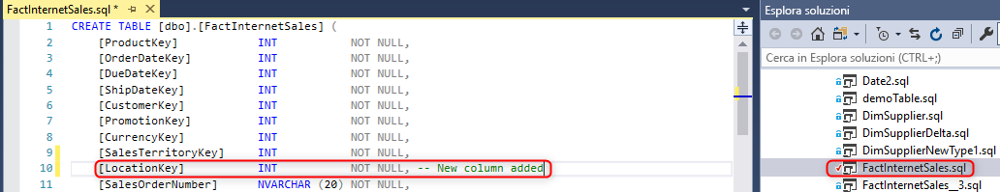

2. Eseguire il commit e il push della modifica dal repository locale al repository Azure Repos

   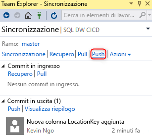

3. Verificare che il push della modifica sia stato eseguito nel repository Azure Repos

   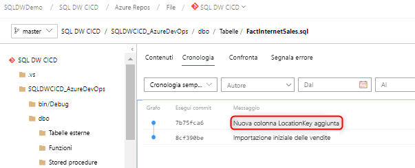

4. (**Facoltativo**) Usare Confronto schema e aggiornare le modifiche apportate al data warehouse di destinazione tramite SSDT per assicurarsi che le definizioni degli oggetti nel repository Azure Repos e nel repository locale riflettano il data warehouse

## Passaggi successivi

- [Sviluppo per Azure SQL Data Warehouse](sql-data-warehouse-overview-develop.md)

<!--Image references-->

<!--Article references-->

<!--MSDN references-->

<!--Other Web references-->

