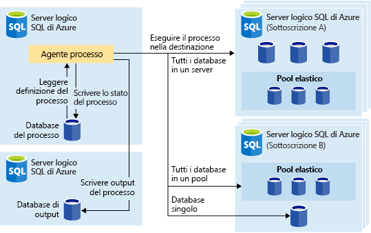
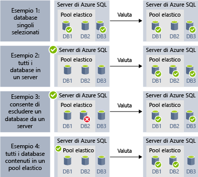
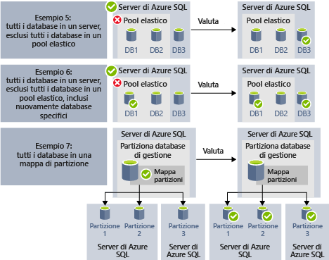
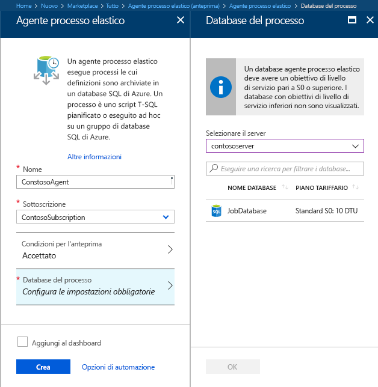
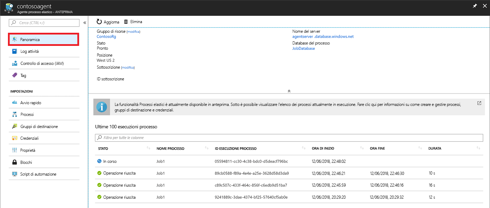

# <a name="manage-groups-of-databases-with-elastic-database-jobs"></a>Gestire gruppi di database con i processi di database elastico

I **processi di database elastico** consentono di eseguire uno o più script T-SQL in parallelo, in un numero elevato di database, in una pianificazione o su richiesta.

**Eseguire processi su qualsiasi combinazione di database**: uno o più database, tutti i database in un server, tutti i database in un pool elastico o in una mappa delle partizioni, con in più la possibilità di includere o escludere database specifici. **I processi possono essere eseguiti in più server, in più pool e anche in database di sottoscrizioni differenti.** I server e i pool vengono enumerati in modo dinamico in fase di esecuzione, quindi i processi vengono eseguiti su tutti i database esistenti nel gruppo di destinazione al momento dell'esecuzione.

La figura seguente mostra un agente di processo che esegue processi tra diversi tipi di gruppi di destinazione:




## <a name="why-use-elastic-jobs"></a>Vantaggi dei processi elastici

### <a name="manage-many-databases"></a>Gestire molti database

- Pianificare le attività amministrative da eseguire ogni giorno della settimana, dopo l'orario di lavoro e così via.
- Distribuire le modifiche dello schema, la gestione delle credenziali, la raccolta dei dati sulle prestazioni o la raccolta dei dati di telemetria del tenant (cliente). Aggiornare i dati di riferimento, ad esempio informazioni comuni tra tutti i database.
- Ricompilazione degli indici per migliorare le prestazioni delle query. Configurare i processi per l'esecuzione in una raccolta di database su base periodica, ad esempio durante le fasce orarie non di punta.
- Raccogliere i risultati di query da un set di database in una tabella centrale su base costante. Le query di prestazione possono essere eseguite continuamente e configurate per l'esecuzione di attività aggiuntive di trigger.

### <a name="collect-data-for-reporting"></a>Raccogliere i dati per i report

- Aggregare i dati di una raccolta di database SQL di Azure in una singola tabella di destinazione.
- Eseguire query di elaborazione dei dati più lunghe per una vasta serie di database, ad esempio la raccolta della telemetria del cliente. I risultati vengono raccolti in una tabella di destinazione singola per ulteriori analisi.

### <a name="reduce-overhead"></a>Ridurre il sovraccarico

- In genere, è necessario connettersi a ciascun database in modo indipendente per eseguire istruzioni T-SQL o effettuare altre attività amministrative. Un processo gestisce le attività di accesso a ogni database nel gruppo di destinazione. È anche necessario definire, gestire e mantenere gli script Transact-SQL da eseguire su un gruppo di database SQL di Azure.

### <a name="accounting"></a>Contabilità

- I processi registrano lo stato di esecuzione per ogni database. È anche disponibile la ripetizione automatica in caso di errori.

### <a name="flexibility"></a>Flessibilità

- Definire gruppi personalizzati di database SQL di Azure e pianificazioni per l'esecuzione di un processo.


## <a name="elastic-job-components"></a>Componenti del processo elastico

|Componente  | Descrizione (altri dettagli sono disponibili sotto la tabella) |
|---------|---------|
|[**Agente di processo elastico**](#elastic-job-agent) |  Risorsa di Azure creata per eseguire e gestire i processi.   |
|[**Database di processo**](#job-database)    |    Database SQL di Azure usato dall'agente di processo per archiviare dati correlati ai processi, definizioni dei processi e così via.      |
|[**Gruppo di destinazione**](#target-group)      |  Il set di server, pool, database e mappe delle partizioni in cui eseguire un processo.       |
|[**Processo**](#job)  |  Un processo è un'unità di lavoro costituita da uno o più [passaggi](#job-step). I passaggi del processo specificano lo script T-SQL da eseguire, nonché altri dettagli necessari per eseguirlo.  |


### <a name="elastic-job-agent"></a>Agente di processo elastico

Un agente di processo elastico è la risorsa di Azure per la creazione, l'esecuzione e la gestione dei processi. L'agente di processo elastico è una risorsa di Azure che viene creata nel portale (sono anche supportati [PowerShell](elastic-jobs-powershell.md) e REST). 

La creazione di un **agente di processo elastico** richiede un database SQL esistente. L'agente configura il database esistente come [*database di processo*](#job-database).

L'agente di processo elastico è gratuito. Il database di processo viene fatturato alla stessa tariffa di qualsiasi database SQL.

### <a name="job-database"></a>Database di processo

Il *database di processo* viene usato per definire i processi e tracciare lo stato e la cronologia delle esecuzioni dei processi. Il *database di processo* viene anche usato per archiviare metadati dell'agente, log, risultati e definizioni dei processi e contiene anche molte utili stored procedure e altri oggetti del database per creare, eseguire e gestire i processi con T-SQL.

Per l'anteprima corrente, è necessario un database SQL di Azure esistente (S0 o superiore) per creare un agente di processo elastico.

Il *database di processo* non deve essere necessariamente nuovo, ma deve essere pulito, vuoto e con livello di servizio S0 o superiore. Il livello di servizio consigliato per il *database di processo* è S1 o superiore, ma in realtà dipende dalle prestazioni richieste dai processi, ovvero numero di passaggi e numero e frequenza delle esecuzioni. Un database S0 può essere ad esempio sufficiente per un agente di processo che esegue pochi processi ogni ora, mentre se esegue un processo ogni minuto le prestazioni potrebbero essere insufficienti e rendere opportuno un livello di servizio superiore.


#### <a name="job-database-permissions"></a>Autorizzazioni per il database di processo

Durante la creazione di un agente di processo vengono creati uno schema, tabelle e un ruolo denominato *jobs_reader* nel *database di processo*. Il ruolo viene creato con l'autorizzazione seguente ed è progettato per fornire agli amministratori un controllo di accesso più preciso per il monitoraggio dei processi:


|Nome del ruolo  |Autorizzazioni per lo schema "jobs"  |Autorizzazioni per lo schema 'jobs_internal'  |
|---------|---------|---------|
|**jobs_reader**     |    SELECT     |    Nessuna     |

> [!IMPORTANT]
> Prima di concedere l'accesso al *database di processo* come amministratore del database, considerare le implicazioni per la sicurezza. Un utente malintenzionato con le autorizzazioni di creazione o modifica dei processi potrebbe creare o modificare un processo che usa una credenziale archiviata per connettersi a un database con il controllo dell'utente malintenzionato, consentendo a questo utente di determinare la password della credenziale.


### <a name="target-group"></a>Gruppo di destinazione

Un *gruppo di destinazione* definisce il set di database sui quali verrà eseguito un passaggio di processo. Un gruppo di destinazione può contenere qualsiasi numero e una combinazione degli elementi seguenti:

- **Server di Azure SQL**: se è specificato un server, tutti i database presenti nel server al momento dell'esecuzione del processo fanno parte del gruppo. È necessario fornire le credenziali del database master in modo che il gruppo possa essere enumerato e aggiornato prima dell'esecuzione del processo.
- **Pool elastico**: se è specificato un pool elastico, tutti i database presenti nel pool elastico al momento dell'esecuzione del processo fanno parte del gruppo. Come per un server, è necessario fornire le credenziali del database master in modo che il gruppo possa essere aggiornato prima dell'esecuzione del processo.
- **Database singolo**: specificare uno o più database singoli da includere nel gruppo.
- **Mappa delle partizioni**: database di una mappa delle partizioni.

> [!TIP]
> Al momento dell'esecuzione del processo, l'*enumerazione dinamica* rivaluta il set dei database nei gruppi di destinazione che includono server o pool. L'enumerazione dinamica assicura che i **processi vengano eseguiti in tutti i database esistenti nel server o nel pool al momento dell'esecuzione**. Rivalutare l'elenco dei database in fase di esecuzione è particolarmente utile per gli scenari in cui l'appartenenza al pool o al server cambia frequentemente.

I pool e i database singoli possono essere specificati come inclusi o esclusi dal gruppo. Ciò consente di creare un gruppo di destinazione con qualsiasi combinazione di database. È ad esempio possibile aggiungere un server a un gruppo di destinazione, ma escludere database specifici di un pool elastico o escludere un intero pool.

Un gruppo di destinazione può includere database in più sottoscrizioni e in più aree. Si noti che le esecuzioni tra più aree hanno una latenza maggiore rispetto alle esecuzioni nella stessa area.

Gli esempi seguenti illustrano come diverse definizioni del gruppo destinazione vengono enumerate in modo dinamico al momento dell'esecuzione del processo per determinare i database che verranno eseguiti:



L'**esempio 1** mostra un gruppo di destinazione costituito da un elenco di singoli database. Quando un passaggio del processo viene eseguito usando questo gruppo di destinazione, l'azione del passaggio verrà eseguita in ognuno di tali database.<br>
L'**esempio 2** mostra un gruppo di destinazione contenente un server di Azure SQL come destinazione. Quando un passaggio del processo viene eseguito usando questo gruppo di destinazione, il server viene enumerato in modo dinamico per determinare l'elenco dei database attualmente presenti nel server. L'azione del passaggio del processo verrà eseguita in ognuno di tali database.<br>
L'**esempio 3** mostra un gruppo di destinazione simile a quello dell'*esempio 2*, ma con l'esclusione specifica di un singolo database. L'azione del passaggio del processo *non* verrà eseguita nel database escluso.<br>
L'**esempio 4** mostra un gruppo di destinazione contenente un pool elastico come destinazione. Analogamente all'*esempio 2*, il pool verrà enumerato in modo dinamico in fase di esecuzione del processo per determinare l'elenco dei database nel pool.
<br><br>




L'**esempio 5** e l'*esempio 6* mostrano scenari avanzati in cui server di Azure SQL, pool elastici e database possono essere combinati usando regole di inclusione e di esclusione.<br>
L'**esempio 7** mostra che in fase di esecuzione del processo possono essere valutate anche le partizioni in una mappa delle partizioni.

### <a name="job"></a>Processo

Un *processo* è un'unità di lavoro che viene eseguita in una pianificazione o come processo occasionale. Un processo è costituito da uno o più *passaggi*.

#### <a name="job-step"></a>Passaggio del processo

Ogni passaggio del processo specifica uno script T-SQL da eseguire, uno o più gruppi di destinazione in cui eseguire lo script T-SQL e le credenziali richieste dall'agente di processo per connettersi al database di destinazione. Ogni passaggio del processo ha criteri di timeout e ripetizione personalizzabili e può eventualmente specificare parametri di output.

#### <a name="job-output"></a>Output del processo

Il risultato dei passaggi di un processo in ciascun database di destinazione vengono registrati nei dettagli e l'output dello script può essere acquisito in una tabella specifica. È possibile specificare un database per salvare i dati restituiti da un processo.

#### <a name="job-history"></a>Cronologia dei processi

La cronologia dell'esecuzione dei processi viene archiviata nel *database di processo*. Un processo di pulizia del sistema elimina la cronologia dei processi eseguiti oltre 45 giorni prima. Per rimuovere la cronologia dei processi eseguiti entro i 45 giorni precedenti, richiamare la stored procedure **sp_purge_history** nel *database di processo*.

## <a name="workflow-to-create-configure-and-manage-jobs"></a>Flusso di lavoro per la creazione, la configurazione e la gestione dei processi

### <a name="create-and-configure-the-agent"></a>Creare e configurare l'agente

1. Creare o identificare un database SQL vuoto con livello di servizio S0 o superiore. Il database verrà usato come *database di processo* durante la creazione dell'agente di processo elastico.
2. Creare un agente di processo elastico nel [portale](https://portal.azure.com/#create/Microsoft.SQLElasticJobAgent) o con [PowerShell ](elastic-jobs-powershell.md#create-the-elastic-job-agent).

   

### <a name="create-run-and-manage-jobs"></a>Creare, eseguire e gestire i processi

1. Creare una credenziale per l'esecuzione del processo nel *database di processo* usando [PowerShell](elastic-jobs-powershell.md#create-job-credentials-so-that-jobs-can-execute-scripts-on-its-targets) o [T-SQL](elastic-jobs-tsql.md#create-a-credential-for-job-execution).
2. Definire il gruppo di destinazione, ovvero i database nei quali eseguire il processo, usando [PowerShell ](elastic-jobs-powershell.md#define-the-target-databases-you-want-to-run-the-job-against)o [T-SQL ](elastic-jobs-tsql.md#create-a-target-group-servers).
3. Creare una credenziale di agente di processo in ogni database in cui verrà eseguito il processo[, aggiungendo l'utente (o il ruolo) a ogni database del gruppo](https://docs.microsoft.com/azure/sql-database/sql-database-control-access). Per un esempio, vedere l'[esercitazione di PowerShell](elastic-jobs-powershell.md#create-job-credentials-so-that-jobs-can-execute-scripts-on-its-targets).
4. Creare un processo usando [PowerShell](elastic-jobs-powershell.md#create-a-job) o [T-SQL](elastic-jobs-tsql.md#deploy-new-schema-to-many-databases).
5. Aggiungere passaggi di processo usando [PowerShell](elastic-jobs-powershell.md#create-a-job-step) o [T-SQL](elastic-jobs-tsql.md#deploy-new-schema-to-many-databases).
6. Eseguire un processo usando [PowerShell](elastic-jobs-powershell.md#run-the-job) o [T-SQL](elastic-jobs-tsql.md#begin-ad-hoc-execution-of-a-job).
7. Monitorare lo stato di esecuzione del processo usando il portale, [PowerShell](elastic-jobs-powershell.md#monitor-status-of-job-executions) o [T-SQL](elastic-jobs-tsql.md#monitor-job-execution-status).

   

## <a name="credentials-for-running-jobs"></a>Credenziali per l'esecuzione di processi

I processi usano [credenziali con ambito database](/sql/t-sql/statements/create-database-scoped-credential-transact-sql) per la connessione ai database specificati dal gruppo di destinazione al momento dell'esecuzione. Se un gruppo di destinazione contiene server o pool, queste credenziali con ambito database vengono usate per connettersi al database master ed enumerare i database disponibili.

La configurazione delle credenziali corrette per l'esecuzione di un processo può essere poco chiara, quindi tenere a mente i punti seguenti:

- Le credenziali di ambito database devono essere create nel *database di processo*.
- Per completare correttamente il processo, **tutti i database di destinazione devono avere un account di accesso con [autorizzazioni sufficienti](https://docs.microsoft.com/sql/relational-databases/security/permissions-database-engine)**(jobuser nello schema seguente).
- Le credenziali verranno riutilizzate in tutti i processi e le password delle credenziali verranno crittografate e protette dagli utenti che hanno accesso in sola lettura agli oggetti del processo.

L'immagine seguente semplifica la comprensione e la configurazione delle credenziali di processo corrette. **Ricordarsi di creare l'utente in ogni database (tutti i *database utente di destinazione*) in cui è necessario eseguire il processo**.


## <a name="security-best-practices"></a>Procedure di sicurezza consigliate

Alcune considerazioni sulle procedure consigliate per l'uso dei processi elastici:

- Limitare l'utilizzo delle API a utenti attendibili.
- Le credenziali devono avere i privilegi minimi necessari per eseguire il passaggio del processo. Per altre informazioni, vedere [Autorizzazioni in SQL Server](https://docs.microsoft.com/dotnet/framework/data/adonet/sql/authorization-and-permissions-in-sql-server).
- Quando si usa un server e/o un membro del gruppo di destinazione del pool, è consigliabile creare una credenziale separata con diritti per il database master per visualizzare/elencare i database, usata per espandere gli elenchi dei database dei server e/o dei pool prima dell'esecuzione del processo.


## <a name="agent-performance-capacity-and-limitations"></a>Prestazioni, capacità e limitazioni degli agenti

I processi elastici usano risorse di calcolo minime in attesa del completamento di processi di lunga durata.

A seconda delle dimensioni del gruppo di database di destinazione e del tempo di esecuzione desiderato per un processo (numero di processi simultanei), l'agente richiede prestazioni e risorse di calcolo differenti per il *database di processo*: maggiore è il numero di destinazioni e di processi, maggiore sarà la quantità di risorse di calcolo necessarie.

Attualmente, l'anteprima è limitata a 100 processi simultanei.

### <a name="prevent-jobs-from-reducing-target-database-performance"></a>Impedire ai processi di ridurre le prestazioni del database di destinazione

Per garantire che le risorse non siano sovraccariche quando si eseguono processi sul database in un pool elastico SQL, è possibile configurare i processi in modo da limitare il numero di database in cui un processo può essere eseguito contemporaneamente.

##  <a name="differences-between-elastic-jobs-and-sql-server-agent"></a>Differenze tra processi elastici e SQL Server Agent

È opportuno notare alcune differenze tra SQL Server Agent (disponibile in locale e come parte dell'istanza gestita di database SQL di Azure) e l'agente di processo elastico del database SQL di Azure, ora disponibile per Database SQL e SQL Data Warehouse.


|  |Processi elastici  |Agente SQL Server |
|---------|---------|---------|
|Scope     |  Qualsiasi numero di database SQL di Azure e/o di data warehouse nello stesso cloud di Azure dell'agente di processo. Le destinazioni possono trovarsi in server logici, sottoscrizioni e/o aree differenti. <br><br>I gruppi di destinazione possono essere composti da singoli database o data warehouse o da tutti i database in un server, pool o mappa delle partizioni (enumerati dinamicamente al momento dell'esecuzione del processo). | Qualsiasi database singolo nella stessa istanza di SQL Server dell'agent SQL. |
|API e strumenti supportati     |  Portale, PowerShell, T-SQL, Azure Resource Manager      |   T-SQL, SQL Server Management Studio (SSMS)     |


## <a name="best-practices-for-creating-jobs"></a>Procedure consigliate per la creazione di processi

### <a name="idempotent-scripts"></a>Script idempotenti
Gli script T-SQL di un processo devono essere [idempotenti](https://en.wikipedia.org/wiki/Idempotence). **Idempotente** significa che se lo script ha esito positivo e viene eseguito di nuovo, si ottiene lo stesso risultato. Uno script potrebbe non riuscire a causa di problemi di rete temporanei. In tal caso, il processo ritenterà automaticamente l'esecuzione dello script per un numero di volte predefinito prima di desistere. Uno script idempotente ha lo stesso risultato anche se è stato eseguito correttamente due volte o più.

Una semplice strategia consiste nel verificare l'esistenza di un oggetto prima di crearlo.


```sql
IF NOT EXIST (some_object)
    -- Create the object
    -- If it exists, drop the object before recreating it.
```

Analogamente, uno script deve poter essere eseguito correttamente verificando in modo logico e risolvendo qualsiasi condizione trovata.


## <a name="next-steps"></a>Passaggi successivi

- [Creare e gestire processi elastici usando PowerShell](elastic-jobs-powershell.md)
- [Creare e gestire processi elastici usando Transact-SQL (T-SQL)](elastic-jobs-tsql.md)