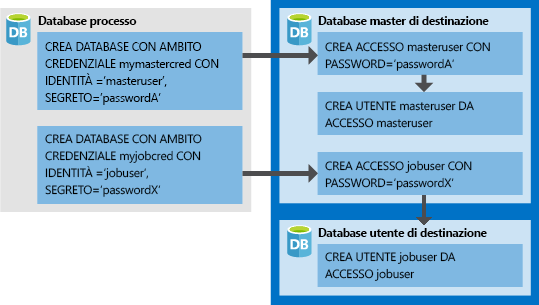

# <a name="create-an-elastic-job-agent-using-powershell"></a>Creare un agente processo elastico con PowerShell

I [processi elastici](sql-database-job-automation-overview.md#elastic-database-jobs-preview) permettono l'esecuzione di uno o più script di Transact-SQL (T-SQL) in parallelo tra molti database.

Questa esercitazione illustra la procedura necessaria per eseguire una query tra più database:

> [!div class="checklist"]
> * Creare un agente processo elastico
> * Creare le credenziali di processo in modo che i processi possano eseguire script nelle relative destinazioni
> * Definire le destinazioni (server, pool elastici, database e mappe delle partizioni) in cui eseguire i processi
> * Creare credenziali con ambito database nei database di destinazione in modo che l'agente possa connettersi ed eseguire processi
> * Creare un processo
> * Aggiungere passaggi del processo a un processo
> * Avviare l'esecuzione di un processo
> * Monitorare un processo

## <a name="prerequisites"></a>Prerequisiti

La versione aggiornata dei processi di database elastico include un nuovo set di cmdlet di PowerShell per l'uso durante la migrazione. Questi nuovi cmdlet consentono di trasferire tutte le credenziali di processo esistenti, le destinazioni (inclusi database, server e raccolte personalizzate), i trigger dei processi, le pianificazioni dei processi, il contenuto dei processi e i processi in un nuovo agente processo elastico.

### <a name="install-the-latest-elastic-jobs-cmdlets"></a>Installare la versione più recente dei cmdlet per i processi elastici

Se non si ha già una sottoscrizione di Azure, creare un [account gratuito](https://azure.microsoft.com/free/) prima di iniziare.

Installare il modulo **Az.Sql** 1.1.1-preview per ottenere i cmdlet per processi elastici più recenti. Eseguire questi comandi in PowerShell con accesso amministrativo.

```powershell
# Installs the latest PackageManagement powershell package which PowershellGet v1.6.5 is dependent on
Find-Package PackageManagement -RequiredVersion 1.1.7.2 | Install-Package -Force

# Installs the latest PowershellGet module which adds the -AllowPrerelease flag to Install-Module
Find-Package PowerShellGet -RequiredVersion 1.6.5 | Install-Package -Force

# Restart your powershell session with administrative access

# Places Az.Sql preview cmdlets side by side with existing Az.Sql version
Install-Module -Name Az.Sql -RequiredVersion 1.1.1-preview -AllowPrerelease

# Import the Az.Sql module
Import-Module Az.Sql -RequiredVersion 1.1.1

# Confirm if module successfully imported - if the imported version is 1.1.1, then continue
Get-Module Az.Sql
```

- Oltre al modulo **Az.Sql** 1.1.1-preview, questa esercitazione richiede anche il modulo *sqlserver* di PowerShell. Per i dettagli, vedere [Installare il modulo SQL Server PowerShell](https://docs.microsoft.com/sql/powershell/download-sql-server-ps-module).


## <a name="create-required-resources"></a>Creare le risorse necessarie

La creazione di un agente processo elastico richiede un database (S0 o versione successiva) da usare come [database di processo](sql-database-job-automation-overview.md#job-database). 

*Lo script seguente crea un nuovo gruppo di risorse, un server e un database da usare come database di processo. Viene inoltre creato un secondo server con due database vuoti per l'esecuzione dei processi.*

I processi elastici non hanno requisiti di denominazione specifici, pertanto è possibile usare le convenzioni di denominazione desiderate, purché siano conformi ai [requisiti di Azure](/azure/cloud-adoption-framework/ready/azure-best-practices/naming-and-tagging).

```powershell
# Sign in to your Azure account
Connect-AzAccount

# Create a resource group
Write-Output "Creating a resource group..."
$ResourceGroupName = Read-Host "Please enter a resource group name"
$Location = Read-Host "Please enter an Azure Region"
$Rg = New-AzResourceGroup -Name $ResourceGroupName -Location $Location
$Rg

# Create a server
Write-Output "Creating a server..."
$AgentServerName = Read-Host "Please enter an agent server name"
$AgentServerName = $AgentServerName + "-" + [guid]::NewGuid()
$AdminLogin = Read-Host "Please enter the server admin name"
$AdminPassword = Read-Host "Please enter the server admin password"
$AdminPasswordSecure = ConvertTo-SecureString -String $AdminPassword -AsPlainText -Force
$AdminCred = New-Object -TypeName "System.Management.Automation.PSCredential" -ArgumentList $AdminLogin, $AdminPasswordSecure
$AgentServer = New-AzSqlServer -ResourceGroupName $ResourceGroupName -Location $Location -ServerName $AgentServerName -ServerVersion "12.0" -SqlAdministratorCredentials ($AdminCred)

# Set server firewall rules to allow all Azure IPs
Write-Output "Creating a server firewall rule..."
$AgentServer | New-AzSqlServerFirewallRule -AllowAllAzureIPs
$AgentServer

# Create the job database
Write-Output "Creating a blank SQL database to be used as the Job Database..."
$JobDatabaseName = "JobDatabase"
$JobDatabase = New-AzSqlDatabase -ResourceGroupName $ResourceGroupName -ServerName $AgentServerName -DatabaseName $JobDatabaseName -RequestedServiceObjectiveName "S0"
$JobDatabase
```

```powershell
# Create a target server and some sample databases - uses the same admin credential as the agent server just for simplicity
Write-Output "Creating target server..."
$TargetServerName = Read-Host "Please enter a target server name"
$TargetServerName = $TargetServerName + "-" + [guid]::NewGuid()
$TargetServer = New-AzSqlServer -ResourceGroupName $ResourceGroupName -Location $Location -ServerName $TargetServerName -ServerVersion "12.0" -SqlAdministratorCredentials ($AdminCred)

# Set target server firewall rules to allow all Azure IPs
$TargetServer | New-AzSqlServerFirewallRule -AllowAllAzureIPs
$TargetServer | New-AzSqlServerFirewallRule -StartIpAddress 0.0.0.0 -EndIpAddress 255.255.255.255 -FirewallRuleName AllowAll
$TargetServer

# Create some sample databases to execute jobs against...
$Db1 = New-AzSqlDatabase -ResourceGroupName $ResourceGroupName -ServerName $TargetServerName -DatabaseName "TargetDb1"
$Db1
$Db2 = New-AzSqlDatabase -ResourceGroupName $ResourceGroupName -ServerName $TargetServerName -DatabaseName "TargetDb2"
$Db2
```

## <a name="enable-the-elastic-jobs-preview-for-your-subscription"></a>Abilitare l'anteprima dei processi elastici per la sottoscrizione

Per usare i processi elastici, registrare la funzionalità nella sottoscrizione di Azure eseguendo il comando seguente, una volta sola per la sottoscrizione in cui si intende effettuare il provisioning dell'agente di processo elastico. Le sottoscrizioni che contengono solo database di destinazione del processo non devono essere registrate.

```powershell
Register-AzProviderFeature -FeatureName sqldb-JobAccounts -ProviderNamespace Microsoft.Sql
```

## <a name="create-the-elastic-job-agent"></a>Creare l'agente processo elastico

Un agente processo elastico è una risorsa di Azure per la creazione, l'esecuzione e la gestione dei processi. L'agente esegue i processi in base a una pianificazione o come processo unico.

Il cmdlet **New-AzSqlElasticJobAgent** richiede un database SQL di Azure già esistente, pertanto i parametri *ResourceGroupName*, *ServerName* e *DatabaseName* devono puntare tutti a risorse esistenti.

```powershell
Write-Output "Creating job agent..."
$AgentName = Read-Host "Please enter a name for your new Elastic Job agent"
$JobAgent = $JobDatabase | New-AzSqlElasticJobAgent -Name $AgentName
$JobAgent
```

## <a name="create-job-credentials-so-that-jobs-can-execute-scripts-on-its-targets"></a>Creare le credenziali di processo in modo che i processi possano eseguire script nelle relative destinazioni

I processi usano credenziali con ambito database per la connessione ai database di destinazione specificati dal gruppo di destinazione al termine dell'esecuzione. Queste credenziali con ambito database permettono inoltre di connettersi al database master per enumerare tutti i database in un server o in un pool elastico, quando uno di questi viene usato come tipo di membro del gruppo di destinazione.

Le credenziali con ambito database devono essere create nel database di processo.  
Tutti i database di destinazione devono disporre di un accesso con autorizzazioni sufficienti per completare correttamente il processo.



Oltre alle credenziali riportate nella figura, si noti l'aggiunta dei comandi *GRANT* nello script seguente. Queste autorizzazioni sono necessarie per lo script che è stato scelto per il processo di esempio. Poiché nell'esempio viene creata una nuova tabella nei database di destinazione, ogni database di destinazione necessita di autorizzazioni appropriate per la corretta esecuzione.

Per creare le credenziali di processo richieste (nel database di processo), eseguire lo script seguente:

```powershell
# In the master database (target server)
# - Create the master user login
# - Create the master user from master user login
# - Create the job user login
$Params = @{
  'Database' = 'master'
  'ServerInstance' =  $TargetServer.ServerName + '.database.windows.net'
  'Username' = $AdminLogin
  'Password' = $AdminPassword
  'OutputSqlErrors' = $true
  'Query' = "CREATE LOGIN masteruser WITH PASSWORD='password!123'"
}
Invoke-SqlCmd @Params
$Params.Query = "CREATE USER masteruser FROM LOGIN masteruser"
Invoke-SqlCmd @Params
$Params.Query = "CREATE LOGIN jobuser WITH PASSWORD='password!123'"
Invoke-SqlCmd @Params

# For each of the target databases
# - Create the jobuser from jobuser login
# - Make sure they have the right permissions for successful script execution
$TargetDatabases = @( $Db1.DatabaseName, $Db2.DatabaseName )
$CreateJobUserScript =  "CREATE USER jobuser FROM LOGIN jobuser"
$GrantAlterSchemaScript = "GRANT ALTER ON SCHEMA::dbo TO jobuser"
$GrantCreateScript = "GRANT CREATE TABLE TO jobuser"

$TargetDatabases | % {
  $Params.Database = $_

  $Params.Query = $CreateJobUserScript
  Invoke-SqlCmd @Params

  $Params.Query = $GrantAlterSchemaScript
  Invoke-SqlCmd @Params

  $Params.Query = $GrantCreateScript
  Invoke-SqlCmd @Params
}

# Create job credential in Job database for master user
Write-Output "Creating job credentials..."
$LoginPasswordSecure = (ConvertTo-SecureString -String "password!123" -AsPlainText -Force)

$MasterCred = New-Object -TypeName "System.Management.Automation.PSCredential" -ArgumentList "masteruser", $LoginPasswordSecure
$MasterCred = $JobAgent | New-AzSqlElasticJobCredential -Name "masteruser" -Credential $MasterCred

$JobCred = New-Object -TypeName "System.Management.Automation.PSCredential" -ArgumentList "jobuser", $LoginPasswordSecure
$JobCred = $JobAgent | New-AzSqlElasticJobCredential -Name "jobuser" -Credential $JobCred
```

## <a name="define-the-target-databases-you-want-to-run-the-job-against"></a>Definire i database di destinazione in cui eseguire il processo

Un [gruppo di destinazione](sql-database-job-automation-overview.md#target-group) definisce il set di uno o più database in cui verrà eseguito il passaggio di un processo. 

Il frammento di codice seguente crea due gruppi di destinazione: *ServerGroup*, e *ServerGroupExcludingDb2*. *ServerGroup* ha come destinazione tutti i database esistenti nel server durante la fase di esecuzione, mentre *ServerGroupExcludingDb2* ha come destinazione tutti i database nel server, ad eccezione di *TargetDb2*:

```powershell
Write-Output "Creating test target groups..."
# Create ServerGroup target group
$ServerGroup = $JobAgent | New-AzSqlElasticJobTargetGroup -Name 'ServerGroup'
$ServerGroup | Add-AzSqlElasticJobTarget -ServerName $TargetServerName -RefreshCredentialName $MasterCred.CredentialName

# Create ServerGroup with an exclusion of Db2
$ServerGroupExcludingDb2 = $JobAgent | New-AzSqlElasticJobTargetGroup -Name 'ServerGroupExcludingDb2'
$ServerGroupExcludingDb2 | Add-AzSqlElasticJobTarget -ServerName $TargetServerName -RefreshCredentialName $MasterCred.CredentialName
$ServerGroupExcludingDb2 | Add-AzSqlElasticJobTarget -ServerName $TargetServerName -Database $Db2.DatabaseName -Exclude
```

## <a name="create-a-job"></a>Creare un processo

```powershell
Write-Output "Creating a new job"
$JobName = "Job1"
$Job = $JobAgent | New-AzSqlElasticJob -Name $JobName -RunOnce
$Job
```

## <a name="create-a-job-step"></a>Creare un passaggio di processo

Questo esempio definisce due passaggi di processo per l'esecuzione del processo. Il primo passaggio di processo (*step1*) crea una nuova tabella (*Step1Table*) in ogni database nel gruppo di destinazione *ServerGroup*. Il secondo passaggio di processo (*step2*) crea una nuova tabella (*Step2Table*) in ogni database ad eccezione di *TargetDb2*, perché nel gruppo di destinazione [definito in precedenza](#define-the-target-databases-you-want-to-run-the-job-against) ne è stata specificata l'esclusione.

```powershell
Write-Output "Creating job steps"
$SqlText1 = "IF NOT EXISTS (SELECT * FROM sys.tables WHERE object_id = object_id('Step1Table')) CREATE TABLE [dbo].[Step1Table]([TestId] [int] NOT NULL);"
$SqlText2 = "IF NOT EXISTS (SELECT * FROM sys.tables WHERE object_id = object_id('Step2Table')) CREATE TABLE [dbo].[Step2Table]([TestId] [int] NOT NULL);"

$Job | Add-AzSqlElasticJobStep -Name "step1" -TargetGroupName $ServerGroup.TargetGroupName -CredentialName $JobCred.CredentialName -CommandText $SqlText1
$Job | Add-AzSqlElasticJobStep -Name "step2" -TargetGroupName $ServerGroupExcludingDb2.TargetGroupName -CredentialName $JobCred.CredentialName -CommandText $SqlText2
```


## <a name="run-the-job"></a>Eseguire il processo

Per avviare immediatamente il processo, eseguire il comando seguente:

```powershell
Write-Output "Start a new execution of the job..."
$JobExecution = $Job | Start-AzSqlElasticJob
$JobExecution
```

Dopo il corretto completamento, dovrebbero essere visibili due nuove tabelle in TargetDb1 e solo una nuova tabella in TargetDb2:


   


## <a name="monitor-status-of-job-executions"></a>Monitorare lo stato delle esecuzioni del processo

I frammenti di codice seguenti recuperano i dettagli di esecuzione del processo:

```powershell
# Get the latest 10 executions run
$JobAgent | Get-AzSqlElasticJobExecution -Count 10

# Get the job step execution details
$JobExecution | Get-AzSqlElasticJobStepExecution

# Get the job target execution details
$JobExecution | Get-AzSqlElasticJobTargetExecution -Count 2
```

### <a name="job-execution-states"></a>Stati di esecuzione dei processi

La tabella seguente elenca i possibili stati di esecuzione dei processi:

|Stato|DESCRIZIONE|
|:---|:---|
|**Creato** | L'esecuzione del processo è stata appena creata e non è ancora in corso.|
|**InProgress** | L'esecuzione del processo è attualmente in corso.|
|**WaitingForRetry** | L'esecuzione del processo non è riuscita a completare l'azione ed è in attesa per riprovare.|
|**Completato** | L'esecuzione del processo è stata completata.|
|**SucceededWithSkipped** | L'esecuzione del processo è stata completata, ma alcuni elementi figlio sono stati ignorati.|
|**Non riuscito** | L'esecuzione del processo non è riuscita e ha esaurito i tentativi.|
|**TimedOut** | L'esecuzione del processo ha raggiunto il timeout.|
|**Canceled** | L'esecuzione del processo è stata annullata.|
|**Ignorato** | L'esecuzione del processo è stata ignorata perché un'altra esecuzione dello stesso passaggio del processo era già attiva nella stessa destinazione.|
|**WaitingForChildJobExecutions** | L'esecuzione del processo è in attesa delle esecuzioni figlio prima del completamento.|

## <a name="schedule-the-job-to-run-later"></a>Pianificazione dell'esecuzione successiva del processo

Per pianificare l'esecuzione di un processo in un momento specifico, eseguire il comando seguente:

```powershell
# Run every hour starting from now
$Job | Set-AzSqlElasticJob -IntervalType Hour -IntervalCount 1 -StartTime (Get-Date) -Enable
```

## <a name="clean-up-resources"></a>Pulire le risorse

Eliminare le risorse di Azure create in questa esercitazione eliminando il gruppo di risorse.

> [!TIP]
> Se si intende continuare a usare questi processi, non è necessario pulire le risorse create in questo articolo. Se non si prevede di continuare, usare i passaggi seguenti per eliminare tutte le risorse create in questo articolo.
>

```powershell
Remove-AzResourceGroup -ResourceGroupName $ResourceGroupName
```


## <a name="next-steps"></a>Passaggi successivi

In questa esercitazione è stato eseguito uno script Transact-SQL in un set di database.  Si è appreso come eseguire queste attività:

> [!div class="checklist"]
> * Creare un agente processo elastico
> * Creare le credenziali di processo in modo che i processi possano eseguire script nelle relative destinazioni
> * Definire le destinazioni (server, pool elastici, database e mappe delle partizioni) in cui eseguire i processi
> * Creare credenziali con ambito database nei database di destinazione in modo che l'agente possa connettersi ed eseguire processi
> * Creare un processo
> * Aggiungere un passaggio del processo al processo
> * Avviare un'esecuzione del processo
> * Monitorare il processo

> [!div class="nextstepaction"]
>[Gestire processi elastici con Transact-SQL](elastic-jobs-tsql.md)
