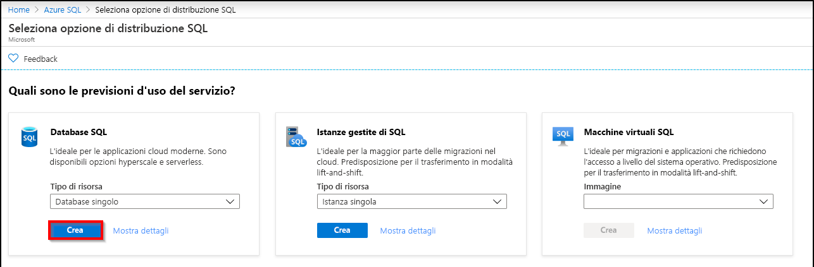
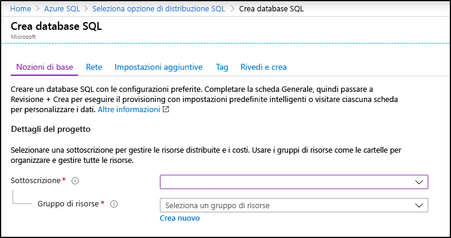
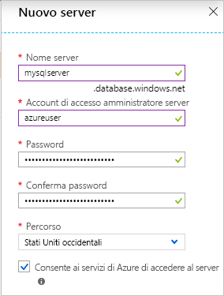
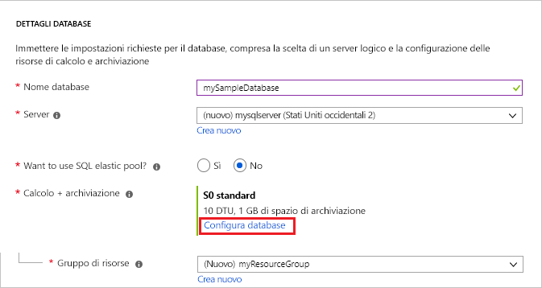
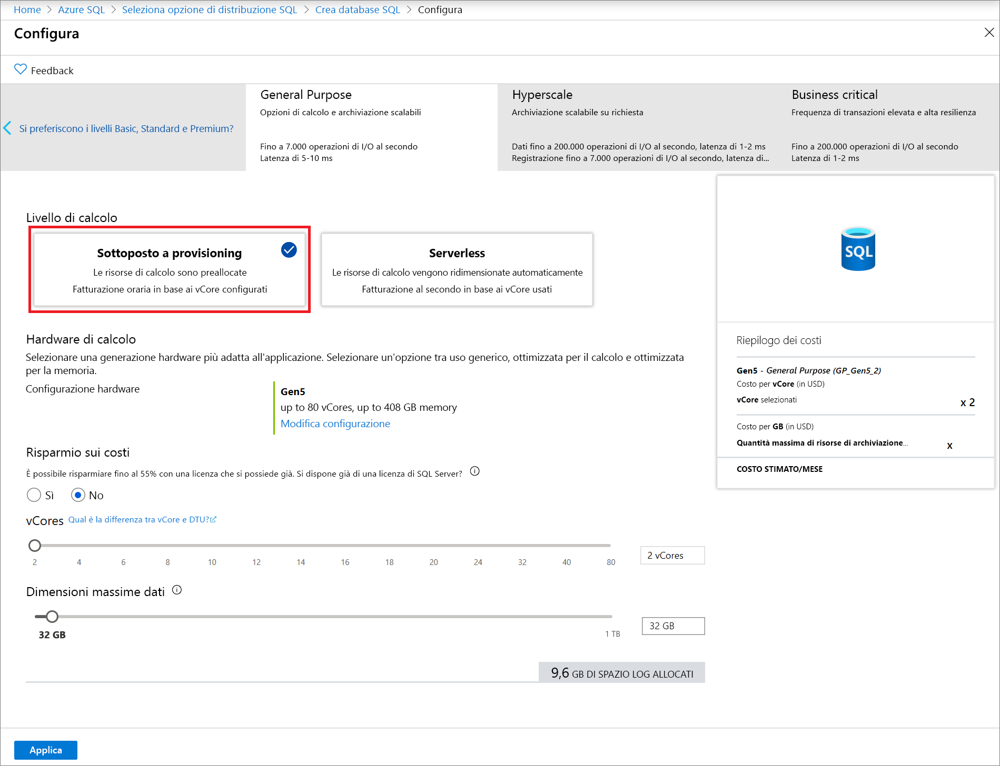
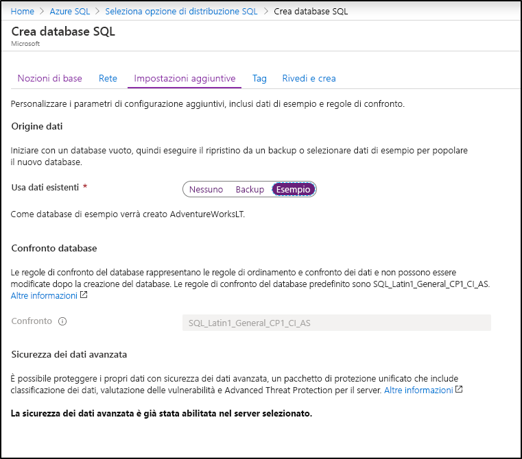

In questo passaggio si creerà un database singolo di Database SQL di Azure. 

> [!IMPORTANT]
> Assicurarsi di configurare le regole del firewall in modo da usare l'indirizzo IP pubblico del computer con cui si completano le procedure di questo articolo.
>
> Per informazioni, vedere [Creare una regola del firewall a livello di database](/sql/relational-databases/system-stored-procedures/sp-set-database-firewall-rule-azure-sql-database) oppure [Creare una regola del firewall a livello di server](../sql-database-server-level-firewall-rule.md) per determinare l'indirizzo IP usato per la regola del firewall a livello di server per il computer in uso.  

# <a name="portaltabazure-portal"></a>[Portale](#tab/azure-portal)

Creare il gruppo di risorse e il database singolo usando il portale di Azure.

1. Selezionare **Azure SQL** nel menu a sinistra nel [portale di Azure](https://portal.azure.com). Se **Azure SQL** non è presente nell'elenco, selezionare **Tutti i servizi** e quindi digitare *Azure SQL* nella casella di ricerca. (Facoltativo) Selezionare la stella accanto ad **Azure SQL** per aggiungerlo ai Preferiti e come elemento del riquadro di spostamento sinistro. 
2. Selezionare **+ Aggiungi** per aprire la pagina **Selezionare l'opzione di distribuzione SQL**. È possibile visualizzare informazioni aggiuntive sui diversi database selezionando **Mostra dettagli** nel riquadro **Database**.
3. Selezionare **Crea**:

   

3. Nella sezione **Dettagli del progetto** della scheda **Generale** digitare o selezionare i valori seguenti:

   - **Sottoscrizione** se non è già visualizzata, selezionare la sottoscrizione corretta nell'elenco a discesa.
   - **Gruppo di risorse**: selezionare **Crea nuovo**, digitare `myResourceGroup` e selezionare **OK**.

     

4. Nella sezione **Dettagli del database** digitare o selezionare i valori seguenti:

   - **Nome database**: Immettere `mySampleDatabase`.
   - **Server**: selezionare **Crea nuovo**, immettere i valori seguenti e quindi scegliere **Selezionare**.
       - **Nome server**: digitare `mysqlserver`, oltre ad alcuni numeri per garantire l'univocità.
       - **Account di accesso amministratore server**: Digitare `azureuser`.
       - **Password**: Digitare una password complessa che soddisfi i corrispondenti requisiti.
       - **Località**: scegliere una località dall'elenco a discesa, ad esempio `West US`.

         

      > [!IMPORTANT]
      > Ricordarsi di prendere nota dell'account di accesso amministratore del server e della password per poter accedere al server e ai database per questa e le altre guide introduttive. Se si dimentica l'account di accesso o la password, è possibile recuperare il nome di accesso o reimpostare la password nella pagina **SQL Server**. Per aprire la pagina **SQL Server**, selezionare il nome del server nella pagina **Panoramica** del database dopo che questo è stato creato.

   - **Usare il pool elastico SQL?** : selezionare l'opzione **No**.
   - **Calcolo e archiviazione**: selezionare **Configura database**. 

     

   - Selezionare **Provisioning effettuato** e **Gen5**.

     

   - Rivedere le impostazioni per **Numero massimo vCore**, **Numero minimo vCore**, **Ritardo di sospensione automatica** e **Dimensioni massime dati**. Modificare tali impostazioni in base alle esigenze.
   - Accettare le condizioni preliminari e fare clic su **OK**.
   - Selezionare **Applica**.

5. Selezionare la scheda **Impostazioni aggiuntive**. 
6. Nella sezione **Origine dati**, in **Usa dati esistenti**, selezionare `Sample`.

   

   > [!IMPORTANT]
   > Assicurarsi di selezionare i dati di **Sample (AdventureWorksLT)** per poter seguire questa e le altre guide introduttive per il database SQL di Azure in cui vengono usati tali dati.

7. Lasciare i restanti valori predefiniti e selezionare **Rivedi e crea** in basso nel modulo.
8. Rivedere le impostazioni finali e selezionare **Crea**.

9. Nel modulo **Database SQL** selezionare **Crea** per distribuire il gruppo di risorse, il server e il database ed effettuarne il provisioning.

# <a name="powershelltabazure-powershell"></a>[PowerShell](#tab/azure-powershell)

[!INCLUDE [updated-for-az](../../../includes/updated-for-az.md)]

Creare il gruppo di risorse e il database singolo usando PowerShell.

   ```powershell-interactive
   # Set variables for your server and database
   $subscriptionId = '<SubscriptionID>'
   $resourceGroupName = "myResourceGroup-$(Get-Random)"
   $location = "West US"
   $adminLogin = "azureuser"
   $password = "PWD27!"+(New-Guid).Guid
   $serverName = "mysqlserver-$(Get-Random)"
   $databaseName = "mySampleDatabase"

   # The ip address range that you want to allow to access your server 
   # (leaving at 0.0.0.0 will prevent outside-of-azure connections to your DB)
   $startIp = "0.0.0.0"
   $endIp = "0.0.0.0"

   # Show randomized variables
   Write-host "Resource group name is" $resourceGroupName 
   Write-host "Password is" $password  
   Write-host "Server name is" $serverName 

   # Connect to Azure
   Connect-AzAccount

   # Set subscription ID
   Set-AzContext -SubscriptionId $subscriptionId 

   # Create a resource group
   Write-host "Creating resource group..."
   $resourceGroup = New-AzResourceGroup -Name $resourceGroupName -Location $location -Tag @{Owner="SQLDB-Samples"}
   $resourceGroup

   # Create a server with a system wide unique server name
   Write-host "Creating primary logical server..."
   $server = New-AzSqlServer -ResourceGroupName $resourceGroupName `
      -ServerName $serverName `
      -Location $location `
      -SqlAdministratorCredentials $(New-Object -TypeName System.Management.Automation.PSCredential `
      -ArgumentList $adminLogin, $(ConvertTo-SecureString -String $password -AsPlainText -Force))
   $server

   # Create a server firewall rule that allows access from the specified IP range
   Write-host "Configuring firewall for primary logical server..."
   $serverFirewallRule = New-AzSqlServerFirewallRule -ResourceGroupName $resourceGroupName `
      -ServerName $serverName `
      -FirewallRuleName "AllowedIPs" -StartIpAddress $startIp -EndIpAddress $endIp
   $serverFirewallRule

   # Create General Purpose Gen4 database with 1 vCore
   Write-host "Creating a gen5 2 vCore database..."
   $database = New-AzSqlDatabase  -ResourceGroupName $resourceGroupName `
      -ServerName $serverName `
      -DatabaseName $databaseName `
      -Edition GeneralPurpose `
      -VCore 2 `
      -ComputeGeneration Gen5 `
      -MinimumCapacity 2 `
      -SampleName "AdventureWorksLT"
   $database
   ```

In questa parte dell'articolo si usano i cmdlet di PowerShell seguenti:

| Comando | Note |
|---|---|
| [New-AzResourceGroup](/powershell/module/az.resources/new-azresourcegroup) | Consente di creare un gruppo di risorse in cui sono archiviate tutte le risorse. |
| [New-AzSqlServer](/powershell/module/az.sql/new-azsqlserver) | Crea un server di database SQL che ospita database singoli e pool elastici. |
| [New-AzSqlServerFirewallRule](/powershell/module/az.sql/new-azsqlserverfirewallrule) | Crea una regola del firewall per un server logico. | 
| [New-AzSqlDatabase](/powershell/module/az.sql/new-azsqldatabase) | Crea un nuovo database singolo di Database SQL di Azure. | 

# <a name="azure-clitabazure-cli"></a>[Interfaccia della riga di comando di Azure](#tab/azure-cli)

Creare il gruppo di risorse e il database singolo usando l'interfaccia della riga di comando AZ.

   ```azurecli-interactive
   #!/bin/bash
   # Set variables
   subscriptionID=<SubscriptionID>
   resourceGroupName=myResourceGroup-$RANDOM
   location=SouthCentralUS
   adminLogin=azureuser
   password="PWD27!"+`openssl rand -base64 18`
   serverName=mysqlserver-$RANDOM
   databaseName=mySampleDatabase
   drLocation=NorthEurope
   drServerName=mysqlsecondary-$RANDOM
   failoverGroupName=failovergrouptutorial-$RANDOM

   # The ip address range that you want to allow to access your DB. 
   # Leaving at 0.0.0.0 will prevent outside-of-azure connections to your DB
   startip=0.0.0.0
   endip=0.0.0.0
  
   # Connect to Azure
   az login

   # Set the subscription context for the Azure account
   az account set -s $subscriptionID

   # Create a resource group
   echo "Creating resource group..."
   az group create \
      --name $resourceGroupName \
      --location $location \
      --tags Owner[=SQLDB-Samples]

   # Create a logical server in the resource group
   echo "Creating primary logical server..."
   az sql server create \
      --name $serverName \
      --resource-group $resourceGroupName \
      --location $location  \
      --admin-user $adminLogin \
      --admin-password $password

   # Configure a firewall rule for the server
   echo "Configuring firewall..."
   az sql server firewall-rule create \
      --resource-group $resourceGroupName \
      --server $serverName \
      -n AllowYourIp \
      --start-ip-address $startip \
      --end-ip-address $endip

   # Create a gen5 1vCore database in the server 
   echo "Creating a gen5 2 vCore database..."
   az sql db create \
      --resource-group $resourceGroupName \
      --server $serverName \
      --name $databaseName \
      --sample-name AdventureWorksLT \
      --edition GeneralPurpose \
      --family Gen5 \
      --capacity 2
   ```

Questo script usa i comandi seguenti. Ogni comando della tabella include collegamenti alla documentazione specifica del comando.

| Comando | Note |
|---|---|
| [az account set](/cli/azure/account?view=azure-cli-latest#az-account-set) | Imposta una sottoscrizione come sottoscrizione attiva corrente. | 
| [az group create](/cli/azure/group#az-group-create) | Consente di creare un gruppo di risorse in cui sono archiviate tutte le risorse. |
| [az sql server create](/cli/azure/sql/server#az-sql-server-create) | Crea un server di database SQL che ospita database singoli e pool elastici. |
| [az sql server firewall-rule create](/cli/azure/sql/server/firewall-rule) | Crea le regole del firewall di un server. | 
| [az sql db create](/cli/azure/sql/db?view=azure-cli-latest) | Crea un database. | 


---
