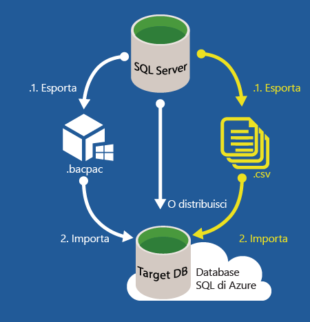
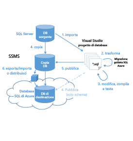

<properties
   pageTitle="Migrazione di un database SQL Server nel database SQL di Azure"
   description="Database SQL di Microsoft Azure, distribuzione del database, migrazione del database, importazione del database, esportazione del database, migrazione guidata"
   services="sql-database"
   documentationCenter=""
   authors="carlrabeler"
   manager="jeffreyg"
   editor=""/>

<tags
   ms.service="sql-database"
   ms.devlang="NA"
   ms.topic="article"
   ms.tgt_pltfrm="NA"
   ms.workload="data-management"
   ms.date="10/12/2015"
   ms.author="carlrab"/>

# Migrazione di un database SQL Server nel database SQL di Azure

Lo spostamento del database locale al database SQL di Azure presenta vari aspetti complessi che dipendono dalle caratteristiche di progettazione dell'applicazione e del database e dalla tolleranza per i tempi di inattività. Per i database compatibili, la migrazione al database SQL di Azure è un'operazione di spostamento semplice che richiede poche modifiche allo schema e ai dati, con una minima o addirittura nessuna attività di riprogettazione dello schema e delle applicazioni. La [versione 12 del database SQL di Azure](../sql-database-v12-whats-new.md) offre una compatibilità quasi completa con SQL Server 2014 e SQL Server 2016. La maggior parte delle istruzioni relative a Transact-SQL di SQL Server 2016 sono completamente supportate nel database SQL di Microsoft Azure. Sono inclusi i tipi di dati di SQL Server, operatori e la stringa, funzioni aritmetiche, logiche e di cursore e gli altri elementi Transact-SQL da cui dipende la maggior parte delle applicazioni. Alcune funzioni non sono supportate o sono supportate parzialmente poiché il database SQL gestisce il database in modo diverso (ad esempio file, disponibilità elevata e funzionalità di sicurezza) o per le funzionalità speciali, ad esempio Service broker. Poiché il database SQL isola molte funzionalità dalla dipendenza nel database master, molte attività a livello di server sono inappropriate e non supportate. Le funzionalità deprecate in SQL Server in genere non sono supportate nel database SQL. I database e le applicazioni basate su [funzionalità non supportate o supportate parzialmente](../sql-database-transact-sql-information.md) dovranno essere riprogettate prima della migrazione.

Ecco il flusso di lavoro per la migrazione di un database SQL Server nel database SQL di Azure:

 1. [Determinare se il database è compatibile](#determine-if-your-database-is-compatible)
 2. [Se non è compatibile, risolvere i problemi di compatibilità del database](#fix-database-compatibility-issues)
 3. [Eseguire la migrazione di un database compatibile](#options-to-migrate-a-compatible-database-to-azure-sql-database)

>[AZURE.NOTE]Per eseguire la migrazione di altri tipi di database, inclusi Microsoft Access, Sybase, MySQL Oracle e DB2 nel database SQL di Azure, vedere il post di blog su [SQL Server Migration Assistant](http://blogs.msdn.com/b/ssma/).

## Determinare se il database è compatibile
È possibile usare due metodi principali per determinare se il database di origine è compatibile. - Esporta l'applicazione livello dati: questo metodo usa una procedura guidata in Management Studio per analizzare il database e visualizza nella console gli eventuali problemi di compatibilità del database. - SQLPackage: questo metodo usa l'utilità della riga di comando SQLPackage.exe [sqlpackage.exe](https://msdn.microsoft.com/library/hh550080.aspx) per analizzare il database e generare un report. SQLPackage è disponibile sia in Visual Studio che in SQL Server.

> [AZURE.NOTE]È disponibile un terzo metodo che usa i file di traccia come informazioni di origine aggiuntiva per verificare la compatibilità a livello di applicazione e a livello di database. Si tratta della [Migrazione guidata SQL Azure](http://sqlazuremw.codeplex.com/), uno strumento gratuito su Codeplex. È tuttavia possibile che questo strumento individui errori di compatibilità che costituiscono un problema per la versione 11 del database SQL di Azure, ma non vengono considerati invece errori per la versione 12 del database SQL di Azure.

Se vengono rilevate incompatibilità del database, sarà necessario correggerle prima di eseguire la migrazione del database al database SQL di Azure. Per indicazioni su come risolvere i problemi di compatibilità del database, passare a [Risolvere i problemi di compatibilità del database](#fix-database-compatibility-issues).

> [AZURE.IMPORTANT]Queste opzioni non rilevano tutti i problemi di compatibilità tra diversi livelli di database SQL Server, ad esempio di livello 90, 100 e 110. Se si esegue la migrazione da un database precedente (livello 80, 90, 100 e 110), è consigliabile eseguire prima di tutto il processo di aggiornamento, almeno nell'ambiente di sviluppo, e dopo il passaggio a SQL Server 2014 o versioni successive eseguire la migrazione al database SQL di Azure.

## Determinare se il database è compatibile mediante sqlpackage.exe

1. Aprire un prompt dei comandi e passare a una directory contenente la versione più recente di sqlpackage.exe. Questa utilità è disponibile sia in Visual Studio che in SQL Server. È inoltre possibile [scaricare](https://msdn.microsoft.com/library/mt204009.aspx) la versione più recente di SQL Server Data Tools per ottenere questa utilità.
2. Eseguire il comando sqlpackage.exe riportato di seguito con gli argomenti seguenti per l'ambiente:

	'sqlpackage.exe /Action:Export /ssn:< server_name > /sdn:< database_name > /tf:< target_file > /p:TableData=< schema_name.table_name > > < output_file > 2>&1'

	| Argomento | Descrizione |
	|---|---|
	| < server_name > | nome server di origine |
	| < database_name > | nome database di origine |
	| < target_file > | nome e percorso del file BACPAC |
	| < schema_name.table_name > | tabelle per cui i dati verranno restituiti nel file di destinazione |
	| < output_file > | nome e percorso del file di output con eventuali errori |

	L'argomento /p:TableName viene usato per indicare che si vuole testare la compatibilità del database solo per l'esportazione nella versione 12 del database SQL di Azure, invece di esportare i dati da tutte le tabelle. Sfortunatamente, l'argomento di esportazione per sqlpackage.exe non consente di evitare l'esportazione di tabelle, quindi sarà necessario specificare una singola tabella di piccole dimensioni. < output_file > includerà il report relativo a eventuali errori. La stringa "> 2>&1" indirizza sia l'output standard che l'errore standard risultante dall'esecuzione del comando al file di output specificato.

	

3. Aprire il file di output ed esaminare gli eventuali errori di compatibilità. Per indicazioni su come risolvere i problemi di compatibilità del database, passare a [Risolvere i problemi di compatibilità del database](#fix-database-compatibility-issues).

	

## Determinare se il database è compatibile mediante Esporta l'applicazione livello dati

1. Verificare che la versione di SQL Server Management Studio disponibile sia 13.0.600.65 o successiva. Le nuove versioni di Management Studio vengono aggiornate ogni mese per rimanere sincronizzate con gli aggiornamenti apportati al portale di Azure classico.

 	 >[AZURE.IMPORTANT]Scaricare la versione [più recente](https://msdn.microsoft.com/library/mt238290.aspx) di SQL Server Management Studio. È consigliabile usare sempre la versione più aggiornata di Management Studio.

2. Aprire Management Studio e connettersi al database di origine in Esplora oggetti.
3. Fare clic con il pulsante destro del mouse sul database di origine in Esplora oggetti, scegliere **Attività** e quindi fare clic su **Esporta l'applicazione livello dati**.

	

4. Nell'esportazione guidata fare clic su **Avanti** e quindi nella scheda **Impostazioni** configurare l'esportazione per salvare il file BACPAC su un percorso disco locale o in un BLOB di Azure. Un file BACPAC verrà salvato solo se non sono presenti problemi di compatibilità del database. Eventuali problemi di compatibilità verranno visualizzati nella console.

	

5. Fare clic sulla scheda **Avanzate** e deselezionare la casella di controllo **Seleziona tutto** per evitare l'esportazione dei dati. In questa fase l'obiettivo principale consiste nella verifica della compatibilità.

	

6. Fare clic su **Avanti** e quindi su **Fine**. Eventuali problemi di compatibilità verranno visualizzati dopo la convalida dello schema da parte della procedura guidata.

	

7. Se non vengono visualizzati errori, il database sarà compatibile e sarà possibile iniziare la migrazione. Se sono presenti errori, sarà necessario risolverli. Per visualizzare gli errori, fare clic su **Errore** per **Convalida schema**. Per informazioni su come risolvere questi errori, vedere [Risolvere i problemi di compatibilità del database](#fix-database-compatibility-issues).

	

8.	Se il file *.BACPAC è stato generato, il database è compatibile con il database SQL ed è possibile eseguire la migrazione.

## Opzioni per la migrazione di un database compatibile nel database SQL di Azure

Dopo aver verificato di disporre di un database compatibile, è necessario scegliere il metodo di migrazione. Innanzitutto, è necessario decidere se è opportuno portare il database fuori produzione durante la migrazione. In caso contrario, usare la replica delle transazioni di SQL Server illustrata di seguito. Se è possibile sostenere i tempi di inattività o si esegue una migrazione di test del database di produzione di cui in un secondo momento è possibile eseguire la migrazione tramite la replica transazionale, considerare uno dei tre metodi seguenti.

### Migrazione di un database compatibile con tempi di inattività   
L'elenco seguente illustra le opzioni per la migrazione di un database compatibile al database SQL di Azure quando è possibile sostenere tempi di inattività durante la migrazione e prima di indirizzare utenti e applicazioni al database migrato nel database SQL di Azure. Con questi metodi, si esegue la migrazione del database esistente in un determinato momento.

> [AZURE.WARNING]Prima di eseguire la migrazione del database mediante uno di questi metodi, assicurarsi che non siano attive transazioni, in modo da garantire la coerenza transazionale durante la migrazione. Per disattivare un database sono disponibili vari metodi, dalla disabilitazione della connettività client alla creazione di uno [snapshot del database](https://msdn.microsoft.com/library/ms175876.aspx).

- Per i database di piccole e medie dimensioni, la migrazione di database [compatibili](#determine-if-your-database-is-compatible) con SQL Server 2005 o versioni successive è semplice quanto l'esecuzione della [distribuzione guidata del database al database SQL di Microsoft Azure](#use-the-deploy-database-to-microsoft-azure-database-wizard) in SQL Server Management Studio. In caso di problemi di connettività, ovvero nessuna connettività, larghezza di banda ridotta o problemi di timeout, è possibile [usare un file BACPAC per la migrazione](#use-a-bacpac-to-migrate-a-database-to-azure-sql-database) di un database SQL Server al database SQL di Azure.
- Per database di medie e grandi dimensioni o in caso di problemi di connettività, [usare un file BACPAC per la migrazione](#use-a-bacpac-to-migrate-a-database-to-azure-sql-database) di un database SQL Server al database SQL di Azure. Questo metodo consente di usare SQL Server Management Studio per esportare i dati e lo schema in un file [BACPAC](https://msdn.microsoft.com/library/ee210546.aspx#Anchor_4) (archiviato localmente o in un BLOB di Azure) e quindi di importare il file BACPAC nell'istanza del database SQL di Azure. Se si archivia il file BACPAC in un BLOB di Azure, è inoltre possibile importare il file BACPAC dal [portale di Azure classico](sql-database-import.md) o [mediante PowerShell](sql-database-import-powershell.md).
- Per i database di grandi dimensioni, si otterranno migliori prestazioni migrando lo schema e i dati separatamente. Con questo metodo, creare un [file BACPAC senza dati](#use-a-bacpac-to-migrate-a-database-to-azure-sql-database) e importare tale file nel database SQL di Azure. Dopo l'importazione dello schema nel database SQL di Azure, usare [BCP](https://msdn.microsoft.com/library/ms162802.aspx) per estrarre i dati in file flat e quindi importarli nel database SQL di Azure.

	 

### Migrazione di un database compatibile senza tempi di inattività

Quando non è possibile rimuovere il database SQL Server dalla produzione quando è in corso la migrazione, è possibile usare la replica transazionale di SQL Server come soluzione di migrazione. Con la replica transazionale, tutte le modifiche ai dati o agli schemi che si verificano tra il momento in cui inizia la migrazione e quello in cui viene completata vengono visualizzate nel database SQL di Azure. Una volta completata la migrazione, è sufficiente modificare la stringa di connessione delle applicazioni in modo che puntino al database SQL di Azure anziché al database locale. Una volta che la replica transazionale completa le eventuali modifiche rimaste nel database locale e tutte le applicazioni puntano al database di Azure, è possibile disinstallare la replica lasciando il database SQL di Azure come sistema di produzione.

 

La replica transazionale è una tecnologia integrata in SQL Server a partire dalla versione 6.5. Si tratta di una tecnologia sperimentata e consolidata che la maggior parte degli amministratori di database conosce e con cui hanno esperienza. Con l'[anteprima di SQL Server 2016](http://www.microsoft.com/server-cloud/products/sql-server-2016/), è ora possibile configurare il database SQL di Azure come [sottoscrittore di replica transazionale](https://msdn.microsoft.com/library/mt589530.aspx) alla pubblicazione locale. L'esperienza che si ottiene impostando il database da Management Studio è identica alla configurazione di un sottoscrittore di replica transazionale in un server locale. Il supporto per questo scenario viene fornito con le versioni di SQL Server seguenti:

 - SQL Server 2016 CTP3 (anteprima) e versioni successive 
 - SQL Server 2014 SP1 CU3 e versioni successive
 - SQL Server 2014 RTM CU10 e versioni successive
 - SQL Server 2012 SP2 CU8 e versioni successive
 - SQL Server 2013 SP3 quando verrà rilasciata

È inoltre possibile usare la replica transazionale per eseguire la migrazione di un subset del database locale. La pubblicazione di cui si esegue la replica nel database SQL di Azure può essere limitata a un subset delle tabelle nel database replicato. Inoltre, per ogni tabella replicata, è possibile limitare i dati a un subset di righe e/o di colonne.

## Usare Distribuisci il database nel database SQL di Microsoft Azure

La procedura guidata Distribuisci il database nel database SQL di Microsoft Azure in SQL Server Management Studio esegue la migrazione di un database [compatibile](#determine-if-your-database-is-compatible) di SQL Server 2005 o versioni successive direttamente nell'istanza del server logico del database SQL di Azure.

> [AZURE.NOTE]Il passaggio precedente presuppone che sia già stato effettuato il [provisioning](../sql-database-get-started.md) dell'istanza logica del database SQL di Azure e che le informazioni di connessione siano disponibili.

1. Verificare che la versione di SQL Server Management Studio disponibile sia 13.0.600.65 o successiva. Le nuove versioni di Management Studio vengono aggiornate ogni mese per rimanere sincronizzate con gli aggiornamenti apportati al portale di Azure classico.

	 >[AZURE.IMPORTANT]Scaricare la versione [più recente](https://msdn.microsoft.com/library/mt238290.aspx) di SQL Server Management Studio. È consigliabile usare sempre la versione più aggiornata di Management Studio.

2. Aprire Management Studio e connettersi al database di origine in Esplora oggetti.
3. Fare clic con il pulsante destro del mouse sul database di origine in Esplora oggetti, scegliere **Attività**, quindi fare clic su **Distribuisci il database nel database SQL di Microsoft Azure**.

	

4.	Nella distribuzione guidata fare clic su **Avanti** e quindi su **Connetti** configurare la connessione al server del database SQL di Azure.

	

5. Nella finestra di dialogo Connetti al server immettere le informazioni di connessione, per connettersi al server del database SQL di Azure.

	

5.	Specificare **Nome nuovo database** per il database nel database SQL di Azure, impostare **Edizione del database SQL di Microsoft Azure** (livello del servizio), **Dimensioni massime database**, **Obiettivo servizio** (livello di prestazioni) e **Nome file temporaneo** per il file BACPAC creato dalla procedura guidata durante il processo di migrazione. Per altre informazioni sui livelli di servizio e sui livelli di prestazioni, vedere [Livelli di servizio del database SQL di Azure](sql-database-service-tiers.md).

	

6.	Completare la procedura guidata per la migrazione del database. A seconda delle dimensioni e della complessità del database la distribuzione può richiedere da pochi minuti a diverse ore.
7.	Usando Esplora oggetti, connettersi al database sottoposto a migrazione nel server del database SQL di Azure.
8.	Usando il portale di Azure classico visualizzare il database e le relative proprietà.

## Usare un file BACPAC per eseguire la migrazione di un database SQL Server nel database SQL di Azure

Per database di medie e grandi dimensioni o in caso di problemi di connettività, è possibile suddividere il processo di migrazione in due passaggi distinti. È possibile esportare lo schema e i relativi dati in un file [BACPAC](https://msdn.microsoft.com/library/ee210546.aspx#Anchor_4) usando uno o due metodi.

- [Eseguire l'esportazione in un file BACPAC mediante SQL Server Management Studio](#export-a-compatible-sql-server-database-to-a-bacpac-file-using-sql-server-management-studio)
- [Eseguire l'esportazione in un file BACPAC mediante SqlPackage](#export-a-compatible-sql-server-database-to-a-bacpac-file-using-sqlpackage)

È possibile archiviare questo file BACPAC localmente o in un BLOB di Azure. È quindi possibile importare il file BACPAC nel database SQL di Azure usando uno dei molti metodi disponibili.

- [Eseguire l'importazione da un file BACPAC al database SQL di Azure mediante SQL Server Management Studio](#import-from-a-bacpac-file-into-azure-sql-database-using-sql-server-management-studio)
- [Eseguire l'importazione da un file BACPAC al database SQL di Azure mediante SqlPackage](#import-from-a-bacpac-file-into-azure-sql-database-using-sqlpackage)
- [Eseguire l'importazione da un file BACPAC al database SQL di Azure mediante il portale di Azure classico](sql-database-import.md)
- [Eseguire l'importazione da un file BACPAC al database SQL di Azure mediante PowerShell](sql-database-import-powershell.md)

## Esportare un database SQL Server compatibile in un file BACPAC mediante SQL Server Management Studio

Seguire questa procedura per usare Management Studio per esportare un database SQL Server [compatibile](#determine-if-your-database-is-compatible) in un file BACPAC.

1. Verificare che la versione di SQL Server Management Studio disponibile sia 13.0.600.65 o successiva. Le nuove versioni di Management Studio vengono aggiornate ogni mese per rimanere sincronizzate con gli aggiornamenti apportati al portale di Azure classico.

	 >[AZURE.IMPORTANT]Scaricare la versione [più recente](https://msdn.microsoft.com/library/mt238290.aspx) di SQL Server Management Studio. È consigliabile usare sempre la versione più aggiornata di Management Studio.

2. Aprire Management Studio e connettersi al database di origine in Esplora oggetti.

	

3. Fare clic con il pulsante destro del mouse sul database di origine in Esplora oggetti, scegliere **Attività** e quindi fare clic su **Esporta l'applicazione livello dati**.

	

4. Nell'esportazione guidata configurare l'esportazione per salvare il file BACPAC in un percorso sul disco locale o in un BLOB di Azure. Il file BACPAC esportato include sempre lo schema di database completo e, per impostazione predefinita, i dati di tutte le tabelle. Se si desidera escludere i dati da alcune o tutte le tabelle, utilizzare la scheda Avanzate. È ad esempio possibile scegliere di esportare solo i dati per le tabelle di riferimento, invece che da tutte le tabelle.

	

## Esportare un database SQL Server compatibile in un file BACPAC mediante SqlPackage

Seguire questa procedura per usare l'utilità da riga di comando [SqlPackage.exe](https://msdn.microsoft.com/library/hh550080.aspx) per esportare un database [compatibile](#determine-if-your-database-is-compatible) in un file BACPAC.

> [AZURE.NOTE]I passaggi seguenti presuppongono che sia già stato effettuato il provisioning di un server del database SQL di Azure, le informazioni di connessione siano disponibili e sia stata verificati la compatibilità del database di origine.

1. Aprire un prompt dei comandi e passare a una directory contenente l'utilità da riga di comando sqlpackage.exe, disponibile in Visual Studio e SQL Server.
2. Eseguire il comando sqlpackage.exe riportato di seguito con gli argomenti seguenti per l'ambiente:

	'sqlpackage.exe /Action:Export /ssn:< server_name > /sdn:< database_name > /tf:< target_file >

	| Argomento | Descrizione |
	|---|---|
	| < server_name > | nome server di origine |
	| < database_name > | nome database di origine |
	| < target_file > | nome e percorso del file BACPAC |

	

## Eseguire l'importazione da un file BACPAC al database SQL di Azure mediante SQL Server Management Studio

Eseguire i passaggi seguenti per eseguire l'importazione da un file BACPAC nel database SQL di Azure.

> [AZURE.NOTE]Il passaggio precedente presuppone che sia già stato effettuato il provisioning dell'istanza logica del database SQL di Azure e che le informazioni di connessione siano disponibili.

1. Verificare che la versione di SQL Server Management Studio disponibile sia 13.0.600.65 o successiva. Le nuove versioni di Management Studio vengono aggiornate ogni mese per rimanere sincronizzate con gli aggiornamenti apportati al portale di Azure classico.

	> [AZURE.IMPORTANT]Scaricare la versione [più recente](https://msdn.microsoft.com/library/mt238290.aspx) di SQL Server Management Studio. È consigliabile usare sempre la versione più aggiornata di Management Studio.

2. Aprire Management Studio e connettersi al database di origine in Esplora oggetti.

	

3. Dopo aver creato il file BACPAC, connettersi al server del database SQL di Azure, fare clic con il pulsante destro del mouse sulla cartella **Database** e quindi scegliere **Importa applicazione livello dati**.

    

4.	Nell’importazione guidata selezionare il file BACPAC appena esportato per creare il nuovo database in database SQL di Azure.

    

5.	Specificare **Nome nuovo database** per il database nel database SQL di Azure, impostare **Edizione del database SQL di Microsoft Azure** (livello del servizio), **Dimensioni massime database** e **Obiettivo servizio** (livello di prestazioni).

    

6.	Fare clic su **Avanti** e quindi su **Fine** per importare il file BACPAC in un nuovo database nel server del database SQL di Azure.

7. Usando Esplora oggetti, connettersi al database sottoposto a migrazione nel server del database SQL di Azure.

8.	Usando il portale di Azure classico visualizzare il database e le relative proprietà.

## Eseguire l'importazione da un file BACPAC al database SQL di Azure mediante SqlPackage

Eseguire i passaggi seguenti per usare l'utilità da riga di comando [SqlPackage.exe](https://msdn.microsoft.com/library/hh550080.aspx) per importare un database SQL Server compatibile o un database SQL di Azure da un file BACPAC.

> [AZURE.NOTE]Il passaggio precedente presuppone che sia già stato effettuato il provisioning di un server del database SQL di Azure e che le informazioni di connessione siano disponibili.

1. Aprire un prompt dei comandi e passare a una directory contenente l'utilità da riga di comando sqlpackage.exe, disponibile in Visual Studio e SQL Server.
2. Eseguire il comando sqlpackage.exe riportato di seguito con gli argomenti seguenti per l'ambiente:

	'sqlpackage.exe /Action:Import /tsn:< server_name > /tdn:< database_name > /tu:< user_name > /tp:< password > /sf:< source_file >

	| Argomento | Descrizione |
	|---|---|
	| < server_name > | nome server di destinazione |
	| < database_name > | nome database di destinazione |
	| < user_name > | nome utente nel server di destinazione |
	| < password > | password utente |
	| < source_file > | nome e percorso del file BACPAC importato |

	

## Risolvere i problemi di compatibilità del database

Se si determina che il database SQL Server di origine non è compatibile, sarà possibile risolvere in diversi modi i problemi di compatibilità [identificati in precedenza](#determine-if-your-database-is-compatible).

- Usare la [migrazione guidata di SQL Azure](http://sqlazuremw.codeplex.com/). È possibile usare questo strumento Codeplex per generare uno script T-SQL da un database di origine non compatibile che viene quindi trasformato dalla procedura guidata per renderlo compatibile con il database SQL e quindi effettuare la connessione al database SQL di Azure per eseguire lo script. Questo strumento analizzerà anche i file di traccia per determinare i problemi di compatibilità. Lo script può essere generato solo con lo schema o può includere dati in formato BCP. Per documentazione aggiuntiva, incluse indicazioni dettagliate, vedere la [migrazione guidata del database SQL di Azure](http://sqlazuremw.codeplex.com/) su Codeplex.  

 

 >[AZURE.NOTE]Si noti che non tutti gli schemi incompatibili che possono essere rilevati dalla procedura guidata, possono essere elaborati dalla relativa funzionalità di trasformazione incorporata. Script incompatibili che non possono essere corretti verranno segnalati come errori con i commenti inseriti nello script generato. Se vengono rilevati molti errori, usare Visual Studio o SQL Server Management Studio per esaminare e risolvere ogni errore che non è stato risolto mediante la migrazione guidata di SQL Server.

- Usare Visual Studio. È possibile usare Visual Studio per importare lo schema del database in un progetto database di Visual Studio per l'analisi. Per eseguire l’analisi, specificare Database SQL versione 12 come piattaforma di destinazione per il progetto, quindi compilare il progetto. Se la compilazione ha esito positivo, il database è compatibile. Se la compilazione ha esito negativo, è possibile risolvere gli errori con SQL Server Data Tools per Visual Studio ("SSDT"). Una volta creato il progetto, è possibile pubblicarlo nuovamente come una copia del database di origine e quindi utilizzare la funzione di confronto di dati in SSDT per copiare i dati dal database di origine al database compatibile alla versione 12 di SQL Azure. Il database aggiornato viene quindi distribuito nel database SQL di Azure mediante le opzioni [illustrate in precedenza](#options-to-migrate-a-compatible-database-to-azure-sql-database).

 

 >[AZURE.NOTE]Se è necessario eseguire la migrazione solo dello schema, è possibile pubblicarlo direttamente da Visual Studio nel database SQL di Azure. Utilizzare questo metodo quando lo schema del database richiede altre modifiche che è possibile gestire solo attraverso la migrazione guidata.

- SQL Server Management Studio. È possibile risolvere i problemi in Management Studio usando alcuni comandi Transact-SQL, ad esempio **ALTER DATABASE**.

<!---HONumber=AcomDC_1203_2015-->