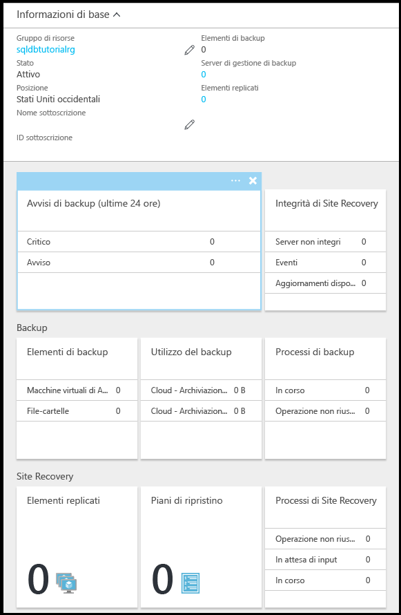

# Configurare la conservazione a lungo termine di backup automatizzati in un insieme di credenziali di Servizi di ripristino di Azure 

Questa procedura illustra come configurare la conservazione a lungo termine dei backup automatizzati in un insieme di credenziali di Servizi di ripristino di Azure.

## Configurare la conservazione a lungo termine nel portale di Azure

1. Aprire il pannello **SQL Server** per il server in uso.

    

2. Fare clic su **Conservazione backup a lungo termine**.

   

3. Nel pannello **Conservazione del backup a lungo termine** leggere e accettare le condizioni preliminari (se non sono già state accettate o se questa funzionalità non è più in versione di anteprima).

   

4. Per configurare la conservazione a lungo termine dei backup per un database, selezionare il database nella griglia e quindi fare clic su **Configura** sulla barra degli strumenti.

   

5. Nel pannello **Configura** fare clic su **Configura le impostazioni obbligatorie** in **Insiemi di credenziali dei servizi di ripristino**.

   

6. Nel pannello **Insiemi di credenziali dei servizi di ripristino** selezionare un insieme di credenziali esistente, se disponibile. In caso contrario, se per la propria sottoscrizione non è presente alcun insieme di credenziali dei servizi di ripristino, fare clic per chiudere il flusso e creare un insieme di credenziali dei servizi di ripristino.

   

7. Nel pannello **Insiemi di credenziali dei servizi di ripristino** fare clic su **Aggiungi**.

   
   
8. Nel pannello **Insiemi di credenziali dei servizi di ripristino** specificare un nome valido per il nuovo insieme di credenziali dei servizi di ripristino.

   

9. Selezionare la propria sottoscrizione e il relativo gruppo di risorse e quindi specificare il percorso per l'insieme di credenziali. Al termine, fare clic su **Crea**.

   

   > [!IMPORTANT]
   > L'insieme di credenziali deve trovarsi nella stessa area del server logico di Azure SQL e deve usare lo stesso gruppo di risorse del server logico.
   >

10. Dopo aver creato il nuovo insieme di credenziali, eseguire i passaggi necessari per tornare al pannello **Insiemi di credenziali dei servizi di ripristino**.

11. Nel pannello **Insiemi di credenziali dei servizi di ripristino** fare clic sull'insieme di credenziali e quindi fare clic su **Seleziona**.

   

12. Nel pannello **Configura** specificare un nome valido per il nuovo criterio di conservazione, modificare i criteri di conservazione predefiniti in base alle esigenze e quindi fare clic su **OK**.

   

13. Nel pannello **Conservazione del backup a lungo termine** fare clic su **Salva** e quindi fare clic su **OK** per applicare i criteri di conservazione dei backup a lungo termine a tutti i database selezionati.

   

14. Fare clic su **Salva** per abilitare la conservazione dei backup a lungo termine usando i nuovi criteri per l'insieme di credenziali di Servizi di ripristino di Azure appena configurato.

   

14. Dopo aver abilitato la conservazione dei backup a lungo termine, aprire il pannello **Insieme di credenziali dei servizi di ripristino** (andare a **Tutte le risorse** ed eseguire la selezione dall'elenco di risorse per la propria sottoscrizione).

   

> [!TIP]
> Per un'esercitazione, vedere [Introduzione a Backup e ripristino per la protezione dei dati e il ripristino](sql-database-get-started-backup-recovery.md)
>

## Passaggi successivi

- Per ripristinare un database da un backup con conservazione a lungo termine, vedere [Eseguire il ripristino da un backup con conservazione a lungo termine](sql-database-restore-from-long-term-retention.md)
- Per visualizzare i backup nell'insieme di credenziali di Servizi di ripristino di Azure, vedere [Visualizzare i backup con conservazione a lungo termine](sql-database-view-backups-in-vault.md)
- Per altre informazioni sui backup automatici generati dal servizio, vedere [backup automatici](: https://azure.microsoft.com/en-us/documentation/articles/)sql-database-automated-backups.MD)
- Per altre informazioni sulla conservazione dei backup a lungo termine, vedere [conservazione dei backup a lungo termine](sql-database-long-term-retention.md)
- Per altre informazioni sul ripristino da backup, vedere [ripristino dal backup](sql-database-recovery-using-backups.md)

<!--HONumber=Dec16_HO2-->

