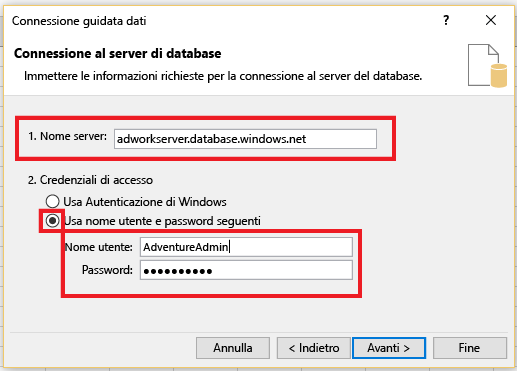
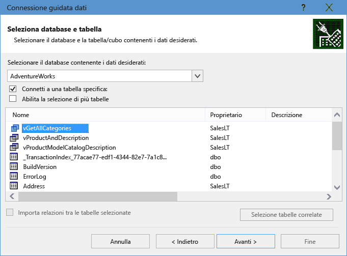
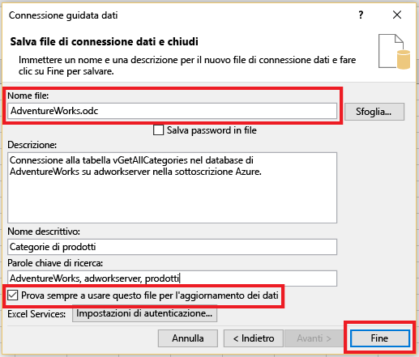
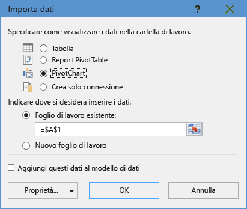
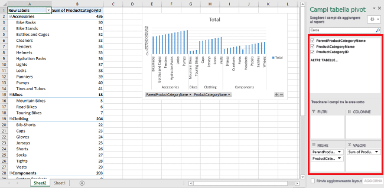
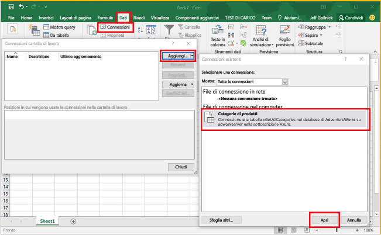

<properties
	pageTitle="Connettere Excel al database SQL | Microsoft Azure"
	description="Informazioni su come connettere Microsoft Excel al database SQL di Azure nel cloud. Importare i dati in Excel per creare report ed esplorare i dati."
	services="sql-database"
	keywords="connettere Excel a SQL, importare i dati in Excel"
	documentationCenter=""
	authors="joseidz"
	manager="jhubbard"
	editor=""/>

<tags
	ms.service="sql-database"
	ms.workload="data-management"
	ms.tgt_pltfrm="na"
	ms.devlang="na"
	ms.topic="get-started-article"
	ms.date="03/25/2016"
	ms.author="joseidz"/>

# Esercitazione sul database SQL: Connettere Excel a un database SQL di Azure e creare un report

> [AZURE.SELECTOR]
- [C#](sql-database-connect-query.md)
- [SSMS](sql-database-connect-query-ssms.md)
- [Excel](sql-database-connect-excel.md)

Informazioni su come connettere Excel a un database SQL nel cloud per importare dati e creare tabelle e grafici in base ai valori nel database. In questa esercitazione sarà necessario configurare la connessione tra Excel e una tabella di database, salvare il file che archivia i dati e le informazioni di connessione per Excel e quindi creare un grafico pivot dai valori del database.

Per iniziare, è necessario un database SQL in Azure. Se non ne è già stato creato uno, vedere [Creare il primo database SQL di Azure](sql-database-get-started.md) per ottenere un database con dati di esempio operativo in pochi minuti. Questo articolo descrive come importare i dati di esempio in Excel, ma è anche possibile seguire la procedura usando dati personalizzati.

Sarà necessaria anche una copia di Excel. In questa esercitazione viene usato [Microsoft Excel 2016](https://products.office.com/it-IT/).

## Connettere Excel a un database SQL e creare un file con estensione odc

1.	Per connettere Excel a un database SQL, aprire Excel e quindi creare una nuova cartella di lavoro o aprirne una esistente.

2.	Nella barra dei menu nella parte superiore della pagina fare clic su **Dati**, quindi su **Da altre origini** e infine su **Da SQL Server**.

	

	Si apre la Connessione guidata dati.

3.	Nella finestra di dialogo **Connessione al server di database** digitare il **Nome del server** per il database SQL a cui si vuole stabilire la connessione nel formato <*nomeserver*>**.database.windows.net**. Ad esempio, **adworkserver.database.windows.net**.

4.	In **Credenziali di accesso** fare clic su **Usa nome utente e password seguenti**, digitare il **Nome utente** e la **Password** configurati per il server di database SQL quando è stato creato e quindi fare clic su **Avanti**.

    

	> [AZURE.TIP] A seconda dell'ambiente di rete, è possibile che non si riesca a connettersi o che si perda la connessione se il server di database SQL non consente il traffico dall'indirizzo IP client dell'utente. Accedere al [portale di Azure](https://portal.azure.com/), fare clic su SQL Server, fare clic sul server, selezionare il firewall nelle impostazioni e aggiungere l'indirizzo IP del client. Per altre informazioni, vedere [Procedura: Configurare le impostazioni del firewall nel database SQL](sql-database-configure-firewall-settings.md).

5. Nella finestra di dialogo **Seleziona database e tabella**, selezionare dall'elenco il database si vuole utilizzare e quindi fare clic sulle tabelle o sulle viste da utilizzare, in questo caso è stato scelto **vGetAllCategories**, e quindi fare clic su **Avanti**.

	

    Verrà visualizzata la finestra di dialogo **Salva file di connessione dati e chiudi** dove è si forniscono le informazioni sul file Office database connection (*.odc) usato da Excel. È possibile lasciare le impostazioni predefinite o personalizzare le selezioni.

6. Si possono mantenere le impostazioni predefinite, ma notare in particolare il **Nome file**. Le voci **Descrizione**, **Nome descrittivo** e **Parole chiave di ricerca** consentono a tutti gli utenti di ricordare e trovare la connessione. Fare clic su **Prova sempre a utilizzare questo file per l'aggiornamento dei dati** se si vogliono archiviare le informazioni sulla connessione nel file ODC, in modo che sia aggiornato quando viene usato durante la connessione, e quindi fare clic su **Fine**.

    

    Verrà visualizzata la finestra di dialogo **Importa dati**.

## Importare i dati in Excel e creare un grafico pivot
Dopo aver stabilito la connessione e creato il file con dati e informazioni sulla connessione, è possibile prepararsi a importare i dati.

1. Nella finestra di dialogo **Importa dati** fare clic sull'opzione da usare per presentare i dati nel foglio di lavoro e quindi fare clic su **OK**. In questo caso è stato scelto **Grafico pivot**. È anche possibile scegliere di creare un **Nuovo foglio di lavoro** o **Aggiungi questi dati al modello di dati**. Per altre informazioni sui modelli di dati, vedere [Creare un modello di dati in Excel](https://support.office.com/article/Create-a-Data-Model-in-Excel-87E7A54C-87DC-488E-9410-5C75DBCB0F7B). Fare clic su **Proprietà** per esaminare le informazioni sul file ODC creato nel passaggio precedente e scegliere le opzioni per l'aggiornamento dei dati.

	

    Il foglio di lavoro include ora una tabella e un grafico pivot vuoti.

8. In **Campi tabella pivot**, selezionare tutte le caselle di controllo per i campi da visualizzare.

	

> [AZURE.TIP] Per connettere altre cartelle di lavoro e fogli di lavoro di Excel al database, fare clic su **Dati**, fare clic su **Connessioni**, su **Aggiungi**, scegliere la connessione creata dall'elenco e quindi fare clic su **Apri**. 

## Passaggi successivi

- Per query e analisi avanzate, vedere [Connettersi al database SQL con SQL Server Management Studio](sql-database-connect-query-ssms.md).
- Informazioni sui vantaggi dei [pool elastici](sql-database-elastic-pool.md).
- Informazioni su come [creare un'app Web che si connette al database SQL nel back-end](../app-service-web/web-sites-dotnet-deploy-aspnet-mvc-app-membership-oauth-sql-database.md).

<!---HONumber=AcomDC_0413_2016-->