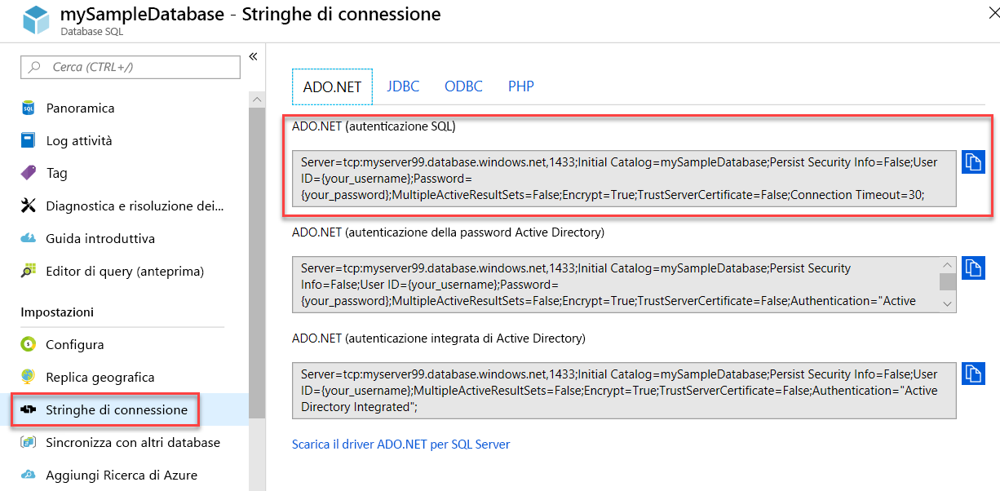

# <a name="quickstart-use-net-core-c-to-query-an-azure-sql-database"></a>Avvio rapido: Usare .NET Core (C#) per eseguire query su un database SQL di Azure

In questa guida introduttiva si userà [.NET Core](https://www.microsoft.com/net/) e il codice C# per la connessione a un database SQL di Azure. Si eseguirà quindi un'istruzione Transact-SQL per eseguire query sui dati.

## <a name="prerequisites"></a>Prerequisiti

Per eseguire questa esercitazione, è necessario avere:

- un database SQL di Azure. Per creare e quindi configurare un database in Database SQL di Azure è possibile usare una di queste guide introduttive:

  || Database singolo | Istanza gestita |
  |:--- |:--- |:---|
  | Create| [Portale](sql-database-single-database-get-started.md) | [Portale](sql-database-managed-instance-get-started.md) |
  || [CLI](scripts/sql-database-create-and-configure-database-cli.md) | [CLI](https://medium.com/azure-sqldb-managed-instance/working-with-sql-managed-instance-using-azure-cli-611795fe0b44) |
  || [PowerShell](scripts/sql-database-create-and-configure-database-powershell.md) | [PowerShell](scripts/sql-database-create-configure-managed-instance-powershell.md) |
  | Configurare | [Regola del firewall per gli indirizzi IP a livello di server](sql-database-server-level-firewall-rule.md)| [Connettività da una VM](sql-database-managed-instance-configure-vm.md)|
  |||[Connettività da locale](sql-database-managed-instance-configure-p2s.md)
  |Caricare i dati|Adventure Works caricato in base alla guida introduttiva|[Ripristinare Wide World Importers](sql-database-managed-instance-get-started-restore.md)
  |||Ripristinare o importare Adventure Works dal file [BACPAC](sql-database-import.md) ottenuto da [GitHub](https://github.com/Microsoft/sql-server-samples/tree/master/samples/databases/adventure-works)|
  |||

  > [!IMPORTANT]
  > Gli script in questo articolo sono scritti in modo da usare il database Adventure Works. Con un'istanza gestita, è necessario importare il database Adventure Works in un database dell'istanza oppure modificare gli script di questo articolo in modo da usare il database Wide World Importers.

- Aver installato [.NET Core per il sistema operativo](https://www.microsoft.com/net/core).

> [!NOTE]
> Questa guida introduttiva usa il database *mySampleDatabase*. Se si desidera utilizzare un database diverso, è necessario cambiare i riferimenti al database e modificare la query `SELECT` nel codice C#.

## <a name="get-sql-server-connection-information"></a>Ottenere informazioni di connessione SQL Server

Ottenere le informazioni di connessione necessarie per connettersi al database SQL di Azure. Nelle procedure successive saranno necessari il nome completo del server o il nome host, il nome del database e le informazioni di accesso.

1. Accedere al [portale di Azure](https://portal.azure.com/).

2. Passare alla pagina **Database SQL** o **Istanze gestite di SQL**.

3. Nella pagina **Panoramica** verificare il nome completo del server accanto a **Nome server** per un database singolo o accanto a **Host** per un'istanza gestita. Per copiare il nome del server o il nome host, passare il puntatore su di esso e selezionare l'icona **Copia**.

## <a name="get-adonet-connection-information-optional"></a>Ottenere informazioni di connessione ADO.NET (facoltativo)

1. Passare alla pagina **mySampleDatabase** e, in **Impostazioni**, selezionare **Stringhe di connessione**.

2. Esaminare la stringa di connessione completa **ADO.NET**.

    

3. Copiare la stringa di connessione **ADO.NET** se si prevede di usarla.
  
## <a name="create-a-new-net-core-project"></a>Creare un nuovo progetto .NET Core

1. Aprire un prompt dei comandi e creare una cartella denominata **sqltest**. Passare a questa cartella ed eseguire questo comando.

    ```cmd
    dotnet new console
    ```
    Vengono creati nuovi file di progetto dell'app, inclusi un iniziale file di codice C# (**Program.cs**), un file di configurazione XML (**sqltest. csproj**) e i file binari necessari.

2. In un editor di testo, aprire **sqltest. csproj** e incollare il codice XML seguente tra i tag `<Project>`. In questo modo viene aggiunto `System.Data.SqlClient` come dipendenza.

    ```xml
    <ItemGroup>
        <PackageReference Include="System.Data.SqlClient" Version="4.6.0" />
    </ItemGroup>
    ```

## <a name="insert-code-to-query-sql-database"></a>Inserire il codice per eseguire query sul database SQL

1. Aprire **Program.cs** in un editor di testo.

2. Sostituire il contenuto con il codice seguente e aggiungere i valori appropriati per il server, il database, il nome utente e la password.

> [!NOTE]
> Per usare una stringa di connessione ADO.NET, sostituire le 4 righe di codice impostando server, database, nome utente e password con la riga seguente. Immettere il proprio nome utente e la password.
>
>    `builder.ConnectionString="<your_ado_net_connection_string>";`

```csharp
using System;
using System.Data.SqlClient;
using System.Text;

namespace sqltest
{
    class Program
    {
        static void Main(string[] args)
        {
            try 
            { 
                SqlConnectionStringBuilder builder = new SqlConnectionStringBuilder();

                builder.DataSource = "<your_server.database.windows.net>"; 
                builder.UserID = "<your_username>";            
                builder.Password = "<your_password>";     
                builder.InitialCatalog = "<your_database>";
         
                using (SqlConnection connection = new SqlConnection(builder.ConnectionString))
                {
                    Console.WriteLine("\nQuery data example:");
                    Console.WriteLine("=========================================\n");
                    
                    connection.Open();       
                    StringBuilder sb = new StringBuilder();
                    sb.Append("SELECT TOP 20 pc.Name as CategoryName, p.name as ProductName ");
                    sb.Append("FROM [SalesLT].[ProductCategory] pc ");
                    sb.Append("JOIN [SalesLT].[Product] p ");
                    sb.Append("ON pc.productcategoryid = p.productcategoryid;");
                    String sql = sb.ToString();

                    using (SqlCommand command = new SqlCommand(sql, connection))
                    {
                        using (SqlDataReader reader = command.ExecuteReader())
                        {
                            while (reader.Read())
                            {
                                Console.WriteLine("{0} {1}", reader.GetString(0), reader.GetString(1));
                            }
                        }
                    }                    
                }
            }
            catch (SqlException e)
            {
                Console.WriteLine(e.ToString());
            }
            Console.WriteLine("\nDone. Press enter.");
            Console.ReadLine(); 
        }
    }
}
```

## <a name="run-the-code"></a>Eseguire il codice

1. Al prompt eseguire i seguenti comandi.

   ```cmd
   dotnet restore
   dotnet run
   ```

2. Verificare che vengano restituite le prime 20 righe.

   ```text
   Query data example:
   =========================================

   Road Frames HL Road Frame - Black, 58
   Road Frames HL Road Frame - Red, 58
   Helmets Sport-100 Helmet, Red
   Helmets Sport-100 Helmet, Black
   Socks Mountain Bike Socks, M
   Socks Mountain Bike Socks, L
   Helmets Sport-100 Helmet, Blue
   Caps AWC Logo Cap
   Jerseys Long-Sleeve Logo Jersey, S
   Jerseys Long-Sleeve Logo Jersey, M
   Jerseys Long-Sleeve Logo Jersey, L
   Jerseys Long-Sleeve Logo Jersey, XL
   Road Frames HL Road Frame - Red, 62
   Road Frames HL Road Frame - Red, 44
   Road Frames HL Road Frame - Red, 48
   Road Frames HL Road Frame - Red, 52
   Road Frames HL Road Frame - Red, 56
   Road Frames LL Road Frame - Black, 58
   Road Frames LL Road Frame - Black, 60
   Road Frames LL Road Frame - Black, 62

   Done. Press enter.
   ```
3. Scegliere **INVIO** per chiudere la finestra dell'applicazione.

## <a name="next-steps"></a>Passaggi successivi

- [Introduzione all'uso di .NET Core su Windows/Linux/macOS dalla riga di comando](/dotnet/core/tutorials/using-with-xplat-cli).
- Informazioni su come [connettersi ed eseguire query su un database SQL di Azure usando .NET Framework e Visual Studio](sql-database-connect-query-dotnet-visual-studio.md).  
- Informazioni su come [Progettare il primo database SQL di Azure con SSMS](sql-database-design-first-database.md) o su come [Progettare un database SQL di Azure e connettersi con C# e ADO.NET](sql-database-design-first-database-csharp.md).
- Per altre informazioni su .NET, vedere la [documentazione di .NET](https://docs.microsoft.com/dotnet/).
