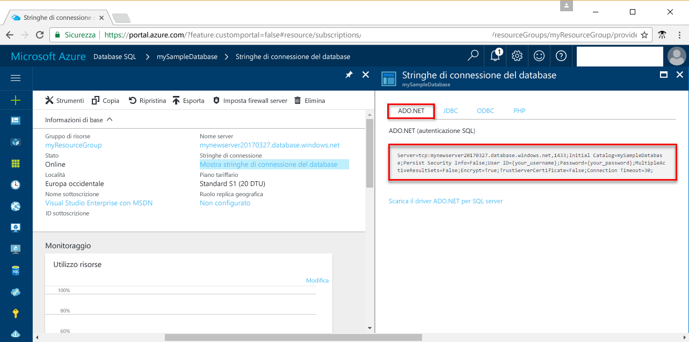

# <a name="azure-sql-database-use-net-c-to-connect-and-query-data"></a>Database SQL di Azure: usare .NET (C#) per connettersi ai dati ed eseguire query

Questa guida introduttiva illustra come usare [C# e ADO.NET](https://msdn.microsoft.com/library/kb9s9ks0.aspx) per connettersi a un database SQL di Azure. Usare quindi istruzioni Transact-SQL per eseguire query e inserire, aggiornare ed eliminare dati nel database da piattaforme Windows, Mac OS e Ubuntu Linux.

> [!TIP]
> Per un'esercitazione sulla creazione e l'esecuzione di query in un nuovo database tramite C#, vedere [Design your first database using C#](sql-database-design-first-database-csharp.md) (Progettare il primo database con C#).
>

## <a name="prerequisites"></a>Prerequisiti

Questa guida introduttiva usa come punto di partenza le risorse create in una delle guide introduttive seguenti:

- [Creare un database: portale](sql-database-get-started-portal.md)
- [Creare un database: interfaccia della riga di comando](sql-database-get-started-cli.md)
- [Creare un database: PowerShell](sql-database-get-started-powershell.md)

## <a name="install-net"></a>Installare .NET

Le procedure descritte in questa sezione presuppongono che si abbia familiarità con lo sviluppo con .NET, ma non con il database SQL di Azure. Se non si ha esperienza con lo sviluppo con .NET, andare alla pagina [Build an app using SQL Server](https://www.microsoft.com/sql-server/developer-get-started/) (Creare un'app con SQL Server) e selezionare **C#** e quindi il sistema operativo in uso.

### <a name="windows-net-framework-and-net-core"></a>**Windows .NET Framework e .NET Core**

Visual Studio 2017 Community è un IDE gratuito, con funzionalità complete ed estendibile per creare applicazioni moderne per Android, iOS, Windows, oltre ad applicazioni Web e database e servizi cloud. È possibile installare solo la versione completa di .NET Framework o solamente .NET Core. I frammenti di codice nella guida introduttiva sono compatibili con entrambe le versioni. Se Visual Studio è già installato nel computer, ignorare i passaggi successivi.

1. Scaricare il [programma di installazione di Visual Studio 2017](https://www.visualstudio.com/thank-you-downloading-visual-studio/?sku=Community&rel=15). 
2. Eseguire il programma di installazione e seguire le richieste di installazione per completare l'operazione.

### <a name="mac-os"></a>**Mac OS**
Aprire il terminale in uso e passare alla directory in cui si prevede di creare il progetto .NET Core. Immettere i comandi seguenti per installare **brew**, **OpenSSL** e **.NET Core**. 

```bash
ruby -e "$(curl -fsSL https://raw.githubusercontent.com/Homebrew/install/master/install)"
brew update
brew install openssl
mkdir -p /usr/local/lib
ln -s /usr/local/opt/openssl/lib/libcrypto.1.0.0.dylib /usr/local/lib/
ln -s /usr/local/opt/openssl/lib/libssl.1.0.0.dylib /usr/local/lib/
```

Installare .NET Core in macOS. Scaricare il [programma di installazione ufficiale](https://go.microsoft.com/fwlink/?linkid=843444). Il programma di installazione installa gli strumenti e li inserisce nella posizione specificata da PATH, per consentire di eseguire dotnet dalla console.

### <a name="linux-ubuntu"></a>**Linux (Ubuntu)**
Aprire il terminale in uso e passare alla directory in cui si prevede di creare il progetto .NET Core. Immettere i comandi seguenti per installare **.NET Core**.

```bash
sudo sh -c 'echo "deb [arch=amd64] https://apt-mo.trafficmanager.net/repos/dotnet-release/ xenial main" > /etc/apt/sources.list.d/dotnetdev.list'
sudo apt-key adv --keyserver hkp://keyserver.ubuntu.com:80 --recv-keys 417A0893
sudo apt-get update
sudo apt-get install dotnet-dev-1.0.1
```

## <a name="get-connection-information"></a>Ottenere informazioni di connessione

Ottenere le informazioni di connessione necessarie per connettersi al database SQL di Azure. Nelle procedure successive saranno necessari il nome completo del server, il nome del database e le informazioni di accesso.

1. Accedere al [Portale di Azure](https://portal.azure.com/).
2. Scegliere **Database SQL** dal menu a sinistra, quindi fare clic sul database nella pagina **Database SQL**. 
3. Nella pagina **Panoramica** per il database, verificare il nome completo del server, come mostrato nell'immagine seguente. È possibile passare il puntatore sul nome del server per visualizzare l'opzione **Fare clic per copiare**. 

    

4. Se si dimenticano le informazioni di accesso per il server del database SQL di Azure, passare alla pagina del server del database SQL per visualizzare il nome dell'amministratore del server e, se necessario, reimpostare la password.

5. Fare clic su **Mostra stringhe di connessione del database**.

6. Esaminare la stringa di connessione completa **ADO.NET**.

    
  
## <a name="add-systemdatasqlclient"></a>Aggiungere System.Data.SqlClient
Quando si usa .NET Core, aggiungere System.Data.SqlClient al file ***csproj*** del progetto come dipendenza.

```xml
<ItemGroup>
    <PackageReference Include="System.Data.SqlClient" Version="4.3.0" />
</ItemGroup>
```

## <a name="select-data"></a>Selezionare i dati

1. Nell'ambiente di sviluppo aprire un file di codice vuoto.
2. Aggiungere ```using System.Data.SqlClient``` al file di codice ([spazio dei nomi System.Data.SqlClient](https://msdn.microsoft.com/library/system.data.sqlclient.aspx)). 

3. Usare il codice seguente per eseguire una query per individuare i primi 20 prodotti per categoria usando il comando [SqlCommand.ExecuteReader](https://msdn.microsoft.com/library/system.data.sqlclient.sqlcommand.executereader.aspx) con un'istruzione [SELECT](https://msdn.microsoft.com/library/ms189499.aspx) di Transact-SQL. Aggiungere i valori appropriati per il server, il database, l'utente e la password.

```csharp
using System;
using System.Data;
using System.Data.SqlClient;

namespace ConsoleApplication1
{
    class Program
    {
        static void Main(string[] args)
        {
            try 
            { 
                SqlConnectionStringBuilder builder = new SqlConnectionStringBuilder();
                builder.DataSource = "your_server.database.windows.net"; 
                builder.UserID = "your_user";            
                builder.Password = "your_password";     
                builder.InitialCatalog = "your_database";

                using (SqlConnection connection = new SqlConnection(builder.ConnectionString))
                {
                    Console.WriteLine("\nQuery data example:");
                    Console.WriteLine("=========================================\n");
                    
                    connection.Open();       
                    StringBuilder sb = new StringBuilder();
                    sb.Append("SELECT TOP 20 pc.Name as CategoryName, p.name as ProductName ");
                    sb.Append("FROM [SalesLT].[ProductCategory] pc ");
                    sb.Append("JOIN [SalesLT].[Product] p ");
                    sb.Append("ON pc.productcategoryid = p.productcategoryid;");
                    String sql = sb.ToString();

                    using (SqlCommand command = new SqlCommand(sql, connection))
                    {
                        using (SqlDataReader reader = command.ExecuteReader())
                        {
                            while (reader.Read())
                            {
                                Console.WriteLine("{0} {1}", reader.GetString(0), reader.GetString(1));
                            }
                        }
                    }                    
                }
            }
            catch (SqlException e)
            {
                Console.WriteLine(e.ToString());
            }
        }
    }
}
```

## <a name="insert-data"></a>Inserire dati

Usare il codice seguente per inserire un nuovo prodotto nella tabella SalesLT.Product usando [SqlCommand.ExecuteNonQuery](https://msdn.microsoft.com/library/system.data.sqlclient.sqlcommand.executenonquery.aspx) con un'istruzione [INSERT](https://msdn.microsoft.com/library/ms174335.aspx) di Transact-SQL. Aggiungere i valori appropriati per il server, il database, l'utente e la password.

```csharp
using System;
using System.Data;
using System.Data.SqlClient;

namespace ConsoleApplication1
{
    class Program
    {
        static void Main(string[] args)
        {
            try 
            { 
                SqlConnectionStringBuilder builder = new SqlConnectionStringBuilder();
                builder.DataSource = "your_server.database.windows.net"; 
                builder.UserID = "your_user";            
                builder.Password = "your_password";     
                builder.InitialCatalog = "your_database";

                using (SqlConnection connection = new SqlConnection(builder.ConnectionString))
                {
                    Console.WriteLine("\nInsert data example:");
                    Console.WriteLine("=========================================\n");

                    connection.Open();       
                    StringBuilder sb = new StringBuilder();
                    sb.Append("INSERT INTO [SalesLT].[Product] ([Name], [ProductNumber], [Color], [StandardCost], [ListPrice], [SellStartDate]) ");
                    sb.Append("VALUES (@Name, @ProductNumber, @Color, @StandardCost, @ListPrice, @SellStartDate);");
                    String sql = sb.ToString();
                    using (SqlCommand command = new SqlCommand(sql, connection))
                    {
                        command.Parameters.AddWithValue("@Name", "BrandNewProduct");
                        command.Parameters.AddWithValue("@ProductNumber", "200989");
                        command.Parameters.AddWithValue("@Color", "Blue");
                        command.Parameters.AddWithValue("@StandardCost", 75);
                        command.Parameters.AddWithValue("@ListPrice", 80);
                        command.Parameters.AddWithValue("@SellStartDate", "7/1/2016");
                        int rowsAffected = command.ExecuteNonQuery();
                        Console.WriteLine(rowsAffected + " row(s) inserted");
                    }         
                }
            }
            catch (SqlException e)
            {
                Console.WriteLine(e.ToString());
            }
        }
    }
}
```

## <a name="update-data"></a>Aggiornare i dati

Usare il codice seguente per aggiornare il nuovo prodotto aggiunto in precedenza usando [SqlCommand.ExecuteNonQuery](https://msdn.microsoft.com/library/system.data.sqlclient.sqlcommand.executenonquery.aspx) con un'istruzione [UPDATE](https://msdn.microsoft.com/library/ms177523.aspx) di Transact-SQL. Aggiungere i valori appropriati per il server, il database, l'utente e la password.

```csharp
using System;
using System.Data;
using System.Data.SqlClient;

namespace ConsoleApplication1
{
    class Program
    {
        static void Main(string[] args)
        {
            try 
            { 
                SqlConnectionStringBuilder builder = new SqlConnectionStringBuilder();
                builder.DataSource = "your_server.database.windows.net"; 
                builder.UserID = "your_user";            
                builder.Password = "your_password";     
                builder.InitialCatalog = "your_database";

                using (SqlConnection connection = new SqlConnection(builder.ConnectionString))
                {
                    Console.WriteLine("\nUpdate data example");
                    Console.WriteLine("=========================================\n");

                    connection.Open();       
                    StringBuilder sb = new StringBuilder();
                    sb.Append("UPDATE [SalesLT].[Product] SET ListPrice = @ListPrice WHERE Name = @Name;");
                    String sql = sb.ToString();
                    using (SqlCommand command = new SqlCommand(sql, connection))
                    {
                        command.Parameters.AddWithValue("@Name", "BrandNewProduct");
                        command.Parameters.AddWithValue("@ListPrice", 500);
                        int rowsAffected = command.ExecuteNonQuery();
                        Console.WriteLine(rowsAffected + " row(s) updated");
                    }         
                }
            }
            catch (SqlException e)
            {
                Console.WriteLine(e.ToString());
            }
        }
    }
}
```

## <a name="delete-data"></a>Eliminare i dati

Usare il codice seguente per eliminare il nuovo prodotto aggiunto in precedenza usando [SqlCommand.ExecuteNonQuery](https://msdn.microsoft.com/library/system.data.sqlclient.sqlcommand.executenonquery.aspx) con un'istruzione [DELETE](https://msdn.microsoft.com/library/ms189835.aspx) di Transact-SQL. Aggiungere i valori appropriati per il server, il database, l'utente e la password.

```csharp
using System;
using System.Data;
using System.Data.SqlClient;

namespace ConsoleApplication1
{
    class Program
    {
        static void Main(string[] args)
        {
            try 
            { 
                SqlConnectionStringBuilder builder = new SqlConnectionStringBuilder();
                builder.DataSource = "your_server.database.windows.net"; 
                builder.UserID = "your_user";            
                builder.Password = "your_password";     
                builder.InitialCatalog = "your_database";

                using (SqlConnection connection = new SqlConnection(builder.ConnectionString))
                {
                    Console.WriteLine("\nDelete data example");
                    Console.WriteLine("=========================================\n");

                    connection.Open();       
                    StringBuilder sb = new StringBuilder();
                    sb.Append("DELETE FROM SalesLT.Product WHERE Name = @Name;");
                    String sql = sb.ToString();
                    using (SqlCommand command = new SqlCommand(sql, connection))
                    {
                        command.Parameters.AddWithValue("@Name", "BrandNewProduct");
                        int rowsAffected = command.ExecuteNonQuery();
                        Console.WriteLine(rowsAffected + " row(s) deleted");
                    }         
                }
            }
            catch (SqlException e)
            {
                Console.WriteLine(e.ToString());
            }
        }
    }
}
```

## <a name="next-steps"></a>Passaggi successivi
- [Progettare il primo database SQL di Azure](sql-database-design-first-database.md)
- [Documentazione di .NET](https://docs.microsoft.com/dotnet/)
- [Connettersi al database SQL con SQL Server Management Studio ed eseguire una query T-SQL di esempio](sql-database-connect-query-ssms.md)
- [Connettersi ed eseguire query con Visual Studio Code](sql-database-connect-query-vscode.md)


