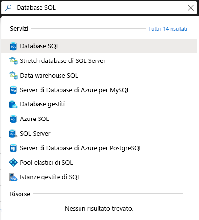
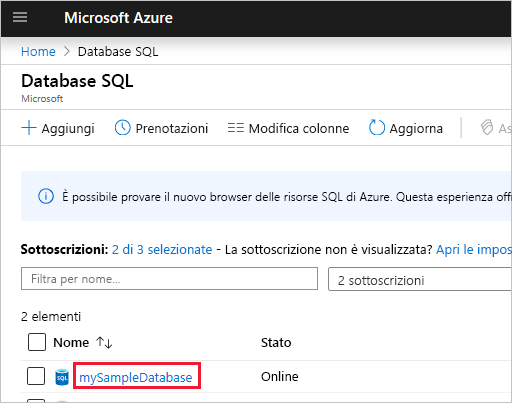

# <a name="quickstart-use-the-azure-portals-sql-query-editor-to-connect-and-query-data"></a>Guida introduttiva: Usare l'editor di query SQL del portale di Azure per connettersi ed eseguire query sui dati

L'editor di query SQL è uno strumento del browser nel portale di Azure che consente di eseguire facilmente query SQL sul database SQL di Azure o su Azure SQL Data Warehouse. In questa guida introduttiva si usa l'editor di query per connettersi a un database SQL e quindi eseguire query e inserire, aggiornare ed eliminare dati con istruzioni Transact-SQL.

## <a name="prerequisites"></a>Prerequisiti

Per completare questa esercitazione, sono necessari:

- un database SQL di Azure. Per creare e quindi configurare un database in Database SQL di Azure è possibile usare una di queste guide introduttive:

  || Database singolo |
  |:--- |:--- |
  | Create| [Portale](sql-database-single-database-get-started.md) |
  || [CLI](scripts/sql-database-create-and-configure-database-cli.md) |
  || [PowerShell](scripts/sql-database-create-and-configure-database-powershell.md) |
  | Configurare | [Regola del firewall IP a livello di server](sql-database-server-level-firewall-rule.md)|
  |||

> [!NOTE]
> L'editor di query usa le porte 443 e 1443 per comunicare.  Assicurarsi di aver abilitato il traffico HTTPS in uscita su queste porte. È anche necessario aggiungere l'indirizzo IP in uscita per le regole del firewall consentite del server per accedere ai database e ai data warehouse.

## <a name="sign-in-the-azure-portal"></a>Accedere al portale di Azure

Accedere al [portale di Azure](https://portal.azure.com/).

## <a name="connect-using-sql-authentication"></a>Connettersi con l'autenticazione SQL

1. Passare al portale di Azure per connettersi a un database SQL. Cercare e selezionare **Database SQL**.

    

2. Selezionare il database SQL.

    

3. Dal menu **Database SQL** scegliere **Editor di query (anteprima)** .

    

4. Nella pagina **Accesso**, sotto l'etichetta **Autenticazione di SQL Server**, immettere l'ID di **Accesso** e la **Password** dell'account amministratore del server usato per creare il database. Selezionare **OK**.

    

## <a name="connect-using-azure-active-directory"></a>Connettersi con Azure Active Directory

La configurazione di un amministratore di Azure Active Directory (Azure AD) consente di usare una singola identità per accedere al portale di Azure e al database SQL. Seguire questa procedura per configurare un amministratore di Azure AD per SQL Server.

> [!NOTE]
> * Gli account di posta elettronica (ad esempio outlook.com, gmail.com, yahoo.com e così via) non sono ancora supportati come amministratori di Azure AD. Assicurarsi di scegliere un utente creato in modo nativo o federato in Azure AD.
> * L'accesso come amministratore di Azure AD non funziona con account per cui è abilitata l'autenticazione a due fattori.

1. Dal menu del portale di Azure o nella pagina **Home** selezionare **Tutte le risorse**.

2. Selezionare il server SQL.

3. Dal menu **SQL Server**, in **Impostazioni**, scegliere **Amministratore di Active Directory**.

4. Sulla barra degli strumenti della pagina **Amministratore di Active Directory** di SQL Server selezionare **Imposta amministratore** e scegliere l'utente o il gruppo da usare come amministratore di Azure AD.

    

5. Nella casella di ricerca della pagina **Aggiungi amministratore** immettere un utente o un gruppo da trovare, selezionarlo come amministratore e quindi scegliere il pulsante **Seleziona**.

6. Di nuovo sulla barra degli strumenti della pagina **Amministratore di Active Directory** di SQL Server selezionare **Salva**.

7. Dal menu **SQL Server** scegliere **Database SQL** e quindi selezionare il database SQL desiderato.

8. Dal menu **Database SQL** scegliere **Editor di query (anteprima)** . Nella pagina **Accesso**, sotto l'etichetta **Autenticazione di Active Directory**, viene visualizzato un messaggio che indica che si è avuto accesso se si è amministratori di Azure AD. Selezionare quindi il pulsante **Continua come** *\<ID utente o gruppo>* .

## <a name="view-data"></a>Visualizzare i dati

1. Dopo l'autenticazione, incollare il codice SQL seguente nell'editor di query per recuperare i primi 20 prodotti per categoria.

   ```sql
    SELECT TOP 20 pc.Name as CategoryName, p.name as ProductName
    FROM SalesLT.ProductCategory pc
    JOIN SalesLT.Product p
    ON pc.productcategoryid = p.productcategoryid;
   ```

2. Selezionare **Esegui** sulla barra degli strumenti e quindi esaminare l'output nel riquadro **Risultati**.

   

## <a name="insert-data"></a>Inserire dati

Eseguire l'istruzione [INSERT](https://msdn.microsoft.com/library/ms174335.aspx) Transact-SQL seguente per aggiungere un nuovo prodotto nella tabella `SalesLT.Product`.

1. Sostituire la query precedente con questa.

    ```sql
    INSERT INTO [SalesLT].[Product]
           ( [Name]
           , [ProductNumber]
           , [Color]
           , [ProductCategoryID]
           , [StandardCost]
           , [ListPrice]
           , [SellStartDate]
           )
    VALUES
           ('myNewProduct'
           ,123456789
           ,'NewColor'
           ,1
           ,100
           ,100
           ,GETDATE() );
   ```


2. Selezionare **Esegui** per inserire una nuova riga nella tabella `Product`. Nel riquadro **Messaggi** verrà visualizzato **Query succeeded: Affected rows: 1** (Query riuscita. Righe interessate: 1).


## <a name="update-data"></a>Aggiornare i dati

Eseguire l'istruzione [UPDATE](https://msdn.microsoft.com/library/ms177523.aspx) Transact-SQL seguente per modificare il nuovo prodotto.

1. Sostituire la query precedente con questa.

   ```sql
   UPDATE [SalesLT].[Product]
   SET [ListPrice] = 125
   WHERE Name = 'myNewProduct';
   ```

2. Selezionare **Esegui** per aggiornare la riga specificata nella tabella `Product`. Nel riquadro **Messaggi** verrà visualizzato **Query succeeded: Affected rows: 1** (Query riuscita. Righe interessate: 1).

## <a name="delete-data"></a>Eliminare i dati

Eseguire l'istruzione [DELETE](https://msdn.microsoft.com/library/ms189835.aspx) Transact-SQL seguente per rimuovere il nuovo prodotto.

1. Sostituire la query precedente con questa:

   ```sql
   DELETE FROM [SalesLT].[Product]
   WHERE Name = 'myNewProduct';
   ```

2. Selezionare **Esegui** per eliminare la riga specificata nella tabella `Product`. Nel riquadro **Messaggi** verrà visualizzato **Query succeeded: Affected rows: 1** (Query riuscita. Righe interessate: 1).


## <a name="query-editor-considerations"></a>Considerazioni sull'editor di query

Quando si usa l'editor di query è necessario tenere presente quanto segue.

* L'editor di query usa le porte 443 e 1443 per comunicare.  Assicurarsi di aver abilitato il traffico HTTPS in uscita su queste porte. È anche necessario aggiungere l'indirizzo IP in uscita per le regole del firewall consentite del server per accedere ai database e ai data warehouse.

* Premendo F5, la pagina dell'editor di query verrà aggiornata e qualsiasi query su cui si sta lavorando andrà persa.

* L'editor di query non supporta la connessione al database `master`.

* Esiste un timeout di 5 minuti per l'esecuzione delle query.

* L'editor di query supporta solo la proiezione cilindrica per i tipi di dati Geography.

* Non è disponibile alcun supporto per IntelliSense per le tabelle e le viste di database. L'editor supporta tuttavia il completamento automatico per i nomi già digitati.


## <a name="next-steps"></a>Passaggi successivi

Per altre informazioni sul supporto per Transact-SQL disponibile nei database SQL di Azure, vedere [Risoluzione delle differenze di Transact-SQL durante la migrazione al database SQL](sql-database-transact-sql-information.md).
