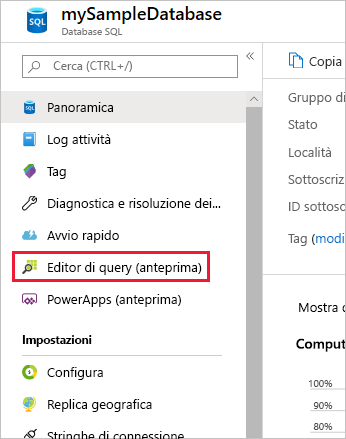
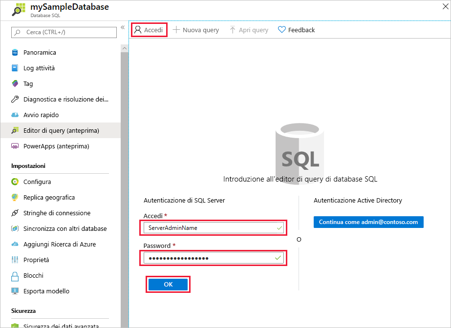
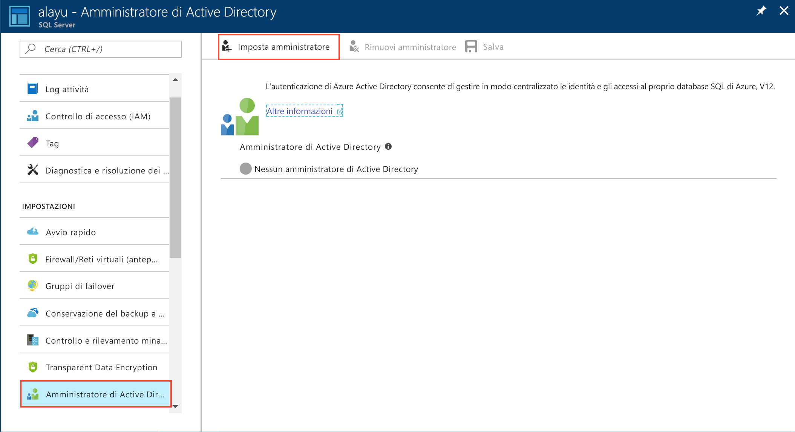
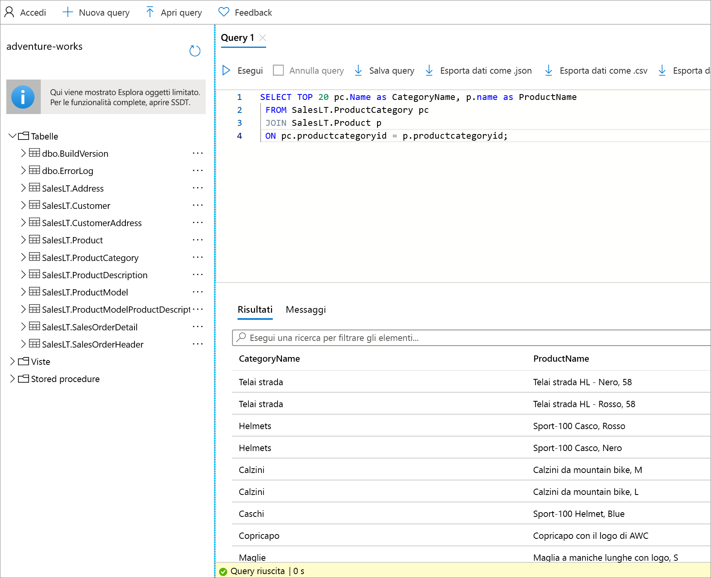

# <a name="azure-portal-use-the-sql-query-editor-to-connect-and-query-data"></a>Portale di Azure: usare l'editor di query SQL per connettersi ai dati ed eseguire query

L'editor di query SQL è uno strumento di query basato su browser che offre un modo semplice ed efficiente per eseguire query SQL sul database SQL di Azure o su Azure SQL Data Warehouse senza uscire dal portale di Azure. Questa guida introduttiva illustra come usare l'editor di query per connettersi a un database SQL e quindi usare istruzioni Transact-SQL per eseguire query e inserire, aggiornare ed eliminare dati nel database.

## <a name="prerequisites"></a>Prerequisiti

Questa guida introduttiva usa come punto di partenza le risorse create in una delle guide introduttive seguenti:

[!INCLUDE [prerequisites-create-db](../../includes/sql-database-connect-query-prerequisites-create-db-includes.md)]

> [!NOTE]
> Verificare che l'opzione "Consenti l'accesso a Servizi di Azure" sia attiva nelle impostazioni del firewall di SQL Server. Questa opzione consente all'editor di query SQL di accedere a database e data warehouse.

## <a name="log-in-to-the-azure-portal"></a>Accedere al Portale di Azure

Accedere al [Portale di Azure](https://portal.azure.com/).


## <a name="connect-using-sql-authentication"></a>Connettersi con l'autenticazione SQL

1. Fare clic su **Database SQL** nel menu a sinistra e quindi sul database su cui si vogliono eseguire query.

2. Nella pagina del database SQL in uso individuare **Editor di query (anteprima)** nel menu a sinistra e fare clic su questa opzione.

    

3. Fare clic su **Accedi** e quindi, quando viene richiesto, selezionare **Autenticazione di SQL Server** e immettere l'account di accesso e la password di amministratore del server specificati durante la creazione del database.

    

4. Fare clic su **OK** per accedere.


## <a name="connect-using-azure-ad"></a>Connettersi con Azure AD

La configurazione di un amministratore di Active Directory consente di usare una singola identità per accedere al portale di Azure e al database SQL. Per configurare un amministratore di Active Directory per l'istanza di SQL Server creata, seguire questa procedura.

> [!NOTE]
> Gli account di posta elettronica (ad esempio outlook.com, hotmail.com, live.com, gmail.com e yahoo.com) non sono ancora supportati come amministratori di Active Directory. Assicurarsi di scegliere un utente creato in modo nativo o federato in Azure Active Directory.

1. Selezionare **SQL Server** nel menu a sinistra e quindi l'istanza di SQL Server nell'elenco di server.

2. Selezionare l'impostazione **Amministratore di Active Directory** nel menu delle impostazioni dell'istanza di SQL Server.

3. Nel pannello Amministratore di Active Directory fare clic sul comando **Imposta amministratore** e selezionare l'utente o il gruppo che sarà l'amministratore di Active Directory.

    

4. Nella parte superiore del pannello Amministratore di Active Directory fare clic sul comando **Salva** per impostare l'amministratore di Active Directory.

Passare al database SQL su cui si vuole eseguire la query e fare clic su **Esplora dati (anteprima)** nel menu a sinistra. Verrà visualizzata la pagina Esplora dati e verrà eseguita automaticamente la connessione al database.


## <a name="run-query-using-query-editor"></a>Eseguire query con l'editor di query

Dopo l'autenticazione, digitare la query seguente nel riquadro dell'editor di query per individuare i primi 20 prodotti per categoria.

```sql
 SELECT TOP 20 pc.Name as CategoryName, p.name as ProductName
 FROM SalesLT.ProductCategory pc
 JOIN SalesLT.Product p
 ON pc.productcategoryid = p.productcategoryid;
```

Fare clic su **Esegui** e quindi esaminare i risultati della query nel riquadro **Risultati**.



## <a name="insert-data-using-query-editor"></a>Inserire dati con l'editor di query

Usare il codice seguente per inserire un nuovo prodotto nella tabella SalesLT.Product usando l'istruzione [INSERT](https://msdn.microsoft.com/library/ms174335.aspx) di Transact-SQL.

1. Nella finestra delle query, sostituire la query precedente con quella seguente:

   ```sql
   INSERT INTO [SalesLT].[Product]
           ( [Name]
           , [ProductNumber]
           , [Color]
           , [ProductCategoryID]
           , [StandardCost]
           , [ListPrice]
           , [SellStartDate]
           )
     VALUES
           ('myNewProduct'
           ,123456789
           ,'NewColor'
           ,1
           ,100
           ,100
           ,GETDATE() );
   ```

2. Sulla barra degli strumenti fare clic su **Esegui** per inserire una nuova riga nella tabella Product.

## <a name="update-data-using-query-editor"></a>Aggiornare i dati con l'editor di query

Usare il codice seguente per aggiornare il nuovo prodotto aggiunto in precedenza usando l'istruzione [UPDATE](https://msdn.microsoft.com/library/ms177523.aspx) di Transact-SQL.

1. Nella finestra delle query, sostituire la query precedente con quella seguente:

   ```sql
   UPDATE [SalesLT].[Product]
   SET [ListPrice] = 125
   WHERE Name = 'myNewProduct';
   ```

2. Sulla barra degli strumenti fare clic su **Esegui** per aggiornare la riga specificata nella tabella Product.

## <a name="delete-data-using-query-editor"></a>Eliminare dati con l'editor di query

Usare il codice seguente per eliminare il nuovo prodotto aggiunto in precedenza usando l'istruzione [DELETE](https://msdn.microsoft.com/library/ms189835.aspx) di Transact-SQL.

1. Nella finestra delle query, sostituire la query precedente con quella seguente:

   ```sql
   DELETE FROM [SalesLT].[Product]
   WHERE Name = 'myNewProduct';
   ```

2. Sulla barra degli strumenti fare clic su **Esegui** per eliminare la riga specificata nella tabella Product.


## <a name="query-editor-considerations"></a>Considerazioni sull'editor di query

Quando si usa l'editor di query ancora in fase di anteprima, è necessario tenere presente quanto segue:

1. Verificare di aver attivato l'opzione "Consenti l'accesso a Servizi di Azure" nelle impostazioni del firewall del server SQL Azure. Questa opzione consente all'editor di query SQL di accedere a data warehouse e database SQL.

2. L'accesso amministratore di Azure Active Directory non funziona con account per cui è abilitata l'autenticazione a due fattori.

3. Gli account di posta elettronica (ad esempio outlook.com, hotmail.com, live.com, gmail.com e yahoo.com) non sono ancora supportati come amministratori di Active Directory. Assicurarsi di scegliere un utente creato in modo nativo o federato in Azure Active Directory.

4. Le query su tipi di dati spaziali non sono ancora supportate nell'editor di query. Le query su colonne spaziali genereranno un errore "System.IO.FileNotFoundException".

5. Non è previsto alcun supporto per IntelliSense in tabelle e viste di database. L'editor, tuttavia, supporta il completamento automatico per i nomi già digitati.

6. Premendo F5, la pagina Editor di query verrà aggiornata e la query su cui si sta lavorando andrà persa. Usare il pulsante Esegui sulla barra degli strumenti per eseguire le query.


## <a name="next-steps"></a>Passaggi successivi

- Per informazioni sul supporto di Transact-SQL disponibile nei database SQL di Azure, vedere l'articolo relativo alle [differenze di Transact-SQL nel database SQL](sql-database-transact-sql-information.md).
