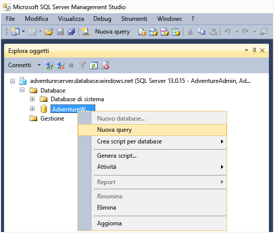
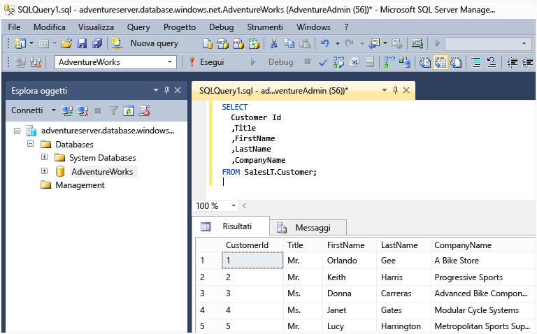

<properties
	pageTitle="Connettersi a un database SQL - SQL Server Management Studio | Microsoft Azure"
	description="Informazioni su come connettersi a un database SQL in Azure tramite SQL Server Management Studio (SSMS). Eseguire quindi una query di esempio usando Transact-SQL (T-SQL)."
	metaCanonical=""
	keywords="connettersi al database sql,sql server management studio"
	services="sql-database"
	documentationCenter=""
	authors="stevestein"
	manager="jhubbard"
	editor="" />

<tags
	ms.service="sql-database"
	ms.workload="data-management"
	ms.tgt_pltfrm="na"
	ms.devlang="na"
	ms.topic="get-started-article"
	ms.date="05/09/2016"
	ms.author="sstein;carlrab" />

# Connettersi al database SQL con SQL Server Management Studio ed eseguire una query T-SQL di esempio

> [AZURE.SELECTOR]
- [Visual Studio](sql-database-connect-query.md)
- [SSMS](sql-database-connect-query-ssms.md)
- [Excel](sql-database-connect-excel.md)

Questo articolo illustra come connettersi a un database SQL di Azure usando la versione più recente di SQL Server Management Studio (SSMS) ed eseguire una query semplice con istruzioni Transact-SQL (T-SQL).

[AZURE.INCLUDE [Accesso](../../includes/azure-getting-started-portal-login.md)]

[AZURE.INCLUDE [Installazione di SSMS](../../includes/sql-server-management-studio-install.md)]

[AZURE.INCLUDE [Connessione a SSMS](../../includes/sql-database-sql-server-management-studio-connect-server-principal.md)]

Per informazioni sulle regole del firewall, vedere [Procedura: Configurare le impostazioni del firewall (database SQL di Azure)](sql-database-configure-firewall-settings.md).

## Eseguire query di esempio

Dopo la connessione al server logico, è possibile connettersi a un database ed eseguire una query di esempio.

1. In **Esplora oggetti** passare a un database sul server per cui si ha l'autorizzazione, ad esempio il database di esempio **AdventureWorks**.
2. Fare clic con il pulsante destro del mouse sul database e selezionare **Nuova query**.

	

3. Nella finestra della query appena aperta, copiare e incollare il codice seguente:

		SELECT
		CustomerId
		,Title
		,FirstName
		,LastName
		,CompanyName
		FROM SalesLT.Customer;

4. Fare clic sul pulsante **Esegui**. Nella schermata seguente viene illustrata una query con esito positivo.

	

## Passaggi successivi

È possibile usare istruzioni T-SQL per creare e gestire i database in Azure in modo analogo a SQL Server. Se si ha familiarità con l'uso di T-SQL con SQL Server, vedere [Informazioni su Transact-SQL del Database SQL di Azure](sql-database-transact-sql-information.md) per un riepilogo delle differenze.

Se non si ha familiarità con T-SQL, vedere [Esercitazione: Scrittura di istruzioni Transact-SQL](https://msdn.microsoft.com/library/ms365303.aspx) e [Guida di riferimento a Transact-SQL (Motore di database)](https://msdn.microsoft.com/library/bb510741.aspx).

Per iniziare a creare gli utenti del database e gli amministratori degli utenti del database, vedere [Introduzione alla sicurezza del database SQL di Azure](sql-database-get-started-security.md)

<!---HONumber=AcomDC_0525_2016-->