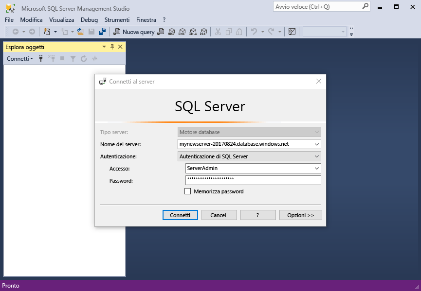
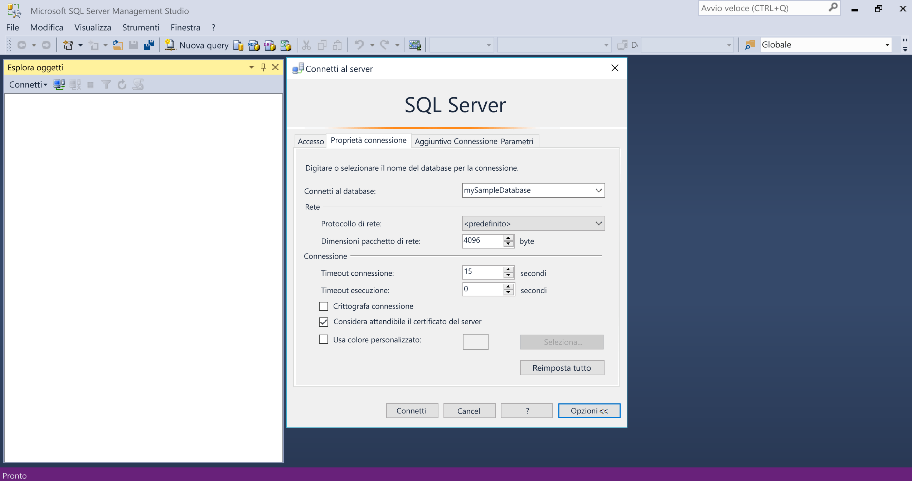
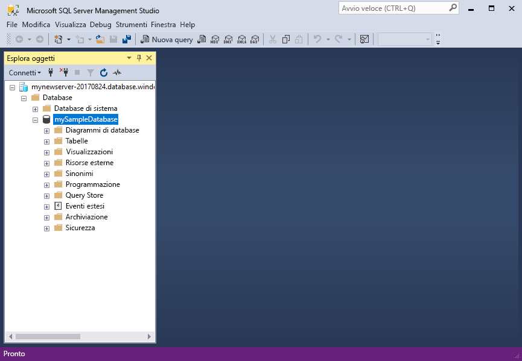
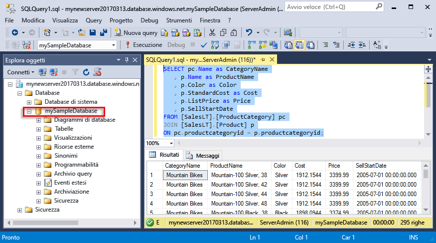
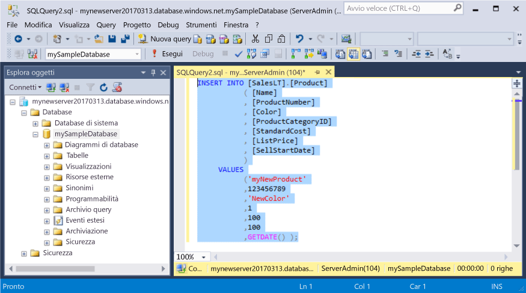
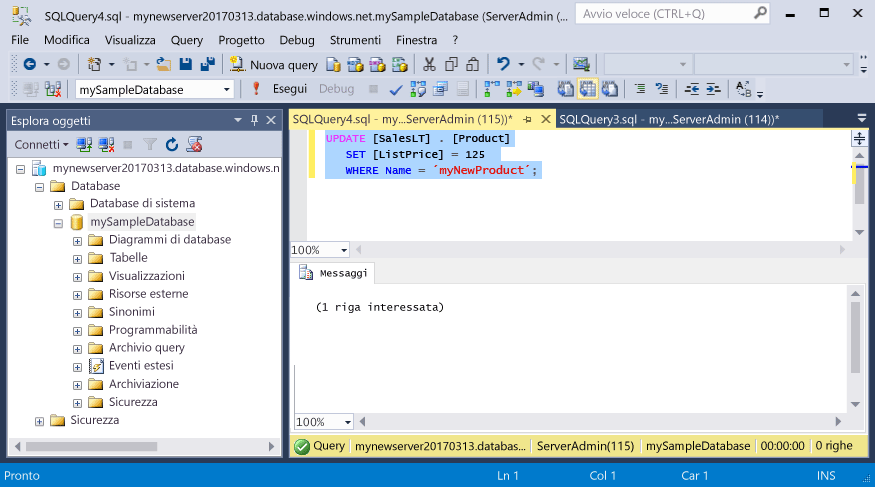
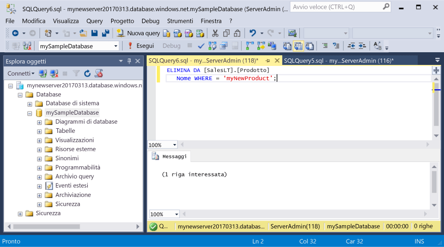

# <a name="azure-sql-database-use-sql-server-management-studio-to-connect-and-query-data"></a>Database SQL di Azure: usare SQL Server Management Studio per connettersi ed eseguire query sui dati

[SQL Server Management Studio](https://msdn.microsoft.com/library/ms174173.aspx) (SSMS) è uno strumento di gestione usato per creare e gestire risorse di SQL Server dall'interfaccia utente o negli script. Questa guida introduttiva illustra come usare SSMS per connettersi a un database SQL di Azure e quindi usare istruzioni Transact-SQL per eseguire query e inserire, aggiornare ed eliminare dati nel database. 

Questa guida introduttiva usa come punto di partenza le risorse create in una delle guide introduttive seguenti:

- [Creare un database: portale](sql-database-get-started-portal.md)
- [Creare un database: interfaccia della riga di comando](sql-database-get-started-cli.md)

Prima di iniziare, assicurarsi di avere installato la versione più recente di [SSMS](https://msdn.microsoft.com/library/mt238290.aspx). 

## <a name="get-connection-information"></a>Ottenere informazioni di connessione

Ottenere il nome completo del server per il server del database SQL di Azure nel portale di Azure. Usare il nome completo del server per connettersi al server tramite SQL Server Management Studio.

1. Accedere al [Portale di Azure](https://portal.azure.com/).
2. Scegliere **Database SQL** dal menu a sinistra, quindi fare clic sul database nella pagina **Database SQL**. 
3. Nel riquadro **Informazioni di base** della pagina del portale di Azure per il database individuare e quindi copiare il **Nome server**.

    


## <a name="connect-to-the-server-and-your-new-database"></a>Connettersi al server e al nuovo database

Usare SQL Server Management Studio per stabilire una connessione al server del database SQL di Azure. 

> [!IMPORTANT]
> Il server logico del database SQL di Azure è in ascolto sulla porta 1433. Se si sta tentando di connettersi a un server logico del database SQL di Azure dall'interno di un firewall aziendale, questa porta deve essere aperta.
>

1. Aprire SQL Server Management Studio.

2. Nella finestra di dialogo **Connetti al server** immettere le informazioni seguenti:
   - **Tipo di server**: specificare il motore del database
   - **Nome server**: immettere il nome completo del server, ad esempio **mynewserver20170313.database.windows.net**
   - **Autenticazione**: specificare l'Autenticazione di SQL Server
   - **Accesso**: immettere l'account dell'amministratore del server
   - **Password**: immettere la password per l'account dell'amministratore del server

     

3. Fare clic su **Opzioni**. Nella sezione **Connetti al database**, immettere **mySampleDatabase** per connettersi al database creato in precedenza.

     

4. Fare clic su **Connetti**. La finestra Esplora oggetti viene visualizzata in SSMS. 

     

4. In Esplora oggetti espandere **Database** e quindi espandere **mySampleDatabase** per visualizzare gli oggetti disponibili nel database di esempio.

## <a name="query-data"></a>Eseguire query sui dati

Usare l'istruzione [SELECT](https://msdn.microsoft.com/library/ms189499.aspx) di Transact-SQL per eseguire query sui dati nel database SQL di Azure.

1. In Esplora oggetti fare clic con il pulsante destro del mouse su **mySampleDatabase** e scegliere **Nuova query**. Viene visualizzata una finestra di query vuota, connessa al database.
2. Nella finestra delle query, immettere la query seguente:

   ```sql
   SELECT pc.Name as CategoryName, p.name as ProductName
   FROM [SalesLT].[ProductCategory] pc
   JOIN [SalesLT].[Product] p
   ON pc.productcategoryid = p.productcategoryid;
   ```

3. Sulla barra degli strumenti fare clic su **Esegui** per recuperare dati dalle tabelle Product e ProductCategory.

    

## <a name="insert-data"></a>Inserire dati

Usare l'istruzione [INSERT](https://msdn.microsoft.com/library/ms174335.aspx) di Transact-SQL per inserire dati nel database SQL di Azure.

1. Nella finestra delle query, sostituire la query precedente con quella seguente:

   ```sql
   INSERT INTO [SalesLT].[Product]
           ( [Name]
           , [ProductNumber]
           , [Color]
           , [ProductCategoryID]
           , [StandardCost]
           , [ListPrice]
           , [SellStartDate]
           )
     VALUES
           ('myNewProduct'
           ,123456789
           ,'NewColor'
           ,1
           ,100
           ,100
           ,GETDATE() );
   ```

2. Sulla barra degli strumenti fare clic su **Esegui** per inserire una nuova riga nella tabella Product.

    

## <a name="update-data"></a>Aggiornare i dati

Usare l'istruzione [UPDATE](https://msdn.microsoft.com/library/ms177523.aspx) di Transact-SQL per aggiornare i dati nel database SQL di Azure.

1. Nella finestra delle query, sostituire la query precedente con quella seguente:

   ```sql
   UPDATE [SalesLT].[Product]
   SET [ListPrice] = 125
   WHERE Name = 'myNewProduct';
   ```

2. Sulla barra degli strumenti fare clic su **Esegui** per aggiornare la riga specificata nella tabella Product.

    

## <a name="delete-data"></a>Eliminare i dati

Usare l'istruzione [DELETE](https://msdn.microsoft.com/library/ms189835.aspx) di Transact-SQL per eliminare i dati nel database SQL di Azure.

1. Nella finestra delle query, sostituire la query precedente con quella seguente:

   ```sql
   DELETE FROM [SalesLT].[Product]
   WHERE Name = 'myNewProduct';
   ```

2. Sulla barra degli strumenti fare clic su **Esegui** per eliminare la riga specificata nella tabella Product.

    

## <a name="next-steps"></a>Passaggi successivi

- Per informazioni su SSMS, vedere [Usare SQL Server Management Studio](https://msdn.microsoft.com/library/ms174173.aspx).
- Per connettersi ed eseguire query usando Visual Studio Code, vedere [Connettersi ed eseguire query con Visual Studio Code](sql-database-connect-query-vscode.md).
- Per connettersi ed eseguire query usando .NET, vedere [Connettersi ed eseguire query con .NET](sql-database-connect-query-dotnet.md).
- Per connettersi ed eseguire query usando PHP, vedere [Connettersi ed eseguire query con PHP](sql-database-connect-query-php.md).
- Per connettersi ed eseguire query usando Node.js, vedere [Connettersi ed eseguire query con Node.js](sql-database-connect-query-nodejs.md).
- Per connettersi ed eseguire query usando Java, vedere [Connettersi ed eseguire query con Java](sql-database-connect-query-java.md).
- Per connettersi ed eseguire query usando Python, vedere [Connettersi ed eseguire query con Python](sql-database-connect-query-python.md).
- Per connettersi ed eseguire query usando Ruby, vedere [Connettersi ed eseguire query con Ruby](sql-database-connect-query-ruby.md).

