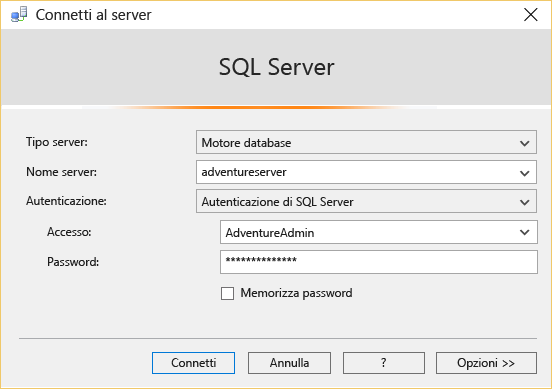

<properties
	pageTitle="Connettersi al database SQL tramite SSMS | Microsoft Azure"
	description="Informazioni su come connettersi a un database SQL di Azure usando SQL Server Management Studio (SSMS). Eseguire quindi una query di esempio usando Transact-SQL (T-SQL)."
	metaCanonical=""
	keywords="connettersi al database sql,sql server management studio"
	services="sql-database"
	documentationCenter=""
	authors="stevestein"
	manager="jeffreyg"
	editor="" />

<tags
	ms.service="sql-database"
	ms.workload="data-management"
	ms.tgt_pltfrm="na"
	ms.devlang="na"
	ms.topic="get-started-article"
	ms.date="10/09/2015"
	ms.author="sstein" />

# Connettersi al database SQL con SQL Server Management Studio ed eseguire una query T-SQL di esempio

> [AZURE.SELECTOR]
- [C#](sql-database-connect-query.md)
- [SSMS](sql-database-connect-query-ssms.md)
- [Excel](sql-database-connect-excel.md)

Questo articolo illustra come connettersi a un database SQL di Azure mediante SQL Server Management Studio (SSMS) ed eseguire una query semplice usando istruzioni Transact-SQL (T-SQL).

È necessario innanzitutto un database SQL in Azure. È possibile crearne uno rapidamente con le istruzioni disponibili in [Introduzione al database SQL di Microsoft Azure](sql-database-get-started.md). Gli esempi qui presenti si basano sul database di esempio AdventureWorks creato nell'articolo sopra riportato, ma la stessa procedura, fino all'esecuzione della query, si applica a qualsiasi database SQL.

## Installare e avviare SQL Server Management Studio (SSMS)

Quando si usa il database SQL, è necessario usare la versione più recente di SSMS. Per ottenerla, visitare la pagina di [download di SQL Server Management Studio](https://msdn.microsoft.com/library/mt238290.aspx). Con la versione più recente, SSMS notifica automaticamente l'utente quando è disponibile un aggiornamento più recente.

## Avviare SSMS e connettersi al server di database SQL

1. Digitare "Microsoft SQL Server Management Studio" nella casella di ricerca di Windows e quindi fare clic sull'applicazione desktop per avviare SSMS.
2. Nella finestra di dialogo **Connetti al server** digitare nella casella **Nome server** il nome del server che ospita il database SQL nel formato *&lt;nomeserver>*.**database.windows.net**.
3. Nella casella **Autenticazione** selezionare **Autenticazione di SQL Server**.
4. Digitare l'**Account di accesso** e la **Password** specificati durante la creazione del server e quindi fare clic su **Connetti** per connettersi al database SQL.

	

### Se la connessione al database SQL non riesce

I motivi più comuni per cui si verificano errori di connessione sono gli errori nel nome del server, nel nome utente o nella password, nonché il blocco delle connessioni da parte del server per motivi di sicurezza. Assicurarsi che le impostazioni del firewall del server consentano le connessioni dall'indirizzo IP del computer locale e dall'indirizzo IP usato dal client di SSMS. In alcuni casi i due indirizzi IP sono diversi.

Se la connessione non riesce a causa di impostazioni del firewall, la versione più recente di SQL Server Management Studio (SSMS) creerà automaticamente la regola del firewall dopo avere chiesto conferma. Per ottenere SSMS, visitare la pagina di [download di SQL Server Management Studio](https://msdn.microsoft.com/library/mt238290.aspx). Se si usa una versione precedente, l'indirizzo IP è segnalato in un messaggio di errore ed è necessario aggiungerlo alla regola del firewall del server. Per altre informazioni, vedere [Procedura: configurare le impostazioni del firewall (Database SQL di Azure)](sql-database-configure-firewall-settings.md).

## Eseguire query di esempio

Dopo la connessione al database SQL, è possibile eseguire una query di esempio. Se il database non è stato creato usando l'esempio AdventureWorks in [Creare il primo database SQL di Microsoft Azure](sql-database-get-started.md), questa query non funzionerà. Per altre informazioni, passare direttamente ai passaggi successivi.

1. In **Esplora oggetti** passare al database **AdventureWorks**.
2. Fare clic con il pulsante destro del mouse sul database e selezionare **Nuova query**.

	

3. Nella finestra della query appena aperta, copiare e incollare il codice seguente:

		SELECT
		CustomerId
		,Title
		,FirstName
		,LastName
		,CompanyName
		FROM SalesLT.Customer;

4. Fare clic sul pulsante **Esegui**. Nella schermata seguente viene illustrata una query con esito positivo.

	

## Passaggi successivi

È possibile usare istruzioni T-SQL per creare e gestire i database in Azure in modo analogo a SQL Server. Se si ha familiarità con l'uso di T-SQL con SQL Server, vedere [Informazioni su Transact-SQL del Database SQL di Azure](sql-database-transact-sql-information.md) per un riepilogo delle differenze.

Se non si ha familiarità con T-SQL, vedere [Esercitazione: Scrittura di istruzioni Transact-SQL](https://msdn.microsoft.com/library/ms365303.aspx) e [Guida di riferimento a Transact-SQL (Motore di database)](https://msdn.microsoft.com/library/bb510741.aspx).

<!---HONumber=Nov15_HO4-->