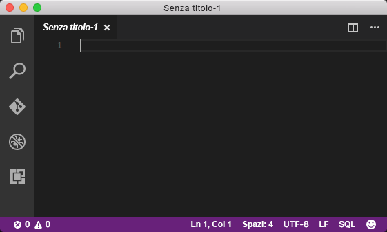
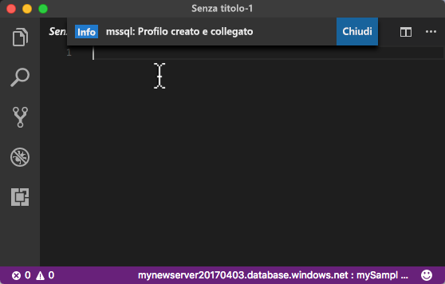
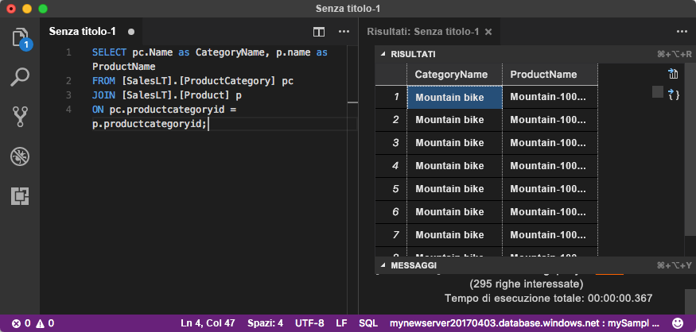

# <a name="azure-sql-database-use-visual-studio-code-to-connect-and-query-data"></a>Database SQL di Azure: Usare Visual Studio Code per connettersi ai dati ed eseguire query

[Visual Studio Code](https://code.visualstudio.com/docs) è un editor grafico di codice per Linux, macOS e Windows che supporta le estensioni, tra cui l'[estensione mssql](https://aka.ms/mssql-marketplace), per le query di Microsoft SQL Server, database SQL di Azure e SQL Data Warehouse. Questa guida introduttiva illustra come usare Visual Studio Code per connettersi a un database SQL di Azure e quindi come usare istruzioni Transact-SQL per eseguire query e inserire, aggiornare ed eliminare dati nel database.

## <a name="prerequisites"></a>Prerequisiti

Questa guida introduttiva usa come punto di partenza le risorse create in una delle guide introduttive seguenti:

[!INCLUDE [prerequisites-create-db](../../includes/sql-database-connect-query-prerequisites-create-db-includes.md)]

#### <a name="install-vs-code"></a>Installare Visual Studio Code

Prima di iniziare, assicurarsi di avere installato la versione più recente di [Visual Studio Code](https://code.visualstudio.com/Download) e di aver caricato l'[estensione mssql](https://aka.ms/mssql-marketplace). Per istruzioni sull'installazione dell'estensione mssql, vedere [Install VS Code](https://docs.microsoft.com/sql/linux/sql-server-linux-develop-use-vscode#install-vs-code) (Installare Visual Studio Code) e [mssql for Visual Studio Code](https://marketplace.visualstudio.com/items?itemName=ms-mssql.mssql) (mssql per Visual Studio Code). 

## <a name="configure-vs-code"></a>Configurare Visual Studio Code 

### <a name="mac-os"></a>**Mac OS**
Per macOS è necessario installare OpenSSL. Si tratta di un prerequisito per DotNet Core, che viene usato dall'estensione mssql. Aprire il terminale e immettere i comandi seguenti per installare **brew** e **OpenSSL**. 

```bash
ruby -e "$(curl -fsSL https://raw.githubusercontent.com/Homebrew/install/master/install)"
brew update
brew install openssl
mkdir -p /usr/local/lib
ln -s /usr/local/opt/openssl/lib/libcrypto.1.0.0.dylib /usr/local/lib/
ln -s /usr/local/opt/openssl/lib/libssl.1.0.0.dylib /usr/local/lib/
```

### <a name="linux-ubuntu"></a>**Linux (Ubuntu)**

Non è necessaria alcuna configurazione speciale.

### <a name="windows"></a>**Windows**

Non è necessaria alcuna configurazione speciale.

## <a name="sql-server-connection-information"></a>Informazioni di connessione SQL Server

Ottenere le informazioni di connessione necessarie per connettersi al database SQL di Azure. Nelle procedure successive saranno necessari il nome completo del server, il nome del database e le informazioni di accesso.

[!INCLUDE [prerequisites-server-connection-info](../../includes/sql-database-connect-query-prerequisites-server-connection-info-includes.md)]

## <a name="set-language-mode-to-sql"></a>Impostare la modalità linguaggio SQL

Impostare la modalità linguaggio su **SQL** in Visual Studio Code per abilitare i comandi mssql e T-SQL IntelliSense.

1. Aprire una nuova finestra di Visual Studio Code. 

2. Fare clic su **Testo normale** nell'angolo inferiore destro della barra di stato.
3. Nel menu a discesa **Seleziona modalità linguaggio** che viene visualizzato, digitare **SQL** e quindi premere **INVIO** per impostare la modalità del linguaggio su SQL. 

   

## <a name="connect-to-your-database"></a>Connettersi al database

Usare Visual Studio Code per stabilire una connessione al server del database SQL di Azure.

> [!IMPORTANT]
> Prima di continuare, assicurarsi di avere a portata di mano le informazioni su server, database e account di accesso. Se si modifica lo stato attivo dopo aver iniziato a immettere le informazioni sul profilo di connessione in Visual Studio Code, sarà necessario riavviare la creazione del profilo di connessione.
>

1. In Visual Studio Code premere **CTRL+MAIUSC+P** o **F1** per aprire il riquadro comandi.

2. Digitare **sqlcon** e premere **INVIO**.

3. Premere **INVIO** per selezionare **Create Connection Profile** (Creare profilo di connessione). Verrà creato un profilo di connessione per l'istanza di SQL Server.

4. Seguire le istruzioni per specificare le proprietà di connessione per il nuovo profilo di connessione. Dopo aver specificato ogni valore, premere **INVIO** per continuare. 

   | Impostazione       | Valore consigliato | Descrizione |
   | ------------ | ------------------ | ------------------------------------------------- | 
   | **Nome server | Nome completo del server | Il nome sarà simile a: **mynewserver20170313.database.windows.net**. |
   | **Database name** (Nome database) | mySampleDatabase | Nome del database a cui connettersi. |
   | **Autenticazione** | Account di accesso SQL| L'autenticazione SQL è il solo tipo di autenticazione configurato in questa esercitazione. |
   | **Nome utente** | Account amministratore del server | Si tratta dell'account specificato quando è stato creato il server. |
   | **Password (SQL Login)** (Password - Account di accesso SQL) | Password per l'account amministratore del server | Si tratta della password specificata quando è stato creato il server. |
   | **Save Password?** (Salvare la password?) | Sì o No | Selezionare Sì se non si vuole immettere la password ogni volta. |
   | **Immettere un nome per questo profilo** | Nome del profilo, ad esempio **mySampleDatabase** | Un nome del profilo salvato velocizza la connessione agli accessi successivi. | 

5. Premere il tasto **ESC** per chiudere il messaggio che informa che il profilo è stato creato e connesso.

6. Verificare la connessione nella barra di stato.

   

## <a name="query-data"></a>Eseguire query sui dati

Usare il codice seguente per eseguire una query per individuare i primi 20 prodotti per categoria usando l'istruzione [SELECT](https://msdn.microsoft.com/library/ms189499.aspx) di Transact-SQL.

1. Nella finestra dell'**editor** immettere la query seguente nella finestra di query vuota:

   ```sql
   SELECT pc.Name as CategoryName, p.name as ProductName
   FROM [SalesLT].[ProductCategory] pc
   JOIN [SalesLT].[Product] p
   ON pc.productcategoryid = p.productcategoryid;
   ```

2. Premere **CTRL+MAIUSC+E** per recuperare dati dalle tabelle Product e ProductCategory.

    

## <a name="insert-data"></a>Inserire dati

Usare il codice seguente per inserire un nuovo prodotto nella tabella SalesLT.Product usando l'istruzione [INSERT](https://msdn.microsoft.com/library/ms174335.aspx) di Transact-SQL.

1. Nella finestra dell'**editor** eliminare la query precedente e immettere la query seguente:

   ```sql
   INSERT INTO [SalesLT].[Product]
           ( [Name]
           , [ProductNumber]
           , [Color]
           , [ProductCategoryID]
           , [StandardCost]
           , [ListPrice]
           , [SellStartDate]
           )
     VALUES
           ('myNewProduct'
           ,123456789
           ,'NewColor'
           ,1
           ,100
           ,100
           ,GETDATE() );
   ```

2. Premere **CTRL+MAIUSC+E** per inserire una nuova riga nella tabella Product.

## <a name="update-data"></a>Aggiornare i dati

Usare il codice seguente per aggiornare il nuovo prodotto aggiunto in precedenza usando l'istruzione [UPDATE](https://msdn.microsoft.com/library/ms177523.aspx) di Transact-SQL.

1.  Nella finestra dell'**editor** eliminare la query precedente e immettere la query seguente:

   ```sql
   UPDATE [SalesLT].[Product]
   SET [ListPrice] = 125
   WHERE Name = 'myNewProduct';
   ```

2. Premere **CTRL+MAIUSC+E** per aggiornare la riga specificata nella tabella Product.

## <a name="delete-data"></a>Eliminare i dati

Usare il codice seguente per eliminare il nuovo prodotto aggiunto in precedenza usando l'istruzione [DELETE](https://docs.microsoft.com/sql/t-sql/statements/delete-transact-sql) di Transact-SQL.

1. Nella finestra dell'**editor** eliminare la query precedente e immettere la query seguente:

   ```sql
   DELETE FROM [SalesLT].[Product]
   WHERE Name = 'myNewProduct';
   ```

2. Premere **CTRL+MAIUSC+E** per eliminare la riga specificata nella tabella Product.

## <a name="next-steps"></a>Passaggi successivi

- Per connettersi ed eseguire una query usando SQL Server Management Studio, vedere [Connettersi ed eseguire una query con SSMS](sql-database-connect-query-ssms.md).
- Per connettersi ed eseguire query tramite il portale di Azure, vedere [Connettersi ed eseguire query con l'editor di query SQL del portale di Azure](sql-database-connect-query-portal.md).
- Per un articolo di MSDN Magazine sull'uso di Visual Studio Code, vedere il post di blog [Crea un IDE di database con estensione MSSQL](https://msdn.microsoft.com/magazine/mt809115).
