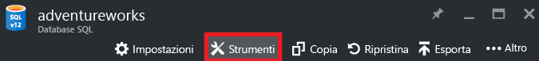
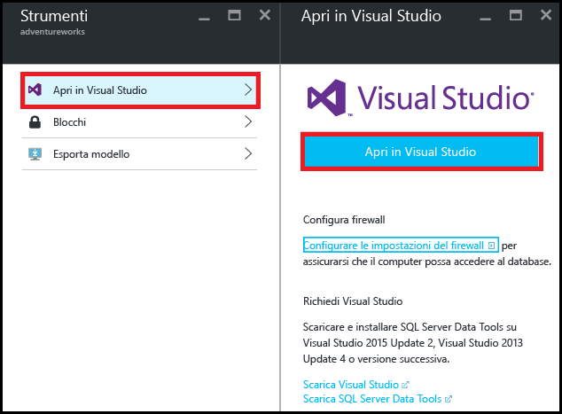
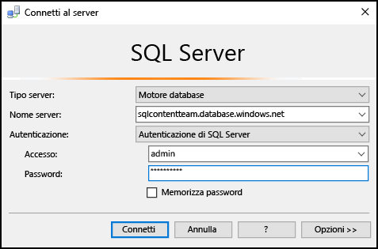
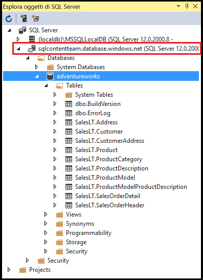
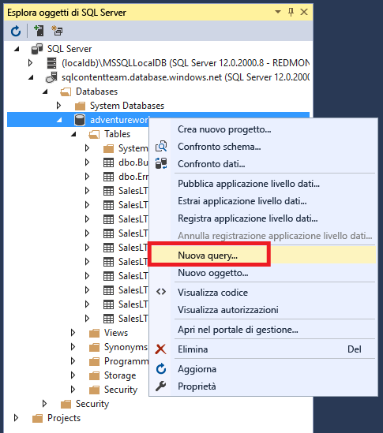
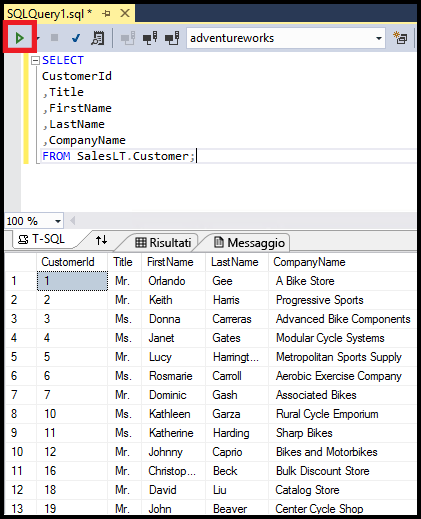

# Connettersi a un database SQL con Visual Studio

Informazioni su come connettersi a un database SQL di Azure in Visual Studio. 

## Prerequisiti
Per connettersi a un database SQL usando Visual Studio sono necessari gli elementi seguenti: 

* Un database SQL cui connettersi. Questo articolo usa il database di esempio **AdventureWorks** . Per ottenere il database di esempio AdventureWorks, vedere [Esercitazione sul database SQL: Creare un database SQL in pochi minuti usando il portale di Azure](sql-database-get-started.md).
* Visual Studio 2013 Update 4 o versioni successive. Ora Microsoft fornisce Visual Studio Community *gratuitamente*.
  
  * [Download di Visual Studio Community](http://www.visualstudio.com/products/visual-studio-community-vs)
  * [Altre opzioni per la versione gratuita di Visual Studio](http://www.visualstudio.com/products/free-developer-offers-vs.aspx)

## Aprire Visual Studio dal portale di Azure
1. Accedere al [Portale di Azure](https://portal.azure.com/).
2. Fare clic su **More Services** (Altri servizi)  > **Database SQL**.
3. Aprire il pannello del database **AdventureWorks** individuando il database *AdventureWorks* e facendo clic su di esso.
4. Nella parte superiore del pannello del database fare clic su **Strumenti** :
   
    
5. Fare clic su **Apri in Visual Studio**. Se è necessario Visual Studio, fare clic sul collegamento per il download:
   
    
6. Visual Studio si apre con la finestra **Connetti al server** già impostata per la connessione al server e al database selezionati nel portale.  Fare clic su **Opzioni** per verificare che la connessione sia impostata sul database corretto. Digitare la password amministratore server e fare clic su **Connetti**.

    

1. Se non è stata configurata una regola del firewall per l'indirizzo IP del computer, verrà visualizzato il messaggio *Impossibile connettersi* . Per creare una regola del firewall, vedere [Configurare una regola firewall a livello di server per il database SQL di Azure tramite il portale di Azure](sql-database-configure-firewall-settings.md).
2. Dopo aver stabilito la connessione si aprirà la finestra **Esplora oggetti di SQL Server** con una connessione al database.
   
    

## Eseguire una query di esempio
Ora che è stata stabilita la connessione al database, i passaggi seguenti illustrano come eseguire una query semplice:

1. Fare clic con il pulsante destro del mouse sul database e selezionare **Nuova query**.
   
    
2. Nella finestra della query appena aperta, copiare e incollare il codice seguente:
   
        SELECT
        CustomerId
        ,Title
        ,FirstName
        ,LastName
        ,CompanyName
        FROM SalesLT.Customer;
3. Fare clic sul pulsante **Esegui** per eseguire la query:
   
    

## Passaggi successivi
* L'apertura dei database SQL in Visual Studio richiede SQL Server Data Tools. Per altri dettagli, vedere [SQL Server Data Tools](https://msdn.microsoft.com/library/hh272686.aspx).
* Per connettersi a un database SQL tramite codice, vedere [Connettersi al database SQL tramite .NET (C#)](sql-database-develop-dotnet-simple.md).

<!--HONumber=Feb17_HO3-->

