# <a name="azure-ad-authentication-access-and-database-level-firewall-rules"></a>Autenticazione, accesso e regole del firewall a livello di database di Azure AD
Questa esercitazione illustra come usare SQL Server Management Studio per gestire l'autenticazione, gli account di accesso, gli utenti e i ruoli del database di Azure Active Directory che concedono l'accesso e le autorizzazioni per i database e i server di database SQL di Azure. Si apprenderà come:

- Visualizzare le autorizzazioni utente nel database master e nei database utente
- Creare account di accesso e utenti in base all'autenticazione di Azure Active Directory
- Concedere agli utenti autorizzazioni a livello di server e per database specifici
- Accedere a un database utente come utente non amministratore
- Creare regole del firewall a livello di database per gli utenti del database
- Creare regole del firewall a livello di server per gli amministratori del server

**Tempo stimato**: per completare questa esercitazione saranno necessari circa 45 minuti, presupponendo che siano già stati soddisfatti i prerequisiti.

## <a name="prerequisites"></a>Prerequisiti

* **Account Azure**. È necessario un account Azure. È possibile [aprire un account Azure gratuito](https://azure.microsoft.com/free/) o [attivare i benefici della sottoscrizione di Visual Studio](https://azure.microsoft.com/pricing/member-offers/msdn-benefits/). 

* **Autorizzazioni di creazione di Azure**. È necessario essere in grado di connettersi al portale di Azure usando un account membro del ruolo proprietario o collaboratore della sottoscrizione. Per altre informazioni sul controllo degli accessi in base al ruolo, vedere [Introduzione alla gestione degli accessi nel portale di Azure](../active-directory/role-based-access-control-what-is.md).

* **SQL Server Management Studio**. Per scaricare e installare l'ultima versione di SQL Server Management Studio (SSMS), vedere [Scaricare SQL Server Management Studio](https://msdn.microsoft.com/library/mt238290.aspx). Per la connessione al database SQL di Azure usare sempre l'ultima versione di SSMS, perché vengono continuamente rilasciate nuove funzionalità.

* **Server e database di base** Per installare e configurare un server e i due database usati in questa esercitazione, fare clic sul pulsante **Distribuisci in Azure**. Facendo clic sul pulsante, si apre il pannello **Deploy from a template** (Distribuisci da un modello). Creare un nuovo gruppo di risorse e specificare la **password di accesso amministratore** per il nuovo server che verrà creato:

   [](https://portal.azure.com/#create/Microsoft.Template/uri/https%3A%2F%2Fsqldbtutorial.blob.core.windows.net%2Ftemplates%2Fsqldbgetstarted.json)

   > [!NOTE]
   > Il completamento dell'esercitazione correlata per l'autenticazione di SQL Server, [l'autenticazione di SQL, account di accesso e utente, ruoli del database, autorizzazioni e regole del firewall a livello di server e a livello di database](sql-database-control-access-sql-authentication-get-started.md), è facoltativo. In tale esercitazione, tuttavia, vengono illustrati concetti che non vengono ripetuti qui. Le procedure di questa esercitazione relative al firewall a livello di server e a livello di database non sono necessarie se l'esercitazione correlata è stata eseguita sugli stessi computer (con gli stessi indirizzi IP) e sono contrassegnate come facoltative per tale motivo. Gli screenshot in questa esercitazione, inoltre, presuppongono che sia stata completata l'esercitazione correlata. 
   >

* Aver creato e popolato un'istanza di Azure Active Directory. Per altre informazioni, consultare [Integrazione delle identità locali con Azure Active Directory](../active-directory/active-directory-aadconnect.md), [Aggiungere un nome di dominio personalizzato ad Azure AD](../active-directory/active-directory-add-domain.md), [Windows Azure now supports federation with Windows Server Active Directory](https://azure.microsoft.com/blog/2012/11/28/windows-azure-now-supports-federation-with-windows-server-active-directory/) (Nuovo supporto per la federazione con Active Directory di Windows Server in Windows Azure), [Amministrazione della directory di Azure AD](https://msdn.microsoft.com/library/azure/hh967611.aspx) e [Gestire Azure AD con Windows PowerShell](https://msdn.microsoft.com/library/azure/jj151815.aspx) e [Porte e protocolli necessari per la soluzione ibrida di gestione delle identità](../active-directory/active-directory-aadconnect-ports.md).

> [!NOTE]
> Questa esercitazione supporta l'apprendimento del contenuto degli argomenti relativi al [controllo dell'accesso al database SQL](sql-database-control-access.md), ad [account di accesso, utenti e ruoli del database](sql-database-manage-logins.md), alle [entità](https://msdn.microsoft.com/library/ms181127.aspx), ai [ruoli del database](https://msdn.microsoft.com/library/ms189121.aspx), alle [regole del firewall per il database SQL](sql-database-firewall-configure.md) e all'[autenticazione di Azure Active Directory](sql-database-aad-authentication.md). 
>  

## <a name="sign-in-to-the-azure-portal-using-your-azure-account"></a>Accedere al portale di Azure con il proprio account Azure
Usando la [sottoscrizione esistente](https://account.windowsazure.com/Home/Index), seguire questa procedura per connettersi al portale di Azure.

1. Aprire il browser preferito e connettersi al [portale di Azure](https://portal.azure.com/).
2. Accedere al [portale di Azure](https://portal.azure.com/).
3. Nella **pagina di accesso** specificare le credenziali per la sottoscrizione.
   
   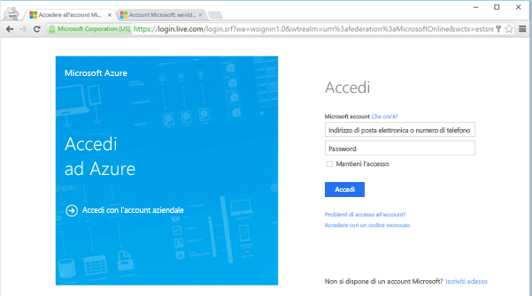


<a name="create-logical-server-bk"></a>

## <a name="provision-an-azure-active-directory-admin-for-your-sql-logical-server"></a>Effettuare il provisioning di un amministratore di Azure Active Directory per il server logico SQL

In questa sezione dell'esercitazione vengono visualizzate le informazioni relative alla configurazione della sicurezza per il server logico nel portale di Azure.

1. Aprire il pannello **SQL Server** per il server logico e visualizzare le informazioni nella pagina **Panoramica**. Si noti che non è stato configurato un amministratore di Azure Active Directory.

   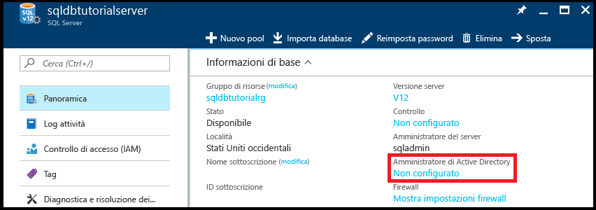

2. Fare clic su **Non configurato** nel riquadro **Informazioni di base** per aprire il pannello **Amministratore di Active Directory**.

   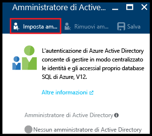

3. Fare clic su **Imposta amministratore** per aprire il pannello **Aggiungi amministratore** e quindi selezionare un account utente o gruppo di Active Directory come amministratore di Active Directory per il server.

   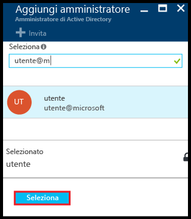

4. Fare clic su **Seleziona** e quindi su **Salva**.

   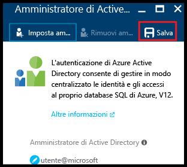

> [!NOTE]
> Per esaminare le informazioni di connessione per il server, andare in [Gestisci i server](sql-database-manage-servers-portal.md). Per questa serie di esercitazioni, il nome completo del server è "sqldbtutorialserver.database.windows.net".
>

## <a name="connect-to-sql-server-using-sql-server-management-studio-ssms"></a>Connettersi ad SQL Server con SQL Server Management Studio (SSMS)

1. Scaricare e installare la versione più recente di SSMS se non è già stato fatto, vedere [Scaricare SQL Server Management Studio](https://msdn.microsoft.com/library/mt238290.aspx). Per mantenersi aggiornata, la versione più recente di SSMS chiede di scaricare la nuova versione quando è disponibile.

2. Dopo l'installazione, digitare **Microsoft SQL Server Management Studio** nella casella di ricerca di Windows e premere **INVIO** per aprire SSMS.

   

3. Nella finestra di dialogo **Connetti al server** selezionare un metodo di autenticazione di Active Directory e quindi specificare le informazioni di autenticazione appropriate. Per informazioni sulla scelta di un metodo, vedere gli articoli relativi all'[autenticazione di Azure Active Directory](sql-database-aad-authentication.md) e al [supporto di SSMS per l'autenticazione MFA di Azure AD](sql-database-ssms-mfa-authentication.md).

   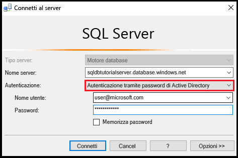

4. Immettere le informazioni necessarie per connettersi al server SQL usando l'autenticazione di SQL Server e l'account amministratore del server.

5. Fare clic su **Connect**.

   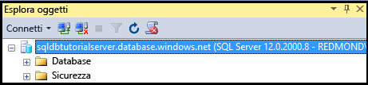

## <a name="view-the-server-admin-account-and-its-permissions"></a>Visualizzare l'account amministratore del server e le relative autorizzazioni 
In questa sezione dell'esercitazione vengono visualizzate le informazioni sull'account amministratore del server e sulle relative autorizzazioni nel database master e nei database utente.

1. In Esplora oggetti espandere **Database**, **Database di sistema**, **master**, **Sicurezza** e quindi **Utenti**. Si noti che nel database master è stato creato un account utente per l'amministratore di Active Directory. Si noti anche che non è stato creato un account di accesso per l'account utente amministratore di Active Directory.

   

   > [!NOTE]
   > Per informazioni sugli altri account utente visualizzati, vedere [Entità](https://msdn.microsoft.com/library/ms181127.aspx).
   >

2. In Esplora oggetti fare clic con il pulsante destro del mouse su **master** e quindi scegliere **Nuova query** per aprire una finestra di query connessa al database master.
3. Nella finestra visualizzata eseguire questa query per ottenere informazioni sull'utente che esegue la query. Si noti che come account utente che esegue la query viene restituito user@microsoft.com. Eseguendo la query su un database utente più avanti in questa procedura verrà visualizzato un risultato diverso.

   ```
   SELECT USER;
   ```

   

4. Nella finestra di query eseguire questa query per ottenere informazioni sulle autorizzazioni dell'utente amministratore di Active Directory. Si noti che l'utente amministratore di Active Directory ha le autorizzazioni per connettersi al database master, creare account di accesso e utenti, selezionare informazioni della tabella sys.sql_logins e aggiungere utenti ai ruoli dbmanager e dbcreator del database. Tali autorizzazioni sono in aggiunta a quelle concesse al ruolo public da cui tutti gli utenti ereditano le autorizzazioni, ad esempio per la selezione delle informazioni di determinate tabelle. Per altre informazioni, vedere [Autorizzazioni](https://msdn.microsoft.com/library/ms191291.aspx).

   ```
   SELECT prm.permission_name
      , prm.class_desc
      , prm.state_desc
      , p2.name as 'Database role'
      , p3.name as 'Additional database role' 
   FROM sys.database_principals p
   JOIN sys.database_permissions prm
      ON p.principal_id = prm.grantee_principal_id
      LEFT JOIN sys.database_principals p2
      ON prm.major_id = p2.principal_id
      LEFT JOIN sys.database_role_members r
      ON p.principal_id = r.member_principal_id
      LEFT JOIN sys.database_principals p3
      ON r.role_principal_id = p3.principal_id
   WHERE p.name = 'user@microsoft.com';
   ```

   

6. In Esplora oggetti espandere **blankdb**, **Sicurezza** e quindi **Utenti**. Si noti che in questo database non è presente un account utente denominato user@microsoft.com.

   

7. In Esplora oggetti fare clic con il pulsante destro del mouse su **blankdb** e quindi scegliere **Nuova query**.

8. Nella finestra visualizzata eseguire questa query per ottenere informazioni sull'utente che esegue la query. Si noti che come account utente che esegue la query viene restituito dbo. Per impostazione predefinita, l'account di accesso amministratore del server è mappato all'account utente dbo in ogni database.

   ```
   SELECT USER;
   ```

   

9. Nella finestra di query eseguire questa query per ottenere informazioni sulle autorizzazioni dell'utente dbo. Si noti che dbo è membro del ruolo public e anche del ruolo predefinito del database db_owner. Per altre informazioni, vedere [Ruoli a livello di database](https://msdn.microsoft.com/library/ms189121.aspx).

   ```
   SELECT prm.permission_name
      , prm.class_desc
      , prm.state_desc
      , p2.name as 'Database role'
      , p3.name as 'Additional database role' 
   FROM sys.database_principals AS p
   JOIN sys.database_permissions AS prm
      ON p.principal_id = prm.grantee_principal_id
      LEFT JOIN sys.database_principals AS p2
      ON prm.major_id = p2.principal_id
      LEFT JOIN sys.database_role_members r
      ON p.principal_id = r.member_principal_id
      LEFT JOIN sys.database_principals AS p3
      ON r.role_principal_id = p3.principal_id
   WHERE p.name = 'dbo';
   ```

   

10. Facoltativamente, ripetere i tre passaggi precedenti per il database utente AdventureWorksLT.

## <a name="create-a-new-user-in-the-adventureworkslt-database-with-select-permissions"></a>Creare un nuovo utente nel database AdventureWorksLT con autorizzazioni SELECT

In questa sezione dell'esercitazione si crea un account utente nel database AdventureWorksLT in base al nome dell'entità utente di un utente di Azure AD o al nome visualizzato di un gruppo di Azure AD, si testano le autorizzazioni di questo utente come membro del ruolo public, si concedono autorizzazioni SELECT all'utente e quindi se ne testano nuovamente le autorizzazioni.

> [!NOTE]
> Gli utenti a livello di database ([utenti indipendenti](https://msdn.microsoft.com/library/ff929188.aspx)) aumentano la portabilità del database, una funzionalità che verrà esaminata in esercitazioni successive.
>

1. In Esplora oggetti fare clic con il pulsante destro del mouse su **AdventureWorksLT** e quindi scegliere **Nuova query** per aprire una finestra di query connessa al database AdventureWorksLT.
2. Eseguire questa istruzione per creare un account utente nel database AdventureWorksLT per un utente denominato aaduser1 nel dominio Microsoft.

   ```
   CREATE USER [aaduser1@microsoft.com]
   FROM EXTERNAL PROVIDER;
   ```
   

3. Nella finestra di query eseguire questa query per ottenere informazioni sulle autorizzazioni di user1. Si noti che user1 ha solo le autorizzazioni ereditate dal ruolo public.

   ```
   SELECT prm.permission_name
      , prm.class_desc
      , prm.state_desc
      , p2.name as 'Database role'
      , p3.name as 'Additional database role' 
   FROM sys.database_principals AS p
   JOIN sys.database_permissions AS prm
      ON p.principal_id = prm.grantee_principal_id
      LEFT JOIN sys.database_principals AS p2
      ON prm.major_id = p2.principal_id
      LEFT JOIN sys.database_role_members r
      ON p.principal_id = r.member_principal_id
      LEFT JOIN sys.database_principals AS p3
      ON r.role_principal_id = p3.principal_id
   WHERE p.name = 'aaduser1@microsoft.com';
   ```

   

4. Eseguire queste query per provare l'esecuzione di query su una tabella del database AdventureWorksLT come user1.

   ```
   EXECUTE AS USER = 'aaduser1@microsoft.com';  
   SELECT * FROM [SalesLT].[ProductCategory];
   REVERT;
   ```

   

5. Eseguire questa istruzione per concedere le autorizzazioni SELECT per la tabella ProductCategory dello schema SalesLT a user1.

   ```
   GRANT SELECT ON OBJECT::[SalesLT].[ProductCategory] to [aaduser1@microsoft.com];
   ```

   

6. Eseguire queste query per provare l'esecuzione di query su una tabella del database AdventureWorksLT come user1.

   ```
   EXECUTE AS USER = 'aaduser1@microsoft.com';  
   SELECT * FROM [SalesLT].[ProductCategory];
   REVERT;
   ```

   

## <a name="create-a-database-level-firewall-rule-for-adventureworkslt-database-users"></a>Creare una regola del firewall a livello di database per gli utenti del database AdventureWorksLT

> [!NOTE]
> Non è necessario completare questa procedura se è stata completata la procedura equivalente nell'esercitazione correlata per l'autenticazione di SQL Server, [autenticazione e autorizzazione SQL](sql-database-control-access-sql-authentication-get-started.md) e se l'utente sta imparando a usare lo stesso computer con lo stesso indirizzo IP.
>

In questa sezione dell'esercitazione si tenta l'accesso con il nuovo account utente da un computer con un diverso indirizzo IP, si crea una regola del firewall a livello di database come amministratore del server e quindi si esegue l'accesso con questa nuova regola del firewall a livello di database. 

> [!NOTE]
> Le [regole del firewall a livello di database](sql-database-firewall-configure.md) aumentano la portabilità del database, una funzionalità che verrà esaminata in esercitazioni successive.
>

1. Aprire SQL Server Management Studio in un altro computer per cui non è già stata creata una regola del firewall a livello di server.

   > [!IMPORTANT]
   > Usare sempre l'ultima versione di SSMS, disponibile nella pagina [Scaricare SQL Server Management Studio](https://msdn.microsoft.com/library/mt238290.aspx). 
   >

2. Nella finestra **Connetti al server** immettere il nome del server e le informazioni di autenticazione per connettersi usando l'autenticazione di SQL Server con l'account aaduser1@microsoft.com. 
    
   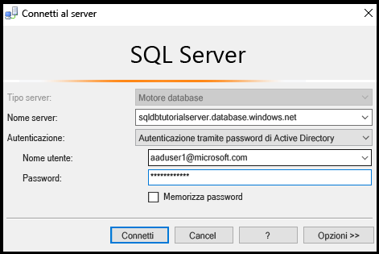

3. Fare clic su **Opzioni** per specificare il database a cui connettersi e quindi digitare **AdventureWorksLT** nella casella di riepilogo a discesa **Connetti al database** della scheda **Proprietà connessione**.
   
   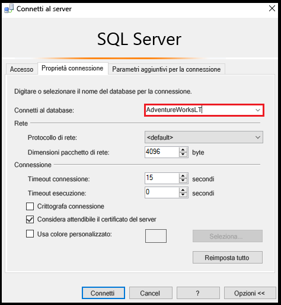

4. Fare clic su **Connect**. Verrà visualizzata una finestra di dialogo che informa che il computer da cui si sta tentando di connettersi al database SQL non ha una regola del firewall che consente l'accesso al database. La finestra di dialogo può essere visualizzata in due varianti, a seconda dei passaggi eseguiti precedentemente con i firewall. In genere, tuttavia, viene visualizzata la prima finestra di dialogo illustrata.

   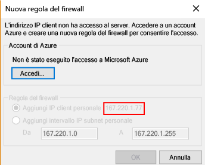

   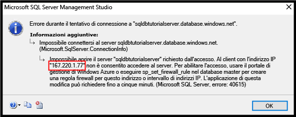

   > [!NOTE]
   > Le versioni più recenti di SSMS includono una funzionalità che consente ai proprietari e ai collaboratori di una sottoscrizione di accedere a Microsoft Azure e creare una regole del firewall a livello di server.
   > 

4. Copiare l'indirizzo IP client riportato in questa finestra di dialogo, che verrà usato nel passaggio 7.
5. Fare clic su **Annulla** ma non chiudere la finestra di dialogo **Connetti al server**.
6. Passare a un computer per cui è già stata creata una regola del firewall a livello di server e connettersi al server usando l'account amministratore del server.
7. In una nuova finestra di query connessa al database AdventureWorksLT, come amministratore del server, eseguire questa istruzione per creare una regola del firewall a livello di database eseguendo [sp_set_database_firewall_rule](https://msdn.microsoft.com/library/dn270010.aspx) con l'indirizzo IP del passaggio 4:

   ```
   EXEC sp_set_database_firewall_rule @name = N'AdventureWorksLTFirewallRule', 
     @start_ip_address = 'x.x.x.x', @end_ip_address = 'x.x.x.x';
   ```

   

8. Cambiare nuovamente computer e fare clic su **Connetti** nella finestra di dialogo **Connetti al server** per connettersi ad AdventureWorksLT come aaduser1. 

9. In Esplora oggetti espandere **Database**, **AdventureWorksLT** e quindi **Tabelle**. Si noti che user1 ha solo l'autorizzazione per visualizzare una singola tabella, **SalesLT.ProductCategory**. 

10. In Esplora oggetti fare clic con il pulsante destro del mouse su **SalesLT.ProductCategory** e quindi scegliere **Seleziona le prime 1000 righe**.   

## <a name="next-steps"></a>Passaggi successivi
- Per una panoramica dell'accesso e del controllo nel database SQL, vedere l'articolo relativo al [controllo dell'accesso al database SQL](sql-database-control-access.md).
- Per una panoramica degli account di accesso, degli utenti e dei ruoli del database nel database SQL, vedere l'articolo relativo ad [account di accesso, utenti e ruoli del database](sql-database-manage-logins.md).
- Per altre informazioni sulle entità di database, vedere [Entità](https://msdn.microsoft.com/library/ms181127.aspx).
- Per altre informazioni sui ruoli del database, vedere [Ruoli a livello di database](https://msdn.microsoft.com/library/ms189121.aspx).
- Per informazioni generali sulle regole del firewall, vedere l'articolo relativo alle [regole del firewall per il database SQL](sql-database-firewall-configure.md).


