# <a name="sql-server-authentication-access-and-database-level-firewall-rules"></a>Autenticazione di SQL Server, accesso e regole del firewall a livello di database

In questa esercitazione viene illustrato come servirsi di SQL Server Management Studio per usare l'autenticazione di SQL Server, gli account di accesso, gli utenti e i ruoli del database che concedono l'accesso e le autorizzazioni per i database e i server di database SQL di Azure. Al termine di questa esercitazione, si sarà in grado di:

- Creare account di accesso e utenti in base all'autenticazione di SQL Server
- Aggiungere utenti e concedere autorizzazioni ai ruoli
- Usare T-SQL per creare una regola del firewall a livello di database e una a livello di server 
- Connettersi come utente a un database specifico usando SSMS
- Visualizzare le autorizzazioni utente nel database master e nei database utente

**Tempo stimato**: per completare questa esercitazione saranno necessari circa 45 minuti, presupponendo che siano già stati soddisfatti i prerequisiti.

> [!NOTE]
> Questa esercitazione supporta l'apprendimento del contenuto degli argomenti relativi al [controllo dell'accesso al database SQL](sql-database-control-access.md), ad [account di accesso, utenti e ruoli del database](sql-database-manage-logins.md), alle [entità](https://msdn.microsoft.com/library/ms181127.aspx), ai [ruoli del database](https://msdn.microsoft.com/library/ms189121.aspx) e alle [regole del firewall per il database SQL](sql-database-firewall-configure.md). Per un'esercitazione sull'autenticazione di Azure Active Directory, vedere l'[introduzione all'autenticazione di Azure AD](sql-database-control-access-aad-authentication-get-started.md).
>  

## <a name="prerequisites"></a>Prerequisiti

* **Account Azure**. È necessario un account Azure. È possibile [aprire un account Azure gratuito](https://azure.microsoft.com/free/) o [attivare i benefici della sottoscrizione di Visual Studio](https://azure.microsoft.com/pricing/member-offers/msdn-benefits/). 

* **Autorizzazioni di creazione di Azure**. È necessario essere in grado di connettersi al portale di Azure usando un account membro del ruolo proprietario o collaboratore della sottoscrizione. Per altre informazioni sul controllo degli accessi in base al ruolo, vedere [Introduzione alla gestione degli accessi nel portale di Azure](../active-directory/role-based-access-control-what-is.md).

* **SQL Server Management Studio**. Per scaricare e installare l'ultima versione di SQL Server Management Studio (SSMS), vedere [Scaricare SQL Server Management Studio](https://msdn.microsoft.com/library/mt238290.aspx). Per la connessione al database SQL di Azure usare sempre l'ultima versione di SSMS, perché vengono continuamente rilasciate nuove funzionalità.

* **Server e database di base** Per installare e configurare un server e i due database usati in questa esercitazione, fare clic sul pulsante **Distribuisci in Azure**. Facendo clic sul pulsante, si apre il pannello **Deploy from a template** (Distribuisci da un modello). Creare un nuovo gruppo di risorse e specificare la **password di accesso amministratore** per il nuovo server che verrà creato:

   [](https://portal.azure.com/#create/Microsoft.Template/uri/https%3A%2F%2Fsqldbtutorial.blob.core.windows.net%2Ftemplates%2Fsqldbgetstarted.json)


## <a name="sign-in-to-the-azure-portal-using-your-azure-account"></a>Accedere al portale di Azure con il proprio account Azure
I passaggi di questa procedura illustrano come connettersi al portale di Azure con l'account Azure (https://account.windowsazure.com/Home/Index).

1. Aprire il browser preferito e connettersi al [portale di Azure](https://portal.azure.com/).
2. Accedere al [portale di Azure](https://portal.azure.com/).
3. Nella **pagina di accesso** specificare le credenziali per la sottoscrizione.
   
   


<a name="create-logical-server-bk"></a>

## <a name="view-logical-server-security-information-in-the-azure-portal"></a>Visualizzare le informazioni sulla sicurezza del server logico nel portale di Azure

I passaggi di questa procedura illustrano come visualizzare le informazioni relative alla configurazione della sicurezza per il server logico nel portale di Azure.

1. Aprire il pannello **SQL Server** per il server e visualizzare le informazioni nella pagina **Panoramica**.

   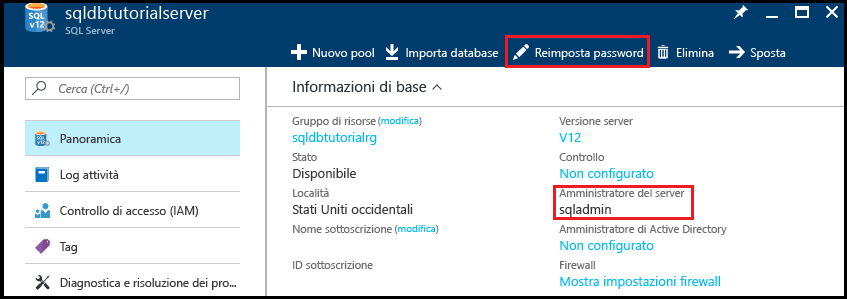

2. Prendere nota del nome dell'amministratore del server logico. 

3. Se non si ricorda la password, fare clic su **Reimposta password** per impostarne una nuova.

4. Se è necessario ottenere le informazioni di connessione per il server, fare clic su **Proprietà**.

## <a name="view-server-admin-permissions-using-ssms"></a>Visualizzare le autorizzazioni dell'amministratore del server con SSMS

I passaggi di questa procedura illustrano come visualizzare le informazioni sull'account amministratore del server e sulle relative autorizzazioni nel database master e nei database utente.

1. Aprire SQL Server Management Studio e connettersi al server come amministratore usando l'autenticazione di SQL Server e l'account amministratore del server.

   

2. Fare clic su **Connect**.

   

3. In Esplora oggetti espandere **Sicurezza** e quindi **Account di accesso** per visualizzare gli account di accesso esistenti per il server. L'unico account di accesso per un nuovo server è quello dell'account amministratore del server.

   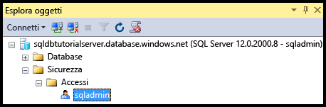

4. In Esplora oggetti espandere **Database**, **Database di sistema**, **master**, **Sicurezza** e quindi **Utenti** per visualizzare l'account utente che è stato creato per l'account di accesso amministratore del server in questo database.

   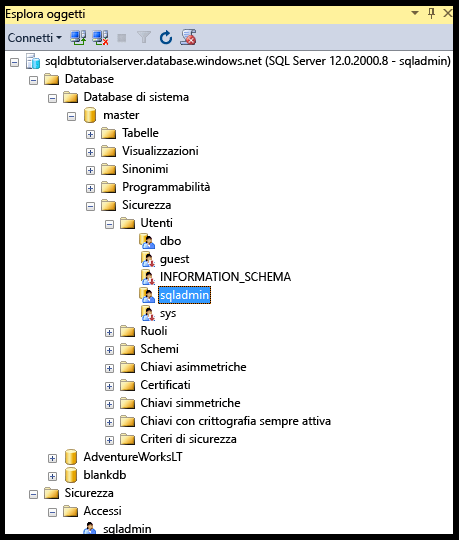

   > [!NOTE]
   > Per informazioni sugli altri account utente visualizzati nel nodo Utenti, vedere [Entità](https://msdn.microsoft.com/library/ms181127.aspx).
   >

5. In Esplora oggetti fare clic con il pulsante destro del mouse su **master** e quindi scegliere **Nuova query** per aprire una finestra di query connessa al database master.
6. Nella finestra visualizzata eseguire questa query per ottenere informazioni sull'utente che esegue la query. 

   ```
   SELECT USER;
   ```

   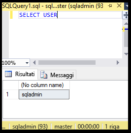

7. Nella finestra di query eseguire questa query per ottenere informazioni sulle autorizzazioni dell'utente sqladmin nel database **master**. 

   ```
   SELECT prm.permission_name
      , prm.class_desc
      , prm.state_desc
      , p2.name as 'Database role'
      , p3.name as 'Additional database role' 
   FROM sys.database_principals p
   JOIN sys.database_permissions prm
      ON p.principal_id = prm.grantee_principal_id
      LEFT JOIN sys.database_principals p2
      ON prm.major_id = p2.principal_id
      LEFT JOIN sys.database_role_members r
      ON p.principal_id = r.member_principal_id
      LEFT JOIN sys.database_principals p3
      ON r.role_principal_id = p3.principal_id
   WHERE p.name = 'sqladmin';
   ```

   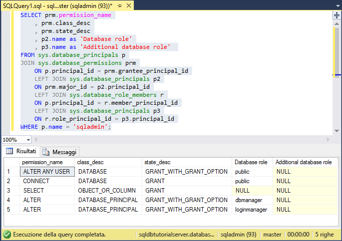

   >[!NOTE]
   > L'amministratore del server ha le autorizzazioni per connettersi al database master, creare account di accesso e utenti, selezionare informazioni della tabella sys.sql_logins e aggiungere utenti ai ruoli dbmanager e dbcreator del database. Tali autorizzazioni sono in aggiunta a quelle concesse al ruolo public da cui tutti gli utenti ereditano le autorizzazioni, ad esempio per la selezione delle informazioni di determinate tabelle. Per altre informazioni, vedere [Autorizzazioni](https://msdn.microsoft.com/library/ms191291.aspx).
   >

8. In Esplora oggetti espandere **blankdb**, **Sicurezza** e quindi **Utenti** per visualizzare l'account utente che è stato creato per l'account di accesso amministratore del server in questo database e in ogni database utente.

   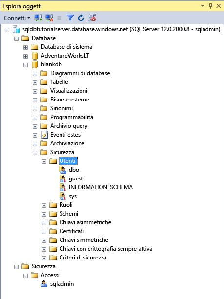

9. In Esplora oggetti fare clic con il pulsante destro del mouse su **blankdb** e quindi scegliere **Nuova query**.

10. Nella finestra visualizzata eseguire questa query per ottenere informazioni sull'utente che esegue la query.

   ```
   SELECT USER;
   ```

   

11. Nella finestra di query eseguire questa query per ottenere informazioni sulle autorizzazioni dell'utente dbo. 

   ```
   SELECT prm.permission_name
      , prm.class_desc
      , prm.state_desc
      , p2.name as 'Database role'
      , p3.name as 'Additional database role' 
   FROM sys.database_principals AS p
   JOIN sys.database_permissions AS prm
      ON p.principal_id = prm.grantee_principal_id
      LEFT JOIN sys.database_principals AS p2
      ON prm.major_id = p2.principal_id
      LEFT JOIN sys.database_role_members r
      ON p.principal_id = r.member_principal_id
      LEFT JOIN sys.database_principals AS p3
      ON r.role_principal_id = p3.principal_id
   WHERE p.name = 'dbo';
   ```

   

   > [!NOTE]
   > L'utente dbo è membro del ruolo public e anche del ruolo predefinito del database db_owner. Per altre informazioni, vedere [Ruoli a livello di database](https://msdn.microsoft.com/library/ms189121.aspx).
   >

## <a name="create-a-new-user-with-select-permissions"></a>Creare un nuovo utente con autorizzazioni SELECT

I passaggi di questa procedura illustrano come creare un utente a livello di database, testare le autorizzazioni predefinite di un nuovo utente (tramite il ruolo public), concedere a un utente autorizzazioni **SELECT** e visualizzare le autorizzazioni modificate.

> [!NOTE]
> Gli utenti a livello di database sono denominati anche [utenti indipendenti](https://msdn.microsoft.com/library/ff929188.aspx) e aumentano la portabilità del database. Per informazioni sui vantaggi della portabilità, vedere l'articolo su come [configurare e gestire la sicurezza dei database SQL di Azure per il ripristino geografico o il failover in un server secondario](sql-database-geo-replication-security-config.md).
>

1. In Esplora oggetti fare clic con il pulsante destro del mouse su **sqldbtutorialdb** e quindi scegliere **Nuova query**.
2. Eseguire questa istruzione nella finestra di query per creare un utente denominato **user1** nel database sqldbtutorialdb.

   ```
   CREATE USER user1
   WITH PASSWORD = 'p@ssw0rd';
   ```
   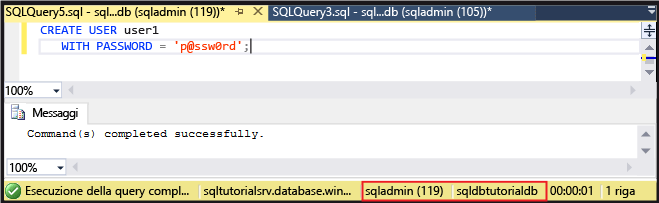

3. Nella finestra di query eseguire questa query per ottenere informazioni sulle autorizzazioni di user1.

   ```
   SELECT prm.permission_name
      , prm.class_desc
      , prm.state_desc
      , p2.name as 'Database role'
      , p3.name as 'Additional database role' 
   FROM sys.database_principals AS p
   JOIN sys.database_permissions AS prm
      ON p.principal_id = prm.grantee_principal_id
      LEFT JOIN sys.database_principals AS p2
      ON prm.major_id = p2.principal_id
      LEFT JOIN sys.database_role_members r
      ON p.principal_id = r.member_principal_id
      LEFT JOIN sys.database_principals AS p3
      ON r.role_principal_id = p3.principal_id
   WHERE p.name = 'user1';
   ```

   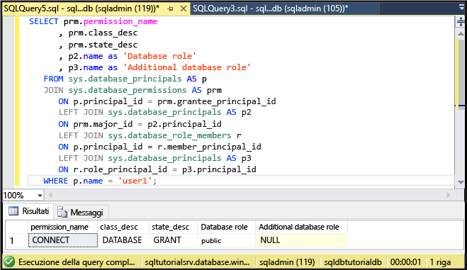

   > [!NOTE]
   > Un nuovo utente in un database ha solo le autorizzazioni ereditate dal ruolo public.
   >

4. Eseguire queste query con l'istruzione **EXECUTE AS USER** per provare l'esecuzione di query sulla tabella SalesLT.ProductCategory del database sqldbtutorialdb come **user1** con le sole autorizzazioni ereditate dal ruolo public.

   ```
   EXECUTE AS USER = 'user1';  
   SELECT * FROM [SalesLT].[ProductCategory];
   REVERT;
   ```

   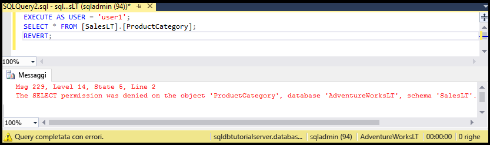

   > [!NOTE]
   > Per impostazioni predefinita, il ruolo public non concede autorizzazioni **SELECT** per gli oggetti utente.
   >

5. Eseguire questa istruzione per concedere le autorizzazioni **SELECT** per la tabella SalesLT.ProductCategory a **user1**.

   ```
   GRANT SELECT ON OBJECT::[SalesLT].[ProductCategory] to user1;
   ```

   

6. Eseguire queste query per completare l'esecuzione di query sulla tabella SalesLT.ProductCategory del database sqldbtutorialdb come **user1**.

   ```
   EXECUTE AS USER = 'user1';  
   SELECT * FROM [SalesLT].[ProductCategory];
   REVERT;
   ```

   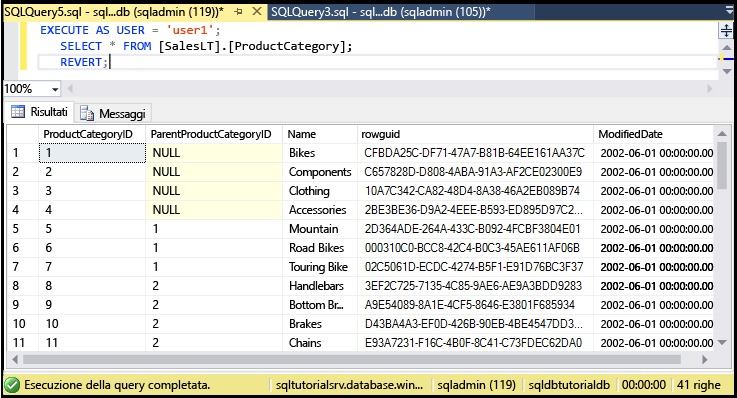

## <a name="create-a-database-level-firewall-rule-using-t-sql"></a>Creare una regola del firewall a livello di database con T-SQL

I passaggi di questa procedura illustrano come creare una regola del firewall a livello di database con la stored procedure di sistema [sp_set_database_firewall_rule](https://msdn.microsoft.com/library/dn270010.aspx). Una regola del firewall a livello di database consente a un amministratore del server di concedere agli utenti l'accesso tramite il firewall di database SQL di Azure solo per database specifici.

> [!NOTE]
> Le [regole del firewall a livello di database](sql-database-firewall-configure.md) aumentano la portabilità del database. Per informazioni sui vantaggi della portabilità, vedere l'articolo su come [configurare e gestire la sicurezza dei database SQL di Azure per il ripristino geografico o il failover in un server secondario](sql-database-geo-replication-security-config.md).
>

> [!IMPORTANT]
> Per testare una regola del firewall a livello di database, connettersi da un altro computer oppure eliminare la regola del firewall a livello di server nel portale di Azure.
>

1. Aprire SQL Server Management Studio in un computer per cui non esiste una regola del firewall a livello di server.

2. Nella finestra **Connetti al server** immettere il nome del server e le informazioni di autenticazione per connettersi usando l'autenticazione di SQL Server con l'account **user1**. 
    
   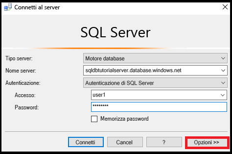

3. Fare clic su **Opzioni** per specificare il database a cui connettersi e quindi digitare **sqldbtutorialdb** nella casella di riepilogo a discesa **Connetti al database** della scheda **Proprietà connessione**.
   
   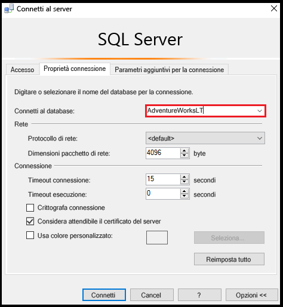

4. Fare clic su **Connect**. 

   Verrà visualizzata una finestra di dialogo che informa che il computer da cui si sta tentando di connettersi al database SQL non ha una regola del firewall che consente l'accesso al database. 

   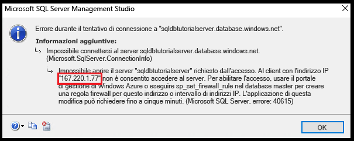


5. Copiare l'indirizzo IP client riportato in questa finestra di dialogo, che verrà usato nel passaggio 8.
6. Fare clic su **OK** per chiudere la finestra di errore, ma non chiudere la finestra di dialogo **Connetti al server**.
7. Passare a un computer per cui è già stata creata una regola del firewall a livello di server. 
8. Connettersi al database sqldbtutorialdb in SSMS come amministratore del server ed eseguire questa istruzione per creare una regola del firewall a livello di database usando l'indirizzo IP (o l'intervallo di indirizzi) del passaggio 5.  

   ```
   EXEC sp_set_database_firewall_rule @name = N'sqldbtutorialdbFirewallRule', 
     @start_ip_address = 'x.x.x.x', @end_ip_address = 'x.x.x.x';
   ```

   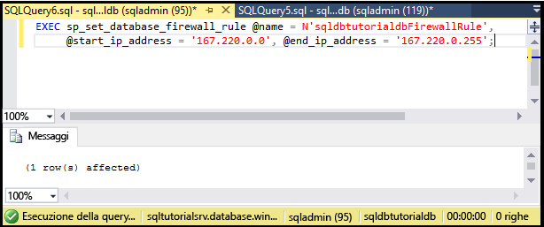

9. Cambiare nuovamente computer e fare clic su **Connetti** nella finestra di dialogo **Connetti al server** per connettersi a sqldbtutorialdb come user1. 

   > [!NOTE]
   > Dopo che è stata creata la regola del firewall a livello di database, prima che diventi attiva potrebbero trascorrere fino a 5 minuti.
   >

10. Dopo aver stabilito la connessione, espandere **Database** in Esplora oggetti. Si noti che **user1** può visualizzare solo il database **sqldbtutorialdb**.

   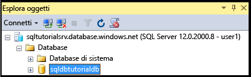

11. Espandere **sqldbtutorialdb** e quindi **Tabelle**. Si noti che user1 ha solo l'autorizzazione per visualizzare una singola tabella, **SalesLT.ProductCategory**. 

   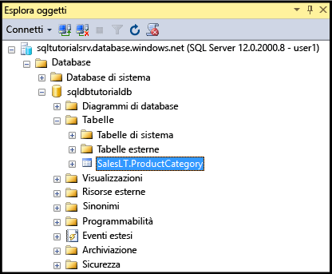

## <a name="create-a-new-user-as-dbowner-and-a-database-level-firewall-rule"></a>Creare un nuovo utente come db_owner e una regola del firewall a livello di database

I passaggi di questa procedura illustrano come creare un utente in un altro database con le autorizzazioni del ruolo del database db_owner e come creare una regola del firewall a livello di database per tale database. Il nuovo utente appartenente al ruolo **db_owner** potrà eseguire la connessione e la gestione solo per questo singolo database.

1. Passare al computer con una connessione al database SQL usando l'account amministratore del server.
2. Aprire una finestra di query connessa al database **blankdb** ed eseguire questa istruzione per creare un utente denominato blankdbadmin nel database blankdb.

   ```
   CREATE USER blankdbadmin
   WITH PASSWORD = 'p@ssw0rd';
   ```

3. Nella stessa finestra di query eseguire questa istruzione per aggiungere l'utente blankdbadmin al ruolo del database db_owner. Ora l'utente può eseguire tutte le azioni necessarie per gestire il database blankdb.

   ```
   ALTER ROLE db_owner ADD MEMBER blankdbadmin; 
   ```

4. Nella stessa finestra di query eseguire questa istruzione per creare una regola del firewall a livello di database eseguendo [sp_set_database_firewall_rule](https://msdn.microsoft.com/library/dn270010.aspx) con l'indirizzo IP del passaggio 4 della procedura precedente, o un intervallo di indirizzi IP per gli utenti del database:

   ```
   EXEC sp_set_database_firewall_rule @name = N'blankdbFirewallRule', 
     @start_ip_address = 'x.x.x.x', @end_ip_address = 'x.x.x.x';
   ```

5. Passare a un computer per cui è stata creata una regola del firewall a livello di database e connettersi al database blankdb usando l'account utente blankdbadmin.
6. Aprire una finestra di query nel database blankdb ed eseguire questa istruzione per creare un utente denominato blankdbuser1 nel database blankdb.

   ```
   CREATE USER blankdbuser1
   WITH PASSWORD = 'p@ssw0rd';
   ```
 
7. In base alle esigenze dell'ambiente di apprendimento, è possibile creare una regola del firewall aggiuntiva a livello di database per questo utente. Questo passaggio potrebbe tuttavia non essere necessario se la regola del firewall a livello di database è stata creata con un intervallo di indirizzi IP.

## <a name="grant-dbmanager-permissions-and-create-a-server-level-firewall-rule"></a>Concedere autorizzazioni a dbmanager e creare una regola del firewall a livello di server

I passaggi di questa procedura illustrano come creare un account di accesso e un utente nel database master con le autorizzazioni per creare e gestire nuovi database utente. I passaggi illustrano anche come creare una regola del firewall aggiuntiva a livello di server usando Transact-SQL con [sp_set_firewall_rule](https://msdn.microsoft.com/library/dn270017.aspx). 

> [!IMPORTANT]
>La prima regola del firewall a livello di server deve essere sempre creata in Azure (nel portale di Azure, con PowerShell o con l'API REST).
>

> [!IMPORTANT]
> Per consentire all'amministratore del server di delegare le autorizzazioni per la creazione di database a un altro utente, è necessario creare account di accesso nel database master e creare un account utente da un account di accesso. La creazione di account di accesso e quindi di utenti dagli account di accesso, tuttavia, riduce la portabilità dell'ambiente.
>

1. Passare al computer con una connessione al database SQL usando l'account amministratore del server.
2. Aprire una finestra di query connessa al database master ed eseguire questa istruzione per creare un account di accesso denominato dbcreator nel database master.

   ```
   CREATE LOGIN dbcreator
   WITH PASSWORD = 'p@ssw0rd';
   ```

3. Nella stessa finestra di query: 

   ```
   CREATE USER dbcreator
   FROM LOGIN dbcreator;
   ```

3. Nella stessa finestra di query eseguire questa query per aggiungere l'utente dbcreator al ruolo del database dbmanager. Ora l'utente può creare e gestire i database creati dall'utente.

   ```
   ALTER ROLE dbmanager ADD MEMBER dbcreator; 
   ```

4. Nella stessa finestra di query eseguire questa query per creare una regola del firewall a livello di server con [sp_set_firewall_rule](https://msdn.microsoft.com/library/dn270017.aspx), usando un indirizzo IP appropriato per l'ambiente:

   ```
   EXEC sp_set_firewall_rule @name = N'dbcreatorFirewallRule', 
     @start_ip_address = 'x.x.x.x', @end_ip_address = 'x.x.x.x';
   ```

5. Passare a un computer per cui è stata creata una regola del firewall a livello di server e connettersi al database master usando l'account utente dbcreator.
6. Aprire una finestra di query nel database master ed eseguire questa query per creare un database denominato foo.

   ```
   CREATE DATABASE FOO (EDITION = 'basic');
   ```
 7. Facoltativamente, è possibile eliminare il database per risparmiare denaro usando l'istruzione seguente:

   ```
   DROP DATABASE FOO;
   ```

## <a name="complete-script"></a>Script completo

Per creare gli account di accesso e gli utenti e poi aggiungerli ai ruoli, concedere loro le autorizzazioni, creare regole del firewall a livello di database e a livello di server, eseguire queste istruzioni nei database appropriati del server.

### <a name="master-database"></a>database master
Eseguire queste istruzioni nel database master usando l'account amministratore del server e aggiungendo gli indirizzi IP o l'intervallo di indirizzi IP appropriato.

```
CREATE LOGIN dbcreator WITH PASSWORD = 'p@ssw0rd';
CREATE USER dbcreator FROM LOGIN dbcreator;
ALTER ROLE dbmanager ADD MEMBER dbcreator;
EXEC sp_set_firewall_rule @name = N'dbcreatorFirewallRule', 
     @start_ip_address = 'x.x.x.x', @end_ip_address = 'x.x.x.x';
```

### <a name="sqldbtutorialdb-database"></a>Database sqldbtutorialdb
Eseguire queste istruzioni nel database sqldbtutorialdb con l'account amministratore del server, aggiungendo gli indirizzi IP o l'intervallo di indirizzi IP appropriato.

```
CREATE USER user1 WITH PASSWORD = 'p@ssw0rd';
GRANT SELECT ON OBJECT::[SalesLT].[ProductCategory] to user1;
EXEC sp_set_database_firewall_rule @name = N'sqldbtutorialdbFirewallRule', 
     @start_ip_address = 'x.x.x.x', @end_ip_address = 'x.x.x.x';
```

### <a name="blankdb-database"></a>Database blankdb
Eseguire queste istruzioni nel database blankdb usando l'account amministratore del server e aggiungendo gli indirizzi IP o l'intervallo di indirizzi IP appropriato.

```
CREATE USER blankdbadmin
   WITH PASSWORD = 'p@ssw0rd';
ALTER ROLE db_owner ADD MEMBER blankdbadmin;
EXEC sp_set_database_firewall_rule @name = N'blankdbFirewallRule', 
     @start_ip_address = 'x.x.x.x', @end_ip_address = 'x.x.x.x';
CREATE USER blankdbuser1
   WITH PASSWORD = 'p@ssw0rd';
```

## <a name="next-steps"></a>Passaggi successivi
- Per una panoramica dell'accesso e del controllo nel database SQL, vedere l'articolo relativo al [controllo dell'accesso al database SQL](sql-database-control-access.md).
- Per una panoramica degli account di accesso, degli utenti e dei ruoli del database nel database SQL, vedere l'articolo relativo ad [account di accesso, utenti e ruoli del database](sql-database-manage-logins.md).
- Per altre informazioni sulle entità di database, vedere [Entità](https://msdn.microsoft.com/library/ms181127.aspx).
- Per altre informazioni sui ruoli del database, vedere [Ruoli a livello di database](https://msdn.microsoft.com/library/ms189121.aspx).
- Per informazioni generali sulle regole del firewall, vedere l'articolo relativo alle [regole del firewall per il database SQL](sql-database-firewall-configure.md).
- Per un'esercitazione sull'uso dell'autenticazione di Azure Active Directory, vedere l'articolo relativo ad [autenticazione e autorizzazione di Azure AD](sql-database-control-access-aad-authentication-get-started.md).


