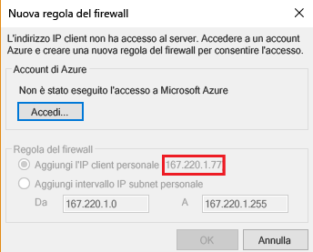
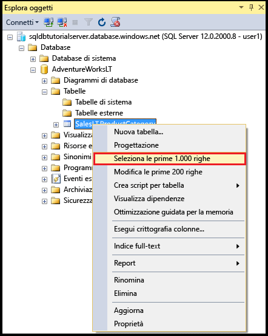
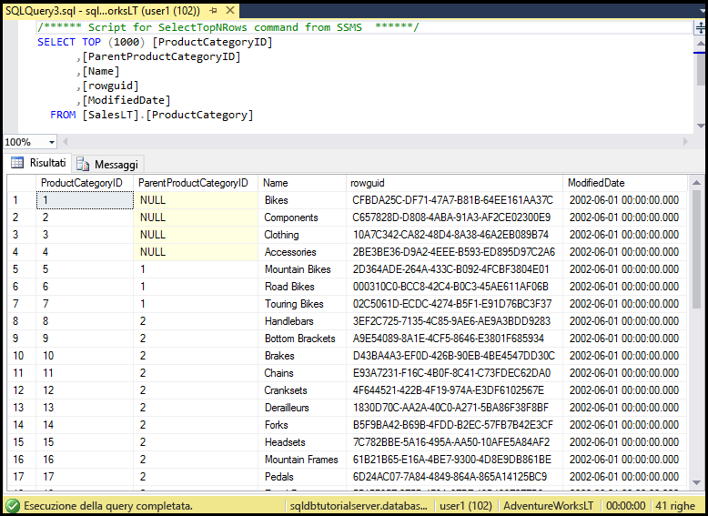

# <a name="sql-database-tutorial-sql-server-authentication-logins-and-user-accounts-database-roles-permissions-server-level-firewall-rules-and-database-level-firewall-rules"></a>Esercitazione sul database SQL: autenticazione SQL, account di accesso e utente, ruoli del database, autorizzazioni e regole del firewall a livello di server e a livello di database
Questa esercitazione introduttiva illustra come usare SQL Server Management Studio per gestire l'autenticazione di SQL Server, gli account di accesso, gli utenti e i ruoli del database che concedono l'accesso e le autorizzazioni per i database e i server di database SQL di Azure. Si apprenderà come:

- Visualizzare le autorizzazioni utente nel database master e nei database utente
- Creare account di accesso e utenti in base all'autenticazione di SQL Server
- Concedere agli utenti autorizzazioni a livello di server e per database specifici
- Accedere a un database utente come utente non amministratore
- Creare regole del firewall a livello di database per gli utenti del database
- Creare regole del firewall a livello di server per gli amministratori del server

**Tempo stimato**: per completare questa esercitazione saranno necessari circa 45 minuti, presupponendo che siano già stati soddisfatti i prerequisiti.

## <a name="prerequisites"></a>Prerequisiti

* È necessario un account Azure. È possibile [aprire un account Azure gratuito](/pricing/free-trial/?WT.mc_id=A261C142F) o [attivare i benefici della sottoscrizione di Visual Studio](/pricing/member-offers/msdn-benefits-details/?WT.mc_id=A261C142F). 

* È necessario essere in grado di connettersi al portale di Azure usando un account membro del ruolo proprietario o collaboratore della sottoscrizione. Per altre informazioni sul controllo degli accessi in base al ruolo, vedere [Introduzione alla gestione degli accessi nel portale di Azure](../active-directory/role-based-access-control-what-is.md).

* Aver completato l'esercitazione [Introduzione ai server del database SQL di Azure, ai database e alle regole del firewall usando il portale di Azure ed SQL Server Management Studio](sql-database-get-started.md) o la [versione per PowerShell](sql-database-get-started-powershell.md) equivalente. In caso contrario, completare questa esercitazione preliminare oppure eseguire lo script di PowerShell in fondo alla [versione per PowerShell](sql-database-get-started-powershell.md) di questa esercitazione prima di continuare.

> [!NOTE]
> Questa esercitazione supporta l'apprendimento del contenuto degli argomenti relativi al [controllo dell'accesso al database SQL](sql-database-control-access.md), ad [account di accesso, utenti e ruoli del database](sql-database-manage-logins.md), alle [entità](https://msdn.microsoft.com/library/ms181127.aspx), ai [ruoli del database](https://msdn.microsoft.com/library/ms189121.aspx) e alle [regole del firewall per il database SQL](sql-database-firewall-configure.md).
>  

## <a name="sign-in-to-the-azure-portal-using-your-azure-account"></a>Accedere al portale di Azure con il proprio account Azure
Usando la [sottoscrizione esistente](https://account.windowsazure.com/Home/Index), seguire questa procedura per connettersi al portale di Azure.

1. Aprire il browser preferito e connettersi al [portale di Azure](https://portal.azure.com/).
2. Accedere al [portale di Azure](https://portal.azure.com/).
3. Nella **pagina di accesso** specificare le credenziali per la sottoscrizione.
   
   


<a name="create-logical-server-bk"></a>

## <a name="view-information-about-the-security-configuration-for-your-logical-server"></a>Visualizzare informazioni sulla configurazione di sicurezza per il server logico

In questa sezione dell'esercitazione vengono visualizzate le informazioni relative alla configurazione della sicurezza per il server logico nel portale di Azure.

1. Aprire il pannello **SQL Server** per il server logico e visualizzare le informazioni nella pagina **Panoramica**.

   

2. Prendere nota del nome dell'account amministratore del server per il server logico. Se non si ricorda la password, fare clic su **Reimposta password** per impostarne una nuova.

> [!NOTE]
> Per esaminare le informazioni di connessione per il server, vedere l'articolo su come [visualizzare o aggiornare le impostazioni del server](sql-database-view-update-server-settings.md). Per questa serie di esercitazioni, il nome completo del server è "sqldbtutorialserver.database.windows.net".
>

## <a name="connect-to-sql-server-using-sql-server-management-studio-ssms"></a>Connettersi ad SQL Server con SQL Server Management Studio (SSMS)

1. Scaricare e installare la versione più recente di SSMS se non è già stato fatto, vedere [Scaricare SQL Server Management Studio](https://msdn.microsoft.com/library/mt238290.aspx). Per mantenersi aggiornata, la versione più recente di SSMS chiede di scaricare la nuova versione quando è disponibile.

2. Dopo l'installazione, digitare **Microsoft SQL Server Management Studio** nella casella di ricerca di Windows e premere **INVIO** per aprire SSMS.

   

3. Nella finestra di dialogo **Connetti al server** immettere le informazioni necessarie per connettersi all'istanza di SQL Server usando l'autenticazione di SQL Server e l'account amministratore del server.

   

4. Fare clic su **Connect**.

   

## <a name="view-the-server-admin-account-and-its-permissions"></a>Visualizzare l'account amministratore del server e le relative autorizzazioni 
In questa sezione dell'esercitazione vengono visualizzate le informazioni sull'account amministratore del server e sulle relative autorizzazioni nel database master e nei database utente.

1. In Esplora oggetti espandere **Sicurezza**, quindi espandere **Account di accesso** per visualizzare gli account di accesso esistenti per il server di database SQL di Azure. Si noti che viene visualizzato un account di accesso per l'account amministratore del server specificato durante il provisioning, ovvero l'account di accesso sqladmin per questa serie di esercitazioni.

   

2. In Esplora oggetti espandere **Database**, **Database di sistema**, **master**, **Sicurezza** e quindi **Utenti**. Si noti che nel database master è stato creato un account utente per l'account di accesso amministratore server usando lo stesso nome dell'account di accesso per l'account utente. I nomi non devono necessariamente corrispondere, ma è una procedura consigliata che permette di evitare confusione.

   

   > [!NOTE]
   > Per informazioni sugli altri account utente visualizzati, vedere [Entità](https://msdn.microsoft.com/library/ms181127.aspx).
   >

3. In Esplora oggetti fare clic con il pulsante destro del mouse su **master** e quindi scegliere **Nuova query** per aprire una finestra di query connessa al database master.
4. Nella finestra visualizzata eseguire questa query per ottenere informazioni sull'utente che esegue la query. Si noti che come account utente che esegue la query viene restituito sqladmin. Eseguendo la query su un database utente più avanti in questa procedura verrà visualizzato un risultato diverso.

   ```
   SELECT USER;
   ```

   

5. Nella finestra di query eseguire questa query per ottenere informazioni sulle autorizzazioni dell'utente sqladmin. Si noti che l'utente sqladmin ha le autorizzazioni per connettersi al database master, creare account di accesso e utenti, selezionare informazioni della tabella sys.sql_logins e aggiungere utenti ai ruoli dbmanager e dbcreator del database. Tali autorizzazioni sono in aggiunta a quelle concesse al ruolo public da cui tutti gli utenti ereditano le autorizzazioni, ad esempio per la selezione delle informazioni di determinate tabelle. Per altre informazioni, vedere [Autorizzazioni](https://msdn.microsoft.com/library/ms191291.aspx).

   ```
   SELECT prm.permission_name
      , prm.class_desc
      , prm.state_desc
      , p2.name as 'Database role'
      , p3.name as 'Additional database role' 
   FROM sys.database_principals p
   JOIN sys.database_permissions prm
      ON p.principal_id = prm.grantee_principal_id
      LEFT JOIN sys.database_principals p2
      ON prm.major_id = p2.principal_id
      LEFT JOIN sys.database_role_members r
      ON p.principal_id = r.member_principal_id
      LEFT JOIN sys.database_principals p3
      ON r.role_principal_id = p3.principal_id
   WHERE p.name = 'sqladmin';
   ```

   

6. In Esplora oggetti espandere **blankdb**, **Sicurezza** e quindi **Utenti**. Si noti che in questo database non è presente un account utente denominato sqladmin.

   

7. In Esplora oggetti fare clic con il pulsante destro del mouse su **blankdb** e quindi scegliere **Nuova query**.

8. Nella finestra visualizzata eseguire questa query per ottenere informazioni sull'utente che esegue la query. Si noti che come account utente che esegue la query viene restituito dbo. Per impostazione predefinita, l'account di accesso amministratore del server è mappato all'account utente dbo in ogni database.

   ```
   SELECT USER;
   ```

   

9. Nella finestra di query eseguire questa query per ottenere informazioni sulle autorizzazioni dell'utente dbo. Si noti che dbo è membro del ruolo public e anche del ruolo predefinito del database db_owner. Per altre informazioni, vedere [Ruoli a livello di database](https://msdn.microsoft.com/library/ms189121.aspx).

   ```
   SELECT prm.permission_name
      , prm.class_desc
      , prm.state_desc
      , p2.name as 'Database role'
      , p3.name as 'Additional database role' 
   FROM sys.database_principals AS p
   JOIN sys.database_permissions AS prm
      ON p.principal_id = prm.grantee_principal_id
      LEFT JOIN sys.database_principals AS p2
      ON prm.major_id = p2.principal_id
      LEFT JOIN sys.database_role_members r
      ON p.principal_id = r.member_principal_id
      LEFT JOIN sys.database_principals AS p3
      ON r.role_principal_id = p3.principal_id
   WHERE p.name = 'dbo';
   ```

   

10. Facoltativamente, ripetere i tre passaggi precedenti per il database utente AdventureWorksLT.

## <a name="create-a-new-user-in-the-adventureworkslt-database-with-select-permissions"></a>Creare un nuovo utente nel database AdventureWorksLT con autorizzazioni SELECT

In questa sezione dell'esercitazione si crea un account utente nel database AdventureWorksLT, si testano le autorizzazioni di questo utente come membro del ruolo public, si concedono autorizzazioni SELECT all'utente e quindi se ne testano nuovamente le autorizzazioni.

> [!NOTE]
> Gli utenti a livello di database ([utenti indipendenti](https://msdn.microsoft.com/library/ff929188.aspx)) aumentano la portabilità del database, una funzionalità che verrà esaminata in esercitazioni successive.
>

1. In Esplora oggetti fare clic con il pulsante destro del mouse su **AdventureWorksLT** e quindi scegliere **Nuova query** per aprire una finestra di query connessa al database AdventureWorksLT.
2. Eseguire questa istruzione per creare un utente denominato user1 nel database AdventureWorksLT.

   ```
   CREATE USER user1
   WITH PASSWORD = 'p@ssw0rd';
   ```
   

3. Nella finestra di query eseguire questa query per ottenere informazioni sulle autorizzazioni di user1. Si noti che user1 ha solo le autorizzazioni ereditate dal ruolo public.

   ```
   SELECT prm.permission_name
      , prm.class_desc
      , prm.state_desc
      , p2.name as 'Database role'
      , p3.name as 'Additional database role' 
   FROM sys.database_principals AS p
   JOIN sys.database_permissions AS prm
      ON p.principal_id = prm.grantee_principal_id
      LEFT JOIN sys.database_principals AS p2
      ON prm.major_id = p2.principal_id
      LEFT JOIN sys.database_role_members r
      ON p.principal_id = r.member_principal_id
      LEFT JOIN sys.database_principals AS p3
      ON r.role_principal_id = p3.principal_id
   WHERE p.name = 'user1';
   ```

   

4. Eseguire queste query per provare l'esecuzione di query su una tabella del database AdventureWorksLT come user1.

   ```
   EXECUTE AS USER = 'user1';  
   SELECT * FROM [SalesLT].[ProductCategory];
   REVERT;
   ```

   

5. Eseguire questa istruzione per concedere le autorizzazioni SELECT per la tabella ProductCategory dello schema SalesLT a user1.

   ```
   GRANT SELECT ON OBJECT::[SalesLT].[ProductCategory] to user1;
   ```

   

6. Eseguire queste query per provare l'esecuzione di query su una tabella del database AdventureWorksLT come user1.

   ```
   EXECUTE AS USER = 'user1';  
   SELECT * FROM [SalesLT].[ProductCategory];
   REVERT;
   ```

   

## <a name="create-a-database-level-firewall-rule-for-an-adventureworkslt-database-user"></a>Creare una regola del firewall a livello di database per un utente del database AdventureWorksLT

In questa sezione dell'esercitazione si tenta l'accesso da un computer con un diverso indirizzo IP, si crea una regola del firewall a livello di database come amministratore del server e quindi si esegue l'accesso con questa nuova regola del firewall a livello di database. 

> [!NOTE]
> Le [regole del firewall a livello di database](sql-database-firewall-configure.md) aumentano la portabilità del database, una funzionalità che verrà esaminata in esercitazioni successive.
>

1. Aprire SQL Server Management Studio in un altro computer per cui non è già stata creata una regola del firewall a livello di server.

   > [!IMPORTANT]
   > Usare sempre l'ultima versione di SSMS, disponibile nella pagina [Scaricare SQL Server Management Studio](https://msdn.microsoft.com/library/mt238290.aspx). 
   >

2. Nella finestra **Connetti al server** immettere il nome del server e le informazioni di autenticazione per connettersi usando l'autenticazione di SQL Server con l'account user1. 
    
   

3. Fare clic su **Opzioni** per specificare il database a cui connettersi e quindi digitare **AdventureWorksLT** nella casella di riepilogo a discesa **Connetti al database** della scheda **Proprietà connessione**.
   
   

4. Fare clic su **Connect**. Verrà visualizzata una finestra di dialogo che informa che il computer da cui si sta tentando di connettersi al database SQL non ha una regola del firewall che consente l'accesso al database. La finestra di dialogo può essere visualizzata in due varianti, a seconda dei passaggi eseguiti precedentemente con i firewall. In genere, tuttavia, viene visualizzata la prima finestra di dialogo illustrata.

   

   

   > [!NOTE]
   > Le versioni più recenti di SSMS includono una funzionalità che consente ai proprietari e ai collaboratori di una sottoscrizione di accedere a Microsoft Azure e creare una regole del firewall a livello di server.
   > 

4. Copiare l'indirizzo IP client riportato in questa finestra di dialogo, che verrà usato nel passaggio 7.
5. Fare clic su **Annulla** ma non chiudere la finestra di dialogo **Connetti al server**.
6. Passare a un computer per cui è già stata creata una regola del firewall a livello di server e connettersi al server usando l'account amministratore del server.
7. In una nuova finestra di query connessa al database AdventureWorksLT, come amministratore del server, eseguire questa istruzione per creare una regola del firewall a livello di database eseguendo [sp_set_database_firewall_rule](https://msdn.microsoft.com/library/dn270010.aspx) con l'indirizzo IP del passaggio 4:

   ```
   EXEC sp_set_database_firewall_rule @name = N'AdventureWorksLTFirewallRule', 
     @start_ip_address = 'x.x.x.x', @end_ip_address = 'x.x.x.x';
   ```

   

8. Cambiare nuovamente computer e fare clic su **Connetti** nella finestra di dialogo **Connetti al server** per connettersi ad AdventureWorksLT come user1. 

   

9. In Esplora oggetti espandere **Database**, **AdventureWorksLT** e quindi **Tabelle**. Si noti che user1 ha solo l'autorizzazione per visualizzare una singola tabella, **SalesLT.ProductCategory**. 

   

10. In Esplora oggetti fare clic con il pulsante destro del mouse su **SalesLT.ProductCategory** e quindi scegliere **Seleziona le prime 1000 righe**.   

   

   

## <a name="create-a-new-user-in-the-blankdb-database-with-dbowner-database-role-permissions-and-a-database-level-firewall-rule"></a>Creare un nuovo utente nel database blankdb con le autorizzazioni del ruolo del database db_owner e una regola del firewall a livello di database

In questa sezione dell'esercitazione si crea un utente nel database blankdb con le autorizzazioni del ruolo del database db_owner e si crea un firewall a livello di database per tale database usando l'account amministratore del server. 

1. Passare al computer con una connessione al database SQL usando l'account amministratore del server.
2. Aprire una finestra di query connessa al database blankdb ed eseguire l'istruzione seguente per creare un utente denominato blankdbadmin nel database blankdb.

   ```
   CREATE USER blankdbadmin
   WITH PASSWORD = 'p@ssw0rd';
   ```

3. Nella stessa finestra di query eseguire questa istruzione per aggiungere l'utente blankdbadmin al ruolo del database db_owner. Ora l'utente può eseguire tutte le azioni necessarie per gestire il database blankdb.

   ```
   ALTER ROLE db_owner ADD MEMBER blankdbadmin; 
   ```

4. Nella stessa finestra di query eseguire questa istruzione per creare una regola del firewall a livello di database eseguendo [sp_set_database_firewall_rule](https://msdn.microsoft.com/library/dn270010.aspx) con l'indirizzo IP del passaggio 4 della procedura precedente, o un intervallo di indirizzi IP per gli utenti del database:

   ```
   EXEC sp_set_database_firewall_rule @name = N'blankdbFirewallRule', 
     @start_ip_address = 'x.x.x.x', @end_ip_address = 'x.x.x.x';
   ```

5. Passare a un computer per cui è stata creata una regola del firewall a livello di database e connettersi al database blankdb usando l'account utente blankdbadmin.
6. Aprire una finestra di query nel database blankdb ed eseguire questa istruzione per creare un utente denominato blankdbuser1 nel database blankdb.

   ```
   CREATE USER blankdbuser1
   WITH PASSWORD = 'p@ssw0rd';
   ```
 
7. In base alle esigenze dell'ambiente di apprendimento, è possibile creare una regola del firewall aggiuntiva a livello di database per questo utente. 

## <a name="create-a-new-login-and-user-in-the-master-database-with-dbmanager-permissions-and-create-a-server-level-firewall-rule"></a>Creare un nuovo account di accesso e un utente nel database master con le autorizzazioni dbmanager e creare una regola del firewall a livello di server

In questa sezione dell'esercitazione si crea un account di accesso e un utente nel database master con le autorizzazioni per creare e gestire nuovi database utente. Si crea anche una regola del firewall aggiuntiva a livello di server usando Transact-SQL con [sp_set_firewall_rule](https://msdn.microsoft.com/library/dn270017.aspx).

> [!NOTE]
> Per permettere al titolare dell'account amministratore del server di delegare la creazione di autorizzazioni database a un altro utente, è necessario creare account di accesso nel database master e creare un account utente da un account di accesso. Tuttavia, la creazione di account di accesso e di utenti da account di accesso riduce la portabilità dell'ambiente. Le relative conseguenze vengono illustrate in esercitazioni successive, inclusa la prevenzione e la gestione come parte della pianificazione per il ripristino di emergenza.
>

1. Passare al computer con una connessione al database SQL usando l'account amministratore del server.
2. Aprire una finestra di query connessa al database master ed eseguire questa istruzione per creare un account di accesso denominato dbcreator nel database master.

   ```
   CREATE LOGIN dbcreator
   WITH PASSWORD = 'p@ssw0rd';
   ```

3. Nella stessa finestra di query: 

   ```
   CREATE USER dbcreator
   FROM LOGIN dbcreator;
   ```

3. Nella stessa finestra di query eseguire questa query per aggiungere l'utente dbcreator al ruolo del database dbmanager. Ora l'utente può creare e gestire i database creati dall'utente.

   ```
   ALTER ROLE dbmanager ADD MEMBER dbcreator; 
   ```

4. Nella stessa finestra di query eseguire questa query per creare un firewall a livello di server con [sp_set_database_firewall_rule](https://msdn.microsoft.com/library/dn270010.aspx), usando un indirizzo IP appropriato per l'ambiente:

   ```
   EXEC sp_set_firewall_rule @name = N'dbcreatorFirewallRule', 
     @start_ip_address = 'x.x.x.x', @end_ip_address = 'x.x.x.x';
   ```

5. Passare a un computer per cui è stata creata una regola del firewall a livello di server e connettersi al database master usando l'account utente dbcreator.
6. Aprire una finestra di query nel database master ed eseguire questa query per creare un database denominato foo.

   ```
   CREATE DATABASE FOO (EDITION = 'basic');
   ```
 7. Facoltativamente, è possibile eliminare il database per risparmiare denaro usando l'istruzione seguente:

   ```
   DROP DATABASE FOO;
   ```

## <a name="complete-script"></a>Script completo

Per creare gli account di accesso e gli utenti e poi aggiungerli ai ruoli, concedere loro le autorizzazioni, creare regole del firewall a livello di database e a livello di server, eseguire queste istruzioni nei database appropriati del server.

### <a name="master-database"></a>database master
Eseguire queste istruzioni nel database master usando l'account amministratore del server e aggiungendo gli indirizzi IP o l'intervallo di indirizzi IP appropriato.

```
CREATE LOGIN dbcreator WITH PASSWORD = 'p@ssw0rd';
CREATE USER dbcreator FROM LOGIN dbcreator;
ALTER ROLE dbmanager ADD MEMBER dbcreator;
EXEC sp_set_firewall_rule @name = N'dbcreatorFirewallRule', 
     @start_ip_address = 'x.x.x.x', @end_ip_address = 'x.x.x.x';
```

### <a name="adventureworkslt-database"></a>Database AdventureWorksLT
Eseguire queste istruzioni nel database AdventureWorksLT usando l'account amministratore del server e aggiungendo gli indirizzi IP o l'intervallo di indirizzi IP appropriato.

```
CREATE USER user1 WITH PASSWORD = 'p@ssw0rd';
GRANT SELECT ON OBJECT::[SalesLT].[ProductCategory] to user1;
EXEC sp_set_database_firewall_rule @name = N'AdventureWorksLTFirewallRule', 
     @start_ip_address = 'x.x.x.x', @end_ip_address = 'x.x.x.x';
```

### <a name="blankdb-database"></a>Database blankdb
Eseguire queste istruzioni nel database blankdb usando l'account amministratore del server e aggiungendo gli indirizzi IP o l'intervallo di indirizzi IP appropriato.

```
CREATE USER blankdbadmin
   WITH PASSWORD = 'p@ssw0rd';
ALTER ROLE db_owner ADD MEMBER blankdbadmin;
EXEC sp_set_database_firewall_rule @name = N'blankdbFirewallRule', 
     @start_ip_address = 'x.x.x.x', @end_ip_address = 'x.x.x.x';
CREATE USER blankdbuser1
   WITH PASSWORD = 'p@ssw0rd';
```

## <a name="next-steps"></a>Passaggi successivi
- Per una panoramica dell'accesso e del controllo nel database SQL, vedere l'articolo relativo al [controllo dell'accesso al database SQL](sql-database-control-access.md).
- Per una panoramica degli account di accesso, degli utenti e dei ruoli del database nel database SQL, vedere l'articolo relativo ad [account di accesso, utenti e ruoli del database](sql-database-manage-logins.md).
- Per altre informazioni sulle entità di database, vedere [Entità](https://msdn.microsoft.com/library/ms181127.aspx).
- Per altre informazioni sui ruoli del database, vedere [Ruoli a livello di database](https://msdn.microsoft.com/library/ms189121.aspx).
- Per informazioni generali sulle regole del firewall, vedere l'articolo relativo alle [regole del firewall per il database SQL](sql-database-firewall-configure.md).
- Per un'esercitazione che illustra l'uso dell'autenticazione di Azure Active Directory, vedere [Esercitazione sul database SQL: autenticazione di AAD, account di accesso e utente, ruoli del database, autorizzazioni e regole del firewall a livello di server e a livello di database](sql-database-control-access-sql-authentication-get-started.md).


<!--HONumber=Jan17_HO3-->


