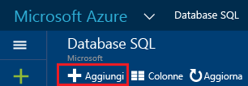

# <a name="create-an-azure-sql-database"></a>Creare un database SQL di Azure

È possibile creare un database SQL di Azure usando il [portale di Azure](https://portal.azure.com/), PowerShell, Transact-SQL, l'API REST o C#. 

## <a name="create-an-azure-sql-database-using-the-azure-portal"></a>Creare un database SQL di Azure usando il portale di Azure

1. Aprire il pannello **Database SQL** nel [portale di Azure](https://portal.azure.com/). 

    
2. Nel pannello dei database SQL fare clic su **Aggiungi**.

    

> [!TIP]
> Per un'esercitazione introduttiva sull'uso del portale di Azure e di SQL Server Management Studio, vedere [Introduzione ai server del database SQL di Azure, ai database e alle regole del firewall usando il portale di Azure ed SQL Server Management Studio](sql-database-get-started.md).
>

## <a name="create-an-azure-sql-database-using-powershell"></a>Creare un database SQL di Azure usando PowerShell

Per creare un database SQL, usare il cmdlet [New-AzureRmSqlDatabase](https://docs.microsoft.com/powershell/resourcemanager/azurerm.sql/v2.3.0/new-azurermsqldatabase). Il gruppo di risorse e il server devono già esistere nella sottoscrizione. 

```
$resourceGroupName = "resourcegroup1"
$sqlServerName = "server1"

$databaseName = "database1"
$databaseEdition = "Standard"
$databaseServiceLevel = "S0"

$currentDatabase = New-AzureRmSqlDatabase -ResourceGroupName $resourceGroupName `
 -ServerName $sqlServerName -DatabaseName $databaseName `
 -Edition $databaseEdition -RequestedServiceObjectiveName $databaseServiceLevel
```
> [!TIP]
> Per uno script di esempio, vedere [Creare uno script di PowerShell per database SQL](sql-database-get-started-powershell.md).
>

## <a name="create-an-azure-sql-database-using-transact-sql-in-sql-server-management-studio"></a>Creare un database SQL di Azure usando Transact-SQL in SQL Server Management Studio

Per creare un database SQL usando Transact-SQL in SQL Server Management Studio:

1. Da SQL Server Management Studio connettersi al server di database di Azure usando l'account di accesso dell'entità di sicurezza a livello di server o un account di accesso membro del ruolo **dbmanager**. Per altre informazioni sugli account di accesso, vedere [Gestire gli account di accesso](sql-database-manage-logins.md).
2. In Esplora oggetti aprire il nodo Database, espandere la cartella **Database di sistema**, fare clic con il pulsante destro del mouse su **master** e quindi scegliere **Nuova query**.
3. Per creare un database, usare l'istruzione **CREATE DATABASE** . Per altre informazioni, vedere [CREATE DATABASE (database SQL)](https://msdn.microsoft.com/library/dn268335.aspx). La seguente istruzione consente di creare un database denominato **myTestDB** specificando che si tratta di un database Standard S0 Edition con una dimensione massima di 250 GB.
  
      CREATE DATABASE myTestDB    (EDITION='Standard',     SERVICE_OBJECTIVE='S0');

4. Fare clic su **Execute** per eseguire la query.
5. In Esplora oggetti fare clic con il pulsante destro del mouse sul nodo Database e scegliere **Aggiorna** per visualizzare il nuovo database in Esplora oggetti. 

> [!TIP]
> Per un'esercitazione introduttiva sull'uso del portale di Azure e di SQL Server Management Studio, vedere [Introduzione ai server del database SQL di Azure, ai database e alle regole del firewall usando il portale di Azure ed SQL Server Management Studio](sql-database-get-started.md).
>

## <a name="additional-resources"></a>Risorse aggiuntive
* Per una panoramica degli strumenti di gestione, vedere [Panoramica degli strumenti di gestione](sql-database-manage-overview.md).
* Per informazioni su come eseguire le attività di gestione usando il portale di Azure, vedere [Gestire database SQL di Azure mediante il portale di Azure](sql-database-manage-portal.md).
* Per informazioni su come eseguire le attività di gestione usando PowerShell, vedere [Manage Azure SQL Databases using PowerShell](sql-database-manage-powershell.md) (Gestire database SQL di Azure usando PowerShell).
* Per informazioni su come eseguire le attività di gestione usando SQL Server Management Studio, vedere [SQL Server Management Studio](sql-database-manage-azure-ssms.md).
* Per informazioni sul servizio di database SQL, vedere [Informazioni sul database SQL](sql-database-technical-overview.md). 
* Per informazioni sui server di database di Azure e sulle funzionalità di database, vedere [Funzionalità](sql-database-features.md).


<!--HONumber=Dec16_HO3-->


