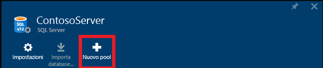
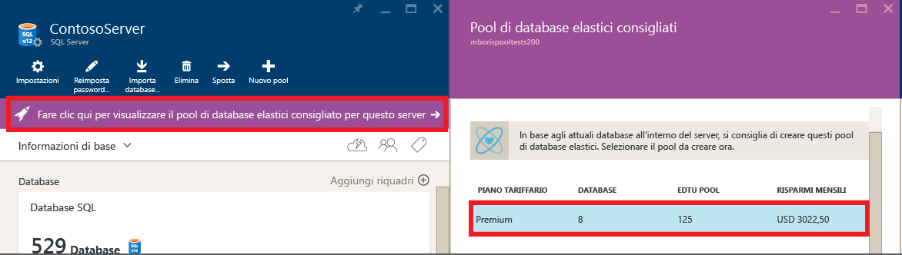
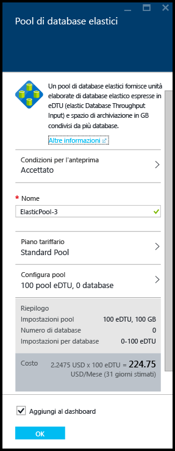
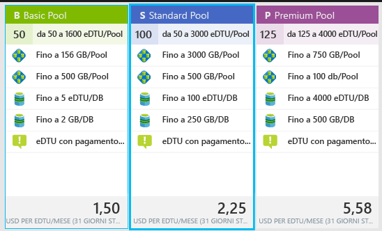
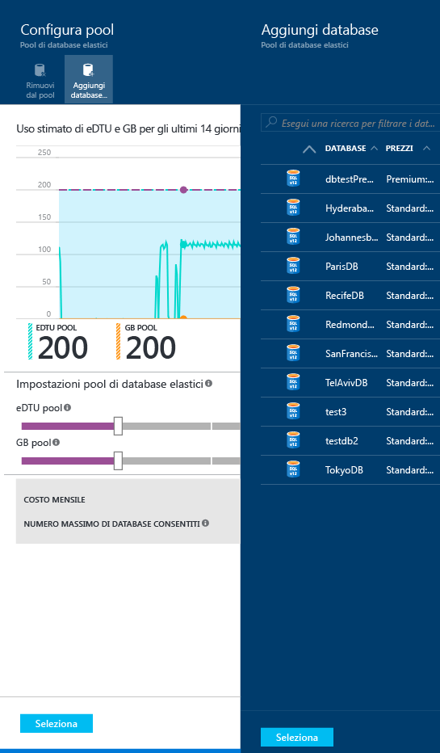
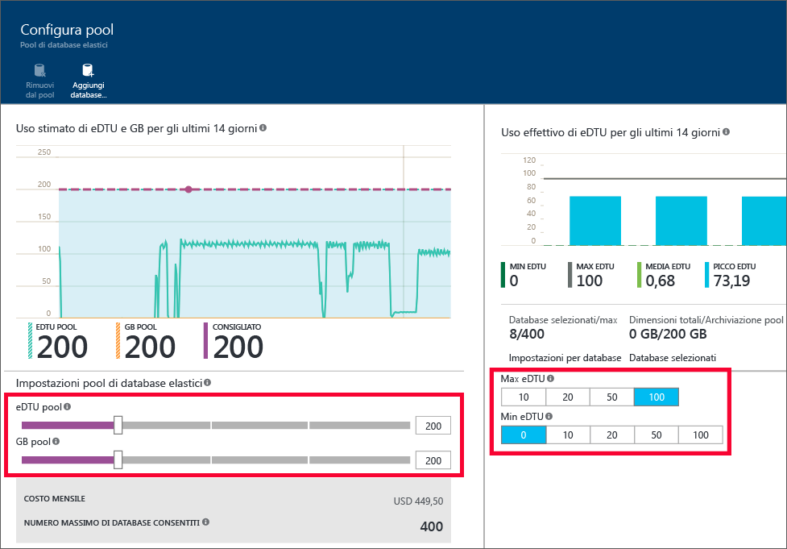

<properties
	pageTitle="Creare un nuovo pool di database elastici con il portale di Azure | Microsoft Azure"
	description="Come aggiungere un pool di database elastici scalabile alla configurazione del database SQL per semplificare l'amministrazione e la condivisione delle risorse tra più database."
	keywords="database scalabile,configurazione del database"
	services="sql-database"
	documentationCenter=""
	authors="ninarn"
	manager="jhubbard"
	editor=""/>

<tags
	ms.service="sql-database"
	ms.devlang="NA"
	ms.date="07/20/2016"
	ms.author="ninarn"
	ms.workload="data-management"
	ms.topic="get-started-article"
	ms.tgt_pltfrm="NA"/>

# Creare un nuovo pool di database elastici con il portale di Azure

> [AZURE.SELECTOR]
- [Portale di Azure](sql-database-elastic-pool-create-portal.md)
- [PowerShell](sql-database-elastic-pool-create-powershell.md)
- [C#](sql-database-elastic-pool-create-csharp.md)

Questo articolo illustra come creare un [pool di database elastici](sql-database-elastic-pool.md) scalabile con il [portale di Azure](https://portal.azure.com/). Esistono due modi per creare un pool. È possibile farlo da zero se si conosce la configurazione del pool da usare oppure iniziare con una raccomandazione fornita dal servizio. Il database SQL integra informazioni in base alle quali viene suggerita una configurazione del pool nel caso risulti più conveniente secondo i dati di telemetria relativi all'utilizzo precedente dei database.

È possibile aggiungere più pool a un server, ma non aggiungere database da diversi server nello stesso pool. Per creare un pool, è necessario almeno un database in un server V12. Se non ne è disponibile uno, vedere [Creare il primo database SQL di Azure](sql-database-get-started.md). È possibile creare un pool con un solo database, ma i pool sono convenienti solo con più database. Vedere [Considerazioni su prezzi e prestazioni per un pool di database elastici](sql-database-elastic-pool-guidance.md).

> [AZURE.NOTE] I pool elastici sono disponibili a livello generale in tutte le aree di Azure ad eccezione di Stati Uniti centro-settentrionali e India occidentale, dove sono attualmente in anteprima. La disponibilità generale dei pool elastici in queste aree verrà offerta al più presto. In più, al momento i pool elastici non supportano i database che utilizzano [OLTP o Analytics in memoria](sql-database-in-memory.md).

## Passaggio 1: Creare un nuovo pool

Questo articolo illustra come creare un nuovo pool da un pannello **server** esistente nel portale, ovvero il modo più semplice per trasferire i database esistenti in un pool.

> [AZURE.NOTE] Indipendentemente dal fatto che sia già presente un server o meno, è anche possibile creare un nuovo pool dal pannello **Pool elastici SQL**. Sotto l'elenco sul lato sinistro del portale, fare clic su **Esplora** **>** **Pool elastici SQL**. Facendo clic su **+Aggiungi** nel pannello **Pool elastici SQL** sarà disponibile la procedura per creare un nuovo server durante il flusso di lavoro di provisioning del pool.

1. Nel [portale di Azure](http://portal.azure.com/), sotto l'elenco sul lato sinistro, fare clic su **Esplora** **>** **SQL Server** e quindi fare clic sul server che contiene i database da aggiungere a un pool.
2. Fare clic su **Nuovo pool**.

    

    **-OPPURE-**

    Potrebbe essere visualizzato un messaggio che informa che sono disponibili pool di database elastici consigliati per il server (solo V12). Fare clic sul messaggio per visualizzare i pool consigliati in base ai dati di telemetria cronologici relativi all'utilizzo del database e quindi fare clic sul livello per visualizzare altri dettagli e personalizzare il pool. Per informazioni su come vengono create le raccomandazioni, vedere [Informazioni sulle raccomandazioni per i pool](#understand-pool-recommendations) più avanti in questo argomento.

    

    Verrà visualizzato il pannello **Pool di database elastici** dove verrà configurato il pool. Se si è fatto clic su **Nuovo pool** nel passaggio precedente, il portale sceglierà un **pool Standard** in **Piano tariffario** e un **nome** univoco e una configurazione predefinita per il pool. Se si sceglie un pool consigliato, la configurazione e il piano del pool consigliati predefiniti sono già impostati, ma è comunque possibile modificarli.

    

3. Specificare un nome per il pool elastico o lasciare il valore predefinito.

## Passaggio 2: Scegliere un piano tariffario

Il piano tariffario del pool determina le funzionalità disponibili per i database elastici nel pool e il numero massimo di eDTU (MAX eDTU) e la memoria (GB) disponibili per ciascun database. Per altre informazioni, vedere Livelli di servizio.

Per modificare il piano tariffario per il pool, fare clic su **Piano tariffario**, scegliere il piano e quindi fare clic su **Seleziona**.

> [AZURE.IMPORTANT] Dopo aver scelto il piano tariffario e aver eseguito il commit delle modifiche facendo clic su **OK** nell'ultimo passaggio, non sarà più possibile modificare il piano tariffario del pool. Per modificare il livello di prezzo per un pool di database elastici esistente creare un nuovo pool elastico nel livello di prezzo desiderato e migrare i database elastici in questo nuovo pool.

## Passaggio 3: Configurare il pool

Dopo avere impostato il piano tariffario, fare clic su Configura pool dove è possibile aggiungere i database, impostare le eDTU e lo spazio di archiviazione (in GB) del pool, nonché il numero minimo e massimo di eDTU per i database elastici nel pool.

1. Fare clic su **Configura pool**.
2. Selezionare i database da aggiungere al pool. Questo passaggio è facoltativo durante la creazione del pool. È possibile aggiungere i database dopo aver creato il pool. Per aggiungere i database, fare clic su **Aggiungi database**, selezionare i database da aggiungere e quindi fare clic sul pulsante **Seleziona**.

    

    Se i dati di telemetria cronologici relativi all'utilizzo disponibili per i database correnti sono sufficienti, il grafico **Utilizzo di eDTU e GB** e il grafico a barre **Utilizzo di eDTU effettivo** vengono aggiornati per semplificare le decisioni relative alla configurazione. Il servizio potrebbe anche visualizzare un messaggio di raccomandazione per facilitare la scelta delle dimensioni corrette per il pool. Vedere la sezione [Indicazioni dinamiche](#dynamic-recommendations).

3. Usare i controlli nella pagina **Configura pool** per esaminare le impostazioni e configurare il pool. Vedere la sezione relativa ai [limiti dei pool elastici](sql-database-elastic-pool.md#edtu-and-storage-limits-for-elastic-pools-and-elastic-databases) per altri dettagli sui limiti per ogni livello di servizio e le [considerazioni su prezzo e prestazioni per i pool di database elastici](sql-database-elastic-pool-guidance.md) per istruzioni dettagliate sul corretto ridimensionamento di un pool. Per altre informazioni sulle impostazioni del pool, vedere la sezione relativa alle [proprietà dei pool di database elastici](sql-database-elastic-pool.md#elastic-database-pool-properties).

	

4. Dopo aver modificato le impostazioni, fare clic su **Seleziona** nel pannello **Configura pool**.
5. Fare clic su **OK** per creare il pool.

## Informazioni sulle raccomandazioni per i pool

Il servizio di database SQL valuta la cronologia di utilizzo e suggerisce uno o più pool quando questo approccio è più conveniente rispetto all'uso di singoli database. Ogni raccomandazione viene configurata con un subset univoco di database del server che meglio si adatta al pool.

La raccomandazione per il pool include:

- Piano tariffario per il pool (Basic, Standard o Premium).
- **eDTU POOL** appropriato, detto anche eDTU max per pool.
- **MAX eDTU** e **Min eDTU** per ogni database.
- Elenco di database consigliati per il pool.

Il servizio prende in considerazione la telemetria degli ultimi 30 giorni per la raccomandazione dei pool. Affinché un database possa essere considerato un candidato per un pool di database elastici, deve esistere per almeno 7 giorni. I database che sono già in un pool di database elastici non vengono considerati come candidati dai consigli relativi ai pool di database elastici.

Il servizio valuta le risorse necessarie e la convenienza dello spostamento di singoli database in ogni livello di servizio nei pool dello stesso livello. Ad esempio, vengono valutati tutti i database Standard in un server per l’utilizzo in un pool elastico Standard. Ciò significa che il servizio non effettua consigli relativi a livelli diversi, ad esempio lo spostamento di un database Standard in un pool Premium.

### Indicazioni dinamiche

Dopo aver aggiunto i database al pool, le indicazioni verranno dinamicamente generate in base all'utilizzo storico dei database selezionati. Queste indicazioni saranno visualizzate nel grafico relativo all'uso di eDTU e GB, oltre che come banner nella parte superiore del pannello **Configura pool**. Queste indicazioni sono concepite per facilitare la creazione di un pool ottimizzato per database specifici.

## Risorse aggiuntive

- [Gestire un pool di database elastici SQL con il portale](sql-database-elastic-pool-manage-portal.md)
- [Gestire un pool di database elastici SQL con PowerShell](sql-database-elastic-pool-manage-powershell.md)
- [Gestire un pool di database elastici SQL con C#](sql-database-elastic-pool-manage-csharp.md)
- [Aumento del numero di istanze con il database SQL di Azure](sql-database-elastic-scale-introduction.md)

<!----HONumber=AcomDC_0907_2016-->