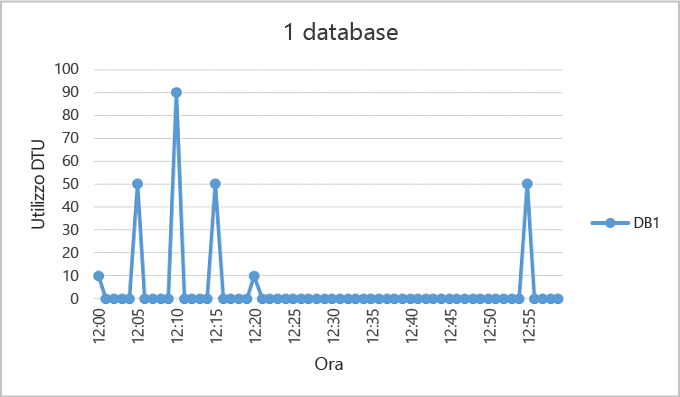
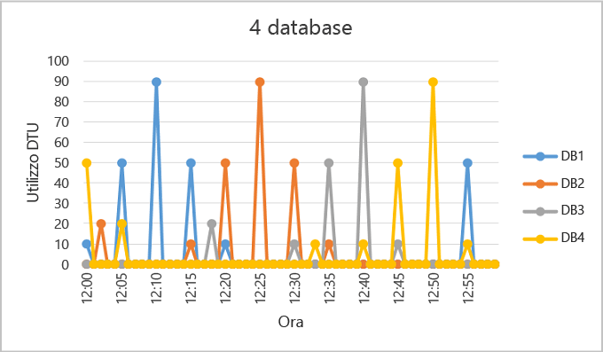
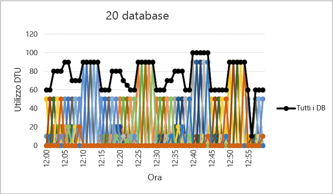

<properties
	pageTitle="Quando usare un pool di database elastici"
	description="Un pool di database elastico è una raccolta di risorse disponibili condivise da un gruppo di database elastici. Questo documento vengono fornite informazioni utili per valutare l'idoneità dell'utilizzo di un pool di database flessibile per un gruppo di database."
	services="sql-database"
	documentationCenter=""
	authors="stevestein"
	manager="jhubbard"
	editor=""/> 

<tags
	ms.service="sql-database"
	ms.devlang="NA"
	ms.date="08/08/2016"
	ms.author="sstein"
	ms.workload="data-management"
	ms.topic="article"
	ms.tgt_pltfrm="NA"/> 

# Quando usare un pool di database elastici
Valutare se l'uso di un pool di database elastici può risultare conveniente in base ai modelli di utilizzo dei database e alle differenze di prezzo tra un pool di database elastici e singoli database. Vengono inoltre fornite informazioni aggiuntive per assistere nella determinazione delle dimensioni del pool corrente necessarie per un set di database SQL esistente.

- Per una panoramica dei pool di database elastici, vedere l'articolo sui [pool di database elastici di database SQL](sql-database-elastic-pool.md).

> [AZURE.NOTE] I pool elastici sono disponibili a livello generale in tutte le aree di Azure ad eccezione di Stati Uniti centro-settentrionali e India occidentale, dove sono attualmente in anteprima. La disponibilità generale dei pool elastici in queste aree verrà offerta al più presto.

## Un pool elastico di database.

Gli sviluppatori di SaaS compilano applicazioni basate su livelli di dati su larga scala costituiti da più database. Un modello di applicazione comune è il provisioning di un database singolo per ogni cliente. Clienti diversi, tuttavia, hanno spesso modelli di utilizzo differenti e non prevedibili. Per questo motivo, è difficile stabilire a priori i requisiti di risorse di ogni singolo utente di database. Di conseguenza, per garantire una velocità effettiva notevole e tempi di risposta rapidi, uno sviluppatore potrebbe effettuare un overprovisioning delle risorse con un considerevole aumento dei costi. In alternativa, lo sviluppatore può ridurre i costi rischiando una riduzione delle prestazioni a discapito dei clienti. Per altre informazioni sui modelli di progettazione per le applicazioni SaaS mediante pool elastici, vedere [Modelli di progettazione per applicazioni SaaS multi-tenant con database SQL di Azure](sql-database-design-patterns-multi-tenancy-saas-applications.md).

I pool elastici nel database SQL di Azure consentono agli sviluppatori di SaaS di ottimizzare i costi per un gruppo di database all'interno di un budget definito, garantendo allo stesso tempo prestazioni elastiche per ogni database. I pool consentono agli sviluppatori di acquistare unità di transazione di database elastico (eDTU) per un pool condiviso da più database, per supportare periodi di utilizzo imprevisti da parte dei singoli database. Il requisito di eDTU di un pool è determinato dall'utilizzo aggregato dei relativi database. La quantità di eDTU disponibile per il pool dipende dal budget dello sviluppatore. I pool consentono allo sviluppatore di ragionare sull'impatto del budget sulle prestazioni e viceversa per il pool. Lo sviluppatore aggiunge semplicemente database al pool, imposta il limite minimo e massimo di eDTU per i database e quindi imposta il numero di eDTU del pool in base al budget. Utilizzando i pool, lo sviluppatore può aumentare con facilità i servizi offerti da una piccola nuova impresa fino a un'azienda matura in continua crescita.
## Quando prendere in considerazione un pool

I pool sono adatti per un numero elevato di database con modelli di utilizzo specifici. Per un determinato database, questo modello è caratterizzato da un utilizzo medio ridotto con picchi di utilizzo relativamente poco frequenti.

Più database è possibile aggiungere a un pool, maggiori diventano i risparmi. In base al modello di uso dell'applicazione, è possibile osservare un risparmio con soli due database S3.

Le sezioni seguenti aiutano a comprendere se l'insieme specifico di database trarrà vantaggio dall'utilizzo di un pool. Gli esempi utilizzano pool Standard, ma gli stessi principi si applicano anche ai pool Basic e Premium.

### Valutazione dei modelli di utilizzo di database

Nella figura seguente viene illustrato un esempio di un database che trascorre il tempo di inattività, ma anche periodicamente picchi di attività. Si tratta di un modello di utilizzo adatto per un pool:

   

Per il periodo di cinque minuti illustrato sopra, DB1 raggiunge picchi fino a 90 DTU, ma l'utilizzo medio complessivo è inferiore a cinque DTU. L'esecuzione di questo carico di lavoro in un database singolo richiede il livello di prestazioni S3, ma in questo modo la maggior parte delle risorse rimane inutilizzata durante i periodi di minore attività.

Un pool consente la condivisione tra più database di queste DTU inutilizzate e quindi riduce la quantità totale di DTU richiesta e i costi complessivi.

Compila l'esempio precedente, si supponga che vi sono altri database con i modelli di utilizzo simili come DB1. Nelle due figure seguenti viene accostato un grafico di utilizzo di quattro database e uno di 20 database, per mostrare come non vi sia sovrapposizione nell'utilizzo nel tempo:

   

   

Dalla riga di colore nera nella figura precedente viene illustrato l'utilizzo di DTU di aggregazione in tutti i database di 20. Viene illustrato che l'utilizzo di DTU aggregato non mai supera le 100 DTU, ciò indica che i 20 database possono condividere 100 eDTU nel corso di tale periodo di tempo. Ciò comporta una riduzione di DTU di 20x e 13x una riduzione del prezzo rispetto all'inserimento di ogni database in livelli di prestazioni S3 per singoli database.

In questo esempio è ideale per i motivi seguenti:

- Esistono grandi differenze tra i picchi di utilizzo e l'utilizzo medio per ogni database.
- Il picco di utilizzo per ogni database si verifica in diversi momenti nel tempo.
- Le eDTU sono condivise da un numero elevato di database.

Il prezzo di un pool è una funzione delle eDTU del pool. Mentre il prezzo unitario delle eDTU di un pool è 1,5 volte maggiore al prezzo unitario delle eDTU per un singolo database, le **eDTU del pool possono essere condivise da molti database e pertanto in molti casi è necessario un minor numero totale di eDTU**. Queste distinzioni nella determinazione dei prezzi e nella condivisione di eDTU costituiscono la base del potenziale risparmio sul prezzo che il pool è in grado di fornire.

Le seguenti regole relative al numero e all'utilizzo del database consentono di garantire che un pool offra una riduzione dei costi rispetto all'utilizzo di livelli di prestazioni per database singoli.

### Numero minimo di database

Se la somma di DTU di livelli di prestazioni per singoli database è superiore di 1,5x rispetto ai DTU necessari per il pool, allora un pool elastico è più conveniente. Per le dimensioni disponibili vedere [Limiti di archiviazione e di eDTU per i pool di database elastici e i database elastici](sql-database-elastic-pool.md#edtu-and-storage-limits-for-elastic-pools-and-elastic-databases).

***Esempio***  Sono necessari almeno due database S3 o 15 database S0 perché un pool di 100 eDTU risulti più conveniente rispetto all'uso di livelli di prestazioni per database singoli.

### Numero massimo di picco contemporaneamente database

Condividendo eDTU, non tutti i database in un pool possono utilizzare contemporaneamente eDTU fino al limite disponibile quando si utilizzano livelli di prestazioni per singoli database. Meno database raggiungono il picco contemporaneamente, minore è il valore da impostare per le eDTU del pool e quindi più redditizio diventa il pool stesso. In generale, non più di un 2/3 (o 67%) dei database nel pool deve raggiungere il picco contemporaneamente al limite delle relative eDTU.

***Esempio***  Per ridurre i costi relativi a tre database S3 in un pool di 200 eDTU, al massimo due dei tre database possono raggiungere il picco di utilizzo contemporaneamente. In caso contrario, se più di due di questi quattro database S3 raggiungono il picco contemporaneamente, il pool dovrebbe essere ridimensionato a più di 200 eDTU. E se il pool viene ridimensionato a più di 200 eDTU, più database S3 dovranno essere aggiunti al pool per mantenere i costi inferiori rispetto a quelli dei livelli di prestazioni per singoli database.

Si noti in questo esempio non prende in considerazione l'utilizzo di altri database nel pool. Se tutti i database con alcune utilizzo in qualsiasi punto nel tempo, minore di 2/3 (o 67%) dei database possono picco contemporaneamente.

### Utilizzo di DTU per ogni database

Una notevole differenza tra il picco e l'utilizzo medio di un database indica periodi prolungati di utilizzo ridotto e brevi periodi di utilizzo elevato. Questo modello di utilizzo è ideale per la condivisione delle risorse tra database. Un database deve essere considerato per un pool quando relativo picchi di utilizzo sono circa 1.5 volte maggiore relativo utilizzo medio.

***Esempio***  Un database S3 con picchi di 100 DTU e un utilizzo medio di 67 DTU o meno è un buon candidato per la condivisione di eDTU in un pool. In alternativa, un database S1 con picchi di 20 DTU e utilizzo medio di 13 DTU o meno è un buon candidato per un pool.

## Ridimensionamento di un pool elastico

La dimensione ottimale per un pool dipende dalle eDTU di aggregazione e dalle risorse di archiviazione necessarie per tutti i database nel pool. Questo richiede di stabilire il valore maggiore tra i seguenti:

* Dtu massima utilizzata da tutti i database nel pool.
* Byte di archiviazione massima utilizzati da tutti i database nel pool.

Per le dimensioni disponibili vedere [Limiti di archiviazione e di eDTU per i pool di database elastici e i database elastici](sql-database-elastic-pool.md#edtu-and-storage-limits-for-elastic-pools-and-elastic-databases).

Database SQL valuta automaticamente la cronologia d’utilizzo delle risorse dei database in un server di database SQL esistente e consiglia una configurazione appropriata del pool nel portale di Azure. Oltre alle raccomandazioni, una funzionalità incorporata stima l'utilizzo di eDTU per un gruppo personalizzato di database del server. Ciò consente di eseguire un'analisi di simulazione tramite l'aggiunta interattiva di database al pool e la relativa rimozione in modo da ottenere un'analisi di utilizzo delle risorse e suggerimenti di ridimensionamento prima di eseguire il commit delle modifiche. Per le procedure, vedere [Monitorare e gestire un pool di database elastici con il portale di Azure](sql-database-elastic-pool-manage-portal.md).

Per valutazioni più flessibili sull'uso delle risorse che consentano stime di ridimensionamento ad hoc per i server precedenti la versione 12, nonché stime di ridimensionamento per i database in server diversi, vedere [Script di PowerShell per identificare database adatti a un pool di database elastici](sql-database-elastic-pool-database-assessment-powershell.md).

| Funzionalità | Funzionalità del portale|	Script di PowerShell|
|:---------------|:----------|:----------|
| Granularità | 5 secondi | 5 secondi
| Considera differenze di prezzo tra un pool e livelli di prestazioni per database singoli.| Sì| No
| Consente di personalizzare l'elenco dei database analizzati| Sì| Sì
| Consente di personalizzare il periodo di tempo utilizzato per l'analisi| No| Sì
| Consente di personalizzare l'elenco dei database analizzati tra server diversi| No| Sì
| Consente di personalizzare l'elenco dei database analizzati su server v11| No| Sì

Nei casi in cui non è possibile utilizzare gli strumenti, le seguenti istruzioni dettagliate consentono di stimare se un pool è più conveniente rispetto ai database singoli:

1.	Stimare le eDTU necessarie per il pool come segue:

    MAX (<*numero totale di database* X *utilizzo medio di DTU per DB*>,  <*numero di database in picco contemporaneamente* X *picco di utilizzo di DTU per DB*)

2.	Stimare lo spazio di archiviazione necessario per il pool aggiungendo il numero di byte necessari per tutti i database nel pool. Determinare quindi la dimensione del pool in eDTU che fornisce la quantità di spazio di archiviazione. Per i limiti di archiviazione del pool in base alla dimensione del pool espressa in eDTU, vedere [Limiti di archiviazione e di eDTU per i pool di database elastici e i database elastici](sql-database-elastic-pool.md#edtu-and-storage-limits-for-elastic-pools-and-elastic-databases).
3.	Considerare la stima eDTU maggiore tra il Passaggio 1 e il Passaggio 2.
4.	Vedere la pagina [Prezzi di Database SQL](https://azure.microsoft.com/pricing/details/sql-database/) e trovare la dimensione di pool in eDTU più piccola, che sia maggiore della stima del Passaggio 3.
5.	Confrontare il prezzo di pool dal Passaggio 5 con il prezzo dell'utilizzo di livelli di prestazioni appropriati per database singoli.

## Riepilogo

Non tutti i database singoli sono candidati ottimali per i pool. Database con modelli di utilizzo caratterizzati da basso utilizzo medio e i picchi di utilizzo relativamente poco frequenti sono candidati eccellenti. I modelli di utilizzo delle applicazioni sono dinamici, utilizzare quindi le informazioni e gli strumenti descritti in questo articolo per una valutazione iniziale che consenta di determinare se un pool potrebbe essere una buona scelta per parte o tutti i database. Questo articolo rappresenta solo un punto di inizio per stabilire se un pool elastico potrebbe rappresentare un valido strumento. Tenere presente che è necessario monitorare continuamente l'utilizzo delle risorse cronologico e rivalutare costantemente i livelli di prestazioni di tutti i database. Tenere presente che è possibile spostare facilmente i database e pool elastico e se si dispone di un numero molto elevato di database può avere più pool di dimensioni variabili che è possibile dividere i database in.

## Passaggi successivi

- [Creare un pool di database elastici](sql-database-elastic-pool-create-portal.md)
- [Monitor, manage, and size an elastic database pool (Monitorare, gestire e ridimensionare un pool di database elastici)](sql-database-elastic-pool-manage-portal.md)
- [Opzioni e prestazioni disponibili in ogni livello di servizio del database SQL](sql-database-service-tiers.md)
- [Script di PowerShell per identificare database adatti a un pool di database elastici](sql-database-elastic-pool-database-assessment-powershell.md)

<!---HONumber=AcomDC_0921_2016-->