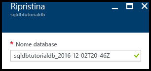
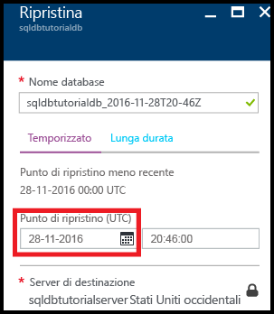
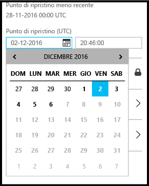
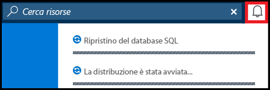
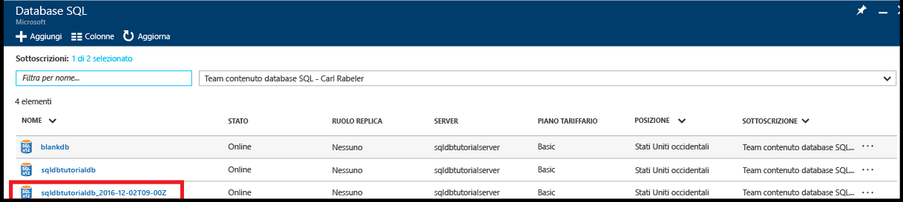

<!------------------
This topic is annotated with TEMPLATE guidelines for TUTORIAL TOPICS.

Metadata guidelines

title
    60 characters or less. Tells users clearly what they will do (deploy an ASP.NET web app to App Service). Not the same as H1. It's 60 characters or fewer including all characters between the quotes and the Microsoft Docs site identifier.

description
    115-145 characters. Duplicate of the first sentence in the introduction. This is the abstract of the article that displays under the title when searching in Bing or Google. 

    Example: "This tutorial shows how to deploy an ASP.NET web application to a web app in Azure App Service by using Visual Studio 2015."
------------------>

<!----------------

TEMPLATE GUIDELINES for tutorial topics

The tutorial topic shows users how to solve a problem using a product or service. It includes the prerequisites and steps users need to be successful.  

It is a "solve a problem" topic, not a "learn concepts" topic.

DO include this:
    • What users will do
    • What they will create or accomplish by the end of the tutorial
    • Time estimate
    • Optional but useful: Include a diagram or video. Diagrams help users see the big picture of what they are doing. A video of the steps can be used by customers as an alternative to following the steps in the topic.
    • Prerequisites: Technical expertise and software requirements
    • End-to-end steps. At the end, include next steps to deeper or related tutorials so users can learn more about the service

DON'T include this:
    • Conceptual info about the service. This info is in overview topics that you can link to in the prerequisites section if necessary

------------------->

<!------------------
GUIDELINES for the H1 
    
    The H1 should answer the question "What will I do in this topic?" Write the H1 heading in conversational language and use search keywords as much as possible. Since this is a "solve a problem" topic, make sure the title indicates that. Use a strong, specific verb like "Deploy."  
        
    Heading must use an industry standard term. If your feature is a proprietary name like "elastic pools", use a synonym. For example: "Learn about elastic pools for multi-tenant databases." In this case multi-tenant database is the industry-standard term that will be an anchor for finding the topic.

-------------------->

# Introduzione a Backup e ripristino per la protezione dei dati e il ripristino

<!------------------
    GUIDELINES for introduction
    
    The introduction is 1-2 sentences.  It is optimized for search and sets proper expectations about what to expect in the article. It should contain the top keywords that you are using throughout the article.The introduction should be brief and to the point of what users will do and what they will accomplish. 

    In this example:
     

Sentence #1 Explains what the user will do. This is also the metadata description. 
    This tutorial shows how to deploy an ASP.NET web application to a web app in Azure App Service by using Visual Studio 2015. 

Sentence #2 Explains what users will learn and the benefit.  
    When you’re finished, you’ll have a simple web application up and running in the cloud.

-------------------->

In questa esercitazione introduttiva si apprenderà come usare il portale di Azure per:

- Visualizzare backup esistenti di un database
- Ripristinare un database a un momento precedente
- Configurare la conservazione a lungo termine di un file di backup del database nell'insieme di credenziali di Servizi di ripristino di Azure
- Ripristinare un database dall'insieme di credenziali di Servizi di ripristino di Azure

**Tempo stimato**: per questa esercitazione saranno necessari circa 30 minuti (presupponendo che i prerequisiti siano già soddisfatti).

## Prerequisiti

* È necessario un account Azure. È possibile [aprire un account Azure gratuito](/pricing/free-trial/?WT.mc_id=A261C142F) o [attivare i benefici della sottoscrizione di Visual Studio](/pricing/member-offers/msdn-benefits-details/?WT.mc_id=A261C142F). 

* È necessario essere in grado di connettersi al portale di Azure usando un account membro del ruolo proprietario o collaboratore della sottoscrizione. Per altre informazioni sul controllo degli accessi in base al ruolo, vedere [Introduzione alla gestione degli accessi nel portale di Azure](../active-directory/role-based-access-control-what-is.md).

* Aver completato l'esercitazione [Introduzione ai server del database SQL di Azure, ai database e alle regole del firewall usando il portale di Azure ed SQL Server Management Studio](sql-database-get-started.md) o la [versione per PowerShell](sql-database-get-started-powershell.md) equivalente. In caso contrario, completare questa esercitazione obbligatoria oppure eseguire lo script di PowerShell in fondo alla [versione per PowerShell](sql-database-get-started-powershell.md) di questa esercitazione prima di continuare.

<!------------------
> [!TIP]
> You can perform these same tasks in a getting started tutorial by using either [C#](sql-database-get-started-csharp.md) or [PowerShell](sql-database-get-started-powershell.md).
>
-------------------->

## Accedere usando un account esistente
Usando la [sottoscrizione esistente](https://account.windowsazure.com/Home/Index), seguire questa procedura per connettersi al portale di Azure.

1. Aprire il browser preferito e connettersi al [portale di Azure](https://portal.azure.com/).
2. Accedere al [portale di Azure](https://portal.azure.com/).
3. Nella **pagina di accesso** specificare le credenziali per la sottoscrizione.
   
   

## Visualizzare il punto di ripristino meno recente dai backup di un database generati dal servizio

In questa sezione dell'esercitazione verranno visualizzate informazioni sul punto di ripristino meno recente ottenute dai [backup automatici del database generati dal servizio](sql-database-automated-backups.md). 

1. Aprire il pannello **Database SQL** del database: **sqldbtutorialdb**.

    

2. Sulla barra degli strumenti fare clic su **Ripristina**.

    

3. Nel pannello Ripristina individuare il punto di ripristino meno recente.

    

## Ripristinare un database a un momento precedente

In questa sezione dell'esercitazione si eseguirà il ripristino del database a un nuovo database in un determinato punto nel tempo.

1. Nel pannello **Ripristina** del database verificare il nome predefinito del nuovo database al quale si esegue il ripristino del proprio database in corrispondenza di un precedente punto nel tempo (il nome coincide con il nome del database esistente, seguito da un timestamp). Nei prossimi passaggi il nome verrà modificato in modo da riflettere la data e l'ora di ripristino specificate.

    

2. Fare clic sull'icona **Calendario** nella casella di input **Punto di ripristino (UTC)**.

    

2. Nel calendario selezionare una data compresa nel periodo di conservazione.

    

3. Nella casella di input **Punto di ripristino (UTC)** specificare l'ora della data selezionata a cui si vuole ripristinare i dati del database dai backup automatizzati.

    

    >[!NOTE]
    >Osservare come il nome del database sia cambiato in funzione della data e dell'ora selezionate. Tenere presente inoltre che non è possibile modificare il server su cui si vuole eseguire il ripristino in un determinato momento nel tempo. Per eseguire il ripristino su un server diverso, usare la funzionalità [Ripristino geografico](sql-database-disaster-recovery.md#recover-using-geo-restore). Tenere presente infine che è possibile eseguire il ripristino in un [pool elastico](sql-database-elastic-jobs-overview.md) o in un altro piano tariffario. 
    >

4. Fare clic su **OK** per ripristinare il database a un nuovo database in corrispondenza di un punto precedente nel tempo.

5. Sulla barra degli strumenti fare clic sull'icona di notifica per visualizzare lo stato del processo di ripristino.

    

6. Al termine del processo di ripristino, aprire il pannello **Database SQL** per visualizzare il database appena ripristinato.

    

   > [!NOTE]
   > A questo punto è possibile connettersi al database ripristinato usando SQL Server Management Studio per eseguire le attività necessarie, ad esempio per [estrarre un bit di dati dal database ripristinato da copiare nel database esistente o per eliminare il database esistente e rinominare il database ripristinato con il nome del database esistente](sql-database-recovery-using-backups.md#point-in-time-restore).
   >

## Configurare la conservazione a lungo termine di backup automatizzati in un insieme di credenziali di Servizi di ripristino di Azure 

In questa sezione dell'esercitazione si [configurerà un insieme di credenziali di Servizi di ripristino di Azure per conservare i backup automatizzati](sql-database-long-term-retention.md) per un periodo più lungo rispetto al periodo di conservazione associato al livello di servizio. 

1. Aprire il pannello **SQL Server** relativo al server: **sqldbtutorialserver**.

    

2. Fare clic su **Conservazione backup a lungo termine**.

   

3. Nel pannello **sqldbtutorial - Conservazione backup a lungo termine** leggere e accettare le condizioni preliminari (se non sono già state accettate o se questa funzionalità non è più in versione di anteprima).

   

4. Per configurare la conservazione a lungo termine dei backup relativi al database sqldbtutorialdb, selezionare il database nella griglia e quindi fare clic su **Configura** sulla barra degli strumenti.

   

5. Nel pannello **Configura** fare clic su **Configura le impostazioni obbligatorie** in **Insiemi di credenziali dei servizi di ripristino**.

   

6. Nel pannello **Insiemi di credenziali dei servizi di ripristino** selezionare un insieme di credenziali esistente, se disponibile. In caso contrario, se per la propria sottoscrizione non è presente alcun insieme di credenziali dei servizi di ripristino, fare clic per chiudere il flusso e creare un insieme di credenziali dei servizi di ripristino.

   

7. Nel pannello **Insiemi di credenziali dei servizi di ripristino** fare clic su **Aggiungi**.

   
   
8. Nel pannello **Insiemi di credenziali dei servizi di ripristino** specificare un nome valido per il nuovo insieme di credenziali dei servizi di ripristino.

   

9. Selezionare la propria sottoscrizione e il relativo gruppo di risorse e quindi specificare il percorso per l'insieme di credenziali. Al termine, fare clic su **Crea**.

   

   > [!IMPORTANT]
   > L'insieme di credenziali deve trovarsi nella stessa area del server logico di Azure SQL e deve usare lo stesso gruppo di risorse del server logico.
   >

10. Dopo aver creato il nuovo insieme di credenziali, eseguire i passaggi necessari per tornare al pannello **Insiemi di credenziali dei servizi di ripristino**.

11. Nel pannello **Insiemi di credenziali dei servizi di ripristino** fare clic sull'insieme di credenziali e quindi fare clic su **Seleziona**.

   

12. Nel pannello **Configura** specificare un nome valido per il nuovo criterio di conservazione, modificare i criteri di conservazione predefiniti in base alle proprie esigenze e quindi fare clic su **OK**.

   

13. Nel pannello **sqldbtutorial - Conservazione backup a lungo termine** fare clic su **Salva** e quindi su **OK** per applicare i criteri di conservazione dei backup a lungo termine a tutti i database selezionati.

   

14. Fare clic su **Salva** per abilitare la conservazione dei backup a lungo termine usando i nuovi criteri per l'insieme di credenziali di Servizi di ripristino di Azure appena configurato.

   

15. Dopo aver abilitato la conservazione dei backup a lungo termine, aprire il pannello **sqldbtutorialvault** (selezionare **Tutte le risorse** e sceglierlo dall'elenco di risorse per la propria sottoscrizione).

   

   > [!IMPORTANT]
   > Dopo essere stati configurati, i backup verranno visualizzati nell'insieme di credenziali entro i successivi sette giorni. Non continuare questa esercitazione finché i backup non verranno visualizzati nell'insieme di credenziali.
   >

## Visualizzare i backup nella conservazione a lungo termine

In questa sezione dell'esercitazione si visualizzeranno informazioni sui backup del database nella [conservazione dei backup a lungo termine](sql-database-long-term-retention.md). 

1. Aprire il pannello **sqldbtutorialvault** (selezionare **Tutte le risorse** e sceglierlo dall'elenco di risorse relativo alla propria sottoscrizione) per visualizzare la quantità di spazio di archiviazione usato dai backup del database nell'insieme di credenziali.

   

2. Aprire il pannello **Database SQL** del database: **sqldbtutorialdb**.

    

3. Sulla barra degli strumenti fare clic su **Ripristina**.

    

4. Nel pannello di ripristino fare clic su **A lungo termine**.

5. Nei backup dell'insieme di credenziali di Azure fare clic su **Selezionare un backup** per visualizzare i backup di database disponibili nella conservazione dei backup a lungo termine.

    

## Ripristinare un database da un backup nella conservazione dei backup a lungo termine

In questa sezione dell'esercitazione si ripristinerà il database a un nuovo database ricavato da un backup nell'insieme di credenziali di Servizi di ripristino di Azure.

1. Nel pannello **Backup dell'insieme di credenziali Azure** fare clic sul backup da ripristinare e quindi su **Seleziona**.

    

2. Nella casella di testo **Nome database** immettere un nome per il database ripristinato.

    

3. Fare clic su **OK** per ripristinare il database dal backup presente nell'insieme di credenziali al nuovo database.

4. Sulla barra degli strumenti fare clic sull'icona di notifica per visualizzare lo stato del processo di ripristino.

    

5. Al termine del processo di ripristino, aprire il pannello **Database SQL** per visualizzare il database appena ripristinato.

    

   > [!NOTE]
   > A questo punto è possibile connettersi al database ripristinato usando SQL Server Management Studio per eseguire le attività necessarie, ad esempio per [estrarre un bit di dati dal database ripristinato da copiare nel database esistente o per eliminare il database esistente e rinominare il database ripristinato con il nome del database esistente](sql-database-recovery-using-backups.md#point-in-time-restore).
   >

<!--**Next steps**: *Reiterate what users have done, and give them interesting and useful next steps so they want to go on.*-->

## Passaggi successivi

- Per altre informazioni sui backup automatici generati dal servizio, vedere [backup automatici](: https://azure.microsoft.com/en-us/documentation/articles/)sql-database-automated-backups.MD)
- Per altre informazioni sulla conservazione dei backup a lungo termine, vedere [conservazione dei backup a lungo termine](sql-database-long-term-retention.md)
- Per altre informazioni sul ripristino da backup, vedere [ripristino dal backup](sql-database-recovery-using-backups.md)

<!--HONumber=Dec16_HO2-->

