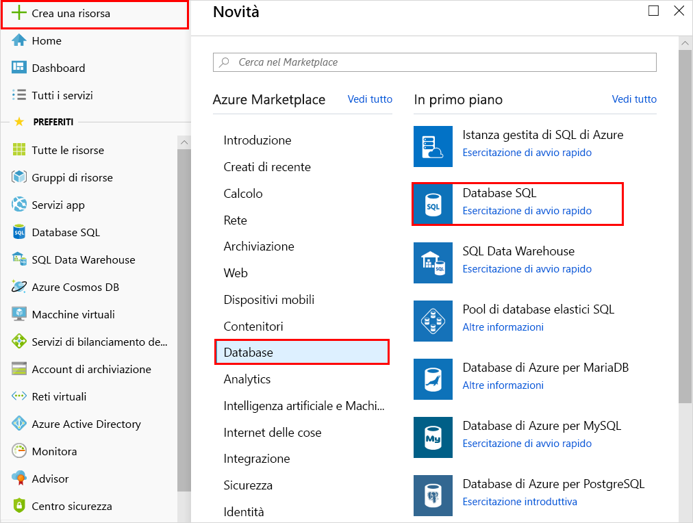
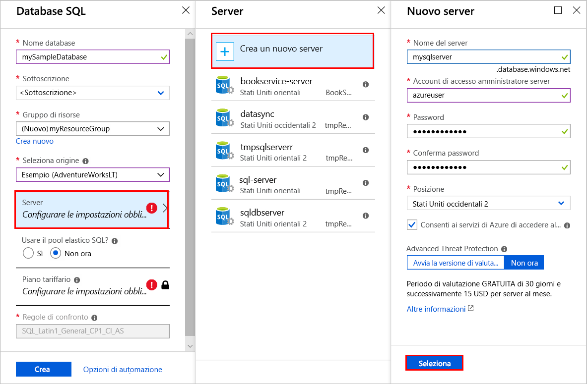
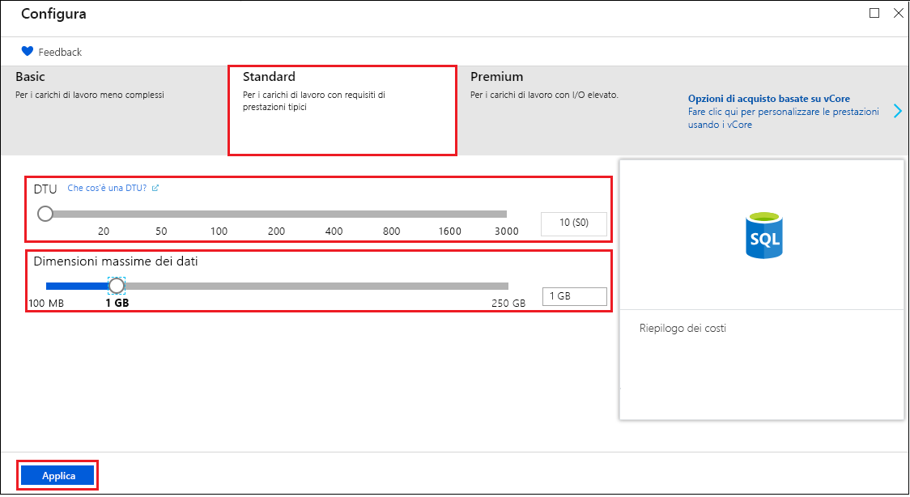
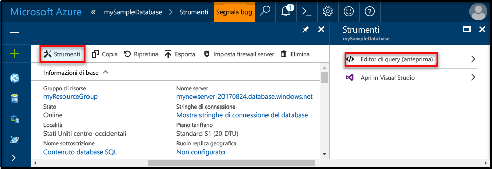
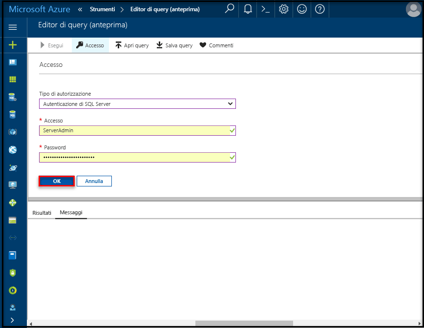
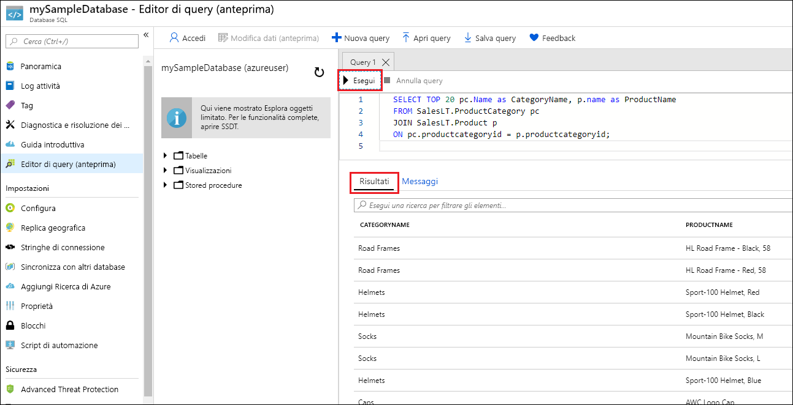

# <a name="create-an-azure-sql-database-in-the-azure-portal"></a>Creare un database SQL di Azure nel portale di Azure

Questa esercitazione introduttiva illustra come creare un database SQL in Azure. Il database SQL di Azure è un'offerta di "database distribuito come servizio" che consente di eseguire e ridimensionare i database di SQL Server a disponibilità elevata nel cloud. Questa guida introduttiva illustra come iniziare a creare un database SQL con il portale di Azure.

Se non si ha una sottoscrizione di Azure, creare un account [gratuito](https://azure.microsoft.com/free/) prima di iniziare.

## <a name="log-in-to-the-azure-portal"></a>Accedere al Portale di Azure.

Accedere al [Portale di Azure](https://portal.azure.com/).

## <a name="create-a-sql-database"></a>Creazione di un database SQL

Un database SQL di Azure viene creato con un set definito di [risorse di calcolo e di archiviazione](sql-database-service-tiers.md). Il database viene creato in un [gruppo di risorse di Azure](../azure-resource-manager/resource-group-overview.md) e in un [server logico di database SQL di Azure](sql-database-features.md). 

Seguire questi passaggi per creare un database SQL contenente i dati di esempio di Adventure Works LT. 

1. Fare clic sul pulsante **Nuovo** nell'angolo superiore sinistro del portale di Azure.

2. Selezionare **Database** nella pagina **Nuovo** e quindi **Database SQL** nella pagina **Database**.

   

3. Compilare il modulo Database SQL con le informazioni seguenti, come illustrato nell'immagine precedente:   

   | Impostazione       | Valore consigliato | Descrizione | 
   | ------------ | ------------------ | ------------------------------------------------- | 
   | **Database name** (Nome database) | mySampleDatabase | Per i nomi di database validi, vedere [Database Identifiers](https://docs.microsoft.com/en-us/sql/relational-databases/databases/database-identifiers) (Identificatori di database). | 
   | **Sottoscrizione** | Sottoscrizione in uso  | Per informazioni dettagliate sulle sottoscrizioni, vedere [Subscriptions](https://account.windowsazure.com/Subscriptions) (Sottoscrizioni). |
   | **Gruppo di risorse**  | myResourceGroup | Per i nomi di gruppi di risorse validi, vedere [Naming rules and restrictions](https://docs.microsoft.com/azure/architecture/best-practices/naming-conventions) (Regole di denominazione e restrizioni). |
   | **Seleziona origine** | Sample (AdventureWorksLT) (Esempio - AdventureWorksLT) | Carica lo schema e i dati di AdventureWorksLT nel nuovo database |

   > [!IMPORTANT]
   > È necessario selezionare il database di esempio in questo modulo perché verrà usato nel resto di questa guida introduttiva.
   > 

4. Compilare il server SQL (server logico) con le informazioni seguenti, come illustrato nell'immagine precedente:   

   | Impostazione       | Valore consigliato | Descrizione | 
   | ------------ | ------------------ | ------------------------------------------------- | 
   | **Server name** (Nome server) | Qualsiasi nome globalmente univoco | Per i nomi di server validi, vedere [Naming rules and restrictions](https://docs.microsoft.com/azure/architecture/best-practices/naming-conventions) (Regole di denominazione e restrizioni). | 
   | **Nome di accesso amministratore server** | Qualsiasi nome valido | Per i nomi di accesso validi, vedere [Database Identifiers](https://docs.microsoft.com/en-us/sql/relational-databases/databases/database-identifiers) (Identificatori di database). |
   | **Password** | Qualsiasi password valida | La password deve almeno 8 caratteri e contenere caratteri inclusi in tre delle categorie seguenti: caratteri maiuscoli, caratteri minuscoli, numeri e caratteri non alfanumerici. |
   | **Sottoscrizione** | Sottoscrizione in uso | Per informazioni dettagliate sulle sottoscrizioni, vedere [Subscriptions](https://account.windowsazure.com/Subscriptions) (Sottoscrizioni). |
   | **Gruppo di risorse** | myResourceGroup | Per i nomi di gruppi di risorse validi, vedere [Naming rules and restrictions](https://docs.microsoft.com/azure/architecture/best-practices/naming-conventions) (Regole di denominazione e restrizioni). |
   | **Posizione** | Qualsiasi località valida | Per informazioni sulle aree, vedere [Aree di Azure](https://azure.microsoft.com/regions/). |

   > [!IMPORTANT]
   > L'account di accesso amministratore server e la password qui specificati sono necessari per accedere al server e ai relativi database più avanti in questa guida introduttiva. Prendere nota di queste informazioni per usarle in seguito. 
   >  

   

5. Dopo aver completato il modulo, fare clic su **Seleziona**.

6. Fare clic su **Piano tariffario** per specificare il livello di servizio e il livello delle prestazioni per il nuovo database. Usare il dispositivo di scorrimento per selezionare **20 DTU** e **250** GB di spazio di archiviazione. Per altre informazioni sulle DTU, vedere il relativo [articolo](sql-database-what-is-a-dtu.md).

   

7. Dopo aver selezionato la quantità di DTU, fare clic su **Applica**.  

8. Dopo aver completato il modulo del database SQL, fare clic su **Crea** per effettuare il provisioning del database. Il provisioning richiede alcuni minuti. 

9. Sulla barra degli strumenti fare clic su **Notifiche** per monitorare il processo di distribuzione.

   

## <a name="create-a-server-level-firewall-rule"></a>Creare una regola del firewall a livello di server

Il servizio di database SQL crea un firewall a livello di server che impedisce alle applicazioni e agli strumenti esterni di connettersi al server o ai database sul server a meno che non venga creata una regola del firewall per aprire il firewall per indirizzi IP specifici. Seguire questi passaggi per creare una [regola del firewall a livello di server di database SQL](sql-database-firewall-configure.md) per l'indirizzo IP del client e abilitare la connettività esterna tramite il firewall del database SQL solo per il proprio indirizzo IP. 

> [!NOTE]
> Il database SQL comunica attraverso la porta 1433. Se si sta tentando di connettersi da una rete aziendale, il traffico in uscita attraverso la porta 1433 potrebbe non essere autorizzato dal firewall della rete. In questo caso, non è possibile connettersi al server del database SQL di Azure, a meno che il reparto IT non apra la porta 1433.
>

1. Al termine della distribuzione, scegliere **Database SQL** dal menu a sinistra e fare clic su **mySampleDatabase** nella pagina **Database SQL**. Si apre la pagina di panoramica per il database, in cui è indicato il nome completo del server (ad esempio, **mynewserver20170313.database.windows.net**) e in cui sono disponibili altre opzioni di configurazione. Copiare il nome completo del server per usarlo in seguito.

   > [!IMPORTANT]
   > Questo nome completo del server è necessario per connettersi al server e ai relativi database nelle guide introduttive successive.
   > 

    

2. Fare clic su **Imposta firewall server** sulla barra degli strumenti, come illustrato nell'immagine precedente. Si apre la pagina **Impostazioni del firewall** per il server del database SQL. 

    

3. Fare clic su **Aggiungi IP client** sulla barra degli strumenti per aggiungere l'indirizzo IP corrente a una nuova regola del firewall. Una regola del firewall può aprire la porta 1433 per un indirizzo IP singolo o un intervallo di indirizzi IP.

4. Fare clic su **Salva**. Viene creata una regola del firewall a livello di server per l'indirizzo IP corrente, che apre la porta 1433 nel server logico.

    

4. Fare clic su **OK** e quindi chiudere la pagina **Impostazioni del firewall**.

È ora possibile connettersi al server del database SQL e ai relativi database usando SQL Server Management Studio o un altro strumento di propria scelta da questo indirizzo IP, con l'account amministratore del server creato in precedenza.

> [!IMPORTANT]
> Per impostazione predefinita, l'accesso attraverso il firewall del database SQL è abilitato per tutti i servizi di Azure. Selezionando **NO** in questa pagina permette di disabilitare tutti i servizi di Azure.
>

## <a name="query-the-sql-database"></a>Effettuare una query sul database SQL

Ora che è stato creato un database di esempio in Azure, usare lo strumento di query predefinito nel portale di Azure per verificare la possibilità di connettersi al database ed eseguire query sui dati. 

1. Nella pagina Database SQL del database fare clic su **Strumenti** sulla barra degli strumenti. Si apre la pagina **Strumenti**.

    

2. Fare clic su **Editor di query (anteprima)**, fare clic sulla casella di controllo **Condizioni per l'anteprima** e quindi su **OK**. Si apre la pagina Editor di query.

3. Fare clic su **Accedi** e quindi, quando viene richiesto, selezionare **Autenticazione di SQL Server** e infine immettere l'account e la password di accesso amministratore server creata prima.

    

4. Fare clic su **OK** per accedere.

5. Dopo l'autenticazione, digitare la query seguente nel riquadro dell'editor di query.

   ```sql
   SELECT TOP 20 pc.Name as CategoryName, p.name as ProductName
   FROM SalesLT.ProductCategory pc
   JOIN SalesLT.Product p
   ON pc.productcategoryid = p.productcategoryid;
   ```

6. Fare clic su **Esegui** e quindi esaminare i risultati della query nel riquadro **Risultati**.

   

7. Chiudere la pagina **Editor di query** e la pagina **Strumenti**.

## <a name="clean-up-resources"></a>Pulire le risorse

Se queste risorse non sono necessarie per un'altra guida introduttiva/esercitazione (vedere [Passaggi successivi](#next-steps)), è possibile eliminarle seguendo questa procedura:


1. Scegliere **Gruppi di risorse** dal menu a sinistra del portale di Azure e quindi fare clic su **myResourceGroup**. 
2. Nella pagina del gruppo di risorse fare clic su **Elimina**, digitare **myResourceGroup** nella casella di testo e quindi fare clic su **Elimina**.

## <a name="next-steps"></a>Passaggi successivi

Dopo aver creato un database, è possibile connettersi ed eseguire query usando gli strumenti preferiti. Per altre informazioni, scegliere uno strumento di seguito:

- [SQL Server Management Studio](sql-database-connect-query-ssms.md)
- [Visual Studio Code](sql-database-connect-query-vscode.md)
- [.NET](sql-database-connect-query-dotnet.md)
- [PHP](sql-database-connect-query-php.md)
- [Node.JS](sql-database-connect-query-nodejs.md)
- [Java](sql-database-connect-query-java.md)
- [Python](sql-database-connect-query-python.md)
- [Ruby](sql-database-connect-query-ruby.md)

