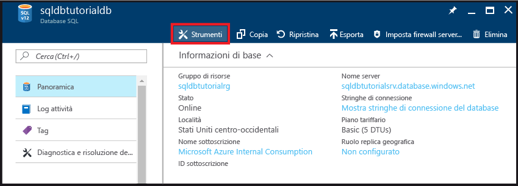
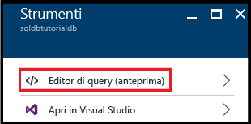
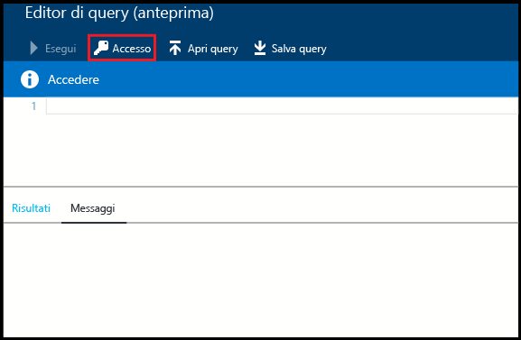
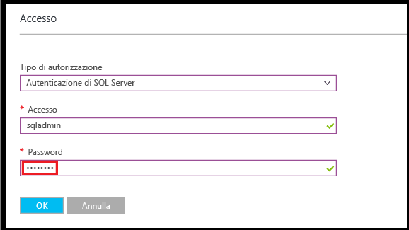
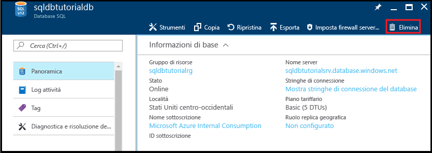
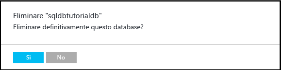

# <a name="quick-start-tutorial-your-first-azure-sql-database"></a>Esercitazione introduttiva: il primo database SQL di Azure

Questa esercitazione introduttiva illustra come eseguire queste operazioni:

* [Creare un nuovo server logico](sql-database-get-started.md#create-a-new-logical-sql-server) 
* [Visualizzare le proprietà del server logico](sql-database-get-started.md#view-the-logical-server-properties) 
* [Creare una regola del firewall a livello di server](sql-database-get-started.md#create-a-server-level-firewall-rule) 
* [Connettersi al server con SSMS](sql-database-get-started.md#connect-to-the-server-with-ssms) 
* [Creare un database con dati di esempio](sql-database-get-started.md#create-a-database-with-sample-data) 
* [Visualizzare le proprietà del database](sql-database-get-started.md#view-the-database-properties) 
* [Eseguire query nel database nel portale di Azure](sql-database-get-started.md#query-the-database-in-the-azure-portal) 
* [Connettersi al database con SSMS ed eseguire query](sql-database-get-started.md#connect-and-query-the-database-with-ssms) 
* [Creare un database vuoto con SSMS](sql-database-get-started.md#create-a-blank-database-with-ssms) 
* [Risolvere i problemi di connettività](sql-database-get-started.md#troubleshoot-connectivity) 
* [Eliminare un database](sql-database-get-started.md#delete-a-single-database) 


Al termine di questa esercitazione introduttiva, saranno disponibili un database di esempio e un database vuoto in esecuzione in un gruppo di risorse di Azure e collegato a un server logico. Saranno anche disponibili due regole del firewall di livello server configurate per abilitare l'entità a livello server per l'accesso al server da due indirizzi IP specificati. 

**Tempo stimato**: per questa esercitazione saranno necessari circa 30 minuti (presupponendo che i prerequisiti siano già soddisfatti).

> [!TIP]
> Per eseguire le stesse attività è possibile usare [C#](sql-database-get-started-csharp.md) o [PowerShell](sql-database-get-started-powershell.md).
>

## <a name="prerequisites"></a>Prerequisiti

* È necessario un account Azure. È possibile [aprire un account Azure gratuito](/pricing/free-trial/?WT.mc_id=A261C142F) o [attivare i benefici della sottoscrizione di Visual Studio](/pricing/member-offers/msdn-benefits-details/?WT.mc_id=A261C142F). 

* È necessario essere in grado di connettersi al portale di Azure con un account membro del ruolo proprietario o collaboratore della sottoscrizione. Per altre informazioni sul controllo degli accessi in base al ruolo, vedere [Introduzione alla gestione degli accessi nel portale di Azure](../active-directory/role-based-access-control-what-is.md).

> [!NOTE]
> Questa esercitazione introduttiva offre informazioni sul contenuto di questi argomenti: [Panoramica del server del database SQL](sql-database-server-overview.md), [Panoramica del database SQL](sql-database-overview.md) e [Panoramica sulle regole del firewall per il database SQL di Azure](sql-database-firewall-configure.md).
>  


### <a name="sign-in-to-the-azure-portal-with-your-azure-account"></a>Accedere al portale di Azure con il proprio account Azure
Seguire questa procedura con l'[account Azure](https://account.windowsazure.com/Home/Index) per connettersi al portale di Azure.

1. Aprire il browser preferito e connettersi al [portale di Azure](https://portal.azure.com/).
2. Accedere al [portale di Azure](https://portal.azure.com/).
3. Nella **pagina di accesso** specificare le credenziali per la sottoscrizione.
   
   


<a name="create-logical-server-bk"></a>

## <a name="create-a-new-logical-sql-server"></a>Creare un nuovo server logico di SQL Server

Seguire questa procedura per creare un nuovo server logico con il portale di Azure nell'area scelta.

1. Fare clic su **Nuovo**, digitare **sql server** e quindi fare clic su **INVIO**.

    
2. Fare clic su **SQL Server (server logico)**.
   
    
3. Fare clic su **Crea** per aprire il nuovo pannello SQL Server (server logico).

    
3. Nella casella di testo Nome server specificare un nome valido per il nuovo server logico. Un segno di spunta verde indica che è stato specificato un nome valido.
    
    

    > [!IMPORTANT]
    > Il nome completo per il nuovo server sarà <nome_server>.database.windows.net.
    >
    
4. Nella casella di testo Account di accesso amministratore server specificare un nome utente per l'account di accesso con autenticazione SQL per questo server. Questo è noto come account di accesso dell'entità server. Un segno di spunta verde indica che è stato specificato un nome valido.
    
    
5. Nelle caselle di testo **Password** e **Conferma password** specificare una password per l'account di accesso dell'entità server. Un segno di spunta verde indica che è stata specificata una password valida.
    
    
6. Selezionare una sottoscrizione in cui si dispone dell'autorizzazione per creare oggetti.

    
7. Nella casella di testo Gruppo di risorse selezionare **Crea nuovo** e quindi, nella casella di testo Gruppo di risorse, specificare un nome valido per il nuovo gruppo di risorse (è inoltre possibile usare un gruppo di risorse esistente se ne è già stato creato uno). Un segno di spunta verde indica che è stato specificato un nome valido.

    

8. Nella casella di testo **Località** selezionare un data center adatto alla propria località, ad esempio "Australia orientale".
    
    
    
    > [!TIP]
    > La casella di controllo **Consenti ai servizi di Azure di accedere al server** non può essere modificata in questo pannello. È possibile modificare questa impostazione nel pannello firewall del server. Per altre informazioni, vedere [Get started with security](sql-database-control-access-sql-authentication-get-started.md) (Introduzione alla sicurezza).
    >
    
9. Fare clic su **Create**.

    

## <a name="view-the-logical-server-properties"></a>Visualizzare le proprietà del server logico

Seguire questa procedura per visualizzare le proprietà del server con il portale di Azure. Il nome completo del server sarà necessario per connettere il server in una procedura successiva. 

1. Nel portale di Azure fare clic su **Altri servizi**.

    
2. Nella casella di testo Filtro digitare **SQL** e quindi fare clic sulla stella per specificare SQL Server come preferito in Azure. 

    
3. Nel pannello predefinito fare clic su **SQL Server** per aprire l'elenco di istanze di SQL Server nella sottoscrizione di Azure. 

    

4. Fare clic sulla nuova istanza di SQL Server per visualizzarne le proprietà nel portale di Azure. Le esercitazioni successive consentiranno di comprendere le opzioni disponibili nel pannello.

    
5. In Impostazioni fare clic su **Proprietà** per visualizzare varie proprietà del server logico di SQL.

    
6. Copiare il nome completo del server negli Appunti per usarli più avanti in questa esercitazione.

    

## <a name="create-a-server-level-firewall-rule"></a>Creare una regola del firewall a livello di server

Seguire questa procedura per creare una nuova regola del firewall a livello di server con il portale di Azure, per consentire la connessione al server con SQL Server Management Studio nella procedura successiva.

1. Nel pannello di SQL Server, in Impostazioni, fare clic su **Firewall** per aprire il pannello del firewall per SQL Server.

    

2. Fare clic su **Aggiungi IP client** sulla barra degli strumenti.

    

    > [!NOTE]
    > È possibile aprire il firewall del database SQL nel server a un singolo indirizzo IP o a un intero intervallo di indirizzi. L'apertura del firewall consente agli amministratori SQL e agli utenti di accedere a qualsiasi database nel server per cui hanno credenziali valide.
    >

4. Fare clic su **Salva** sulla barra degli strumenti per salvare questa regola del firewall a livello di server e quindi fare clic su **OK**.

    

## <a name="connect-to-the-server-with-ssms"></a>Connettersi al server con SSMS

Seguire questa procedura per connettersi al server logico per SQL Server con SQL Server Management Studio.

1. Scaricare e installare la versione più recente di SSMS se non è già stato fatto, vedere [Scaricare SQL Server Management Studio](https://msdn.microsoft.com/library/mt238290.aspx). Per mantenersi aggiornata, la versione più recente di SSMS chiede di scaricare la nuova versione quando è disponibile.

2. Dopo l'installazione, digitare **Microsoft SQL Server Management Studio** nella casella di ricerca di Windows e fare clic su **INVIO** per aprire SSMS:

    
3. Nella casella di dialogo Connetti al server immettere le informazioni necessarie per connettersi a SQL Server usando Autenticazione di SQL Server.

    
4. Fare clic su **Connect**.

    
5. In Esplora oggetti espandere **Database**, **Database di sistema**, **Master** per visualizzare gli oggetti nel database master.

    
6. Fare clic con il pulsante destro del mouse su **Master** e quindi scegliere **Nuova query**.

    

8. Nella finestra della query digitare la query seguente:

   ```select * from sys.objects```

9.  Sulla barra degli strumenti fare clic su **Execute** (Esegui) per restituire un elenco degli oggetti di sistema nel database master.

    

    > [!NOTE]
    > Per informazioni sulla sicurezza di SQL, vedere [Get Started with SQL security](sql-database-control-access-sql-authentication-get-started.md) (Introduzione alla sicurezza di SQL)
    >

## <a name="create-a-database-with-sample-data"></a>Creare un database con dati di esempio

Seguire questa procedura per creare un database con dati di esempio con il portale di Azure. Verrà creato un database associato al server logico creato in precedenza. Se il livello di servizio Basic non è disponibile nell'area in cui è stato creato il server, eliminare il server e crearlo di nuovo in un'altra area. Per informazioni sui passaggi di eliminazione, vedere l'ultima procedura di questa esercitazione.

1. Nel portale di Azure fare clic su **Database SQL** nel pannello predefinito.

    
2. Nel pannello dei database SQL fare clic su **Aggiungi**.

    
3. Nel pannello Database SQL esaminare le informazioni completate automaticamente.

    
4. Specificare un nome di database valido.

    
5. In Selezionare l'origine fare clic su **Esempio** e quindi in Selezionare l'esempio fare clic su **AdventureWorksLT [V12]**.
   
    
6. In Server specificare il nome utente di accesso amministratore server e la password.

    

    > [!NOTE]
    > Quando si aggiunge un database a un server, è possibile aggiungerlo come database singolo (questo è il valore predefinito) o aggiungerlo a un pool elastico. Per altre informazioni sui pool elastici, vedere [Elastic pools](sql-database-elastic-pool.md) (Pool elastici).
    >

7. In Piano tariffario modificare il piano tariffario in **Basic** (è possibile aumentare il piano tariffario in un secondo momento, se necessario, ma ai fini dell'esercitazione si consiglia di usare il piano tariffario a costo più basso).

    
8. Fare clic su **Create**.

    

## <a name="view-the-database-properties"></a>Visualizzare le proprietà del database

Seguire questa procedura per eseguire query nel database con il portale di Azure.

1. Nel pannello del database SQL fare clic su nuovo database per visualizzarne le proprietà nel portale di Azure. Le esercitazioni successive consentiranno di comprendere le opzioni disponibili nel pannello. 

    
2. Fare clic su **Proprietà** per visualizzare informazioni aggiuntive sul database.

    

3. Fare clic su **Mostra stringhe di connessione del database**.

    
4. Fare clic su **Panoramica** e quindi sul nome del server nel riquadro Informazioni di base.
    
    
5. Nel riquadro Informazioni di base del server, vedere il database appena aggiunto.

    

## <a name="query-the-database-in-the-azure-portal"></a>Eseguire query nel database nel portale di Azure

Seguire questa procedura per eseguire query nel database con l'Editor di query nel portale di Azure. La query mostra gli oggetti nel database.

1. Nel pannello del database SQL fare clic su **Strumenti** sulla barra degli strumenti.

    
2. Nel pannello Strumenti fare clic su **Editor di query (anteprima)**.

    
3. Selezionare la casella di controllo per confermare che l'Editor di query è una funzionalità disponibile in anteprima, quindi fare clic su **OK**.
4. Nel pannello **Editor di query** fare clic su **Accedi**.

    
5. Verificare i valori per il tipo di autorizzazione e per l'accesso, quindi specificare la password per l'accesso. 

    
6. Fare clic su **OK** per provare ad accedere.
7. Quando si riceve un errore di accesso che indica che il client non ha le autorizzazioni necessarie per l'accesso a causa dell'assenza di una regola del firewall per l'indirizzo IP del client, copiare l'indirizzo IP del client nella finestra dell'errore e creare una regola del firewall a livello di server nel pannello di SQL Server per questo database.

    
8. Ripetere i 6 passaggi precedenti per accedere al database.
9. Dopo l'autenticazione, nella finestra della query digitare la query seguente:

   ```select * from sys.objects```

     10 clic **Esegui**.
11. Verificare i risultati della query nel riquadro **Risultati**.

    

## <a name="connect-and-query-the-database-with-ssms"></a>Connettersi al database con SSMS ed eseguire query

Seguire questa procedura per connettersi al database con SQL Server Management Studio e quindi eseguire una query nei dati di esempio per visualizzare gli oggetti nel database.

1. Passare ad SQL Server Management Studio e, in Esplora oggetti, fare clic su **Database** e quindi su **Aggiorna** sulla barra degli strumenti per visualizzare il database di esempio.

    
2. In Esplora oggetti espandere il nuovo database per visualizzarne gli oggetti.

    
3. Fare clic con il pulsante destro del mouse sul database di esempio e quindi fare clic su **Nuova query**.

    
4. Nella finestra della query digitare la query seguente:

   ```select * from sys.objects```
   
9.  Sulla barra degli strumenti fare clic su **Execute** (Esegui) per restituire un elenco degli oggetti di sistema nel database di esempio.

    

## <a name="create-a-blank-database-with-ssms"></a>Creare un database vuoto con SSMS

Seguire questa procedura per creare un nuovo database nel server logico con SQL Server Management Studio.

1. In Esplora oggetti fare clic con il pulsante destro del mouse su **Database** e scegliere **Nuovo database**.

    

    > [!NOTE]
    > È anche possibile impostare SSMS affinché crei uno script di database per creare un nuovo database con Transact-SQL.
    >

2. Nella finestra di dialogo Nuovo database specificare un nome di database nella casella di testo Nome database. 

    

3. Nella finestra di dialogo Nuovo database fare clic su **Opzioni** e quindi modificare l'edizione in **Basic**.

    

    > [!TIP]
    > Esaminare le altre opzioni nella finestra di dialogo che è possibile modificare per un database SQL di Azure. Per altre informazioni su queste opzioni, vedere [Create Database](https://msdn.microsoft.com/library/dn268335.aspx).
    >

4. Fare clic su **OK** per creare il database vuoto.
5. Al termine, aggiornare il nodo del database in Esplora oggetti per visualizzare il database vuoto appena creato. 

    

## <a name="troubleshoot-connectivity"></a>Risolvere i problemi di connettività

> [!IMPORTANT]
> In caso di problemi di connettività, vedere [Problemi di connessione](sql-database-troubleshoot-common-connection-issues.md).
> 

## <a name="delete-a-single-database"></a>Eliminare un database singolo

Seguire questa procedura per eliminare un singolo database con il portale di Azure.

1. Nel pannello del database SQL del portale di Azure fare clic su **Elimina**.

    
2. Fare clic su **Sì** per confermare che si vuole eliminare definitivamente questo database.

    

> [!TIP]
> Durante il periodo di conservazione per il database è possibile ripristinarlo dai backup automatici avviati dal servizio. È possibile ripristinare i database dell'edizione Basic in sette giorni. Tuttavia, non eliminare un server. In tal caso, è possibile ripristinare il server o i relativi database eliminati. Per altre informazioni sui backup dei database, vedere [Informazioni sul backup del database SQL](sql-database-automated-backups.md) e per informazioni sul ripristino di un database dai backup, vedere [Ripristino del database](sql-database-recovery-using-backups.md). Per informazioni pratiche sul ripristino di un database eliminato, vedere [Ripristinare un database SQL di Azure eliminato - Portale di Azure](sql-database-restore-deleted-database-portal.md).
>


## <a name="next-steps"></a>Passaggi successivi
Dopo aver completato questa esercitazione, sono disponibili numerose altre esercitazioni che può essere opportuno consultare per mettere in pratica i concetti appresi in questa esercitazione. 

- Per un'introduzione all'esercitazione sull'autenticazione di SQL Server, vedere [SQL authentication and authorization](sql-database-control-access-sql-authentication-get-started.md) (Autenticazione e autorizzazione di SQL).
- Per un'introduzione all'esercitazione sull'autenticazione di Azure Active Directory, vedere [AAD authentication and authorization](sql-database-control-access-aad-authentication-get-started.md) (Autenticazione e autorizzazione di AAD).
* Per eseguire query sul database di esempio nel portale di Azure, vedere [Public preview: Interactive query experience for SQL databases](https://azure.microsoft.com/en-us/updates/azure-sql-database-public-preview-t-sql-editor/) (Anteprima pubblica: esperienza di query interattiva per i database SQL).
* Se si ha familiarità con Excel, vedere l'esercitazione [Connettere Excel a un database SQL di Azure e creare un report](sql-database-connect-excel.md).
* Se si è pronti per iniziare a scrivere codice, scegliere il linguaggio di programmazione in [Raccolte di connessioni per database SQL e SQL Server](sql-database-libraries.md).
* Per spostare i database SQL Server locali in Azure, vedere [Migrating a database to SQL Database](sql-database-cloud-migrate.md) (Migrazione di un database al database SQL).
* Per caricare alcuni dati in una nuova tabella da un file CSV con lo strumento da riga di comando BCP, vedere [Caricamento di dati in un database SQL da un file CSV con BCP](sql-database-load-from-csv-with-bcp.md).
* Per iniziare a creare tabelle e altri oggetti, vedere l'argomento "Per creare una tabella" in [Esercitazione per la creazione di una tabella](https://msdn.microsoft.com/library/ms365315.aspx).

## <a name="additional-resources"></a>Risorse aggiuntive

- Per una panoramica tecnica, vedere [Informazioni sul database SQL](sql-database-technical-overview.md).
- Per informazioni sui prezzi, vedere [Database SQL Azure - Prezzi](https://azure.microsoft.com/pricing/details/sql-database/).


<!--HONumber=Feb17_HO1-->


