# <a name="sql-database-tutorial-get-started-with-azure-sql-database-servers-databases-and-firewall-rules-using-the-azure-portal-and-sql-server-management-studio"></a>Esercitazione sul database SQL: Introduzione ai server di database SQL di Azure, ai database e alle regole del firewall con il portale di Azure e SQL Server Management Studio

In questa esercitazione introduttiva si apprenderà come usare il portale di Azure per:

* Creare un nuovo gruppo di risorse di Azure
* Creare un server logico di Azure SQL
* Visualizzare le proprietà del server logico di Azure SQL
* Creare una regola del firewall a livello di server
* Creare il database di esempio Adventure Works LT come database singolo
* Visualizzare le proprietà del database di esempio Adventure Works LT in Azure

In questa esercitazione è inoltre possibile usare la versione più recente di SQL Server Management Studio per:

* Connettersi al server logico e al database master
* Eseguire query sul database master
* Connettersi al database di esempio
* Eseguire query sul database di esempio

Al termine di questa esercitazione, si disporrà di un database di esempio e di un database vuoto in esecuzione in un gruppo di risorse di Azure e collegato a un server logico. Sarà inoltre disponibile una regola del firewall a livello di server configurata per abilitare l'entità a livello di server per accedere al server da un indirizzo IP specificato (o da un intervallo di indirizzi IP). 

**Tempo stimato**: per questa esercitazione saranno necessari circa 30 minuti (presupponendo che i prerequisiti siano già soddisfatti).

## <a name="prerequisites"></a>Prerequisiti

* È necessario un account Azure. È possibile [aprire un account Azure gratuito](/pricing/free-trial/?WT.mc_id=A261C142F) o [attivare i benefici della sottoscrizione di Visual Studio](/pricing/member-offers/msdn-benefits-details/?WT.mc_id=A261C142F). 

* È necessario essere in grado di connettersi al portale di Azure usando un account membro del ruolo proprietario o collaboratore della sottoscrizione. Per altre informazioni sul controllo degli accessi in base al ruolo, vedere [Introduzione alla gestione degli accessi nel portale di Azure](../active-directory/role-based-access-control-what-is.md).

> [!TIP]
> Per eseguire queste stesse attività in un'esercitazione introduttiva, è possibile usare [C#](sql-database-get-started-csharp.md) o [PowerShell](sql-database-get-started-powershell.md).
>

### <a name="sign-in-by-using-your-existing-account"></a>Accedere usando un account esistente
Usando la [sottoscrizione esistente](https://account.windowsazure.com/Home/Index), seguire questa procedura per connettersi al portale di Azure.

1. Aprire il browser preferito e connettersi al [portale di Azure](https://portal.azure.com/).
2. Accedere al [portale di Azure](https://portal.azure.com/).
3. Nella **pagina di accesso** specificare le credenziali per la sottoscrizione.
   
   


<a name="create-logical-server-bk"></a>

## <a name="create-a-new-logical-sql-server-in-the-azure-portal"></a>Creare un nuovo server logico di SQL nel portale di Azure

1. Fare clic su **Nuovo**, digitare **sql server** e quindi fare clic su **INVIO**.

    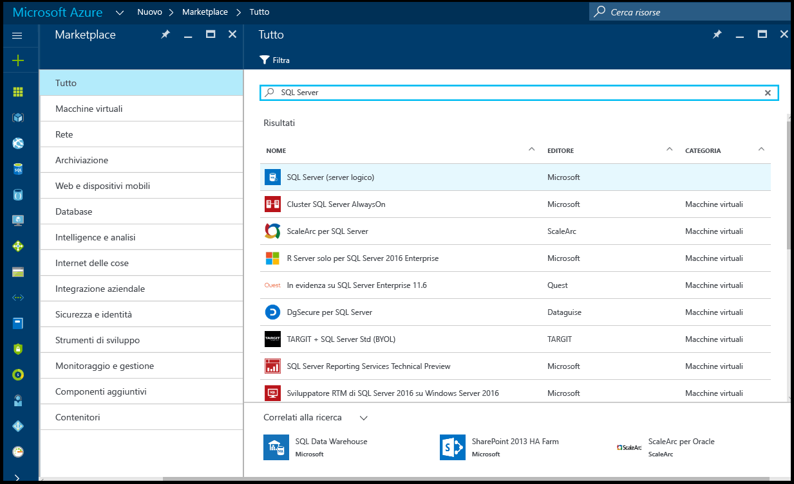
2. Fare clic su **SQL Server (server logico)**.
   
    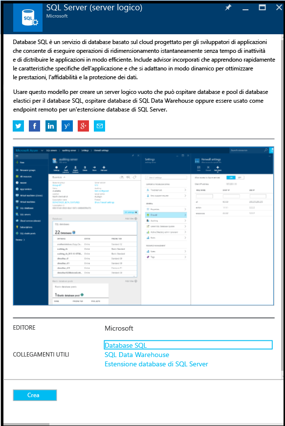
3. Fare clic su **Crea** per aprire il nuovo pannello SQL Server (server logico).

    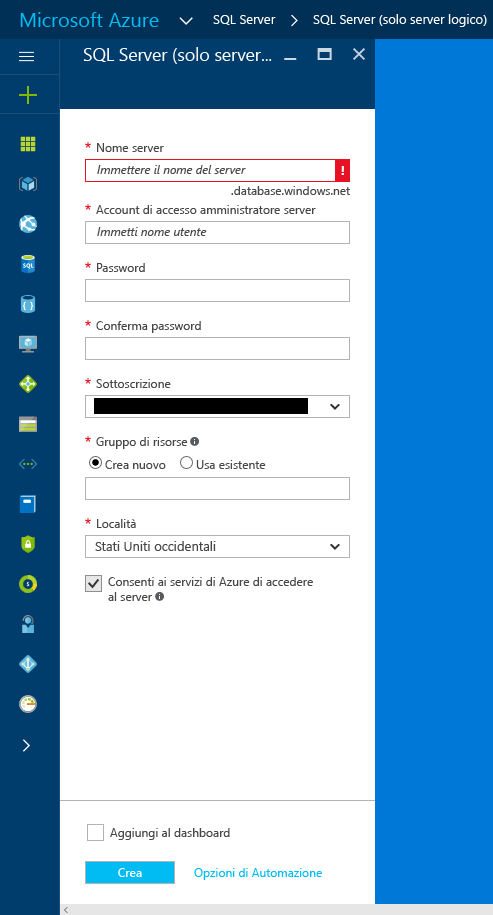
3. Nella casella di testo Nome server specificare un nome valido per il nuovo server logico. Un segno di spunta verde indica che è stato specificato un nome valido.
    
    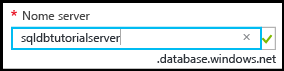

    > [!IMPORTANT]
    > Il nome completo per il nuovo server sarà <nome_server>.database.windows.net.
    >
    
4. Nella casella di testo Account di accesso amministratore server specificare un nome utente per l'account di accesso con autenticazione SQL per questo server. Questo è noto come account di accesso dell'entità server. Un segno di spunta verde indica che è stato specificato un nome valido.
    
    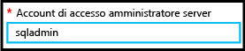
5. Nelle caselle di testo **Password** e **Conferma password** specificare una password per l'account di accesso dell'entità server. Un segno di spunta verde indica che è stata specificata una password valida.
    
    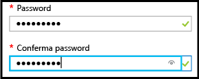
6. Selezionare una sottoscrizione in cui si dispone dell'autorizzazione per creare oggetti.

    
7. Nella casella di testo Gruppo di risorse selezionare **Crea nuovo** e quindi, nella casella di testo Gruppo di risorse, specificare un nome valido per il nuovo gruppo di risorse (è inoltre possibile usare un gruppo di risorse esistente se ne è già stato creato uno). Un segno di spunta verde indica che è stato specificato un nome valido.

    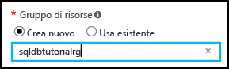

8. Nella casella di testo **Località** selezionare un data center adatto alla propria località, ad esempio "Australia orientale".
    
    
    
    > [!TIP]
    > La casella di controllo **Consenti ai servizi di Azure di accedere al server** non può essere modificata in questo pannello. È possibile modificare questa impostazione nel pannello firewall del server. Per altre informazioni, vedere [Get started with security](sql-database-get-started-security.md) (Introduzione alla sicurezza).
    >
    
9. Fare clic su **Create**.

    

## <a name="view-the-logical-sql-server-properties-in-the-azure-portal"></a>Visualizzare le proprietà logiche di SQL Server nel portale di Azure

1. Nel portale di Azure fare clic su **Altri servizi**.

    
2. Nella casella di testo Filtro digitare **SQL** e quindi fare clic sulla stella per specificare SQL Server come preferito in Azure. 

    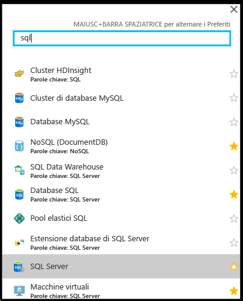
3. Nel pannello predefinito fare clic su **SQL Server** per aprire l'elenco di istanze di SQL Server nella sottoscrizione di Azure. 

    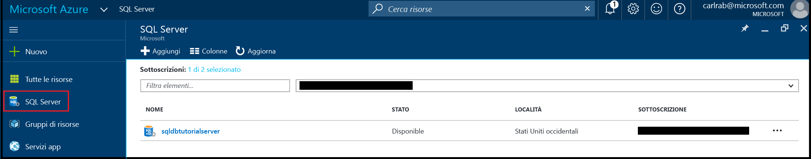

4. Fare clic sulla nuova istanza di SQL Server per visualizzarne le proprietà nel portale di Azure. Le esercitazioni successive consentiranno di comprendere le opzioni disponibili nel pannello.

    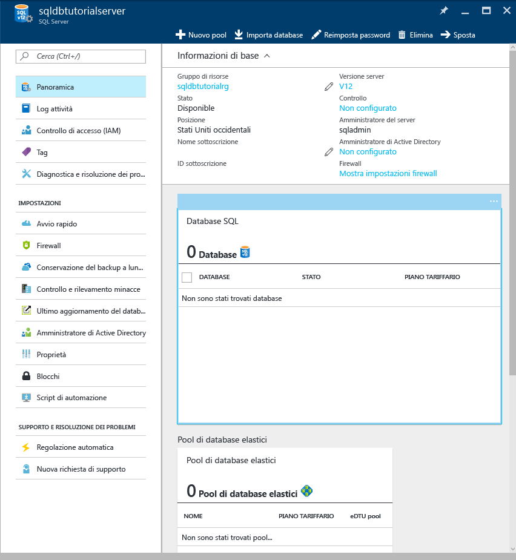
5. In Impostazioni fare clic su **Proprietà** per visualizzare varie proprietà del server logico di SQL.

    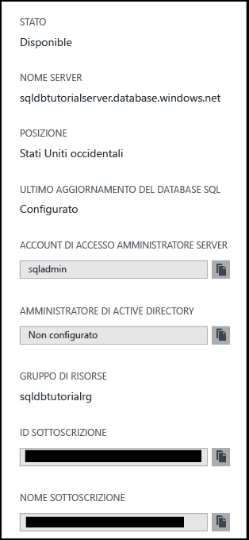
6. Copiare il nome completo del server negli Appunti per usarli più avanti in questa esercitazione.

    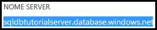

## <a name="create-a-server-level-firewall-rule-in-the-azure-portal"></a>Creare una regola del firewall a livello di server nel portale di Azure

1. Nel pannello di SQL Server, in Impostazioni, fare clic su **Firewall** per aprire il pannello del firewall per SQL Server.

    

2. Verificare la presenza dell'indirizzo IP del client e che questo sia l'indirizzo IP Internet che usa un browser di propria scelta (chiedere "qual è l'indirizzo IP in uso"). Talvolta non corrispondono per varie ragioni.

    

3. Supponendo che gli indirizzi IP corrispondano, fare clic su **Aggiungi IP client** sulla barra degli strumenti.

    

    > [!NOTE]
    > È possibile aprire il firewall del database SQL nel server a un singolo indirizzo IP o a un intero intervallo di indirizzi. L'apertura del firewall consente agli amministratori SQL e agli utenti di accedere a qualsiasi database nel server per cui hanno credenziali valide.
    >

4. Fare clic su **Salva** sulla barra degli strumenti per salvare questa regola del firewall a livello di server e quindi fare clic su **OK**.

    

## <a name="connect-to-sql-server-using-sql-server-management-studio-ssms"></a>Connettersi ad SQL Server con SQL Server Management Studio (SSMS)

1. Scaricare e installare la versione più recente di SSMS se non è già stato fatto, vedere [Scaricare SQL Server Management Studio](https://msdn.microsoft.com/library/mt238290.aspx). Per mantenersi aggiornata, la versione più recente di SSMS chiede di scaricare la nuova versione quando è disponibile.

2. Dopo l'installazione, digitare **Microsoft SQL Server Management Studio** nella casella di ricerca di Windows e fare clic su **INVIO** per aprire SSMS:

    
3. Nella casella di dialogo Connetti al server immettere le informazioni necessarie per connettersi al server SQL usando Autenticazione di SQL Server.

    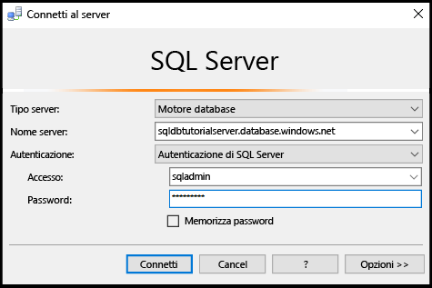
4. Fare clic su **Connect**.

    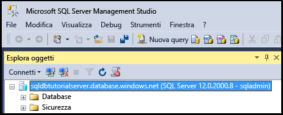
5. In Esplora oggetti espandere **Database**, **Database di sistema**, **Master** per visualizzare gli oggetti nel database master.

    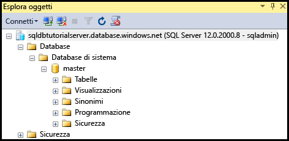
6. Fare clic con il pulsante destro del mouse su **Master** e quindi scegliere **Nuova query**.

    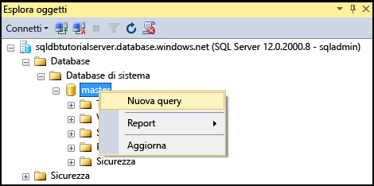

8. Nella finestra della query digitare la query seguente:

   ```select * from sys.objects```

9.  Sulla barra degli strumenti fare clic su **Execute** (Esegui) per restituire un elenco degli oggetti di sistema nel database master.

    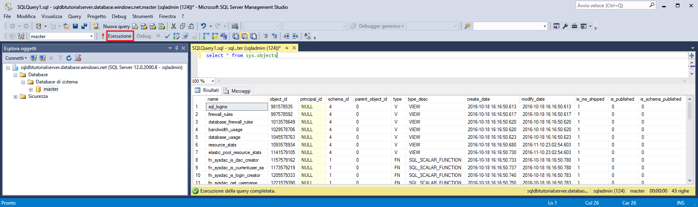

    > [!NOTE]
    > Per informazioni sulla sicurezza di SQL, vedere [Get Started with SQL security](sql-database-get-started-security.md) (Introduzione alla sicurezza di SQL)
    >

## <a name="create-new-database-in-the-azure-portal-using-adventure-works-lt-sample"></a>Creare un nuovo database nel portale di Azure usando l'esempio Adventure Works LT

1. Nel portale di Azure fare clic su **Database SQL** nel pannello predefinito.

    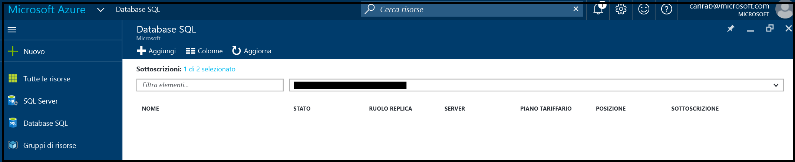
2. Nel pannello dei database SQL fare clic su **Aggiungi**.

    
3. Nel pannello Database SQL esaminare le informazioni completate automaticamente.

    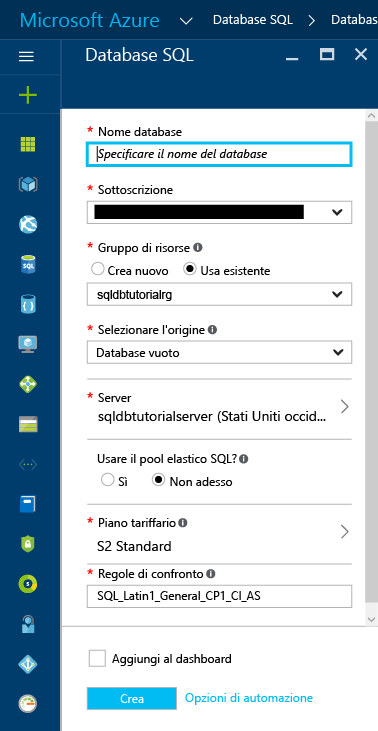
4. Specificare un nome di database valido.

    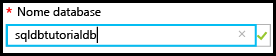
5. In Selezionare l'origine fare clic su **Esempio** e quindi in Selezionare l'esempio fare clic su **AdventureWorksLT [V12]**.
   
    
6. In Server specificare il nome utente di accesso amministratore server e la password.

    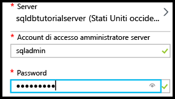

    > [!NOTE]
    > Quando si aggiunge un database a un server, è possibile aggiungerlo come database singolo (questo è il valore predefinito) o aggiungerlo a un pool elastico. Per altre informazioni sui pool elastici, vedere [Elastic pools](sql-database-elastic-pool.md) (Pool elastici).
    >

7. In Piano tariffario modificare il piano tariffario in **Basic** (è possibile aumentare il piano tariffario in un secondo momento, se necessario, ma ai fini dell'esercitazione si consiglia di usare il piano tariffario a costo più basso).

    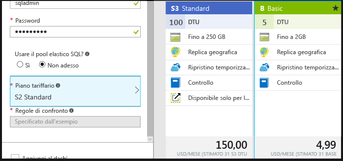
8. Fare clic su **Create**.

    

## <a name="view-database-properties-in-the-azure-portal"></a>Visualizzare le proprietà del database nel portale di Azure

1. Nel pannello del database SQL fare clic su nuovo database per visualizzarne le proprietà nel portale di Azure. Le esercitazioni successive consentiranno di comprendere le opzioni disponibili nel pannello. 

    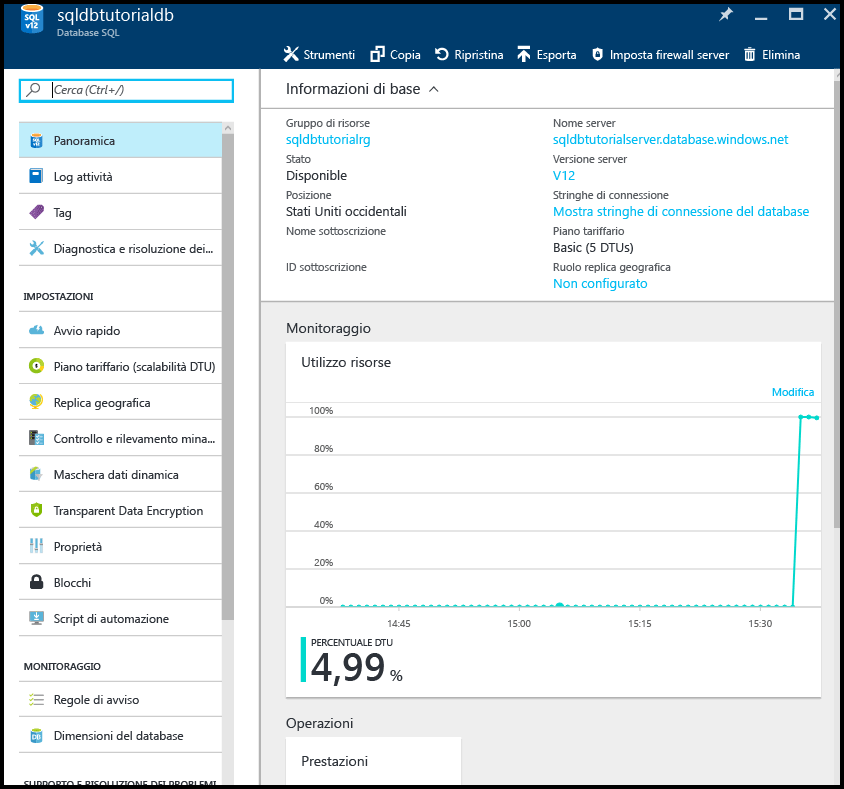
2. Fare clic su **Proprietà** per visualizzare informazioni aggiuntive sul database.

    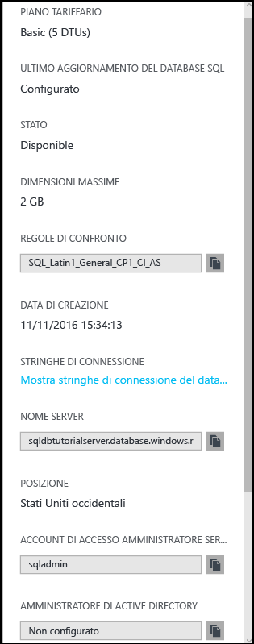

3. Fare clic su **Mostra stringhe di connessione del database**.

    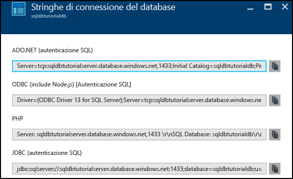
4. Fare clic su **Panoramica** e quindi sul nome del server nel riquadro Informazioni di base.
    
    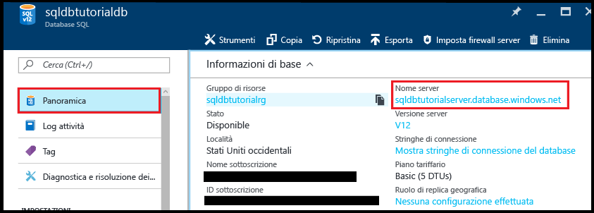
5. Nel riquadro Informazioni di base del server, vedere il database appena aggiunto.

    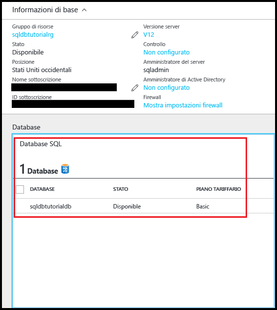

## <a name="connect-and-query-sample-database-using-sql-server-management-studio"></a>Eseguire connessioni e query con un database di esempio con SQL Server Management Studio

1. Passare ad SQL Server Management Studio e, in Esplora oggetti, fare clic su **Database** e quindi su **Aggiorna** sulla barra degli strumenti per visualizzare il database di esempio.

    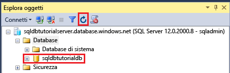
2. In Esplora oggetti espandere il nuovo database per visualizzarne gli oggetti.

    
3. Fare clic con il pulsante destro del mouse sul database di esempio e quindi fare clic su **Nuova query**.

    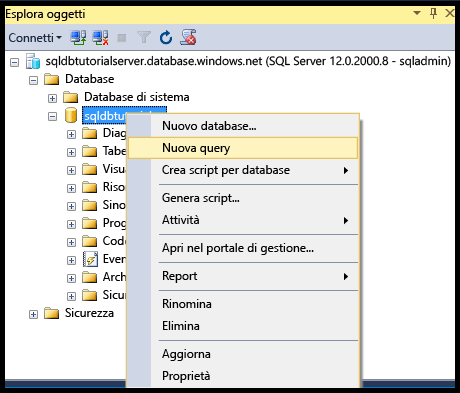
4. Nella finestra della query digitare la query seguente:

   ```select * from sys.objects```
   
9.  Sulla barra degli strumenti fare clic su **Execute** (Esegui) per restituire un elenco degli oggetti di sistema nel database di esempio.

    

## <a name="create-a-new-blank-database-using-sql-server-management-studio"></a>Creare un nuovo database vuoto con SQL Server Management Studio

1. In Esplora oggetti fare clic con il pulsante destro del mouse su **Database** e scegliere **Nuovo database**.

    

    > [!NOTE]
    > È anche possibile impostare SSMS affinché crei uno script di database per creare un nuovo database usando Transact-SQL.
    >

2. Nella finestra di dialogo Nuovo database specificare un nome di database nella casella di testo Nome database. 

    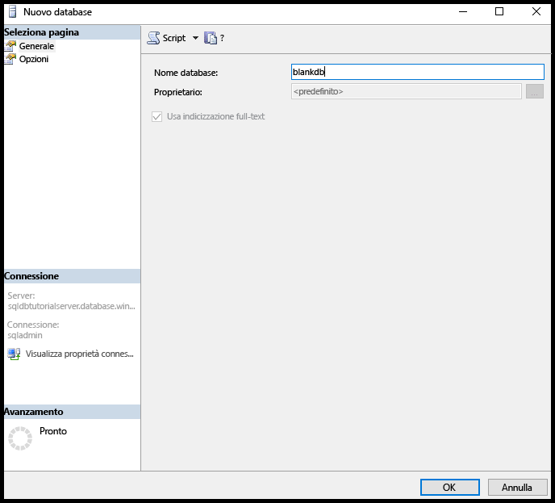

3. Nella finestra di dialogo Nuovo database fare clic su **Opzioni** e quindi modificare l'edizione in **Basic**.

    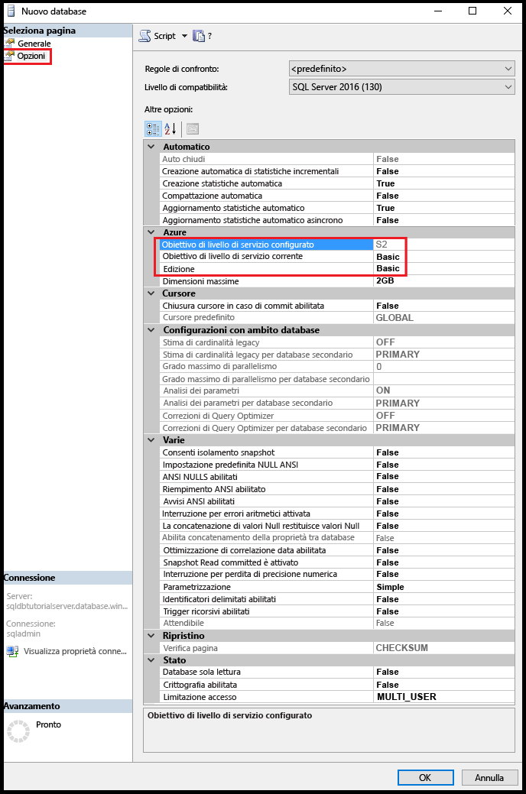

    > [!TIP]
    > Esaminare le altre opzioni nella finestra di dialogo che è possibile modificare per un database SQL di Azure. Per altre informazioni su queste opzioni, vedere [Create Database](https://msdn.microsoft.com/library/dn268335.aspx).
    >

4. Fare clic su **OK** per creare il database vuoto.
5. Al termine, aggiornare il nodo del database in Esplora oggetti per visualizzare il database vuoto appena creato. 

    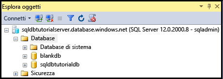

> [!TIP]
> È possibile risparmiare durante l'esercitazione eliminando i database che non si siano usano. È possibile ripristinare i database dell'edizione Basic in sette giorni. Tuttavia, non eliminare un server. In tal caso, è possibile ripristinare il server o i relativi database eliminati.
>


## <a name="next-steps"></a>Passaggi successivi
Dopo aver completato questa esercitazione, sono disponibili numerose altre esercitazioni che può essere opportuno consultare per mettere in pratica i concetti appresi in questa esercitazione. 

* Per informazioni sulla sicurezza del database SQL di Azure, vedere [Getting started with security](sql-database-get-started-security.md) (Introduzione alla sicurezza).
* Se si ha familiarità con Excel, vedere l'esercitazione [Connettere Excel a un database SQL di Azure e creare un report](sql-database-connect-excel.md).
* Se si è pronti per iniziare a scrivere codice, scegliere il linguaggio di programmazione in [Raccolte di connessioni per database SQL e SQL Server](sql-database-libraries.md).
* Per spostare i database SQL Server locali in Azure, vedere [Migrating a database to SQL Database](sql-database-cloud-migrate.md) (Migrazione di un database al database SQL).
* Per caricare alcuni dati in una nuova tabella da un file CSV usando lo strumento da riga di comando BCP, vedere [Caricare dati da CSV in Azure SQL Data Warehouse (file flat)](sql-database-load-from-csv-with-bcp.md).
* Per iniziare a creare tabelle e altri oggetti, vedere l'argomento "Per creare una tabella" in [Esercitazione per la creazione di una tabella](https://msdn.microsoft.com/library/ms365315.aspx).

## <a name="additional-resources"></a>Risorse aggiuntive

- Per una panoramica tecnica, vedere [Informazioni sul database SQL](sql-database-technical-overview.md).
- Per informazioni sui prezzi, vedere [Database SQL Azure - Prezzi](https://azure.microsoft.com/pricing/details/sql-database/).


<!--HONumber=Jan17_HO1-->


