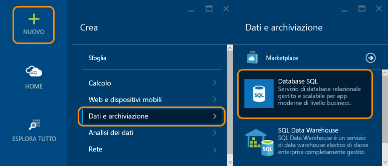
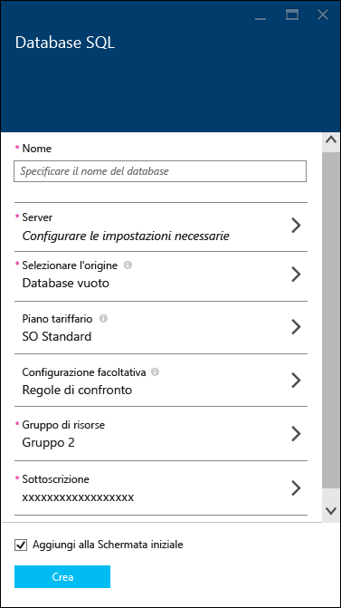
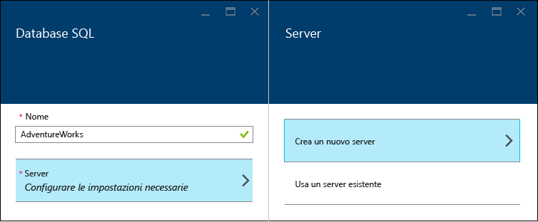
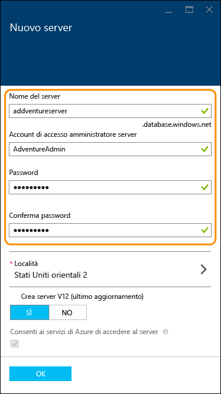
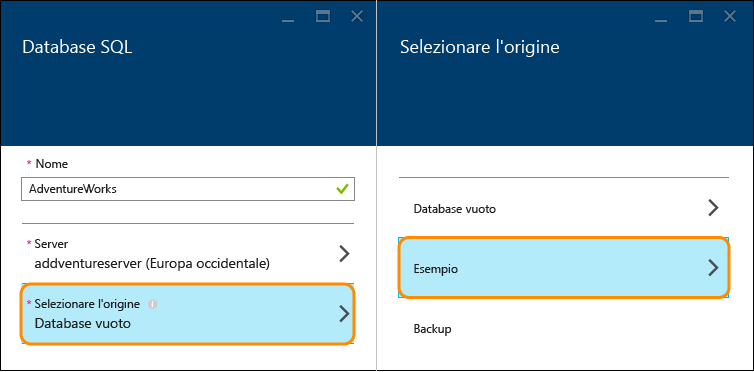
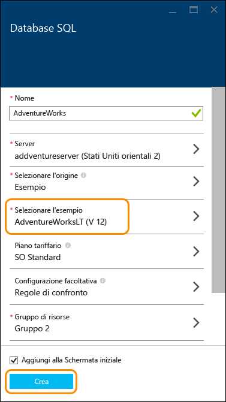
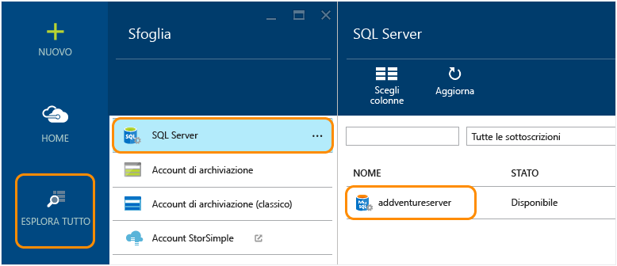
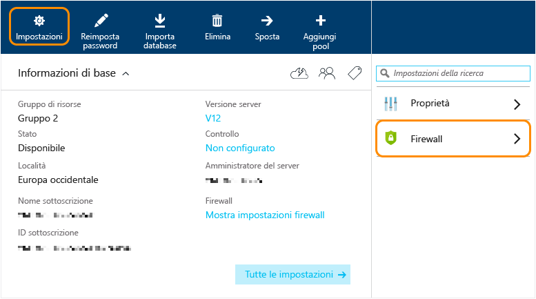
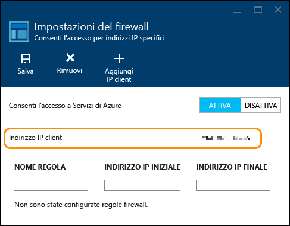
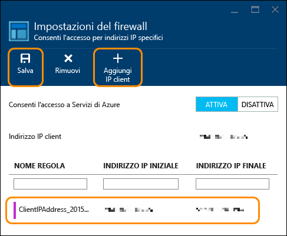

<properties
	pageTitle="Introduzione al database SQL | Microsoft Azure"
	description="Creare il primo database cloud in pochi minuti con database SQL di Azure, servizio Microsoft di gestione di database relazionali (RDBMS) nel cloud, utilizzando il portale di Azure e il database di esempio AdventureWorks."
	services="sql-database"
	documentationCenter=""
	authors="MightyPen"
	manager="jeffreyg"
	editor=""/>

<tags
	ms.service="sql-database"
	ms.workload="data-management"
	ms.tgt_pltfrm="na"
	ms.devlang="na"
	ms.topic="hero-article"
	ms.date="09/01/2015"
	ms.author="genemi"/>

# Creare il primo database SQL di Azure

**Database singolo**

> [AZURE.SELECTOR]
- [Azure portal](sql-database-get-started.md)
- [C#](sql-database-get-started-csharp.md)
- [PowerShell](sql-database-get-started-powershell.md)

Questo articolo descrive come creare un database SQL di esempio in pochi minuti usando il portale di Azure. Si apprenderà come:

- Creare un server per ospitare il database creato e quindi configurare una regola firewall per il server
- Creare un database da un esempio di AdventureWorks che contiene dati con cui è possibile sperimentare

Per iniziare, sono necessari un account e una sottoscrizione di Azure. Nel caso in cui non siano disponibili, è possibile usare una [versione di valutazione gratuita](http://azure.microsoft.com/pricing/free-trial/).

## Passaggio 1: Eseguire l'accesso e avviare l'installazione del database SQL
1. Accedere al [portale di Azure](http://portal.azure.com/).
2. Fare clic su **Nuovo** > **Dati + Archiviazione** > **Database SQL**.

	
	
	Verrà visualizzato il pannello delle impostazioni del **database SQL** in cui è possibile configurare i dettagli del server e del database.

	

## Passaggio 2: Scegliere le impostazioni del server
Un database SQL in Azure è ospitato in un server di database. Un server può ospitare più database. Durante la configurazione del database, è anche possibile creare e configurare il server che lo ospiterà oppure usarne uno creato in precedenza. In questo caso, ne verrà configurato uno nuovo.

1. Digitare un **Nome** per il database (in questo caso **AdventureWorks**). Le altre impostazioni del database verranno esaminate più avanti.
2. In **Server** fare clic su **Configurare le impostazioni necessarie** e quindi fare clic su **Crea un nuovo server**.

	

3. Nel pannello **Nuovo server** digitare un **Nome server** univoco in Azure e facile da ricordare. Questo nome sarà necessario in seguito per connettersi al database e usarlo.
4. Digitare un **Nome di accesso amministratore server** facile da ricordare (in questo caso **AdventureAdmin**). Specificare quindi una **Password** sicura e digitarla di nuovo in **Conferma password**.

	

	 Lasciare l'opzione **Crea server V12 (ultimo aggiornamento)** impostata su **Sì** per usare le funzionalità più recenti. La **Località** determina l'area del data center in cui viene creato il server.

	>[AZURE.TIP]Creare i server di database in una località vicina alle applicazioni che useranno il database. Per cambiare la località, fare clic su **Località**, selezionarne un'altra e quindi fare clic su **OK**.

5. Fare clic su **OK** per tornare al pannello **Database SQL**.

Il database e il server non sono ancora stati creati. Questo avverrà dopo il passaggio successivo, nel quale si sceglierà di creare il database dall'esempio di AdventureWorks e si confermeranno le impostazioni.

## Passaggio 4: Installare e creare il database
1. Nel pannello **Database SQL** fare clic su **Selezionare l'origine** e quindi su **Esempio**. 

	

2. Tornare al pannello **Database SQL**. Nell'elenco **Selezionare l'esempio** sarà visualizzato il database **AdventureWorks LT [V12]**. Fare clic su **Crea** per avviare la creazione di server e database.

	

	>[AZURE.NOTE]In questa procedura rapida, non sono state modificate le impostazioni per **Piano tariffario**, **Regole di confronto** e **Gruppo di risorse**. È possibile cambiare il piano tariffario di un database e ridimensionarlo in qualsiasi momento, senza tempi di inattività. Per altre informazioni, vedere [Prezzi di Database SQL](http://azure.microsoft.com/pricing/details/sql-database/) e la pagina relativa ai [piani tariffari per il database SQL](sql-database-service-tiers.md). Non è possibile modificare le regole di confronto di un database dopo averle impostate qui. Per informazioni dettagliate sulle regole di confronto, vedere [Regole di confronto e supporto Unicode](https://msdn.microsoft.com/library/ms143726.aspx). Per informazioni dettagliate sui gruppi di risorse di Azure, vedere [Panoramica di Gestione risorse di Microsoft Azure](resource-group-overview.md).

Tornare alla schermata iniziale di Azure nella quale è presente un riquadro che mostra lo stato di avanzamento fintanto che l'operazione di creazione non è completata e il database non è online. Per verificare se il database è online, è anche possibile fare clic su **Esplora tutto** e su **Database SQL**.
	
Congratulazioni. Il database è ora in esecuzione nel cloud. La procedura è quasi terminata. Rimane solo un importante passaggio da completare. Sarà necessario creare una regola nel server di database per potersi connettere al database.

## Passaggio 5: Configurare il firewall

È necessario configurare una regola firewall nel server per consentire le connessioni dall'indirizzo IP del computer client, per poter usare il database. Questo passaggio, oltre a verificare che sia possibile stabilire la connessione, consente anche di visualizzare l'area in cui è possibile ottenere informazioni sui server SQL in Azure.

1. Fare clic su **Esplora tutto**, scorrere verso il basso e fare clic su **SQL Server** e quindi selezionare il nome del server creato in precedenza dall'elenco **SQL Server**.

	

	
3. Nel pannello delle proprietà del database visualizzato a destra, fare clic su **Impostazioni** e quindi selezionare **Firewall** dall'elenco.

	

	In **Impostazioni del firewall** verrà visualizzato l'**Indirizzo IP client** corrente.

	

4. Fare clic su **Aggiungi IP client** per consentire ad Azure di creare una regola per l'indirizzo IP specificato e quindi fare clic su **Salva**.

	

	>[AZURE.IMPORTANT]È possibile che l'indirizzo IP client cambi nel tempo. In questo caso, non sarà possibile accedere al server fino a quando non viene creata una nuova regola firewall. Per verificare il proprio indirizzo IP, usare [Bing](http://www.bing.com/search?q=my%20ip%20address) e quindi aggiungere un singolo indirizzo IP o un intervallo di indirizzi IP. Per altre informazioni, vedere [Procedura: Configurare le impostazioni del firewall nel database SQL](sql-database-configure-firewall-settings.md).

## Passaggi successivi
Dopo aver creato un database con alcuni dati di esempio, è possibile iniziare l'esplorazione con i propri strumenti preferiti.

- Se si ha familiarità con Transact-SQL e SQL Server Management Studio, vedere l'articolo che illustra come [connettersi a un database SQL ed eseguire query con SQL Server Management Studio](sql-database-connect-query-ssms.md).

- Se si ha familiarità con Excel, vedere l'articolo che illustra come [connettersi al database SQL con Excel](sql-database-connect-excel.md).

- Se si ha familiarità con la scrittura di codice, vedere gli articoli che illustrano come [connettersi al database SQL ed eseguire query con C#](sql-database-connect-query.md) e come [usare il database SQL da .NET (C#)](sql-database-develop-dotnet-simple.md). Vedere anche gli [esempi di codice per la connessione al database SQL](sql-database-develop-quick-start-client-code-samples.md) per Node.js, Python, Ruby, Java e PHP, gli esempi e le procedure per C++, oltre a quelli per C#.

- Per spostare i database SQL Server locali in Azure, vedere l'articolo relativo alla [migrazione di un database al database SQL di Azure](sql-database-cloud-migrate.md).

<!---HONumber=Oct15_HO2-->